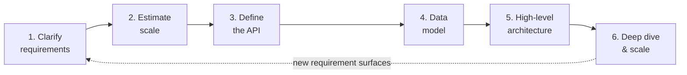

# The 6-Step Framework

## Concept

- A repeatable, time-boxed sequence for structuring any system design interview.
- Keeps you covering the right things in the right order instead of jumping straight to boxes and arrows.
- The six steps:
  - **1. Clarify requirements** — functional features, non-functional goals (scale, latency, availability), and explicit out-of-scope items.
  - **2. Estimate scale** — back-of-the-envelope numbers for users, QPS, storage, and bandwidth.
  - **3. Define the API** — the contract between client and system that satisfies the functional requirements.
  - **4. Design the data model** — entities, relationships, and the storage choice that follows from access patterns.
  - **5. Sketch the high-level architecture** — components and data flow: clients, load balancers, services, DBs, caches, queues.
  - **6. Deep dive and scale** — refine the bottlenecks: sharding, caching, replication, failure handling.
- Rough time budget in a 45-minute interview: 5 / 5 / 5 / 5 / 10 / 15 minutes.

## Problem It Solves

- Open-ended prompts like "design Twitter" are paralysing without a starting point.
- Prevents the three classic failures:
  - Freezing at a blank canvas.
  - Diving into one component for 40 minutes and never finishing.
  - Designing the wrong thing because requirements were never clarified.
- Converts an intimidating prompt into a checklist.
- Signals seniority through visible process.
- Ensures requirements drive the design, not the reverse.
- Gives the interviewer predictable hooks to evaluate you and steer the conversation.

## Trade-offs

- **Structure vs. adaptability** — the steps are a scaffold, not a script; reorder when the interviewer steers elsewhere.
- **Breadth vs. depth** — equal time on every step yields a shallow design with no deep dive, where senior signal lives.
- **Speed vs. precision in estimation** — exact capacity math burns the clock; order-of-magnitude numbers are enough.
- **Process visibility vs. flow** — narrating steps too explicitly feels robotic; internalise it so structure shows naturally.

## Examples

- **URL shortener**
  - Clarify: create short URL + redirect; read-heavy, low-latency, highly available.
  - Estimate: ~100M URLs/month, 10:1 read:write, modest storage.
  - API: `POST /urls`, `GET /{shortcode}`.
  - Data model: single `(shortcode → long_url)` table; key-value store fits.
  - Architecture: LB → stateless app servers → cache → DB.
  - Deep dive: shortcode generation (counter+base62 vs. hash) and hot-link caching.
- **Chat system**
  - Step 1 alone (1:1 vs. group, presence, delivery guarantees) reshapes everything downstream — WebSockets, queues, fan-out.
  - Shows why requirements come first.
- **Reordering in practice**
  - "Design Instagram's feed" may push you straight to step 6 (fan-out-on-write vs. fan-out-on-read).
  - The framework still gave you the vocabulary to get there fast.
