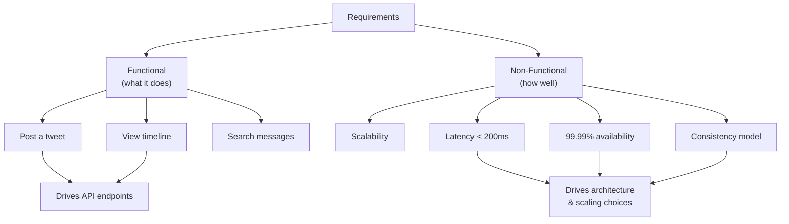

# Functional vs Non-Functional Requirements

## Concept

- **Functional requirements** describe *what* the system does.
  - The features and behaviours users invoke.
  - Examples: "a user can post a tweet," "a follower sees it in their feed," "a user can search messages."
  - Map directly to API endpoints and use cases.
- **Non-functional requirements** describe *how well* the system must do it.
  - The qualities and constraints: scalability, latency, availability, consistency, durability, security, cost.
  - Examples: "feed loads in under 200ms," "99.99% availability," "no posted tweet is ever lost."
- Functional requirements decide *which components exist*.
- Non-functional requirements decide *how those components are built, replicated, and scaled*.
- Non-functional requirements are usually where interviews are won.

## Problem It Solves

- Stops designs that work on paper but fail in reality (correct feed that takes 5 seconds; fast payments that lose transactions).
- Forces the constraints that drive hard decisions to the surface:
  - Strong consistency rules out certain databases.
  - 99.99% availability mandates redundancy and multi-region.
- Prevents over-engineering - if eventual consistency is acceptable, you skip distributed transactions.
- Turns vague prompts into concrete, defensible engineering targets.

## Trade-offs

- **Consistency vs. availability**: the central tension (CAP); a bank ledger picks consistency, a social feed picks availability.
- **Latency vs. durability/consistency**: synchronous replication is durable but slow; async is fast but risks data loss.
- **Completeness vs. time**: don't list every non-functional; pick the 3-4 that shape the design and quantify them.
- **Stated vs. assumed**: clarify the load-bearing requirements, assume the rest aloud.

## Examples

- **Twitter feed**
  - Functional: post tweet, follow user, view home timeline.
  - Non-functional: read-heavy (~100:1), timeline < 200ms p99, eventual consistency OK, 99.99% availability.
  - These justify fan-out-on-write and aggressive caching.
- **Stock-trading platform**
  - Functional: place order, cancel order, view portfolio.
  - Non-functional: strong consistency, ordered trades, full durability, strict auditability.
  - These rule out eventual-consistency stores; push toward single-writer or consensus designs.
- **Quantification matters**
  - Weak: "highly available."
  - Strong: "99.99% = ~52 min downtime/year, so multi-AZ redundancy and no single points of failure."
