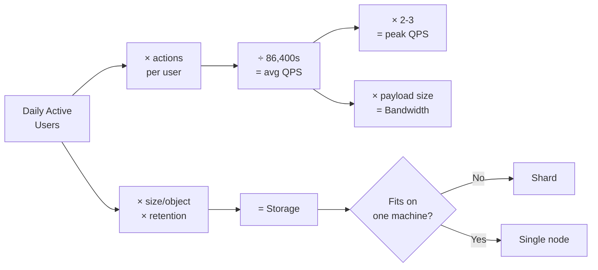

# Capacity Estimation

## Concept

- Back-of-the-envelope math that turns "design Twitter" into concrete numbers.
- Start from a user count + a few assumptions, then derive load.
- Use round powers of ten so the arithmetic stays in your head.
- Core quantities:
  - **QPS** = daily active users × actions per user ÷ 86,400 seconds.
  - **Peak QPS** ≈ 2-3 × average QPS.
  - **Storage** = objects/day × size/object × retention period.
  - **Bandwidth** = QPS × payload size.
  - **Cache memory** = apply 80/20 - cache the ~20% of data serving ~80% of requests.
- Useful anchors:
  - 1 day ≈ 100K seconds (86,400 rounded).
  - 1 million seconds ≈ 12 days.
  - Sizes: char ≈ 1 byte, small text record ≈ 1 KB, photo ≈ 1 MB.
  - Ladder: KB → MB → GB → TB → PB.

## Problem It Solves

- Numbers separate a real design from hand-waving.
- They tell you:
  - Whether data fits on one machine or needs sharding.
  - Whether reads can be served from memory.
  - Whether a single DB can absorb the write rate.
  - Where the bottleneck will appear.
- Reveal the read/write ratio, which dictates architecture:
  - Read-heavy → caching and replicas.
  - Write-heavy → partitioning and queues.
- Demonstrate engineering judgment - you reason about scale instead of asserting it.

## Trade-offs

- **Precision vs. speed**: round aggressively (300M → "say 100M DAU"); order of magnitude drives decisions.
- **Detail vs. relevance**: compute only numbers that change a design choice (usually peak QPS and 5-year storage).
- **Average vs. peak**: designing for average is cheaper but fails on spikes; state your peak multiplier.
- **Assumptions vs. accuracy**: state assumptions aloud so they can be corrected and the math stays defensible.

## Examples

- **Twitter writes/storage**
  - 200M DAU × 2 tweets/day = 400M tweets/day ≈ 4,600 writes/sec avg, ~10K/sec peak.
  - 300 bytes/tweet → ~120 GB/day → ~44 TB/year of raw text.
  - Conclusion: storage must be sharded; tweets fanned out.
- **Read-heavy ratio**
  - 200M users × 20 timeline loads/day = 4B reads/day ≈ 46K reads/sec avg.
  - Read:write ≈ 100:1 → caching and read replicas dominate.
- **Cache sizing**
  - Hot 20% of a day's timelines ≈ 50 GB working set.
  - Fits across a few cache nodes → justifies an in-memory layer.
- **Sanity anchor**
  - "86,400 s/day ≈ 100K" → convert per-day to per-second by dropping five zeros, fast enough to do live.
