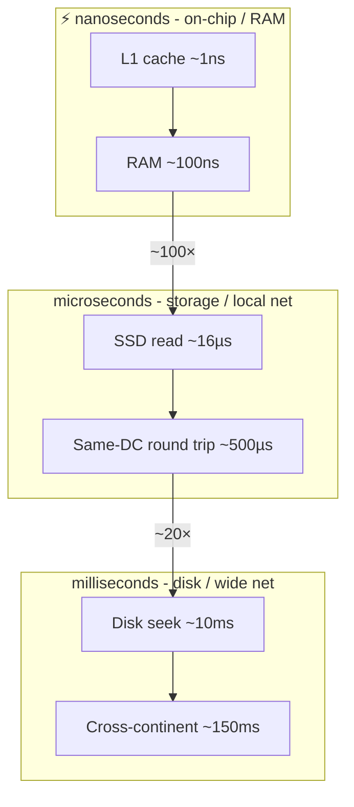

# Latency Numbers Every Engineer Should Know

## Concept

- A mental table of how long fundamental operations take.
- Spans ~9 orders of magnitude, from CPU cache to cross-continent round trips.
- Popularised by Jeff Dean's "numbers everyone should know."
- Approximate values:

| Operation | Latency | Anchor |
| - | - | - |
| L1 cache reference | ~1 ns | baseline |
| Branch mispredict | ~3 ns | |
| L2 cache reference | ~4 ns | |
| Mutex lock/unlock | ~17 ns | |
| Main memory (RAM) reference | ~100 ns | 100× L1 |
| Compress 1 KB | ~2 µs | |
| Read 1 MB sequentially from RAM | ~3 µs | |
| SSD random read | ~16 µs | |
| Round trip in same datacenter | ~500 µs | |
| Read 1 MB sequentially from SSD | ~50 µs - 1 ms | |
| Disk (HDD) seek | ~2-10 ms | |
| Read 1 MB from disk | ~5-20 ms | |
| Round trip CA ↔ Netherlands | ~150 ms | |

- Rules of thumb:
  - Memory ≈ 100× faster than SSD.
  - SSD ≈ 100× faster than disk seek.
  - Same-datacenter calls are sub-millisecond.
  - Cross-continent calls are ~100 ms.

## Problem It Solves

- Turns architecture into arithmetic.
- Explains why a cache hit (RAM, ~100 ns) beats a disk read (~10 ms) by five orders of magnitude.
- Explains why N+1 queries across a network are deadly.
- Explains why chatty cross-region calls blow latency budgets.
- Lets you budget a target: a "feed under 200ms" can't afford a 150 ms cross-region hop.
- Justifies caching, batching, denormalisation, colocation, and CDNs with physics, not opinion.

## Trade-offs

- **Memorisation vs. understanding**: the *ratios* (RAM ≫ SSD ≫ disk ≫ network) matter more than exact figures.
- **Latency vs. throughput**: batching helps throughput but adds latency; weigh against your goal.
- **Locality vs. consistency**: serving from a nearby cache/region cuts latency but risks staleness.
- **Precision vs. era**: classic numbers predate NVMe and faster networks; use for relative reasoning, not exact SLAs.

## Examples

- **Cache justification**
  - Timeline from RAM (~microseconds) vs. recomputed from disk-backed DB (~10 ms+).
  - The gap is the entire argument for an in-memory cache.
- **Avoiding chatty calls**
  - 100 sequential same-DC round trips ≈ 100 × 500 µs = 50 ms.
  - Batched into one call ≈ 500 µs - why you batch.
- **Region placement**
  - 200 ms budget can't fit a 150 ms transatlantic round trip + DB work.
  - Replicate data into the user's region or use a CDN edge.
- **Read-path budgeting**
  - "Disk seek ~10 ms, RAM ~100 ns" → databases keep indexes in memory and prefer sequential I/O.
