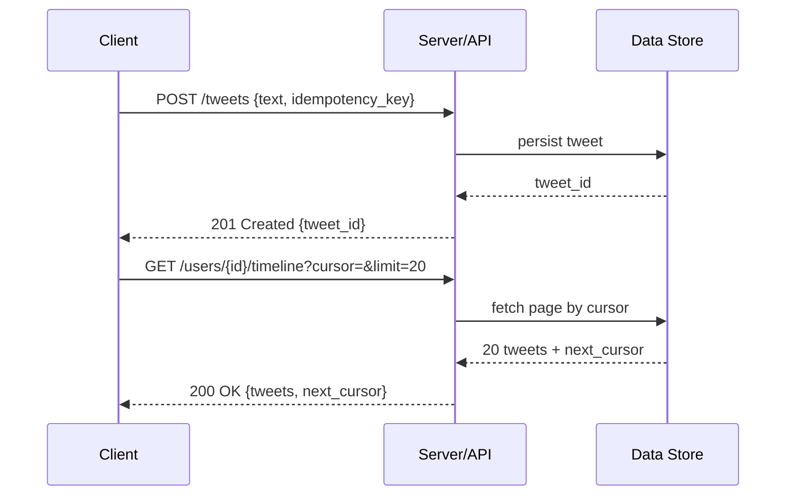

# API Design in Interviews

## Concept

- Defining the contract between client and system.
- The bridge between requirements (step 1) and architecture (step 5).
- Each functional requirement becomes one or more endpoints.
- A good definition specifies: method/verb, path or RPC name, key params, response shape, pagination, auth.
- Skips field-by-field detail; keeps the focus on operations and semantics.
- Common styles:
  - **REST** — resource-oriented HTTP (`POST /tweets`), stateless, cache-friendly, ubiquitous.
  - **RPC / gRPC** — action-oriented calls (`postTweet(...)`), efficient binary transport, great service-to-service.
  - **GraphQL** — single endpoint; clients query exactly the fields they need.
- Goal: smallest set of endpoints that fully satisfies the functional requirements.

## Problem It Solves

- Forces the design to be concrete and testable.
- Pins down exactly what the client sends and receives.
- Surfaces missing requirements (e.g. "how does the client get the next page?").
- Exposes data-model needs (e.g. timeline response needs author name → join or denormalise).
- Gives the interviewer a clean checkpoint before architecture.
- Reveals correctness issues: idempotency for retries, cursor vs. offset pagination, rate-limit semantics.

## Trade-offs

- **REST vs. RPC vs. GraphQL**
  - REST: simple, cacheable, standard — but can over/under-fetch.
  - gRPC: fast, strongly typed — but less browser-friendly, harder to debug.
  - GraphQL: flexible for clients — but complicates server, caching, and rate limiting.
- **Granularity** — coarse endpoints = fewer round trips but over-fetch; fine-grained = precise but chatty.
- **Offset vs. cursor pagination** — offset is simple but slow/unstable on large changing data; cursor is stable and scalable but stateful.
- **Idempotency cost** — keys make retries safe (payments, posting) but add storage and lookup overhead.
- **Detail vs. time** — define the load-bearing endpoints precisely; gesture at the rest.

## Examples

- **URL shortener**
  - `POST /urls {long_url} → {short_code}`.
  - `GET /{short_code} → 301 redirect`.
  - Interesting points: redirect cacheability, create-call idempotency.
- **Twitter**
  - `POST /tweets {text}`.
  - `GET /users/{id}/timeline?cursor=...&limit=20`.
  - Cursor pagination chosen because the timeline changes constantly.
- **Payments idempotency**
  - `POST /payments {amount, idempotency_key}`.
  - Key ensures a retried request after a timeout doesn't double-charge.
- **GraphQL fit**
  - `{ tweet { text author { name avatar } } }` per screen.
  - Avoids ten REST variants — at the cost of query-complexity and caching work.
