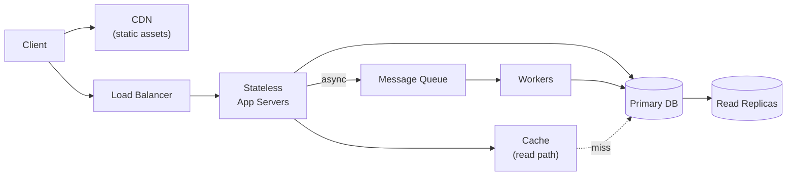
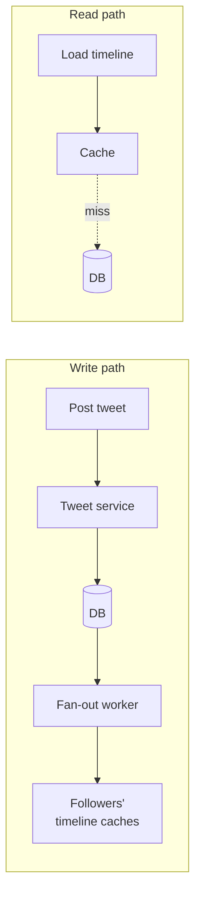

# Drawing System Diagrams

## Concept

- Communicating an architecture visually: boxes for components, arrows for request/data flow.
- Components: clients, load balancers, services, databases, caches, queues, CDNs.
- A good interview diagram is a layered left-to-right (or top-to-bottom) flow:
  - client → edge/CDN → load balancer → stateless app/services → caches and datastores.
  - Asynchronous paths (queues, workers) branch off.
- Annotate arrows with protocol/action ("HTTP GET timeline", "publish event").
- Mark where data is partitioned or replicated.
- Label read vs. write paths when they differ.
- It is a *communication tool*, not art — a shared map to point at while discussing trade-offs.

## Problem It Solves

- A picture makes an architecture legible in seconds where prose takes minutes.
- Externalises your mental model so the interviewer can follow your reasoning.
- Lets them point at a component and ask "what happens when this fails?"
- Verifies the data flow actually satisfies the requirements.
- Disciplines your thinking — every arrow must land somewhere.
- Provides anchors for the deep-dive phase (point at the DB box and start sharding).

## Trade-offs

- **Detail vs. clarity** — start minimal; add detail only where you deep-dive.
- **Breadth-first vs. depth-first** — sketch the full flow first, then drill into one component.
- **Logical vs. physical** — logical (services/responsibilities) for the overview; physical (instances, AZs, replicas) only for availability/scaling talk.
- **Drawing vs. talking** — keep it rough and legible; narrate as you draw rather than drawing in silence.

## Examples

- **High-level web app**
  - Client → CDN → LB → app servers → cache → primary DB + replicas.
  - Side branch: app → queue → workers → DB.
  - Covers reads, writes, async work, and caching in one picture.
- **Read vs. write paths (feed)**
  - Write: post tweet → service → DB → fan-out worker → followers' timeline caches.
  - Read: load timeline → cache → fallback DB.
  - Separating them clarifies why fan-out-on-write helps reads.

- **Failure deep-dive hook**
  - DB drawn as primary + replicas → interviewer asks "what if the primary dies?"
  - The diagram makes the failover discussion concrete.
- **Keep it minimal first**
  - URL shortener: start with LB → app → cache → DB.
  - Add shortcode-generation service and analytics pipeline only when the conversation goes there.
