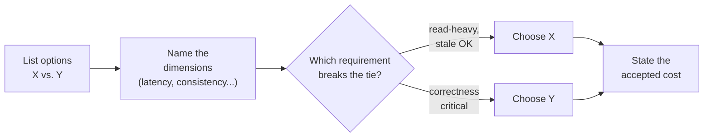

# Trade-Off Communication

## Concept

- The skill of articulating *why* you chose one option over another.
- Name the alternatives, the dimensions they differ on, and the requirement that breaks the tie.
- Every meaningful design decision is a trade-off — no free lunch, only choices.
- The communication pattern:
  - "We could do X or Y."
  - "X gives lower latency but weaker consistency; Y is the reverse."
  - "Our requirement is read-heavy with tolerance for staleness, so I'll choose X."
- The decision is *justified by a requirement*, not asserted by preference.
- Senior signal comes from understanding consequences, not from picking a "right" answer (often there isn't one).

## Problem It Solves

- Interviewers can't see your reasoning — only your words.
- Decisions without trade-offs read as luck or memorisation.
- Leaves you defenceless when the interviewer changes a requirement.
- Explicit trade-offs:
  - Show you understand the design space.
  - Tie choices back to stated requirements (closing the loop from step 1).
  - Make the conversation collaborative — they tweak an assumption, you re-derive.
- Inoculate against "gotcha" follow-ups — acknowledged weaknesses can't be used against you.

## Trade-offs

- **Depth vs. time** — flag minor trade-offs briefly; reserve detail for load-bearing ones (data store, consistency, sharding).
- **Decisiveness vs. open-endedness** — "here are the options, here's my pick, here's why" beats listing without committing.
- **Confidence vs. humility** — state a clear recommendation while owning its costs; avoid both over-asserting and over-hedging.
- **Theory vs. relevance** — anchor every trade-off to a real constraint; don't debate SQL vs. NoSQL when data is trivially small.

## Examples

- **Consistency choice (like-count)**
  - Options: strong (correct, slower, hot-row contention) vs. eventual (fast, approximate).
  - Requirement: users tolerate a stale count but expect snappy loads.
  - Pick: eventual, reconcile asynchronously.
- **SQL vs. NoSQL (orders/payments)**
  - Relational: transactions + joins, strong consistency.
  - Wide-column: better write scaling, weaker guarantees.
  - Requirement: correctness > write volume → Postgres, revisit if writes grow.
- **Fan-out strategy**
  - On-write: cheap reads, explodes for celebrities.
  - On-read: cheap writes, expensive reads.
  - Pick: hybrid — write for normal users, read for celebrities.
- **Pre-empting the follow-up**
  - "This cache means a deleted post may briefly appear; we accepted bounded staleness and cap TTL at 30s."
