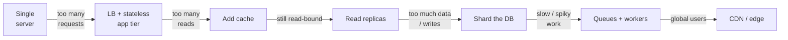

# Scaling a Design

## Concept

- Evolving a simple working architecture into one that handles far more load.
- Done by systematically removing bottlenecks, one layer at a time.
- The standard progression:
  - **Vertical scaling** — a bigger machine; simple, but capped and a single point of failure.
  - **Horizontal scaling** — many machines behind a load balancer; needs stateless services.
  - **Caching** — keep hot data in memory (client, CDN, Redis) to cut read load and latency.
  - **Database replication** — read replicas absorb reads; primary handles writes.
  - **Sharding/partitioning** — split data across nodes by a key when one machine can't cope.
  - **Asynchronous processing** — queues + workers move slow/spiky work off the request path.
  - **CDN and edge** — push static/cacheable content close to users.
- The art: apply each lever in response to a *specific* bottleneck, not all at once.

## Problem It Solves

- A design that works for 1,000 users may collapse at 10 million.
- Scaling techniques let the system grow without a rewrite.
- In interviews, the scaling discussion (step 6) is where senior signal concentrates.
- Connects your capacity estimates to concrete mechanisms.
- Each technique targets a specific limit:
  - Load balancers → "too many requests for one server."
  - Replicas → "too many reads."
  - Sharding → "too much data or too many writes."
  - Queues → "slow work blocking the request."

## Trade-offs

- **Vertical vs. horizontal** — vertical is simple but capped with no redundancy; horizontal scales without limit but adds statelessness and coordination complexity.
- **Caching vs. consistency** — caches cut latency but introduce staleness and invalidation problems.
- **Replication vs. consistency** — replicas multiply reads but lag the primary; sync replication fixes lag at write-latency cost.
- **Sharding vs. complexity** — removes data/write limits but breaks cross-shard joins/transactions; shard-key is hard to change later.
- **Async vs. simplicity** — queues smooth spikes but add eventual consistency, ordering, and ops overhead (DLQs, retries, monitoring).
- **Scale now vs. later** — over-engineering wastes effort and adds failure modes; under-engineering forces painful migrations. Scale the bottleneck the numbers predict.

## Examples

- **Read-heavy site (news feed)**
  - Bottleneck is reads → add cache and read replicas first.
  - Estimation showed read:write ≈ 100:1, which justifies the order.
- **Write-heavy / large dataset (44 TB/year of tweets)**
  - One DB can't hold or absorb it → shard by user_id.
  - Accept loss of cross-user joins; design queries around the shard key.
- **Spiky background work (notifications, video encoding)**
  - Move behind a queue with workers so a burst doesn't stall the request.
  - Accept eventual completion.
- **Global users**
  - CDN for static assets + regional read caches to beat the ~150 ms cross-continent round trip.
  - Trade some freshness for latency.
- **Incremental story**
  - Single box → LB + stateless app → cache → read replicas → shard → queues.
  - Walking this evolution shows you scale in response to bottlenecks, not by reflex.
