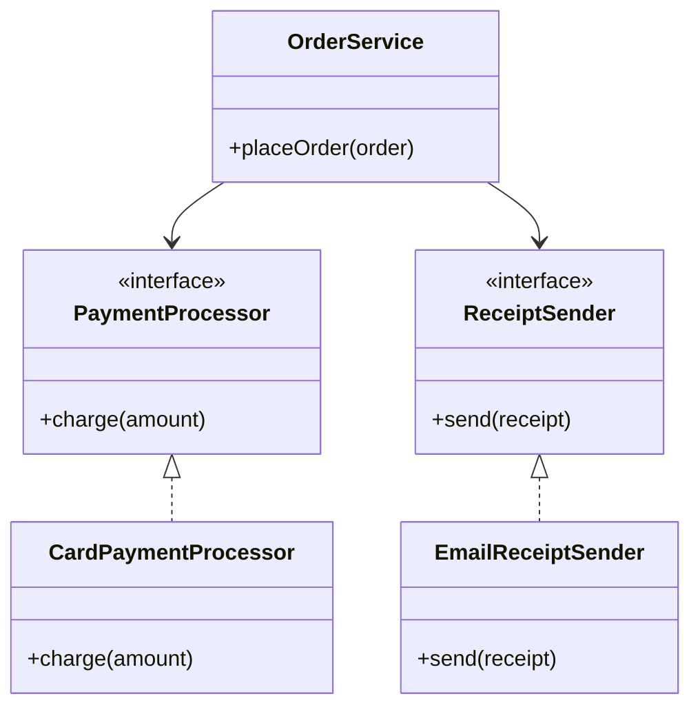
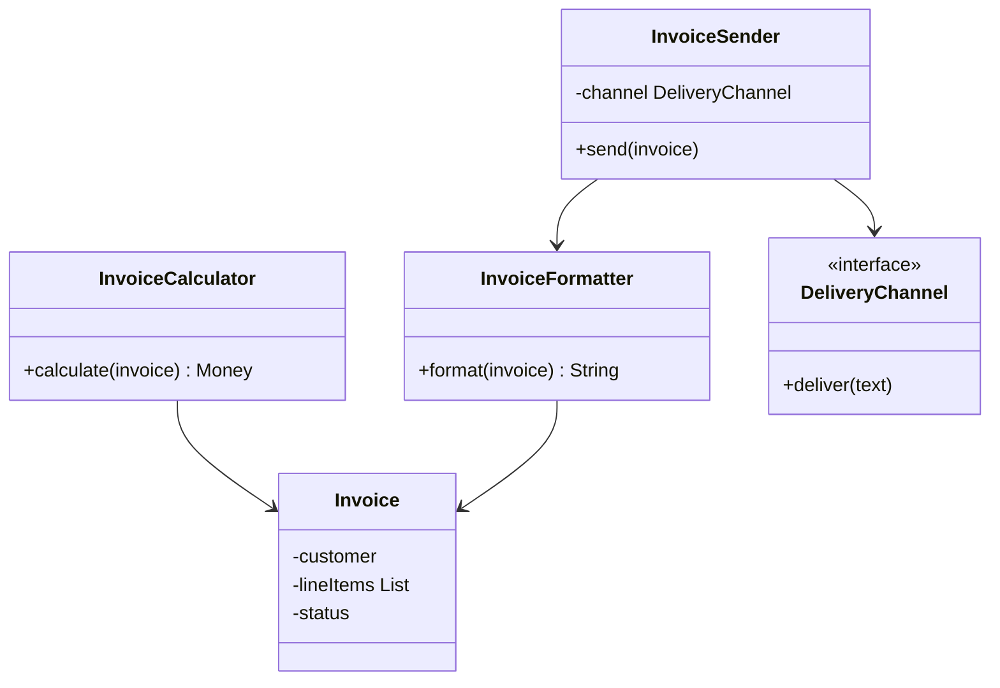
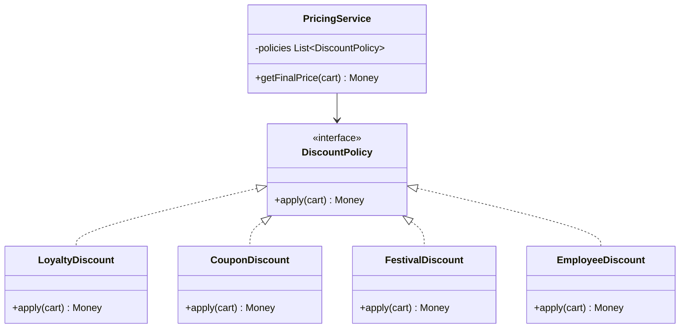
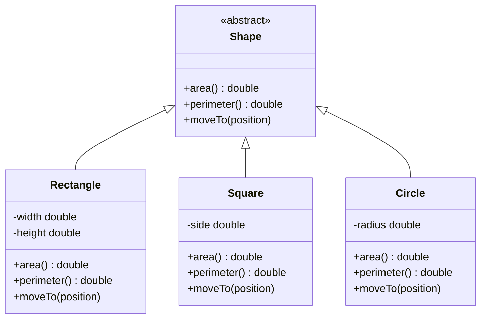
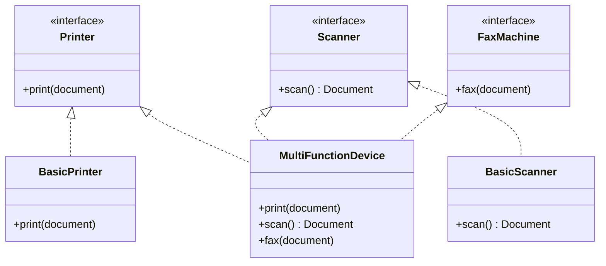
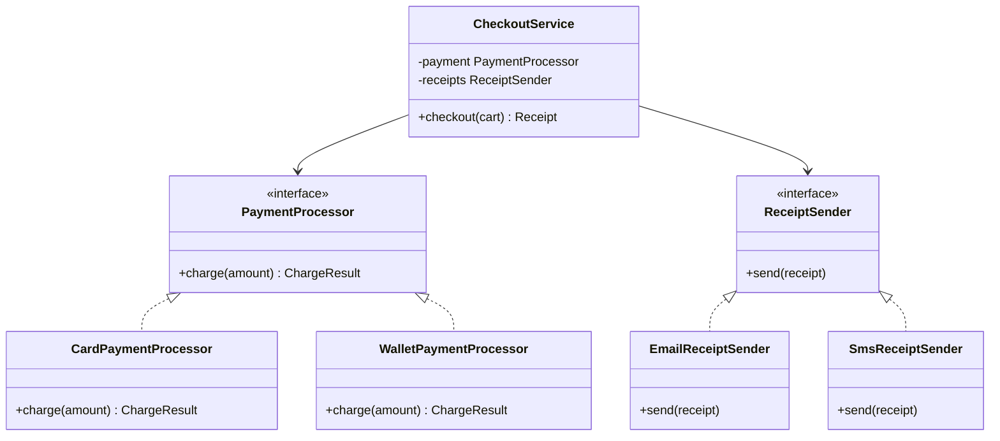

# SOLID Principles

## Concept

- SOLID is a set of five object-oriented design principles for keeping classes small, replaceable, and easier to change.
- It helps turn requirements into class boundaries instead of one large object that does everything.
- The five principles:
  - **Single Responsibility Principle (SRP)** — a class should have one reason to change.
  - **Open/Closed Principle (OCP)** — open for extension, closed for modification.
  - **Liskov Substitution Principle (LSP)** — a subtype must be usable wherever its parent type is expected.
  - **Interface Segregation Principle (ISP)** — clients should not depend on methods they do not use.
  - **Dependency Inversion Principle (DIP)** — high-level policy should depend on abstractions, not concrete details.
- SOLID does not mean "more classes everywhere." It means responsibilities and dependencies should be shaped around likely change.
- In LLD interviews, SOLID gives vocabulary for explaining why a class exists and why it owns a specific behavior.

## Problem It Solves

- Prevents classes from becoming hard-to-change "god objects."
- Makes new requirements easier to add: new payment method, new notification channel, new validation rule.
- Keeps tests focused because each class has a narrow role.
- Reduces accidental breakage when one feature changes.
- Helps interviewers see that the design can evolve after the first version.

## Trade-offs

- **Simplicity vs. flexibility** — a tiny program may not need separate interfaces for every role.
- **Fewer classes vs. clear boundaries** — fewer files are easier to scan, but mixed responsibilities become painful as requirements grow.
- **Inheritance vs. composition** — inheritance can express shared identity, but composition is usually safer for optional behavior.
- **Abstractions vs. over-design** — interfaces help when behavior varies; they add noise when there is only one stable implementation.
- **Strictness vs. pragmatism** — SOLID guides design, but forcing every principle mechanically can make a small problem look inflated.

## Examples

### SRP: invoice generation

- Requirement: create an invoice, compute totals, format a printable version, and send it to a customer.
- Weak design: `Invoice` stores data, calculates tax, formats text, and sends the invoice — all in one class.
- Problem: tax-rule changes, formatting changes, and delivery changes all touch the same file.
- Better design:

- Each class has exactly one reason to change: tax rules change in `InvoiceCalculator`, layout changes in `InvoiceFormatter`, delivery changes in `InvoiceSender`.

### OCP: discount policies

- Requirement: a shopping cart supports loyalty, coupon, festival, and employee discounts.
- Weak design: `DiscountCalculator.calculate(cart)` contains a long `if/else` branch for every discount type. Adding a new discount edits stable code.
- Better design: define a shared interface and add each rule as a new class.

- Adding `ClearanceDiscount` adds one class and one mapping to the list — the `PricingService` is never edited.

### LSP: shapes

- Requirement: a drawing board calculates total area for any shape.
- Weak design: `Square` extends `Rectangle`. Code that calls `rect.setWidth(5)` expects height to remain unchanged, but `Square.setWidth(5)` also changes height to maintain the square invariant. Callers that treat a `Square` as a `Rectangle` get wrong results.
- Better design: keep the hierarchy flat so every subtype safely fulfills the parent contract.

- `DrawingBoard` holds a `List<Shape>` and calls `area()` on each. Any `Shape` subtype works correctly without special cases.

### ISP: office machines

- Requirement: support a basic printer, a scanner, and a multifunction device.
- Weak design: one `Machine` interface forces every device to implement `print()`, `scan()`, and `fax()`, so `BasicPrinter.scan()` either throws or does nothing.
- Better design:

- `BasicPrinter` depends only on `Printer`. It is never forced to stub `scan()` or `fax()`.
- A `DocumentService` that only needs printing takes `Printer` as its dependency, not the full `MultiFunctionDevice` interface.

### DIP: checkout

- Requirement: checkout should charge a customer and send a receipt.
- Weak design: `CheckoutService` calls `new CardPaymentProcessor()` and `new EmailReceiptSender()` directly. Tests require real network calls.
- Better design:

- `CheckoutService` depends on `PaymentProcessor` and `ReceiptSender` abstractions. A test can supply `FakePaymentProcessor` without touching `CheckoutService`.
