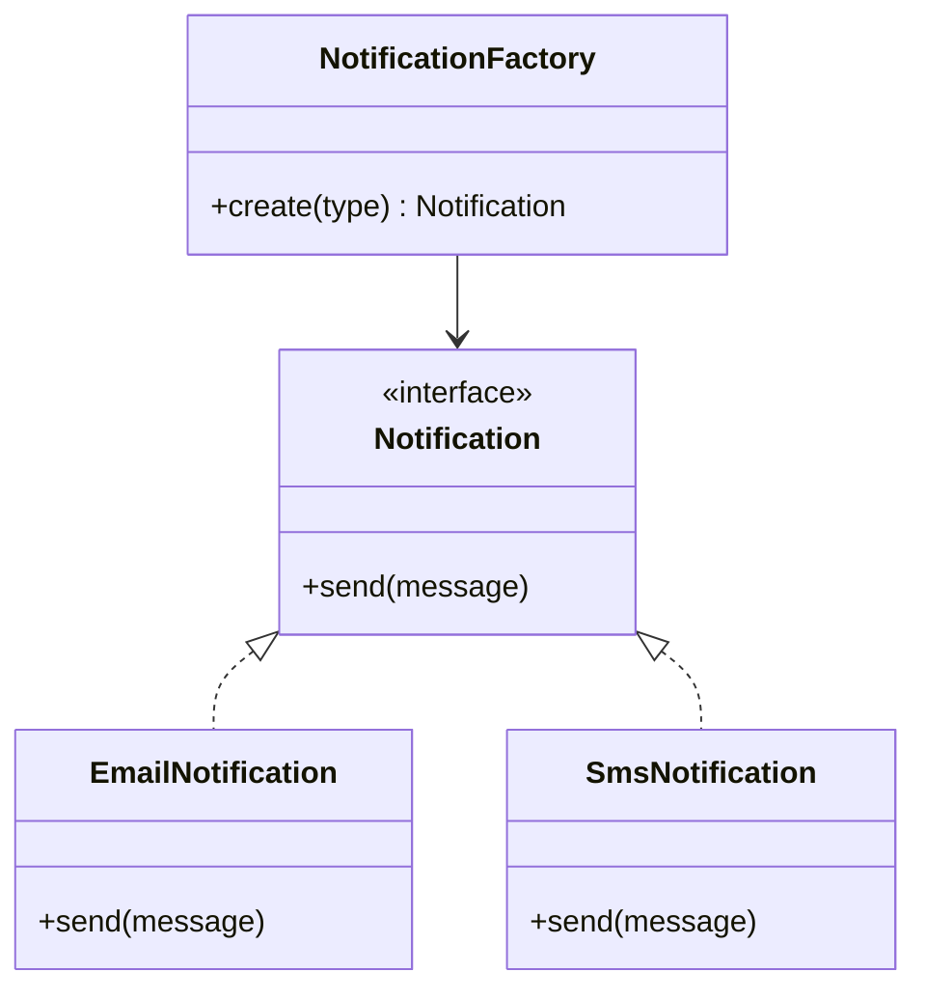
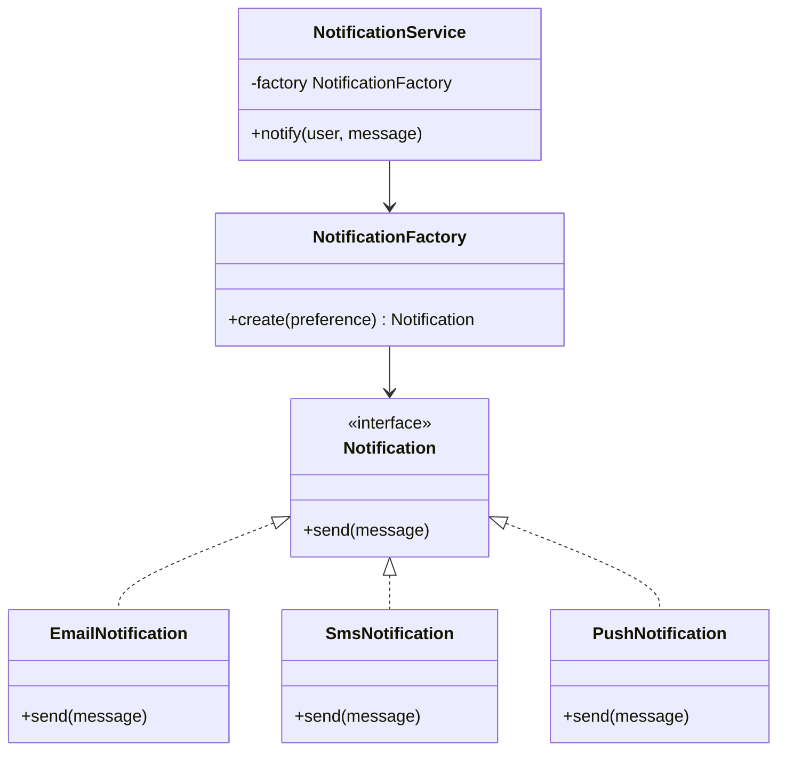
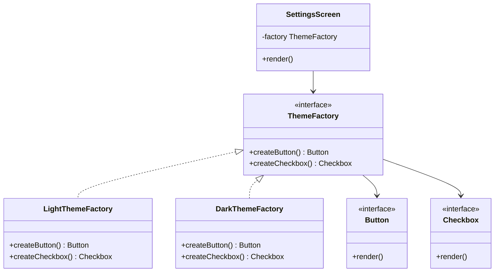
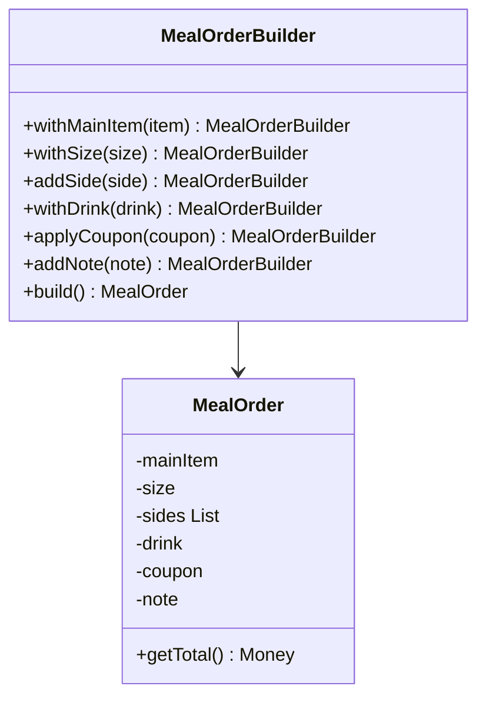
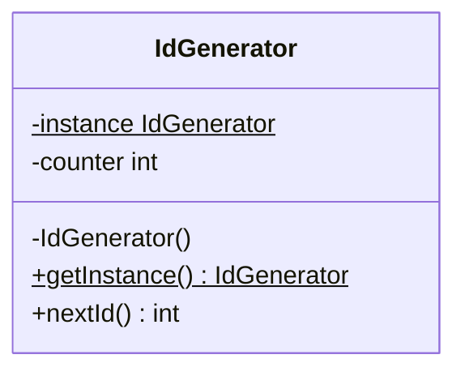

# Design Patterns: Creational

## Concept

- Creational patterns manage how objects are created.
- They are useful when direct construction with `new` exposes too much detail, repeats setup logic, or makes code depend on concrete classes.
- Common creational patterns:
  - **Factory Method**: let a method decide which subtype to create.
  - **Abstract Factory**: create families of related objects through one interface.
  - **Builder**: construct complex objects step by step with readable intent.
  - **Prototype**: create new objects by copying an existing object.
  - **Singleton**: ensure one shared instance exists for a process-level responsibility.
- The goal is not to hide every constructor. The goal is to control creation when construction itself carries design decisions.
- Connection to SOLID: factories help callers depend on abstractions rather than concrete classes (DIP from topic 1), and each factory covers one creation responsibility (SRP).

## Problem It Solves

- Avoids repeating object setup across many callers.
- Keeps high-level code from knowing every concrete class (DIP).
- Makes future variants easier to add without changing existing code (OCP).
- Helps enforce valid construction for objects with many required and optional fields.
- Reduces accidental inconsistent setup, especially for objects that need multiple collaborators.

## Trade-offs

- **Direct constructor vs. factory**: constructors are simplest; factories help when selection or setup logic is meaningful.
- **Factory Method vs. Abstract Factory**: Factory Method creates one product hierarchy; Abstract Factory creates related product families.
- **Builder vs. constructor overloads**: Builder improves readability for many parameters, but is unnecessary for small immutable objects.
- **Prototype vs. explicit construction**: copying is convenient for similar objects, but can hide shared mutable state if done carelessly.
- **Singleton vs. dependency passing**: Singleton is convenient, but makes tests and alternate configurations harder; prefer injecting the instance (DIP) over letting every class reach for a global.

## Examples

### Factory Method: notification creation

- Requirement: send a user notification through email, SMS, or push notification based on user preference.
- Classes:
  - `Notification` interface defines `send(message)`.
  - `EmailNotification`, `SmsNotification`, and `PushNotification` implement the interface.
  - `NotificationFactory.create(preference)` returns the correct implementation.
  - `NotificationService` asks the factory for a notifier, then calls `send`.
- SOLID connection: `NotificationService` depends only on `Notification` (DIP). Adding `PushNotification` adds one class and one mapping - the factory and service are not edited (OCP).

### Abstract Factory: themed controls

- Requirement: a settings screen must render light-theme or dark-theme controls consistently across all component types.
- Classes:
  - `ThemeFactory` interface creates `Button` and `Checkbox`.
  - `LightThemeFactory` returns `LightButton` and `LightCheckbox`.
  - `DarkThemeFactory` returns matching dark controls.
  - `SettingsScreen` depends only on `ThemeFactory` (DIP).
- Why it fits: related objects are created as a family, so a dark checkbox cannot be mixed with a light button. Adding a new theme adds two concrete classes - nothing existing changes (OCP).

### Builder: meal order

- Requirement: create an order with a required main item and many optional choices - size, sides, drink, coupons, and special notes.
- Weak design: a constructor with many parameters is hard to read and easy to misuse.
- Better design:

- `build()` validates required fields and returns `MealOrder`. Invalid orders are rejected in one place (SRP). The builder itself is the one class responsible for constructing a valid order.

### Prototype: drawing canvas

- Requirement: duplicate an existing shape while preserving its full style.
- Classes:
  - `Shape` has `clone()` and common fields: color, border, and position.
  - `Circle`, `Rectangle`, and `TextBox` implement `clone()` for their own fields.
  - `Canvas.duplicate(shape)` calls `clone()`, changes the position, and adds the copy to the canvas.
- Why it fits: the caller does not need to know the exact shape type or all construction parameters.
- Watch out: `clone()` should avoid sharing mutable internal objects unless sharing is intentional.

### Singleton: process-wide ID source

- Requirement: generate simple in-memory IDs during one program run. No ID should ever be duplicated.
- Classes:
  - `IdGenerator` exposes `nextId()`.
  - Only one instance is allowed so IDs are not duplicated by multiple counters.

- Why it fits: there is one process-level responsibility - generating unique IDs.
- LLD caution: inject `IdGenerator` into classes that need it rather than letting every class call `getInstance()` directly. Injection keeps the dependency visible and testable (DIP).
