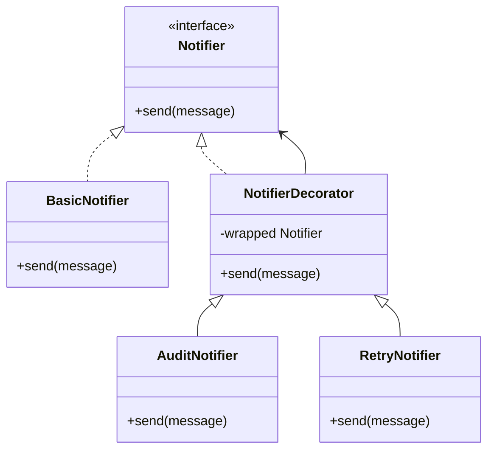
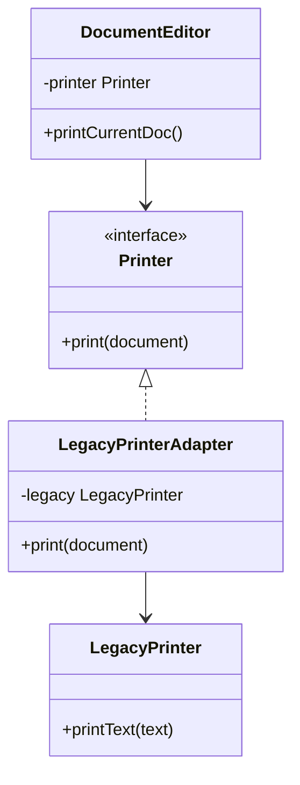
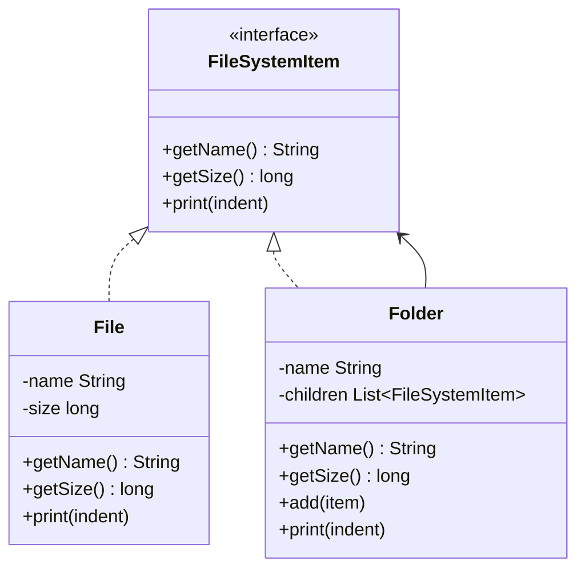
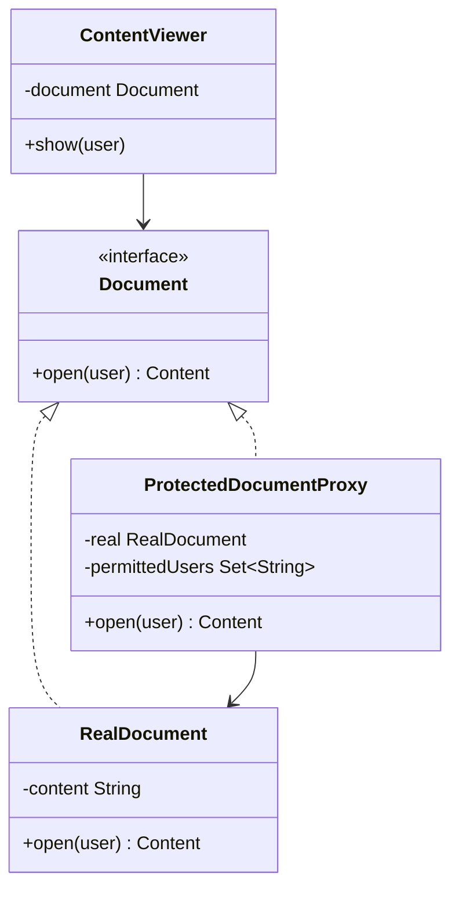
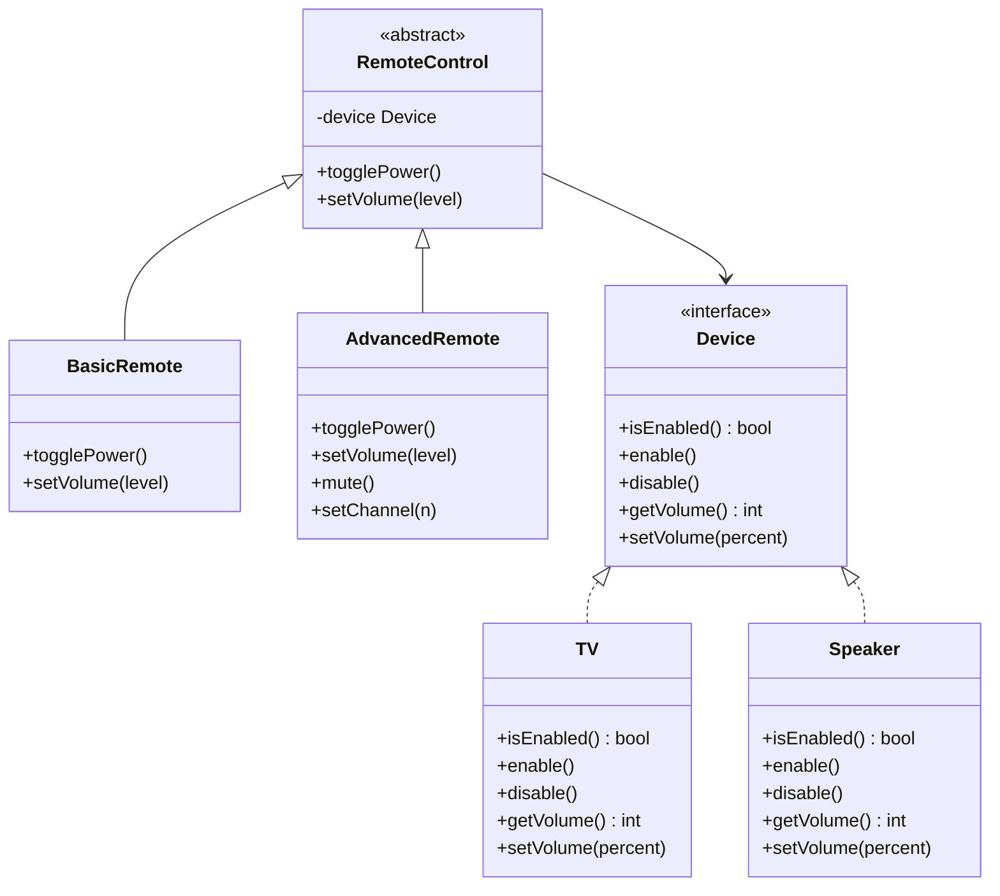

# Design Patterns: Structural

## Concept

- Structural patterns organize how classes and objects are composed.
- They help objects fit together when their shapes, responsibilities, or ownership relationships differ.
- Common structural patterns:
  - **Adapter** — translate one interface into another expected interface.
  - **Facade** — provide a simple entry point over several collaborating classes.
  - **Decorator** — add behavior by wrapping an object with the same interface.
  - **Composite** — treat individual objects and groups uniformly.
  - **Proxy** — stand in front of another object to control access.
  - **Bridge** — split an abstraction from its implementation so both can vary independently.
  - **Flyweight** — share repeated immutable state across many small objects.
- Structural patterns usually prefer composition over inheritance.
- Connection to SOLID: Decorator and Proxy add behavior or control without modifying existing classes (OCP from topic 1). Facade gives one class one coordination responsibility (SRP). Adapter lets callers depend on stable abstractions even when the underlying class changes (DIP).
- Connection to creational patterns (topic 2): Flyweight often uses a Factory Method internally to reuse shared instances, and a Facade may use a Builder to construct complex objects on behalf of its callers.

## Problem It Solves

- Lets incompatible classes collaborate without rewriting them (Adapter).
- Keeps client code simple when a task needs several internal steps (Facade).
- Adds optional behavior without creating a subclass for every combination (Decorator).
- Models part-whole structures like folders containing files and other folders (Composite).
- Controls access to an object: lazy initialization, permission checks, or logging (Proxy).
- Lets two hierarchies evolve independently (Bridge).
- Reduces memory when many objects repeat the same internal data (Flyweight).

## Trade-offs

- **Adapter vs. changing the class** — adapt when the class is external, stable, or used elsewhere; change it when you own it and the new interface is better.
- **Facade vs. hiding too much** — a Facade simplifies common use, but should not block access to important lower-level operations.
- **Decorator vs. subclassing** — Decorators compose behavior flexibly, but many nested wrappers can be harder to trace.
- **Composite vs. simple lists** — Composite is powerful for recursive structures, but unnecessary for flat collections.
- **Proxy vs. direct access** — Proxy adds control points, but can surprise callers if behavior becomes too different from the real object.
- **Bridge vs. one hierarchy** — Bridge is worth the extra interface when two axes of variation grow independently; a single hierarchy is simpler when they do not.
- **Flyweight vs. clarity** — sharing state saves memory, but separates intrinsic (shared) state from extrinsic (per-object) state.

## Examples

### Adapter: legacy printer

- Requirement: the document editor expects `Printer.print(document)`, but an older printer object exposes `printText(text)`.
- Classes:
  - `Printer` interface defines the editor-facing contract.
  - `LegacyPrinter` has the incompatible method.
  - `LegacyPrinterAdapter` implements `Printer`, converts the document into text, and delegates to `LegacyPrinter`.
- Why it fits: the editor does not change (OCP), and the legacy class does not need to be rewritten.

### Facade: checkout flow

- Requirement: checkout validates the cart, calculates price, charges through an abstract payment interface, and creates a receipt.
- Classes:
  - `CartValidator` checks item and quantity rules.
  - `PriceCalculator` computes the final amount.
  - `PaymentGateway` is an interface for payment.
  - `ReceiptFactory` creates a receipt object (Factory Method from topic 2).
  - `CheckoutFacade.checkout(cart, paymentMethod)` coordinates the common flow.
- Why it fits: callers use one simple operation while the internal classes stay separated (SRP). Adding a new validation step does not change the caller.

### Decorator: notifier behavior

- Requirement: some notifications need logging, some need retry behavior, and some need both.
- Classes:
  - `Notifier` interface defines `send(message)`.
  - `BasicNotifier` performs the core send operation.
  - `LoggingNotifier` wraps another `Notifier` and records the attempt before and after.
  - `RetryNotifier` wraps another `Notifier` and retries on failure.
- Why it fits: combinations are created by wrapping objects, not by creating `LoggingRetryEmailNotifier` subclasses. New behavior can be added without changing existing classes (OCP).

### Composite: file explorer

- Requirement: calculate size and print names for both individual files and folders, including nested folders.

- Why it fits: client code treats a single `File` and a deeply nested `Folder` tree uniformly — both implement `FileSystemItem`. `Folder.getSize()` recursively sums child sizes without any type checks.

### Proxy: protected document

- Requirement: only permitted users can open a confidential document.

- Why it fits: access control is placed in front of the object without changing `RealDocument` (OCP). The proxy's one responsibility is the permission check (SRP).

### Bridge: remote controls and devices

- Requirement: support different remotes (basic and advanced) and different devices (TV and speaker) without creating one subclass for every combination.

- Why it fits: adding `Projector` adds one `Device` class — no remote changes. Adding `VoiceRemote` adds one `RemoteControl` subclass — no device changes. The two hierarchies vary independently (ISP and OCP from SOLID).

### Flyweight: chess board pieces

- Requirement: represent many pieces on a chess board without repeating shared display data.
- Classes:
  - `PieceType` stores shared immutable data: name, color, symbol, and allowed movement description.
  - `Piece` stores object-specific data: current square and whether it has been captured.
  - `PieceTypeFactory` (a Factory Method from topic 2) returns one `PieceType` instance per kind and caches it.
- Why it fits: repeated intrinsic state is shared, while extrinsic per-piece state stays in each `Piece`. A board with 32 pieces reuses 12 `PieceType` instances.
