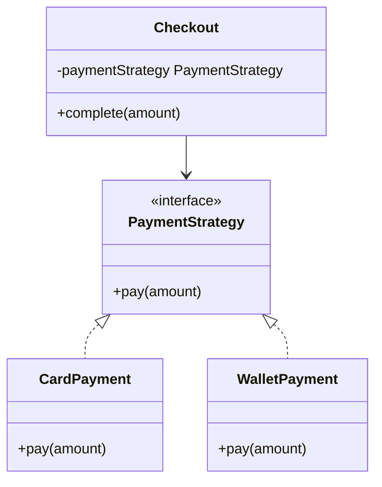
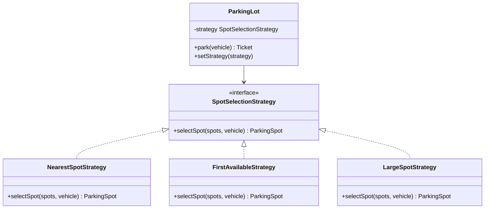
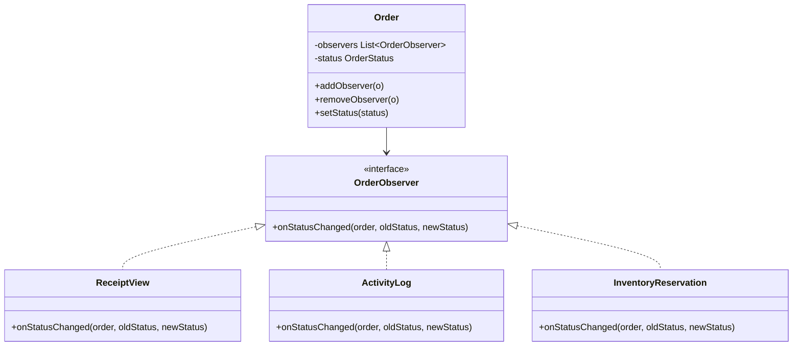
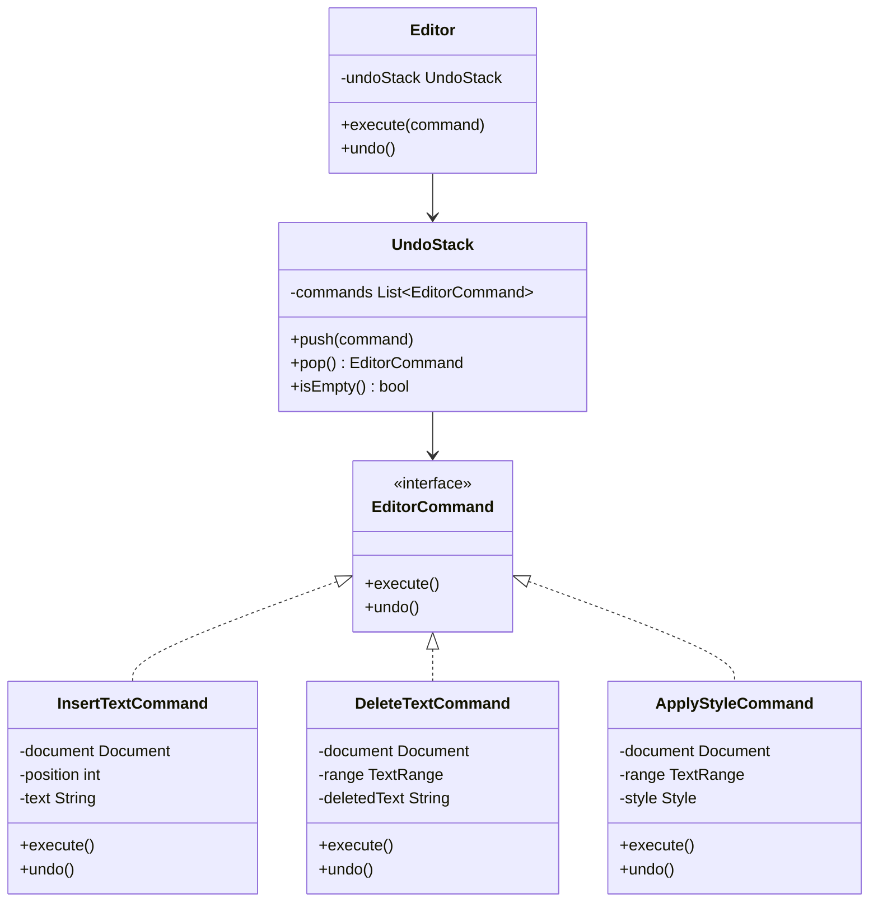
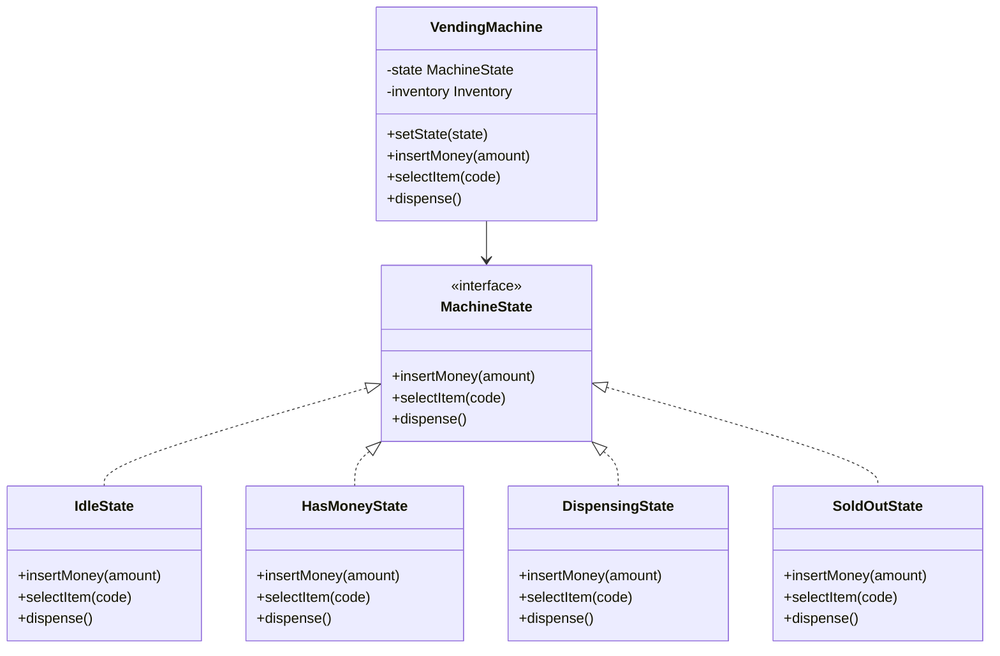
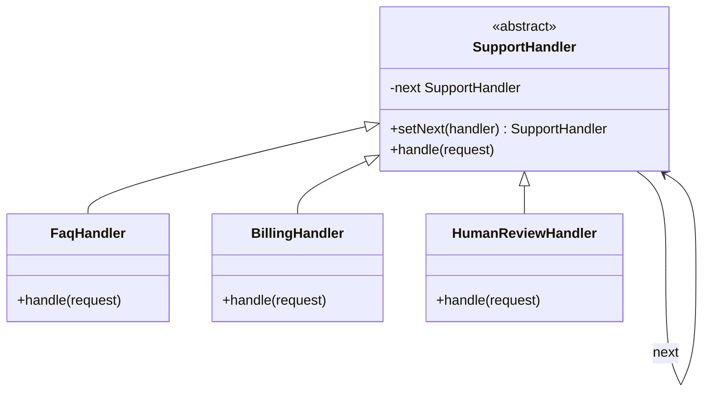

# Design Patterns: Behavioral

## Concept

- Behavioral patterns manage how objects communicate and assign behavior.
- They reduce long conditional logic by moving choices into collaborating objects.
- Common behavioral patterns:
  - **Strategy**: swap an algorithm behind a stable interface.
  - **Observer**: notify interested objects when state changes.
  - **Command**: turn an action into an object.
  - **State**: change behavior when an object's internal state changes.
  - **Template Method**: define an algorithm skeleton and let subclasses fill in the steps.
  - **Chain of Responsibility**: pass a request through handlers until one handles it.
  - **Iterator**: traverse a collection without exposing its internals.
  - **Mediator**: centralize interaction between many peer objects.
  - **Memento**: capture and restore an object's state.
  - **Visitor**: add operations over object structures without changing the structures.
- These patterns are most useful when behavior varies more often than the objects themselves.

## Problem It Solves

- Keeps business rules from collapsing into one large `if/else` block.
- Makes behavior easier to add, replace, test, and explain (OCP from topic 1 - SOLID).
- Decouples the object that triggers work from the object that performs it (DIP from topic 1 - SOLID).
- Helps model workflows with clear states and transitions.
- Supports undo, replay, notifications, and configurable rules at class level.

## Trade-offs

- **Strategy vs. conditionals**: Strategy is cleaner when algorithms change or multiply; conditionals are fine for two stable branches.
- **Observer vs. direct calls**: Observer reduces coupling, but event order and duplicate notifications must be considered.
- **Command vs. plain method call**: Command enables undo, ordered action lists, or history, but adds extra classes.
- **State vs. flags**: State objects avoid invalid flag combinations, but can feel heavy for simple objects.
- **Chain vs. explicit routing**: chains are flexible, but debugging can be harder if handler order is unclear.
- **Visitor vs. adding methods**: Visitor helps when operations change often, but makes adding new element types more expensive.

## Connection to Prior Topics

- Every behavioral pattern that uses a "do this behavior" interface is the same technique as the OCP discount policies from topic 1 (SOLID). The interface is the fixed contract; the implementations are the varying behaviors.
- Command's undo list often uses a Factory Method (topic 2 - creational) to create the right command from a user action string.
- Proxy (topic 3 - structural) and Command (behavioral) appear together: a Proxy can log calls and store them as Command objects for replay.
- Composite (topic 3 - structural) and Visitor (behavioral) are natural partners: Visitor adds operations over a Composite tree without changing the node classes.
- Observer and the notification factories from topic 2 often combine: the factory creates the right notification channel; the observer drives when to send.

## Examples

### Strategy: parking spot selection

- Requirement: a parking lot may assign the nearest spot, the first available spot, or the spot best suited to the vehicle size.
- Classes:
  - `SpotSelectionStrategy` defines `selectSpot(spots, vehicle)`.
  - `NearestSpotStrategy`, `FirstAvailableStrategy`, and `LargeSpotStrategy` implement it.
  - `ParkingLot` delegates spot choice to the strategy.
- Why it fits: the parking flow is stable, but the selection algorithm can change or be configured at runtime (OCP).

### Observer: order status

- Requirement: when an order moves from `PLACED` to `CONFIRMED`, several downstream objects need to react.
- Classes:
  - `Order` keeps a list of `OrderObserver`.
  - `OrderObserver` defines `onStatusChanged(order, oldStatus, newStatus)`.
  - `ReceiptView`, `ActivityLog`, and `InventoryReservation` implement the observer.
- Why it fits: `Order` announces the change without knowing every downstream reaction (SRP, DIP).

### Command: document editor undo

- Requirement: users can insert text, delete text, apply bold, and undo operations.
- Classes:
  - `EditorCommand` defines `execute()` and `undo()`.
  - `InsertTextCommand`, `DeleteTextCommand`, and `ApplyStyleCommand` each store enough data to reverse themselves.
  - `Editor` executes commands and stores completed commands in `UndoStack`.
- Why it fits: actions become objects, so history and undo are natural. New command types can be added without changing `Editor` (OCP).

### State: vending machine

- Requirement: `selectItem()` should behave differently depending on whether money has been inserted, whether an item is being dispensed, or whether the machine is sold out.
- Classes:
  - `MachineState` defines `insertMoney(amount)`, `selectItem(code)`, and `dispense()`.
  - `IdleState`, `HasMoneyState`, `DispensingState`, and `SoldOutState` each implement only valid behavior for their state.
  - `VendingMachine` delegates all user actions to the current state.
- Why it fits: invalid transitions return a message or no-op from the state class, instead of scattered flag checks everywhere.

### Template Method: game setup

- Requirement: every board game follows setup, play turns, and declare winner, but each game fills the steps differently.
- Classes:
  - `BoardGame` defines `start()` as: `setupBoard()`, `assignPlayers()`, `playTurns()`, `declareWinner()`.
  - `ChessGame` and `TicTacToeGame` override the abstract steps.
- Why it fits: the high-level flow is fixed while individual steps vary (OCP, SRP).

### Chain of Responsibility: support request routing

- Requirement: a support request should be handled by the first suitable handler in a chain.
- Classes:
  - `SupportHandler` abstract class has `handle(request)` and a `next` reference.
  - `FaqHandler`, `BillingHandler`, and `HumanReviewHandler` each decide whether they can handle a request; if not, they forward it.
- Why it fits: adding a new handler adds one class and one chain connection - existing handlers are not edited (OCP).

### Iterator: playlist

- Requirement: clients should traverse songs without knowing whether the playlist stores them in an array, a linked list, or grouped sections.
- Classes:
  - `Playlist` exposes `iterator()`.
  - `PlaylistIterator` exposes `hasNext()` and `next()`.
- Why it fits: traversal logic is separated from the collection's internal representation (SRP).

### Mediator: chat room

- Requirement: users in a room send messages to each other without each user tracking every other user.
- Classes:
  - `ChatMediator` defines `sendMessage(sender, message)`.
  - `ChatRoom` implements the mediator, knows current participants, and routes messages.
  - `User` holds a reference to the mediator and sends through it.
- Why it fits: user-to-user coordination is centralized in one class (SRP). Users are decoupled from each other.

### Memento: editor snapshots

- Requirement: restore a document to a previous state on undo.
- Classes:
  - `Document` creates a `DocumentSnapshot` capturing its current state.
  - `DocumentSnapshot` stores state but does not expose mutable internals.
  - `History` stores a stack of snapshots.
- Why it fits: the document can be restored without letting outside classes directly manipulate its private fields.
- Relationship to Command: Command reverses one step at a time and is suited to fine-grained undo. Memento snapshots the whole document and is suited to bulk undo or "save before risky edit." Both can be used together - Command for normal edits, Memento before major operations.

### Visitor: report over shapes

- Requirement: calculate different reports over a drawing - total area, export text, and validation warnings.
- Classes:
  - `ShapeVisitor` defines `visitCircle(c)`, `visitRectangle(r)`, and `visitTextBox(t)`.
  - Each `Shape` implements `accept(visitor)`, which calls the visitor's matching method.
  - `AreaVisitor`, `ExportVisitor`, and `ValidationVisitor` each implement the full set.
- Why it fits: new operations add one visitor class - no shape class changes (OCP). Visitor works naturally over a Composite tree from topic 3.
