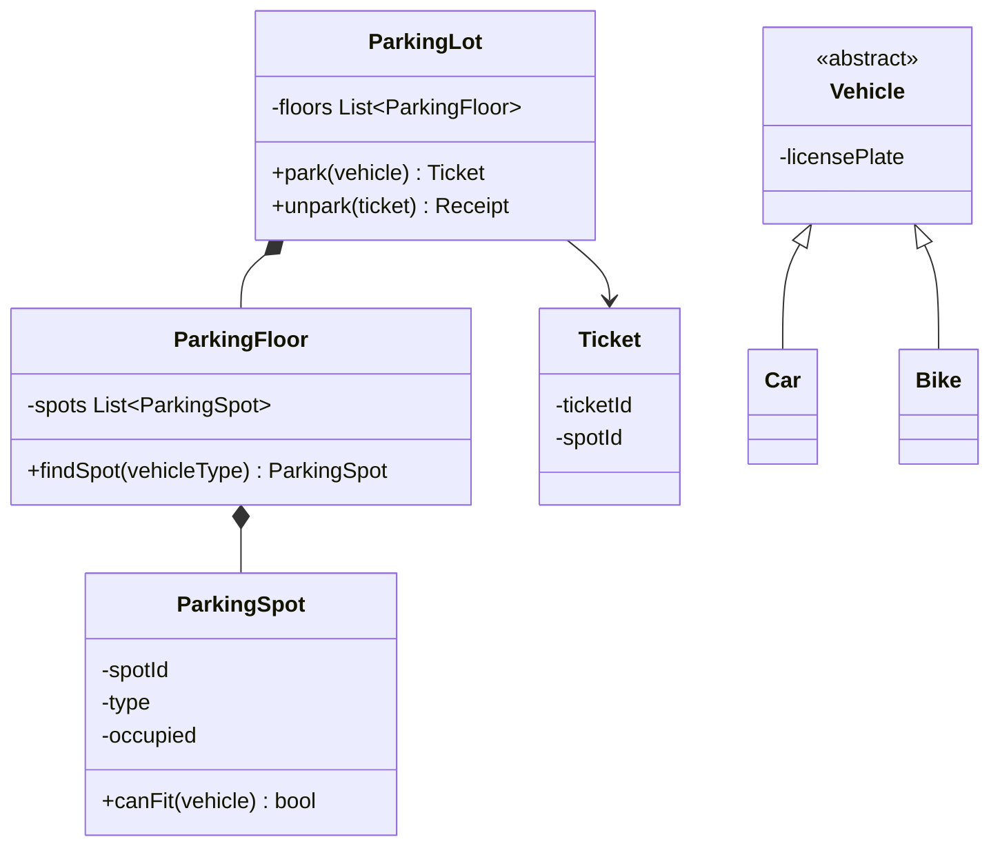
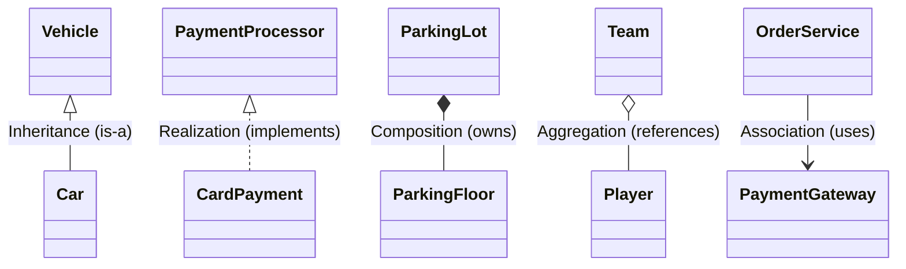
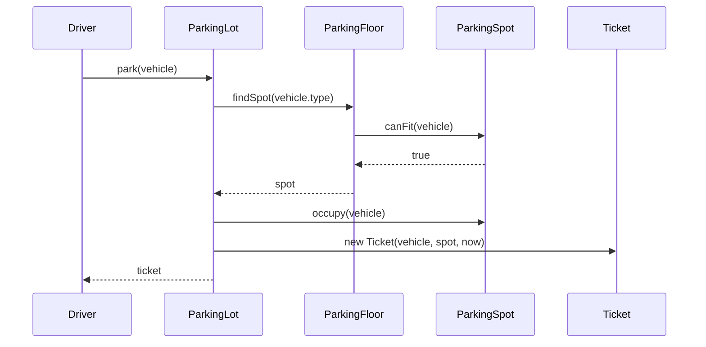
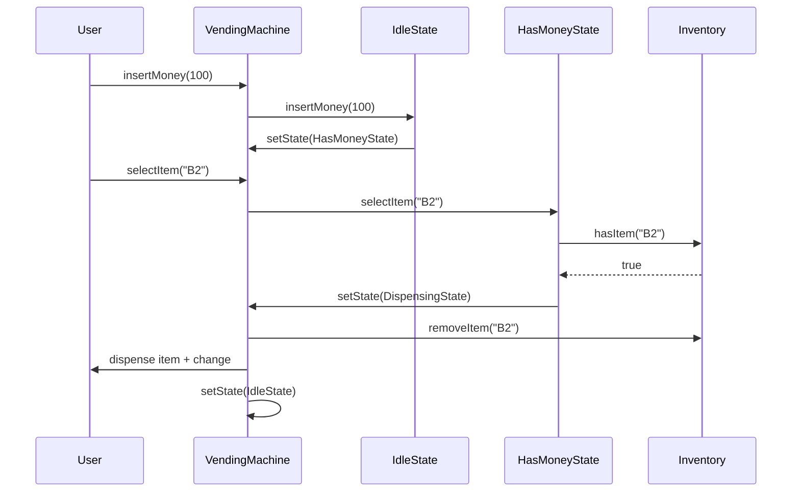

# UML and Class Diagrams

## Concept

- UML gives a shared notation for describing classes, relationships, and object interactions.
- In LLD, the most useful diagrams are:
  - **Class diagrams**: show types, fields, methods, and relationships between classes.
  - **Sequence diagrams**: show how objects collaborate over time for one specific use case.
- Class diagrams help answer:
  - What are the main entities?
  - Which responsibilities belong to which class?
  - Which classes depend on abstractions (DIP from topic 1)?
  - Which relationships are ownership, usage, inheritance, or implementation?
- Sequence diagrams help answer:
  - In what order do the objects interact?
  - Which object is responsible for each step?
  - Does the class diagram actually support this flow?
- Interview diagrams should be readable, not exhaustive. Show the load-bearing classes and methods. Draw the sequence diagram for the one or two flows the interviewer cares about most.

## Problem It Solves

- Converts vague requirements into concrete objects and relationships.
- Makes responsibility boundaries visible before writing any code.
- Exposes missing abstractions, such as a `PaymentMethod` or `PricingStrategy`.
- Helps catch invalid ownership, such as a child object that outlives its parent when it should not.
- Gives the interviewer a clear map before the conversation moves to behavior and trade-offs.
- Sequence diagrams prove that the class diagram actually supports the required flows.

## Trade-offs

- **Completeness vs. readability**: include important classes and methods; omit trivial getters, setters, and every field.
- **Class diagram vs. sequence diagram**: class diagrams show structure; sequence diagrams show one flow through that structure. Use both, but draw the class diagram first.
- **Inheritance vs. interface realization**: inheritance (` - |>`) means "is a"; realization (`..|>`) means "implements this contract."
- **Association vs. composition**: association (` - >`) means one object uses another; composition (`* - `) means strong ownership and shared lifecycle.
- **Precision vs. speed**: perfect UML notation matters less in interviews than a clear design that can be discussed.

## Examples

### Class box notation

- A class box has the class name, important fields, and important methods.
- Example - `ItemSlot`:
  - Fields: `code`, `price`, `quantity`.
  - Methods: `isAvailable()`, `dispenseOne()`.
- Omit trivial getters and setters unless they communicate a rule (for example, `setQuantity(n)` that validates non-negative).
- Mark interface with `<<interface>>` and abstract class with `<<abstract>>`.

### Member Visibility & UML Classifiers in Mermaid

In Mermaid class diagrams, prefixes indicate member visibility, while trailing suffixes define UML classifiers:

| Symbol | Meaning | Example | UML Visual Convention |
|---|---|---|---|
| `+` | **Public** | `+getName() String` | Accessible by all callers |
| `-` | **Private** | `-counter int` | Encapsulated internal state |
| `#` | **Protected** | `#validate()` | Accessible by class and subclasses |
| `~` | **Package / Internal** | `~cache Map` | Accessible within same package |
| `$` | **Static Member** | `+getInstance()$ IdGenerator` | Renders **underlined** (static method or property) |
| `*` | **Abstract Method** | `+render()*` | Renders in **italics** (abstract method) |

### UML Relationships & Mermaid Arrow Reference

In class diagrams, relationships define how objects interact, inherit, or manage lifecycles.

| Relationship | UML Type | Mermaid Arrow | Meaning | Lifecycle Rule | Code Pattern |
|---|---|---|---|---|---|
| **Inheritance** | Generalization | `Child <|-- Parent` | "Is-a" | Subclass inherits parent contract (LSP) | `class Car extends Vehicle` |
| **Realization** | Implementation | `Class ..|> Interface` | "Implements" | Class fulfills interface abstraction (DIP) | `class Card implements Payment` |
| **Composition** | Strong Ownership | `Parent *-- Child` | "Part-of" | Child **dies** if Parent dies (bound lifecycle) | `new ParkingFloor()` inside `ParkingLot` |
| **Aggregation** | Weak Ownership | `Parent o-- Child` | "Has-a" | Child **survives** if Parent dies (independent) | `Player` passed into `Team(player)` |
| **Association** | Dependency / Usage | `ClassA --> ClassB` | "Uses-a" | Transient caller relationship | `service.charge(gateway)` |
| **Multiplicity** | Cardinality | `Lot "1" *-- "*" Floor` | Multiplicity | Defines 1-to-1, 1-to-many (`*`), or many-to-many | List/Array vs single field |

### 5-Second Interview Decision Rule: Composition vs. Aggregation

When deciding between Composition (`*--`) and Aggregation (`o--`) in an interview, ask one question:
> *"If I delete the parent container object, does the child object cease to exist?"*
- **YES**: **Composition (`*--`)**. Deleting `ParkingLot` deletes all its `ParkingFloor`s and `ParkingSpot`s. The children cannot exist without the parent.
- **NO**: **Aggregation (`o--`)**. Deleting a `Team` does not delete the `Player`s. The players simply move to free agency.

### When to draw a sequence diagram

- After the class diagram - once the entities are established, pick the single most important flow.
- Good candidates: the core action (park a vehicle, place an order, dispense an item), and the undo/error path if it crosses many objects.
- Keep the diagram to one scenario. Multiple scenarios become multiple small diagrams, not one big one.

### Sequence diagram: parking flow

### Sequence diagram: vending machine purchase

### What to omit in an interview diagram

- Every enum value, minor helper, or validation method - unless it affects the structural design.
- Getters and setters that add no rule.
- Internal implementation fields that do not shape relationships.
- Prefer one readable diagram and verbal explanation over a dense wall of boxes.
- Start with 5-8 core classes; add helpers only when the interviewer asks for more detail.

### Common LLD correction

- Weak: `ParkingLot` directly contains all `Vehicle` objects and all parking logic in one class.
- Better: `ParkingLot` coordinates, `ParkingFloor` groups spots, `ParkingSpot` owns occupancy, `Ticket` records the assignment, and `SpotSelectionStrategy` (from topic 4 - behavioral patterns) decides which spot to pick.
- Why it matters: each class shows exactly one reason to change, and the sequence diagram proves the collaboration works end to end.
