# LLD Case Studies

## Concept

- LLD case studies apply object-oriented design to small, self-contained systems.
- The goal is to move from a requirement prompt to classes, interfaces, relationships, and behavior.
- A useful LLD flow:
  1. Clarify functional requirements and scope.
  2. Identify nouns as candidate entities.
  3. Identify verbs as candidate behaviors.
  4. Assign responsibilities using SOLID (topic 1).
  5. Choose patterns from topics 2-4 only where they solve an actual variation point.
  6. Draw a class diagram (topic 5 notation).
  7. Walk one or two important flows with a sequence diagram.
  8. Discuss trade-offs and extensions.
- Keep the design at object level. External capabilities - payment, persistence, network - should be abstract interfaces.

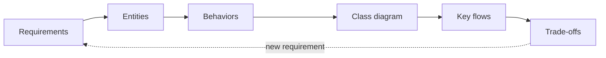
```mermaid
flowchart LR
    R["Requirements"] --> E["Entities"]
    E --> B["Behaviors"]
    B --> C["Class diagram"]
    C --> F["Key flows"]
    F --> T["Trade-offs"]
    T -.->|"new requirement"| R
```

## Problem It Solves

- Prevents jumping straight from prompt to code.
- Shows how to reason about responsibilities before implementation.
- Makes the design extensible without adding unnecessary machinery.
- Builds reusable instincts for the most common LLD prompts asked in interviews.
- Each case study is a worked example of SOLID + a few patterns working together.

## Trade-offs

- **General design vs. prompt-specific design**: reusable abstractions help, but too much generality hides the actual problem.
- **Patterns vs. plain classes**: use a pattern when behavior varies; otherwise plain composition is enough.
- **Inheritance vs. composition**: inheritance is clear for stable type hierarchies; composition is safer for behavior that changes independently.
- **Full model vs. interview model**: a real implementation needs many more details; an interview design should focus on core entities and flows.
- **Abstract interfaces vs. concrete classes**: interfaces protect the design from external details, but too many make the diagram noisy.

---

## Case Study 1: Parking Lot

- **Requirements:** park vehicles, assign compatible spots, issue tickets, release spots, compute parking fee.
- **Entities:** `ParkingLot`, `ParkingFloor`, `ParkingSpot`, `Vehicle`, `Ticket`, `Receipt`.
- **Patterns used:** Strategy (topic 4) for spot selection policy.
- **Responsibilities:**
  - `ParkingLot` coordinates park and unpark operations.
  - `ParkingFloor` owns a group of spots.
  - `ParkingSpot` knows whether it can fit a vehicle and whether it is currently occupied.
  - `SpotSelectionStrategy` chooses among available spots.
  - `Ticket` records the vehicle, spot, and entry time.
  - `FeeCalculator` computes the fee on exit.

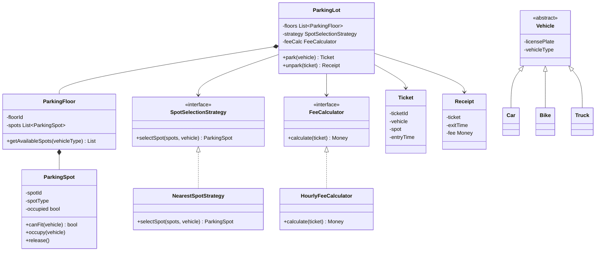
```mermaid
classDiagram
    class SpotSelectionStrategy {
        <<interface>>
        +selectSpot(spots, vehicle) ParkingSpot
    }
    class NearestSpotStrategy {
        +selectSpot(spots, vehicle) ParkingSpot
    }
    class FeeCalculator {
        <<interface>>
        +calculate(ticket) Money
    }
    class HourlyFeeCalculator {
        +calculate(ticket) Money
    }
    class ParkingLot {
        -floors List~ParkingFloor~
        -strategy SpotSelectionStrategy
        -feeCalc FeeCalculator
        +park(vehicle) Ticket
        +unpark(ticket) Receipt
    }
    class ParkingFloor {
        -floorId
        -spots List~ParkingSpot~
        +getAvailableSpots(vehicleType) List
    }
    class ParkingSpot {
        -spotId
        -spotType
        -occupied bool
        +canFit(vehicle) bool
        +occupy(vehicle)
        +release()
    }
    class Vehicle {
        <<abstract>>
        -licensePlate
        -vehicleType
    }
    class Ticket {
        -ticketId
        -vehicle
        -spot
        -entryTime
    }
    class Receipt {
        -ticket
        -exitTime
        -fee Money
    }

    ParkingLot *-- ParkingFloor
    ParkingFloor *-- ParkingSpot
    ParkingLot --> SpotSelectionStrategy
    ParkingLot --> FeeCalculator
    SpotSelectionStrategy <|.. NearestSpotStrategy
    FeeCalculator <|.. HourlyFeeCalculator
    ParkingLot --> Ticket
    ParkingLot --> Receipt
    Vehicle <|-- Car
    Vehicle <|-- Bike
    Vehicle <|-- Truck
```

**Park flow:**

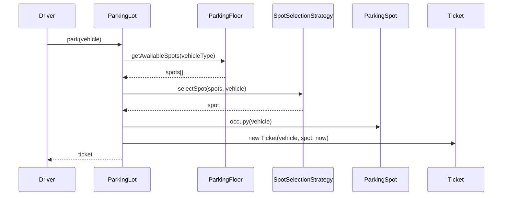
```mermaid
sequenceDiagram
    participant D as Driver
    participant Lot as ParkingLot
    participant F as ParkingFloor
    participant St as SpotSelectionStrategy
    participant Sp as ParkingSpot
    participant T as Ticket

    D->>Lot: park(vehicle)
    Lot->>F: getAvailableSpots(vehicleType)
    F-->>Lot: spots[]
    Lot->>St: selectSpot(spots, vehicle)
    St-->>Lot: spot
    Lot->>Sp: occupy(vehicle)
    Lot->>T: new Ticket(vehicle, spot, now)
    Lot-->>D: ticket
```

- **Extension:** adding `Truck` or `NearestExitStrategy` should not rewrite the parking flow.

---

## Case Study 2: Vending Machine

- **Requirements:** accept money, select item, dispense item, return change, reject invalid actions in the wrong state.
- **Entities:** `VendingMachine`, `ItemSlot`, `Inventory`, `MachineState`.
- **Patterns used:** State (topic 4) for `Idle`, `HasMoney`, `Dispensing`, and `SoldOut`.
- **Responsibilities:**
  - `VendingMachine` stores current state and delegates user actions to it.
  - `Inventory` tracks item slots and quantities.
  - `MachineState` controls valid behavior and transitions for each state.
  - `ItemSlot` knows item code, price, and quantity.

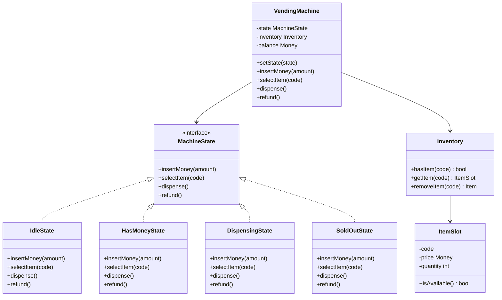
```mermaid
classDiagram
    class MachineState {
        <<interface>>
        +insertMoney(amount)
        +selectItem(code)
        +dispense()
        +refund()
    }
    class IdleState {
        +insertMoney(amount)
        +selectItem(code)
        +dispense()
        +refund()
    }
    class HasMoneyState {
        +insertMoney(amount)
        +selectItem(code)
        +dispense()
        +refund()
    }
    class DispensingState {
        +insertMoney(amount)
        +selectItem(code)
        +dispense()
        +refund()
    }
    class SoldOutState {
        +insertMoney(amount)
        +selectItem(code)
        +dispense()
        +refund()
    }
    class VendingMachine {
        -state MachineState
        -inventory Inventory
        -balance Money
        +setState(state)
        +insertMoney(amount)
        +selectItem(code)
        +dispense()
        +refund()
    }
    class Inventory {
        +hasItem(code) bool
        +getItem(code) ItemSlot
        +removeItem(code) Item
    }
    class ItemSlot {
        -code
        -price Money
        -quantity int
        +isAvailable() bool
    }

    MachineState <|.. IdleState
    MachineState <|.. HasMoneyState
    MachineState <|.. DispensingState
    MachineState <|.. SoldOutState
    VendingMachine --> MachineState
    VendingMachine --> Inventory
    Inventory --> ItemSlot
```

**Purchase flow:**

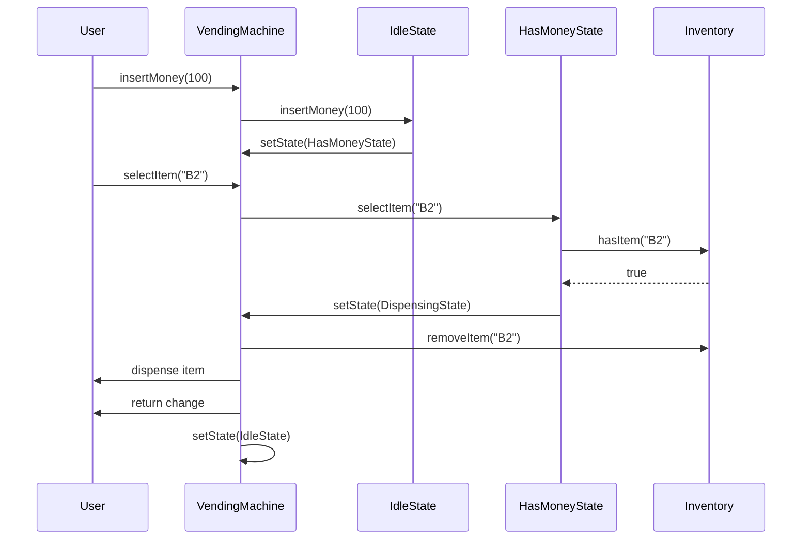
```mermaid
sequenceDiagram
    participant U as User
    participant VM as VendingMachine
    participant IS as IdleState
    participant HM as HasMoneyState
    participant Inv as Inventory

    U->>VM: insertMoney(100)
    VM->>IS: insertMoney(100)
    IS->>VM: setState(HasMoneyState)
    U->>VM: selectItem("B2")
    VM->>HM: selectItem("B2")
    HM->>Inv: hasItem("B2")
    Inv-->>HM: true
    HM->>VM: setState(DispensingState)
    VM->>Inv: removeItem("B2")
    VM->>U: dispense item
    VM->>U: return change
    VM->>VM: setState(IdleState)
```

- **Extension:** adding a refund action is a new behavior in each state, not a branch in every method.

---

## Case Study 3: Elevator

- **Requirements:** accept floor requests from inside and outside the cabin, move between floors, open and close doors, choose the next stop efficiently.
- **Entities:** `Elevator`, `FloorRequest`, `Door`, `ElevatorController`, `SchedulingStrategy`.
- **Patterns used:** Strategy (topic 4) for scheduling policy.
- **Key trade-off:** a simple nearest-floor strategy is easy to explain; a direction-preserving (SCAN) strategy gives smoother behavior under many simultaneous requests.
- **Responsibilities:**
  - `Elevator` knows current floor, direction, door state, and assigned requests.
  - `Door` owns open/closed behavior.
  - `ElevatorController` receives requests and tells elevators what to do next.
  - `SchedulingStrategy` picks the next request from the queue.

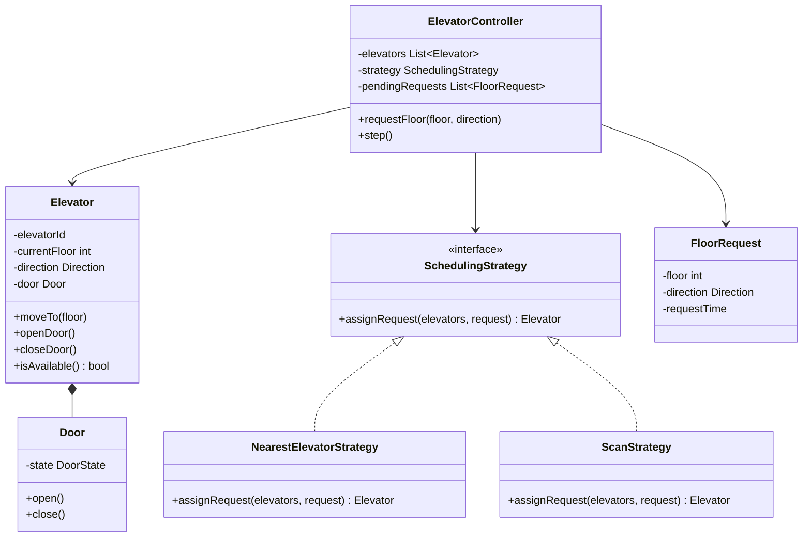
```mermaid
classDiagram
    class ElevatorController {
        -elevators List~Elevator~
        -strategy SchedulingStrategy
        -pendingRequests List~FloorRequest~
        +requestFloor(floor, direction)
        +step()
    }
    class Elevator {
        -elevatorId
        -currentFloor int
        -direction Direction
        -door Door
        +moveTo(floor)
        +openDoor()
        +closeDoor()
        +isAvailable() bool
    }
    class Door {
        -state DoorState
        +open()
        +close()
    }
    class SchedulingStrategy {
        <<interface>>
        +assignRequest(elevators, request) Elevator
    }
    class NearestElevatorStrategy {
        +assignRequest(elevators, request) Elevator
    }
    class ScanStrategy {
        +assignRequest(elevators, request) Elevator
    }
    class FloorRequest {
        -floor int
        -direction Direction
        -requestTime
    }

    ElevatorController --> Elevator
    ElevatorController --> SchedulingStrategy
    ElevatorController --> FloorRequest
    SchedulingStrategy <|.. NearestElevatorStrategy
    SchedulingStrategy <|.. ScanStrategy
    Elevator *-- Door
```

**Request flow:**

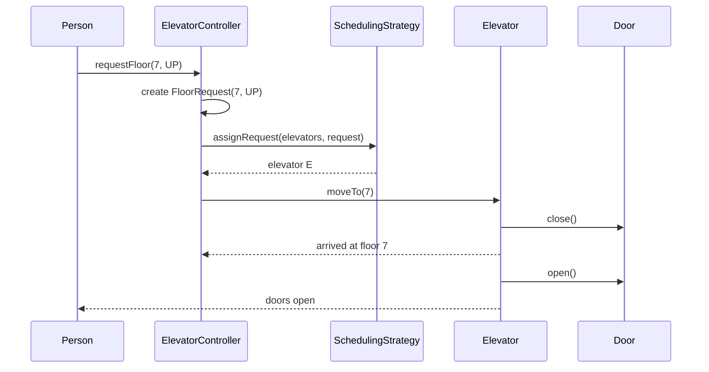
```mermaid
sequenceDiagram
    participant P as Person
    participant EC as ElevatorController
    participant St as SchedulingStrategy
    participant E as Elevator
    participant D as Door

    P->>EC: requestFloor(7, UP)
    EC->>EC: create FloorRequest(7, UP)
    EC->>St: assignRequest(elevators, request)
    St-->>EC: elevator E
    EC->>E: moveTo(7)
    E->>D: close()
    E-->>EC: arrived at floor 7
    E->>D: open()
    E-->>P: doors open
```

- **Extension:** a new scheduling strategy can be plugged in without changing `Elevator`.

---

## Case Study 4: Document Editor

- **Requirements:** insert text, delete text, apply formatting, undo actions, restore previous state.
- **Entities:** `Document`, `Block`, `TextRange`, `EditorCommand`, `UndoStack`.
- **Patterns used:** Command (topic 4) for undoable actions; Memento (topic 4) for bulk snapshots.
- **Responsibilities:**
  - `Document` owns blocks and manages text content.
  - `EditorCommand` represents one undoable user action.
  - `UndoStack` stores executed commands.
  - `InsertTextCommand`, `DeleteTextCommand`, and `ApplyStyleCommand` each know how to undo themselves.

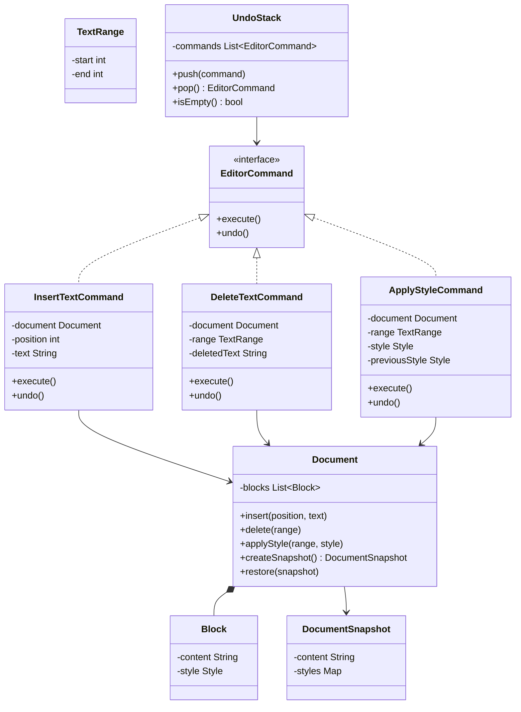
```mermaid
classDiagram
    class Document {
        -blocks List~Block~
        +insert(position, text)
        +delete(range)
        +applyStyle(range, style)
        +createSnapshot() DocumentSnapshot
        +restore(snapshot)
    }
    class Block {
        -content String
        -style Style
    }
    class TextRange {
        -start int
        -end int
    }
    class EditorCommand {
        <<interface>>
        +execute()
        +undo()
    }
    class InsertTextCommand {
        -document Document
        -position int
        -text String
        +execute()
        +undo()
    }
    class DeleteTextCommand {
        -document Document
        -range TextRange
        -deletedText String
        +execute()
        +undo()
    }
    class ApplyStyleCommand {
        -document Document
        -range TextRange
        -style Style
        -previousStyle Style
        +execute()
        +undo()
    }
    class UndoStack {
        -commands List~EditorCommand~
        +push(command)
        +pop() EditorCommand
        +isEmpty() bool
    }
    class DocumentSnapshot {
        -content String
        -styles Map
    }

    Document *-- Block
    EditorCommand <|.. InsertTextCommand
    EditorCommand <|.. DeleteTextCommand
    EditorCommand <|.. ApplyStyleCommand
    InsertTextCommand --> Document
    DeleteTextCommand --> Document
    ApplyStyleCommand --> Document
    UndoStack --> EditorCommand
    Document --> DocumentSnapshot
```

**Insert and undo flow:**

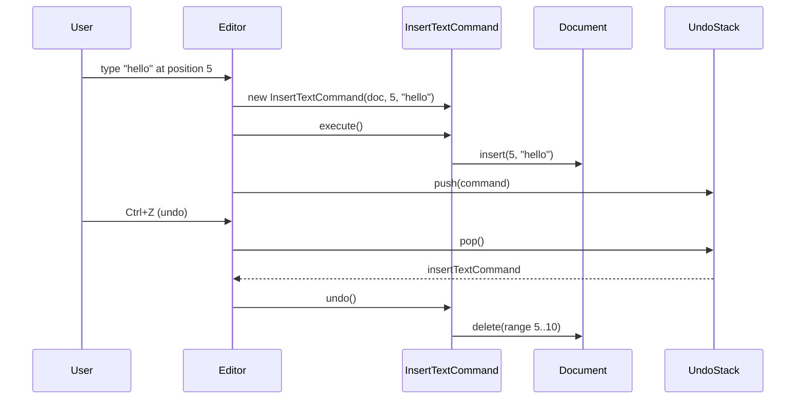
```mermaid
sequenceDiagram
    participant U as User
    participant Ed as Editor
    participant C as InsertTextCommand
    participant Doc as Document
    participant US as UndoStack

    U->>Ed: type "hello" at position 5
    Ed->>C: new InsertTextCommand(doc, 5, "hello")
    Ed->>C: execute()
    C->>Doc: insert(5, "hello")
    Ed->>US: push(command)
    U->>Ed: Ctrl+Z (undo)
    Ed->>US: pop()
    US-->>Ed: insertTextCommand
    Ed->>C: undo()
    C->>Doc: delete(range 5..10)
```

- **Extension:** adding `ResizeImageCommand` follows the same `EditorCommand` contract.

---

## Case Study 5: Tic-Tac-Toe

- **Requirements:** 3×3 board, two players alternate turns, reject invalid moves, detect win or draw.
- **Entities:** `Game`, `Board`, `Cell`, `Player`, `Move`, `WinCondition`.
- **Patterns used:** Strategy (topic 4) if board size or win rule can vary.
- **Responsibilities:**
  - `Game` controls turn order and game status.
  - `Board` owns cells and validates empty positions.
  - `WinCondition` checks whether the latest move wins.
  - `Player` owns marker information.

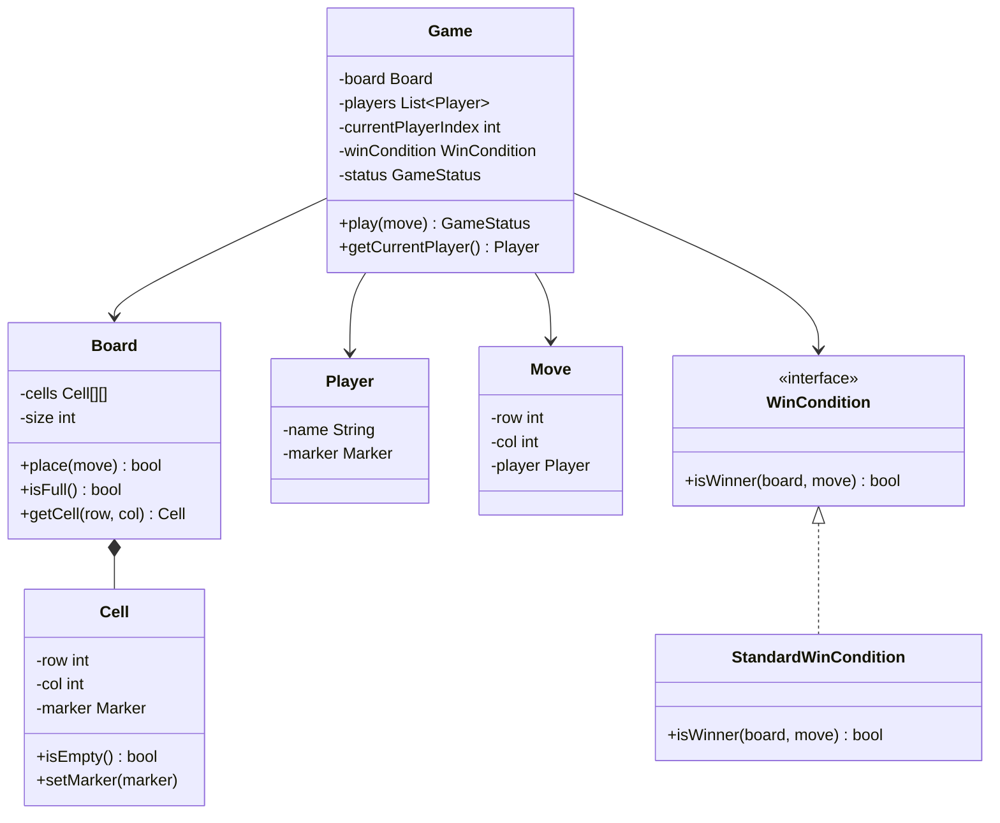
```mermaid
classDiagram
    class Game {
        -board Board
        -players List~Player~
        -currentPlayerIndex int
        -winCondition WinCondition
        -status GameStatus
        +play(move) GameStatus
        +getCurrentPlayer() Player
    }
    class Board {
        -cells Cell[][]
        -size int
        +place(move) bool
        +isFull() bool
        +getCell(row, col) Cell
    }
    class Cell {
        -row int
        -col int
        -marker Marker
        +isEmpty() bool
        +setMarker(marker)
    }
    class Player {
        -name String
        -marker Marker
    }
    class Move {
        -row int
        -col int
        -player Player
    }
    class WinCondition {
        <<interface>>
        +isWinner(board, move) bool
    }
    class StandardWinCondition {
        +isWinner(board, move) bool
    }

    Game --> Board
    Game --> Player
    Game --> WinCondition
    Game --> Move
    Board *-- Cell
    WinCondition <|.. StandardWinCondition
```

**Turn flow:**

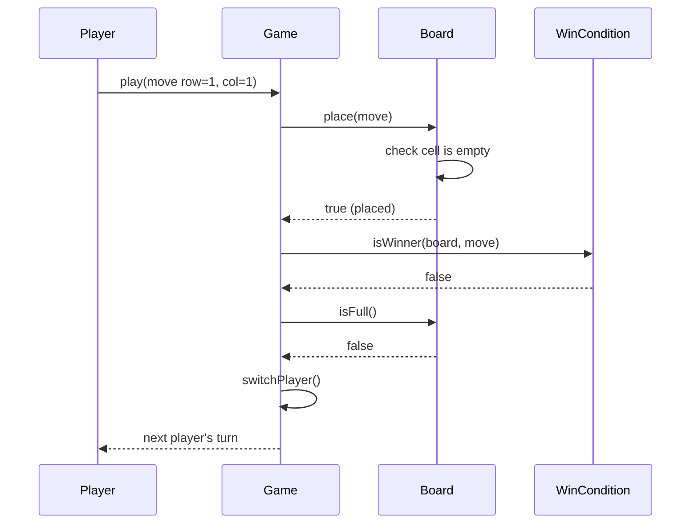
```mermaid
sequenceDiagram
    participant P as Player
    participant G as Game
    participant B as Board
    participant W as WinCondition

    P->>G: play(move row=1, col=1)
    G->>B: place(move)
    B->>B: check cell is empty
    B-->>G: true (placed)
    G->>W: isWinner(board, move)
    W-->>G: false
    G->>B: isFull()
    B-->>G: false
    G->>G: switchPlayer()
    G-->>P: next player's turn
```

- **Extension:** a 4×4 version or a connect-4 variant can use a different `WinCondition`.

---

## Case Study 6: ATM Machine

- **Requirements:** insert card, enter PIN, check balance, withdraw cash, deposit, transfer, eject card.
- **Entities:** `ATM`, `Card`, `Session`, `Account`, `Transaction`, `CashDispenser`, `BankService`.
- **Patterns used:** State (topic 4) for `NoCard`, `CardInserted`, `PinVerified`, `Dispensing`; Command (topic 4) for transactions.
- **Responsibilities:**
  - `ATM` delegates all user actions to the current session state.
  - `Session` records the verified card and active account.
  - `BankService` is an interface for account access - the ATM does not depend on a concrete bank (DIP).
  - `CashDispenser` manages physical cash notes.
  - `Transaction` records each operation.

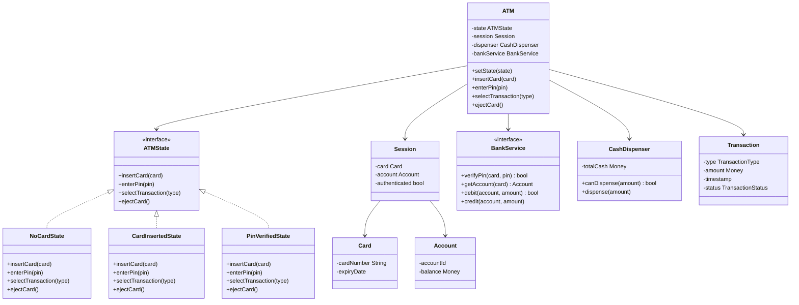
```mermaid
classDiagram
    class ATMState {
        <<interface>>
        +insertCard(card)
        +enterPin(pin)
        +selectTransaction(type)
        +ejectCard()
    }
    class NoCardState {
        +insertCard(card)
        +enterPin(pin)
        +selectTransaction(type)
        +ejectCard()
    }
    class CardInsertedState {
        +insertCard(card)
        +enterPin(pin)
        +selectTransaction(type)
        +ejectCard()
    }
    class PinVerifiedState {
        +insertCard(card)
        +enterPin(pin)
        +selectTransaction(type)
        +ejectCard()
    }
    class ATM {
        -state ATMState
        -session Session
        -dispenser CashDispenser
        -bankService BankService
        +setState(state)
        +insertCard(card)
        +enterPin(pin)
        +selectTransaction(type)
        +ejectCard()
    }
    class Session {
        -card Card
        -account Account
        -authenticated bool
    }
    class BankService {
        <<interface>>
        +verifyPin(card, pin) bool
        +getAccount(card) Account
        +debit(account, amount) bool
        +credit(account, amount)
    }
    class CashDispenser {
        -totalCash Money
        +canDispense(amount) bool
        +dispense(amount)
    }
    class Card {
        -cardNumber String
        -expiryDate
    }
    class Account {
        -accountId
        -balance Money
    }
    class Transaction {
        -type TransactionType
        -amount Money
        -timestamp
        -status TransactionStatus
    }

    ATMState <|.. NoCardState
    ATMState <|.. CardInsertedState
    ATMState <|.. PinVerifiedState
    ATM --> ATMState
    ATM --> Session
    ATM --> BankService
    ATM --> CashDispenser
    ATM --> Transaction
    Session --> Card
    Session --> Account
```

**Withdraw flow:**

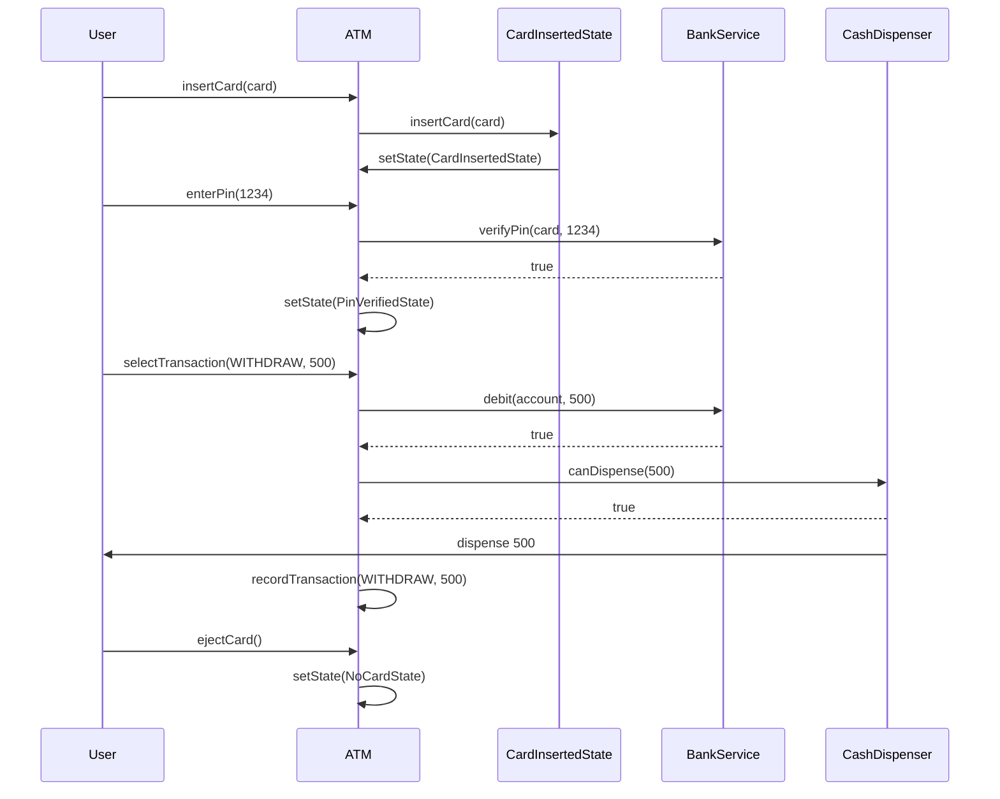
```mermaid
sequenceDiagram
    participant U as User
    participant A as ATM
    participant S as CardInsertedState
    participant BS as BankService
    participant CD as CashDispenser

    U->>A: insertCard(card)
    A->>S: insertCard(card)
    S->>A: setState(CardInsertedState)
    U->>A: enterPin(1234)
    A->>BS: verifyPin(card, 1234)
    BS-->>A: true
    A->>A: setState(PinVerifiedState)
    U->>A: selectTransaction(WITHDRAW, 500)
    A->>BS: debit(account, 500)
    BS-->>A: true
    A->>CD: canDispense(500)
    CD-->>A: true
    CD->>U: dispense 500
    A->>A: recordTransaction(WITHDRAW, 500)
    U->>A: ejectCard()
    A->>A: setState(NoCardState)
```

- **Extension:** contactless or biometric entry changes `CardInsertedState` internals only - the flow is the same.

---

## Case Study 7: Library Management System

- **Requirements:** catalog books, allow members to borrow and return copies, track due dates, calculate fines.
- **Entities:** `Library`, `Book`, `BookCopy`, `Member`, `Loan`, `Fine`, `Catalog`.
- **Patterns used:** Observer (topic 4) for due-date notifications; Strategy (topic 4) for fine calculation.
- **Responsibilities:**
  - `Catalog` manages search and availability of books.
  - `BookCopy` tracks the physical copy - its status and current borrower.
  - `Loan` records which member has which copy and when it is due.
  - `FinePolicy` is a Strategy that calculates overdue fines.
  - `LoanObserver` gets notified when a due date approaches or a copy is returned late.

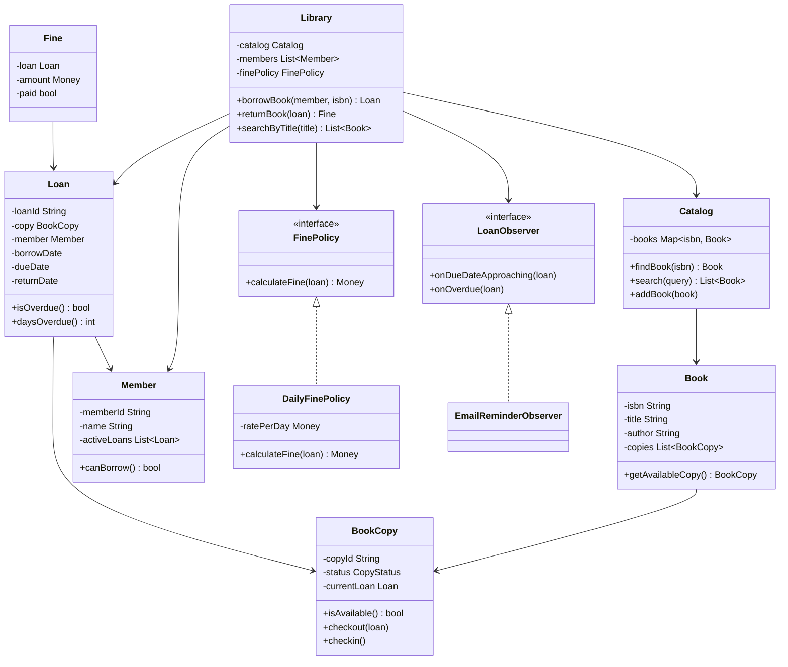
```mermaid
classDiagram
    class Library {
        -catalog Catalog
        -members List~Member~
        -finePolicy FinePolicy
        +borrowBook(member, isbn) Loan
        +returnBook(loan) Fine
        +searchByTitle(title) List~Book~
    }
    class Catalog {
        -books Map~isbn, Book~
        +findBook(isbn) Book
        +search(query) List~Book~
        +addBook(book)
    }
    class Book {
        -isbn String
        -title String
        -author String
        -copies List~BookCopy~
        +getAvailableCopy() BookCopy
    }
    class BookCopy {
        -copyId String
        -status CopyStatus
        -currentLoan Loan
        +isAvailable() bool
        +checkout(loan)
        +checkin()
    }
    class Member {
        -memberId String
        -name String
        -activeLoans List~Loan~
        +canBorrow() bool
    }
    class Loan {
        -loanId String
        -copy BookCopy
        -member Member
        -borrowDate
        -dueDate
        -returnDate
        +isOverdue() bool
        +daysOverdue() int
    }
    class FinePolicy {
        <<interface>>
        +calculateFine(loan) Money
    }
    class DailyFinePolicy {
        -ratePerDay Money
        +calculateFine(loan) Money
    }
    class Fine {
        -loan Loan
        -amount Money
        -paid bool
    }
    class LoanObserver {
        <<interface>>
        +onDueDateApproaching(loan)
        +onOverdue(loan)
    }

    Library --> Catalog
    Library --> FinePolicy
    Catalog --> Book
    Book --> BookCopy
    Library --> Member
    Library --> Loan
    Library --> LoanObserver
    FinePolicy <|.. DailyFinePolicy
    LoanObserver <|.. EmailReminderObserver
    Loan --> BookCopy
    Loan --> Member
    Fine --> Loan
```

**Borrow flow:**

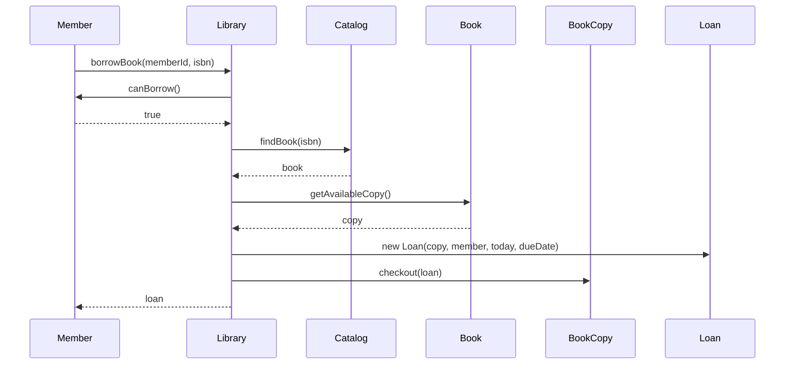
```mermaid
sequenceDiagram
    participant M as Member
    participant Lib as Library
    participant Cat as Catalog
    participant B as Book
    participant BC as BookCopy
    participant L as Loan

    M->>Lib: borrowBook(memberId, isbn)
    Lib->>M: canBorrow()
    M-->>Lib: true
    Lib->>Cat: findBook(isbn)
    Cat-->>Lib: book
    Lib->>B: getAvailableCopy()
    B-->>Lib: copy
    Lib->>L: new Loan(copy, member, today, dueDate)
    Lib->>BC: checkout(loan)
    Lib-->>M: loan
```

- **Extension:** a new `WeeklyFinePolicy` adds one class. A new notification channel adds one `LoanObserver` implementation.

---

## Case Study 8: Movie Ticket Booking (BookMyShow)

- **Requirements:** search movies, view shows, select seats, book tickets, make payment, send confirmation.
- **Entities:** `Movie`, `Show`, `Theatre`, `Screen`, `Seat`, `Booking`, `Payment`.
- **Patterns used:** Strategy (topic 4) for seat selection and pricing; Observer (topic 4) for booking confirmation notifications.
- **Responsibilities:**
  - `Show` links a movie to a screen and a time slot. It owns seat availability for that show.
  - `SeatSelectionStrategy` chooses a seat cluster given user preference.
  - `Booking` records the confirmed seat reservation and payment.
  - `PaymentService` is an abstract interface (DIP from SOLID).
  - `BookingObserver` sends confirmation email or SMS.

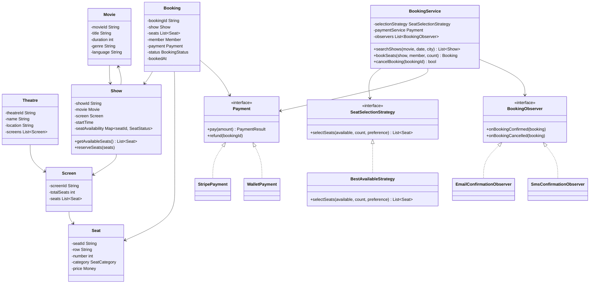
```mermaid
classDiagram
    class Movie {
        -movieId String
        -title String
        -duration int
        -genre String
        -language String
    }
    class Theatre {
        -theatreId String
        -name String
        -location String
        -screens List~Screen~
    }
    class Screen {
        -screenId String
        -totalSeats int
        -seats List~Seat~
    }
    class Show {
        -showId String
        -movie Movie
        -screen Screen
        -startTime
        -seatAvailability Map~seatId, SeatStatus~
        +getAvailableSeats() List~Seat~
        +reserveSeats(seats)
    }
    class Seat {
        -seatId String
        -row String
        -number int
        -category SeatCategory
        -price Money
    }
    class Booking {
        -bookingId String
        -show Show
        -seats List~Seat~
        -member Member
        -payment Payment
        -status BookingStatus
        -bookedAt
    }
    class Payment {
        <<interface>>
        +pay(amount) PaymentResult
        +refund(bookingId)
    }
    class SeatSelectionStrategy {
        <<interface>>
        +selectSeats(available, count, preference) List~Seat~
    }
    class BestAvailableStrategy {
        +selectSeats(available, count, preference) List~Seat~
    }
    class BookingObserver {
        <<interface>>
        +onBookingConfirmed(booking)
        +onBookingCancelled(booking)
    }
    class BookingService {
        -selectionStrategy SeatSelectionStrategy
        -paymentService Payment
        -observers List~BookingObserver~
        +searchShows(movie, date, city) List~Show~
        +bookSeats(show, member, count) Booking
        +cancelBooking(bookingId) bool
    }

    Movie --> Show
    Theatre --> Screen
    Screen --> Seat
    Show --> Movie
    Show --> Screen
    Booking --> Show
    Booking --> Seat
    Booking --> Payment
    BookingService --> SeatSelectionStrategy
    BookingService --> Payment
    BookingService --> BookingObserver
    SeatSelectionStrategy <|.. BestAvailableStrategy
    BookingObserver <|.. EmailConfirmationObserver
    BookingObserver <|.. SmsConfirmationObserver
    Payment <|.. StripePayment
    Payment <|.. WalletPayment
```

**Book seats flow:**

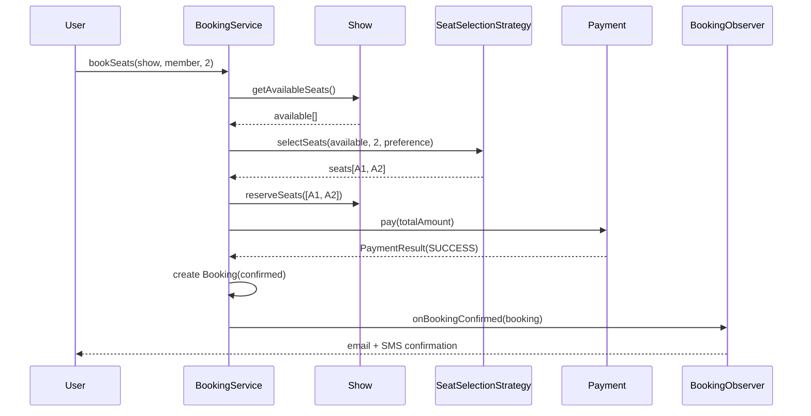
```mermaid
sequenceDiagram
    participant U as User
    participant BS as BookingService
    participant Sh as Show
    participant St as SeatSelectionStrategy
    participant Pay as Payment
    participant Obs as BookingObserver

    U->>BS: bookSeats(show, member, 2)
    BS->>Sh: getAvailableSeats()
    Sh-->>BS: available[]
    BS->>St: selectSeats(available, 2, preference)
    St-->>BS: seats[A1, A2]
    BS->>Sh: reserveSeats([A1, A2])
    BS->>Pay: pay(totalAmount)
    Pay-->>BS: PaymentResult(SUCCESS)
    BS->>BS: create Booking(confirmed)
    BS->>Obs: onBookingConfirmed(booking)
    Obs-->>U: email + SMS confirmation
```

- **Extension:** adding a new payment method adds one `Payment` implementation. Adding loyalty points adds one `BookingObserver`.

---

## Case Study 9: Chess Game

- **Requirements:** two players alternate moves on an 8×8 board, validate legal moves per piece type, detect check and checkmate, support undo.
- **Entities:** `Game`, `Board`, `Piece`, `PieceType`, `Player`, `Move`, `MoveHistory`.
- **Patterns used:**
  - Strategy (topic 4) per piece type for move validation.
  - Command (topic 4) for moves, enabling undo.
  - Flyweight (topic 3) via `PieceType` to share movement rules across pieces of the same kind.
- **Responsibilities:**
  - `Board` manages the grid and provides position lookup.
  - `Piece` holds position and delegates legal-move calculation to `MoveStrategy`.
  - `MoveStrategy` encodes the movement rules for each piece type.
  - `Move` (Command) stores from/to squares and captured piece for undo.
  - `MoveHistory` stores executed moves for undo replay.
  - `CheckDetector` determines if a player's king is in check.

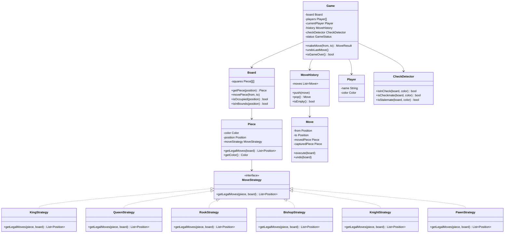
```mermaid
classDiagram
    class Game {
        -board Board
        -players Player[]
        -currentPlayer Player
        -history MoveHistory
        -checkDetector CheckDetector
        -status GameStatus
        +makeMove(from, to) MoveResult
        +undoLastMove()
        +isGameOver() bool
    }
    class Board {
        -squares Piece[][]
        +getPiece(position) Piece
        +movePiece(from, to)
        +isOccupied(position) bool
        +isInBounds(position) bool
    }
    class Piece {
        -color Color
        -position Position
        -moveStrategy MoveStrategy
        +getLegalMoves(board) List~Position~
        +getColor() Color
    }
    class MoveStrategy {
        <<interface>>
        +getLegalMoves(piece, board) List~Position~
    }
    class KingStrategy {
        +getLegalMoves(piece, board) List~Position~
    }
    class QueenStrategy {
        +getLegalMoves(piece, board) List~Position~
    }
    class RookStrategy {
        +getLegalMoves(piece, board) List~Position~
    }
    class BishopStrategy {
        +getLegalMoves(piece, board) List~Position~
    }
    class KnightStrategy {
        +getLegalMoves(piece, board) List~Position~
    }
    class PawnStrategy {
        +getLegalMoves(piece, board) List~Position~
    }
    class Move {
        -from Position
        -to Position
        -movedPiece Piece
        -capturedPiece Piece
        +execute(board)
        +undo(board)
    }
    class MoveHistory {
        -moves List~Move~
        +push(move)
        +pop() Move
        +isEmpty() bool
    }
    class Player {
        -name String
        -color Color
    }
    class CheckDetector {
        +isInCheck(board, color) bool
        +isCheckmate(board, color) bool
        +isStalemate(board, color) bool
    }

    Game --> Board
    Game --> Player
    Game --> MoveHistory
    Game --> CheckDetector
    Board --> Piece
    Piece --> MoveStrategy
    MoveStrategy <|.. KingStrategy
    MoveStrategy <|.. QueenStrategy
    MoveStrategy <|.. RookStrategy
    MoveStrategy <|.. BishopStrategy
    MoveStrategy <|.. KnightStrategy
    MoveStrategy <|.. PawnStrategy
    MoveHistory --> Move
```

**Make move flow:**

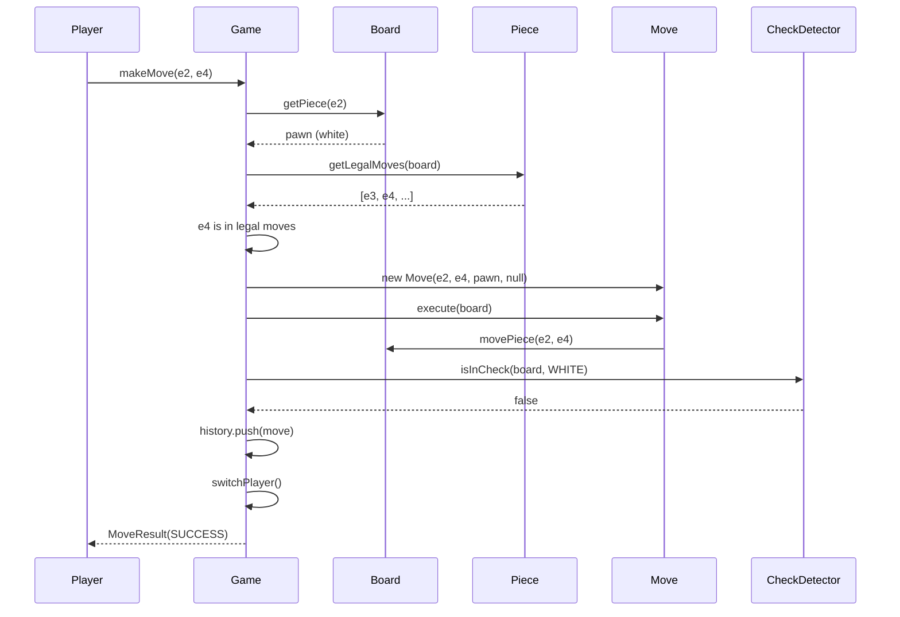
```mermaid
sequenceDiagram
    participant P as Player
    participant G as Game
    participant B as Board
    participant Pi as Piece
    participant M as Move
    participant CD as CheckDetector

    P->>G: makeMove(e2, e4)
    G->>B: getPiece(e2)
    B-->>G: pawn (white)
    G->>Pi: getLegalMoves(board)
    Pi-->>G: [e3, e4, ...]
    G->>G: e4 is in legal moves
    G->>M: new Move(e2, e4, pawn, null)
    G->>M: execute(board)
    M->>B: movePiece(e2, e4)
    G->>CD: isInCheck(board, WHITE)
    CD-->>G: false
    G->>G: history.push(move)
    G->>G: switchPlayer()
    G-->>P: MoveResult(SUCCESS)
```

- **Extension:** adding en passant changes `PawnStrategy` only. Adding timed chess adds a `Clock` per player - `Game` observes it.

---

## How to Present in an Interview

A well-structured LLD answer follows a consistent 6-step flow:

### Step 1: Clarify scope (1-2 minutes)

- Ask one or two questions to pin the scope before drawing anything.
- Example for parking lot: "Single lot or multi-site? What vehicle types? Is pricing required?"
- State your assumed answers clearly: "I'll design a single lot with multiple floors, supporting cars and bikes, with hourly pricing."
- This signals that you think before designing and avoids building the wrong thing.

### Step 2: Identify entities (2-3 minutes)

- List the main nouns from your scoped requirements.
- For each noun, say what it *owns* (its data) and what it *does* (its behavior).
- Discard entities that are just fields on another entity.
- Example: a `Ticket` owns vehicle, spot, and entry time - it is a real entity. "Spot type" is just a field on `ParkingSpot`, not its own entity.

### Step 3: Sketch the class diagram (5-8 minutes)

- Draw 5-8 core classes. Start with the obvious central class and expand outward.
- Label key relationships: composition, association, inheritance, realization.
- Add one or two interfaces where behavior varies (discount policy, strategy, observer).
- Name methods that matter for the flow you will show next.
- Say SOLID connection aloud: "I'm making `SpotSelectionStrategy` an interface so we can add new policies without changing `ParkingLot`."

### Step 4: Walk one key flow with a sequence diagram (3-5 minutes)

- Pick the core happy-path action (park a vehicle, withdraw cash, book seats).
- Walk through which object calls which, and what each returns.
- Say it out loud as you draw: "Driver calls `park(vehicle)`, lot asks each floor for available spots, strategy picks the best one, lot occupies it and creates a ticket."
- This proves the class diagram works - a sequence diagram that cannot be drawn means a missing method or a misplaced responsibility.

### Step 5: Discuss trade-offs (2-3 minutes)

- Name one trade-off you made and why: "I used Strategy for spot selection to make it easy to add new policies. For a simpler system, I could inline the logic in `ParkingLot`."
- Mention where you simplified: "I left `FeeCalculator` as an interface but didn't implement different pricing tiers."
- Optionally raise a risk: "If concurrent users try to park at the same time, `occupy()` needs to be atomic."

### Step 6: Show one extension (1-2 minutes)

- Show that the design can absorb a new requirement without rewriting stable code.
- Example: "If they add EV charging spots, I add `ChargingSpot extends ParkingSpot` and a new strategy - `ParkingLot.park()` is untouched."
- This closes the loop: you started with scope, designed for extensibility, and proved it.

### Quick reference: pattern signals in LLD prompts

| Prompt signal | Likely pattern |
| - | - |
| "Support multiple pricing rules / algorithms" | Strategy |
| "Notify users / components when state changes" | Observer |
| "Support undo or action history" | Command |
| "Behavior changes based on current status" | State |
| "Treat single items and groups the same way" | Composite |
| "Add features without changing existing code" | Decorator |
| "Wrap a class you cannot modify" | Adapter |
| "Create families of related objects" | Abstract Factory |
| "Build objects with many optional fields" | Builder |
| "One shared resource per process" | Singleton |
