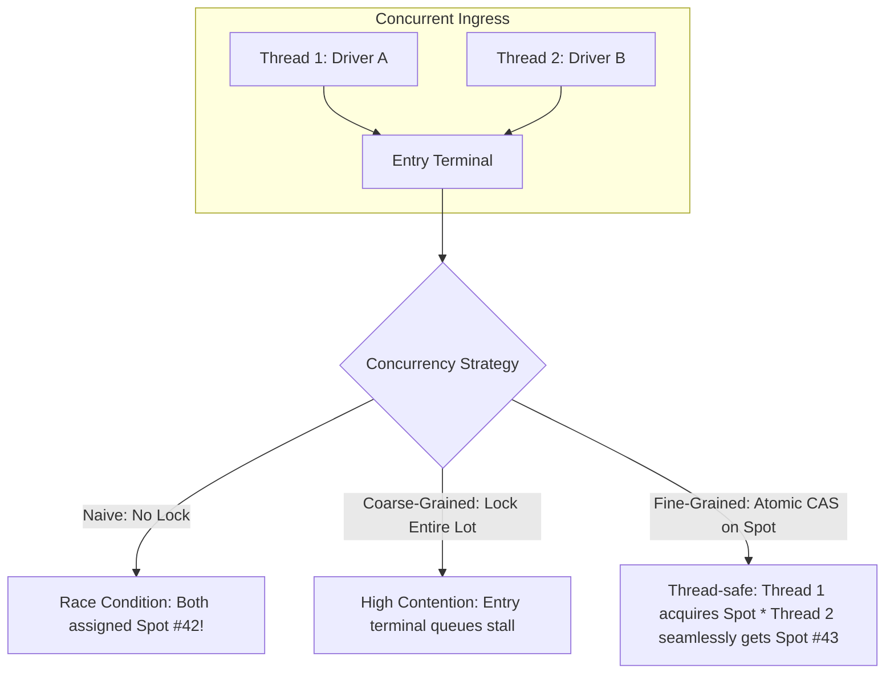

# Concurrency in Low-Level Design

## Concept

- In senior and Staff-level Low-Level Design interviews, interviewers frequently take a working object-oriented design and ask: *"Now, multiple threads are calling this concurrently. What breaks, and how do you make it thread-safe?"*
- Single-threaded object designs assume sequential execution. In multi-threaded environments, **shared mutable state** without synchronization leads to:
  - **Race conditions**: Multiple threads read and mutate state simultaneously, producing nondeterministic corrupted state (e.g., two cars assigned the exact same parking spot).
  - **Memory visibility issues**: Changes made by one CPU core remain in local L1/L2 caches and are not immediately visible to other threads without memory barriers (`volatile` / atomic operations).
  - **Deadlocks**: Two threads waiting indefinitely on locks held by each other.
- Key Concurrency Primitives in Object Design:
  1. **Mutex / Monitor Lock (`synchronized`, `ReentrantLock`)**: Guarantees mutual exclusion for critical sections.
  2. **ReadWriteLock (`ReentrantReadWriteLock`)**: Allows multiple concurrent readers but exclusive write access - ideal for read-heavy entities (like querying catalog items or available inventory).
  3. **Atomic Primitives (`AtomicInteger`, `AtomicReference`, CAS)**: Non-blocking, hardware-level Compare-And-Swap operations for counters and state flags without mutex overhead.
  4. **Thread-Safe Collections (`ConcurrentHashMap`, `BlockingQueue`)**: Internally segmented or lock-free data structures that isolate synchronization logic from domain entities.
  5. **Semaphores**: Restricts the number of concurrent threads accessing a finite pool of resources (e.g., connection pools or physical parking entry gates).



## Problem It Solves

- Prevents data corruption, double-allocation, and lost updates in multi-threaded application servers.
- Separates synchronization mechanics from business domain models, keeping object-oriented code clean, modular, and maintainable.
- Provides predictable performance under concurrent load without deadlocking or starving threads.

## Trade-offs

- **Coarse-Grained vs. Fine-Grained Locking**:
  - Locking the entire root entity (`synchronized (parkingLot)`) is simple to implement and avoids deadlocks, but creates a massive performance bottleneck because only one user can enter/exit at a time.
  - Locking individual sub-entities (per-floor or per-spot locks) maximizes throughput, but significantly increases code complexity and introduces potential deadlock risks if locks are acquired in inconsistent order.
- **Lock-Based vs. Lock-Free (CAS)**:
  - Mutexes put blocked threads to sleep, incurring OS context switching overhead (~1-5 µs).
  - Atomic CAS (`compareAndSet`) spins in user-space without context switching, which is blazingly fast under low-to-moderate contention, but wastes CPU cycles under extreme write contention.
- **Pessimistic vs. Optimistic Concurrency**:
  - Pessimistic locking locks the resource immediately upon reading. Safe, but degrades concurrent throughput.
  - Optimistic locking reads without locks and validates a version timestamp at commit time. Excellent for read-heavy objects; fails with excessive retry loops when write conflict rates are high.

## Core Thread-Safe Design Patterns

### 1. Thread-Safe Singleton (Double-Checked Locking)
Used for process-wide coordinators (e.g., `ElevatorSystem`, `ParkingLot` instance):
```java
public class ParkingLot {
    private static volatile ParkingLot instance; // volatile ensures memory visibility & prevents instruction reordering

    private ParkingLot() {}

    public static ParkingLot getInstance() {
        if (instance == null) {
            synchronized (ParkingLot.class) {
                if (instance == null) {
                    instance = new ParkingLot();
                }
            }
        }
        return instance;
    }
}
```

### 2. Producer-Consumer with `BlockingQueue`
Decouples request submission from processing workers (e.g., elevator button presses or ticket printing):
```java
public class Dispatcher {
    private final BlockingQueue<Request> queue = new LinkedBlockingQueue<>(1000);

    public void submitRequest(Request req) throws InterruptedException {
        queue.put(req); // Blocks if queue is full (backpressure)
    }

    public Request pollRequest() throws InterruptedException {
        return queue.take(); // Blocks if queue is empty
    }
}
```

---

## Applied Case Study Concurrency Fixes

### 1. Parking Lot: Spot Allocation Race Condition
- **The Bug**: Two threads call `findAvailableSpot()` and both see `spot.isOccupied() == false`. Both call `spot.occupy()`, assigning the same spot to two vehicles.
- **The Fix (Atomic State Transition)**:
  ```java
  public class ParkingSpot {
      private final int spotId;
      private final AtomicBoolean occupied = new AtomicBoolean(false);

      public boolean tryOccupy(Vehicle vehicle) {
          // Atomically transitions from false -> true; returns true only for the winning thread
          return occupied.compareAndSet(false, true);
      }

      public void vacate() {
          occupied.set(false);
      }
  }
  ```

### 2. ATM / Banking: Deadlock Prevention in Fund Transfers
- **The Bug**: Thread 1 transfers Account A -> Account B (locks A, waits for B). Thread 2 transfers Account B -> Account A (locks B, waits for A). System deadlocks.
- **The Fix (Deterministic Lock Ordering)**:
  ```java
  public class AccountService {
      public void transfer(Account from, Account to, double amount) {
          Account firstLock = from.getId() < to.getId() ? from : to;
          Account secondLock = from.getId() < to.getId() ? to : from;

          synchronized (firstLock) {
              synchronized (secondLock) {
                  if (from.getBalance() >= amount) {
                      from.debit(amount);
                      to.credit(amount);
                  }
              }
          }
      }
  }
  ```

### 3. Elevator: Concurrent Dispatcher
- **The Bug**: Hall call buttons pressed on multiple floors simultaneously race to mutate the elevator's target floor set.
- **The Fix**: Use thread-safe `ConcurrentSkipListSet` or a dedicated event loop with `BlockingQueue` per elevator car to sequence floor stops without shared state mutation.

---

## Interview Framing

- In LLD rounds, proactively point out shared mutable state before the interviewer asks: *"Here, `availableSpots` is shared across entry gates. In a multi-threaded system, this will create a race condition."*
- Propose the concurrency model deliberately:
  1. Start with **lock-free atomics** for primitive states (e.g., `AtomicBoolean` for spot allocation).
  2. Use **`ReadWriteLock`** when reads vastly outnumber writes (e.g., reading movie seat layouts vs booking a seat).
  3. Apply **deterministic lock ordering** (sorting resource IDs) whenever an operation requires holding multiple locks simultaneously to prove you understand deadlock prevention (Coffman conditions).
