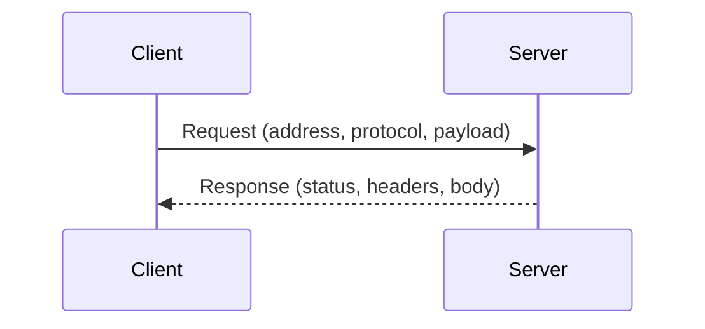
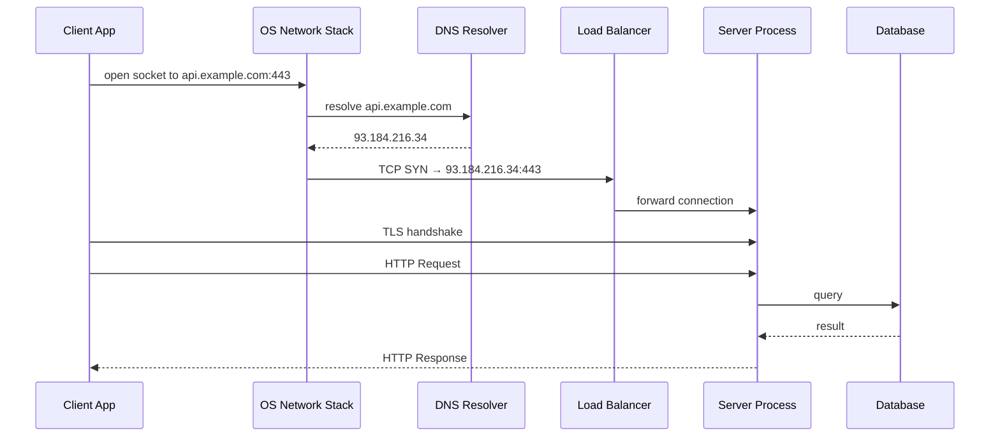
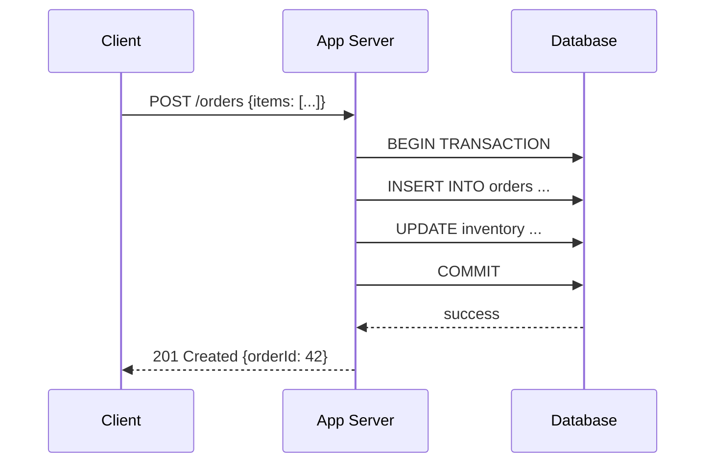
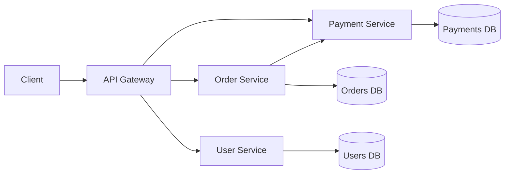

# Client-Server Architecture

## Concept

- A **client** is any process that initiates a request — a browser, a mobile app, a CLI tool, or another service.
- A **server** is any process that listens for requests, processes them, and sends responses.
- The model separates **consuming** a service from **providing** it. Neither side needs to know how the other is built internally — only the agreed protocol matters.
- This separation is the foundation of almost every networked system: HTTP APIs, databases, email, DNS, and microservices all follow the client-server pattern.

**Analogy**: a restaurant. You (the client) sit at a table and place orders. The kitchen (the server) processes orders and delivers food. You don't need to know how the kitchen works; the kitchen doesn't need to know why you're hungry. The menu is the protocol.



## Problem It Solves

**Before client-server**: every user needed a local copy of the application and data (spreadsheets, files, programs). Updates had to be distributed to every machine. Collaboration was impossible in real time.

**After client-server**: data and logic live on the server. Every client gets the same up-to-date data. Updating the server updates the experience for all clients simultaneously.

Specific benefits:
- **Shared resources** — one database serves thousands of clients without each owning a copy.
- **Centralised updates** — deploy once on the server; all clients benefit immediately.
- **Thin clients** — a browser needs no database engine or complex business logic. Compute stays on the server.
- **Independent scaling** — add more server instances under load without touching any client.
- **Security boundary** — sensitive data and logic never leave the server; the client only sees what it's explicitly given.

## Trade-offs

| Factor | Centralised Server | Distributed / P2P |
|---|---|---|
| Reliability | Single point of failure (mitigated by replicas) | No central failure point |
| Scalability | Scale server tier independently | Each peer contributes resources |
| Security | Enforce at one boundary | Hard to enforce consistent policy |
| Data consistency | Server is the source of truth | Eventual consistency is common |
| Operational cost | You run the servers | Users supply compute |

**Stateless vs. stateful servers** is the second major trade-off:

| | Stateless | Stateful |
|---|---|---|
| Definition | Each request contains all context needed | Server remembers state between requests |
| Example | REST APIs, CDN responses | WebSocket game servers, database connections |
| Horizontal scaling | Easy — any server handles any request | Hard — client must return to the same server |
| Failure recovery | Any replica takes over immediately | Session must be migrated or rebuilt |
| Caching | Simple — same input → same output | Complex — response depends on invisible state |

**Thick vs. thin client**:
- **Thin client** (browser, terminal): server computes everything; client only renders. Low device requirements but dependent on network connectivity.
- **Thick client** (mobile app, desktop): runs significant logic locally. Can work offline. Requires sync strategy for local vs. server state.

## How It Works — Deep Dive

### The full request lifecycle



Every step adds latency:
- DNS lookup: 1–100 ms (cached: ~0 ms)
- TCP handshake: 1 RTT (~50 ms cross-continent)
- TLS handshake: 1–2 RTTs (~50–100 ms)
- Server processing: varies (1 ms–seconds)

This is why persistent connections (HTTP keep-alive), DNS caching, and TLS session resumption exist — to eliminate repeated handshake costs.

### Two-tier architecture

```
Client ←→ Application Server (logic + data)
```

Simple and fast to build. The application server handles both business logic and data storage. Works for small applications but violates SRP (Single Responsibility Principle — phase 1): the same process owns logic, I/O, and storage.

**Failure mode**: if the server restarts, all in-process state is lost.

### Three-tier architecture

```
Client ←→ Application Server (logic) ←→ Database (data)
```

The standard production architecture:



- **App server** handles authentication, validation, business logic, and orchestration.
- **Database** handles durable storage, ACID transactions, and querying.
- Each tier scales independently: more app servers for compute, read replicas for read-heavy database load.

### N-tier and microservices

As systems grow, the application tier splits into many services:



- Each service is a separate client-server pair.
- The Order Service is a **server** to the client but a **client** to the Payment Service.
- Services communicate via HTTP/REST, gRPC, or message queues.
- **Trade-off**: more flexible scaling and independent deployment, but distributed system complexity (network failures, latency, partial failures).

### Connection pooling

Opening a TCP + TLS connection is expensive (2–3 RTTs). Applications reuse connections via a **connection pool**:

- Application maintains N open connections to the database.
- Each request borrows a connection, uses it, and returns it.
- No handshake cost on reuse.
- Pool size is a key tuning knob: too few → requests queue waiting for a connection; too many → database is overwhelmed.

Common pool libraries: HikariCP (Java), `pg` pool (Node.js), `database/sql` (Go).

### Peer-to-Peer as contrast

In P2P, every node is simultaneously a client and a server:

| | Client-Server | Peer-to-Peer |
|---|---|---|
| Coordination | Centralised | Decentralised |
| Bandwidth | Server pays for all bandwidth | Each peer contributes bandwidth |
| Availability | Depends on server uptime | Survives individual node failures |
| Content integrity | Server controls content | Requires cryptographic verification (e.g., BitTorrent hash) |
| Examples | Web, email, databases | BitTorrent, IPFS, WebRTC, blockchain |

Hybrid models exist: WebRTC uses a signalling server (client-server) to establish peer connections, then switches to P2P for the actual media stream.

### Serverless as an evolution

**Serverless** (AWS Lambda, Cloudflare Workers) is still client-server: your function is the server, the platform manages the instances. The difference is:
- No long-running server process to manage.
- Scales to zero (no requests = no running instances = no cost).
- Cold start latency when a new instance must be initialised.
- Stateless by design — functions must externalise all state to databases or caches.

## Common Mistakes in System Design Interviews

- **Single server for everything** — always ask: "What happens when this server goes down?" Add a replica or discuss failover.
- **Forgetting load balancers** — clients shouldn't connect directly to application servers in production. A load balancer distributes traffic and hides the server pool.
- **Stateful app servers** — storing session state in app-server memory means requests must always reach the same server. Store sessions in Redis instead.
- **Ignoring the client's network** — mobile clients have ~100–300 ms RTT and occasional packet loss. Design for it: reduce round trips, use compression, cache aggressively.
