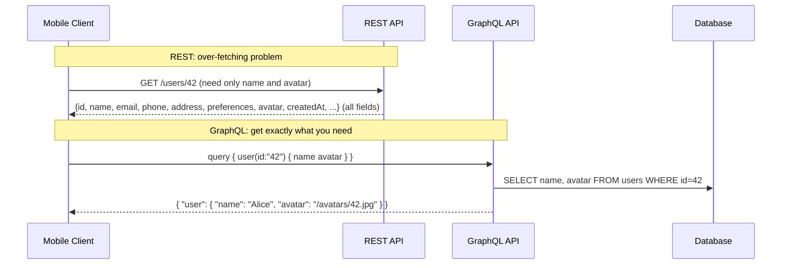
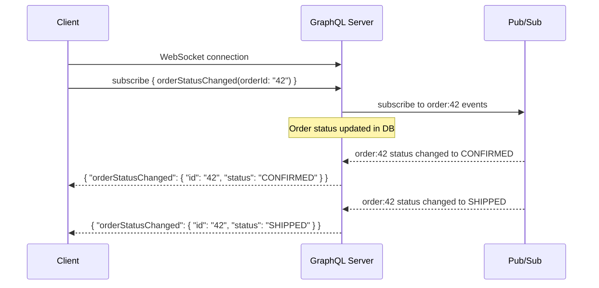
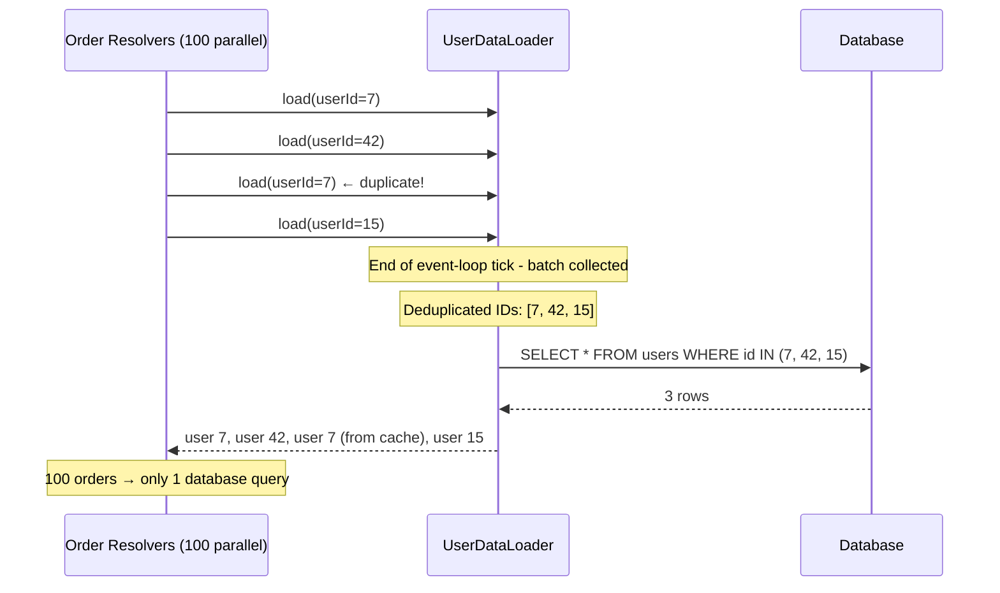

# GraphQL

## Concept

- **GraphQL** is a query language for APIs and a runtime for executing those queries. Developed at Facebook (~2012), open-sourced in 2015, now maintained by the GraphQL Foundation.
- GraphQL solves a fundamental mismatch in REST (topic 9): REST endpoints return **fixed shapes**. Clients take what they get. GraphQL inverts this - the **client defines the shape** of the response it needs.
- All operations go through **one endpoint** (usually `POST /graphql`). The query in the request body determines what data is returned.
- GraphQL is not a replacement for REST everywhere - it's a different tool for a different set of problems. Understanding both and when to choose each is the skill.

**The core insight**: in REST, the server owns the response shape. In GraphQL, the client owns the response shape. This single change has profound implications for performance, flexibility, and complexity.



## The Problems GraphQL Solves

### Over-fetching

A REST endpoint for `/users/42` might return 30 fields. A mobile app rendering a user card needs 3 of them. The remaining 27 fields are downloaded, parsed, and discarded - wasting bandwidth and time.

GraphQL: request exactly the 3 fields you need. The server queries only those columns from the database.

### Under-fetching (N+1 problem for the client)

To render an "order confirmation" screen in REST, a client might need:
1. `GET /orders/42` - get the order
2. `GET /users/7` - get the buyer's details
3. `GET /products/101` - get details of item 1
4. `GET /products/205` - get details of item 2
5. `GET /addresses/88` - get the shipping address

That's 5 sequential HTTP round trips. With 50ms RTT each, that's 250ms just in network time before rendering.

GraphQL: one request assembles the entire view:
```graphql
query OrderConfirmation {
  order(id: "42") {
    total status
    buyer { name email }
    items { product { name price imageUrl } quantity }
    shippingAddress { street city zip }
  }
}
```

### Multiple client types with different needs

A desktop web app, a mobile app, and a third-party integration may all need different subsets of the same underlying data. With REST, you either:
- Build separate endpoints per client (not scalable)
- Return the union of all fields to all clients (over-fetching)
- Accept the N+1 client round trips

GraphQL: one API, each client queries what it needs.

## The Type System and Schema

The GraphQL **schema** is the single source of truth for the API contract:

```graphql
type Query {
  user(id: ID!): User
  users(filter: UserFilter, limit: Int = 20, cursor: String): UserConnection!
  order(id: ID!): Order
}

type Mutation {
  createOrder(input: CreateOrderInput!): OrderPayload!
  cancelOrder(id: ID!, reason: String): OrderPayload!
}

type Subscription {
  orderStatusChanged(orderId: ID!): Order!
}

type User {
  id: ID!
  name: String!
  email: String!
  avatar: String
  orders(limit: Int = 10): [Order!]!
  createdAt: DateTime!
}

type Order {
  id: ID!
  status: OrderStatus!
  total: Float!
  items: [OrderItem!]!
  buyer: User!
  shippingAddress: Address!
  createdAt: DateTime!
}

enum OrderStatus {
  PENDING
  CONFIRMED
  SHIPPED
  DELIVERED
  CANCELLED
}

type OrderItem {
  product: Product!
  quantity: Int!
  price: Float!
}

input CreateOrderInput {
  items: [OrderItemInput!]!
  shippingAddressId: ID!
  paymentMethodId: ID!
}
```

**Type system features**:
- `!` = non-null (required). `String!` = a non-null string. `String` = nullable string.
- `[Order!]!` = non-null list of non-null orders. `[Order]` = nullable list of nullable orders.
- `Input` types - used as mutation arguments, separate from output types.
- `enum` - a closed set of allowed values.
- `scalar` - custom primitive types (DateTime, URL, JSON, UUID).
- `interface` and `union` - polymorphic types for fields that can return different types.

## Operations in Depth

### Query

```graphql
query GetUserOrders($userId: ID!, $limit: Int = 5) {
  user(id: $userId) {
    name
    orders(limit: $limit) {
      id
      status
      total
      items {
        product { name }
        quantity
      }
    }
  }
}
```

Variables (separate JSON, never interpolated into the query string):
```json
{ "userId": "42", "limit": 10 }
```

**Never interpolate variables into query strings** - that's GraphQL injection. Always use typed variables.

### Mutation

```graphql
mutation PlaceOrder($input: CreateOrderInput!) {
  createOrder(input: $input) {
    order {
      id
      status
      total
    }
    userErrors {
      field
      message
    }
  }
}
```

`userErrors` pattern: return both the success payload and structured validation errors in one type. The client checks `userErrors` before using `order`. More explicit than throwing an exception.

### Subscription

Subscriptions deliver a stream of events over WebSocket (topic 8):

```graphql
subscription WatchOrder($orderId: ID!) {
  orderStatusChanged(orderId: $orderId) {
    id
    status
    updatedAt
  }
}
```



## The N+1 Problem: The Most Important GraphQL Concept

The N+1 problem is the most common GraphQL performance pitfall. Every developer working with GraphQL must understand it.

### The problem

Consider this query:
```graphql
query {
  orders(limit: 100) {
    id
    buyer { name }  # ← each order has a buyer
  }
}
```

A naive resolver implementation:
```
1. SELECT * FROM orders LIMIT 100          → 100 orders
2. SELECT * FROM users WHERE id = order1.buyer_id   → user for order 1
3. SELECT * FROM users WHERE id = order2.buyer_id   → user for order 2
4. SELECT * FROM users WHERE id = order3.buyer_id   → user for order 3
... (100 more queries!)
Total: 101 queries for one GraphQL request
```

### The DataLoader solution

DataLoader is a batching utility:
1. All resolver calls for `buyer` within the same event-loop tick are **collected** rather than executed.
2. At the end of the tick, DataLoader **deduplicates** the IDs and fires **one batched query**.



DataLoader is available for every major language. Libraries: `dataloader` (Node.js), `aiodataloader` (Python), `graph-batch-loader` (Go).

**Always use DataLoader for every nested resolver** that could be called in a loop. This is not optional - it's mandatory for production GraphQL.

## Caching: GraphQL's Achilles' Heel

HTTP caching (CDN, browser) doesn't work for GraphQL by default:
- All queries go to `POST /graphql`
- POST responses are never cached by CDN or browser
- The query body determines what data is returned, but that body isn't in the URL

### Solutions

**1. Persisted Queries (Automatic Persisted Queries - APQ)**:
- Client hashes the query: `sha256(queryText) = "abc123..."`
- First request: `{ "extensions": { "persistedQuery": { "sha256Hash": "abc123" } } }` - server looks up by hash, miss.
- Second request: client sends hash + full query - server stores it.
- Future requests: send only `{ "extensions": { "persistedQuery": { "sha256Hash": "abc123" } } }` - no query text, server looks up.
- Now you can use GET: `GET /graphql?extensions={"persistedQuery":{"sha256Hash":"abc123"}}&variables=...`
- GET responses are CDN-cacheable by URL.

**2. Application-level caching**:
- Cache individual resolved fields in Redis/Memcached.
- Use DataLoader's request-level cache (automatic - same ID in the same request is only fetched once).
- Add field-level `@cacheControl` directives to hint CDN caching rules.

**3. HTTP GET for queries** (not mutations):
Some GraphQL clients support `GET /graphql?query={user(id:"42"){name}}&variables={}`. CDN-cacheable by URL. Queries only - mutations must remain POST.

## Authorization in GraphQL

In REST, authorization is at the endpoint level. In GraphQL, a single query can touch many types and fields - authorization must be **field-level**.

### Pattern: authorization in resolvers

```javascript
const resolvers = {
  User: {
    email: (user, args, context) => {
      // Only return email if the requester is the owner or an admin
      if (context.user.id !== user.id && !context.user.isAdmin) {
        return null; // or throw a PermissionError
      }
      return user.email;
    }
  }
}
```

### Pattern: shield middleware

```javascript
const permissions = shield({
  Query: {
    orders: isAuthenticated,
    adminStats: and(isAuthenticated, isAdmin),
  },
  Order: {
    buyerDetails: isOwnerOrAdmin,
  }
});
```

GraphQL Shield (and similar tools for each language) applies rule-based authorization as a middleware layer, keeping authorization logic separate from resolver logic.

## Schema Design Best Practices

### Connections (Relay-style pagination)

A standardised pagination pattern used by Facebook, GitHub, and most large GraphQL APIs:

```graphql
type UserConnection {
  edges: [UserEdge!]!
  pageInfo: PageInfo!
  totalCount: Int!
}

type UserEdge {
  node: User!
  cursor: String!
}

type PageInfo {
  hasNextPage: Boolean!
  hasPreviousPage: Boolean!
  startCursor: String
  endCursor: String
}

type Query {
  users(first: Int, after: String, last: Int, before: String): UserConnection!
}
```

Standardisation means client libraries (Relay) can manage pagination automatically without knowing anything about your specific schema.

### Mutation payload pattern

Return a rich payload from mutations rather than just the modified object:

```graphql
type CreateOrderPayload {
  order: Order          # null if there were errors
  userErrors: [UserError!]!
}

type UserError {
  field: [String!]!     # path to the field with the error
  message: String!
}
```

This lets the client distinguish between server errors (HTTP 500 → exception), user-input errors (validation - in `userErrors`), and success (non-null `order`, empty `userErrors`).

### Avoid breaking schema changes

GraphQL has no built-in versioning (topic 15). Evolve without breaking:
- **Add fields freely**: existing queries ignore unknown fields.
- **Never remove fields**: mark them `@deprecated(reason: "use newField instead")` first.
- **Never rename fields**: add the new name, deprecate the old one, wait for all clients to migrate.
- **Never change return types**: adding nullability (`String!` → `String`) is technically breaking.

## GraphQL vs. REST: When to Choose Each

| Factor | GraphQL | REST |
| - | - | - |
| Client diversity (web, mobile, third-party) | Yes - each queries what it needs | Requires multiple endpoints or over-fetching |
| Strong typing and schema documentation | Yes - always | Optional (OpenAPI) |
| Caching is critical (CDN, browser) | Hard - requires APQ | Easy - URL-based HTTP caching |
| Simple CRUD with few consumer types | Overkill | Clean and simple |
| Rapid frontend iteration | Yes - add fields without backend changes | Requires backend coordination |
| File uploads | Awkward (multipart spec is non-standard) | Native multipart/form-data |
| Real-time (subscriptions) | Built-in standard | Requires separate WebSocket endpoint |
| Public API | Harder to document and secure | Simpler - OpenAPI tooling is more mature |
| Internal microservice calls | Usually overkill | Or gRPC (topic 11) |

**Real-world adoption**: GitHub API v4, Shopify Storefront API, Twitter API, Facebook/Instagram - all GraphQL. Stripe, Twilio, Slack - REST.
