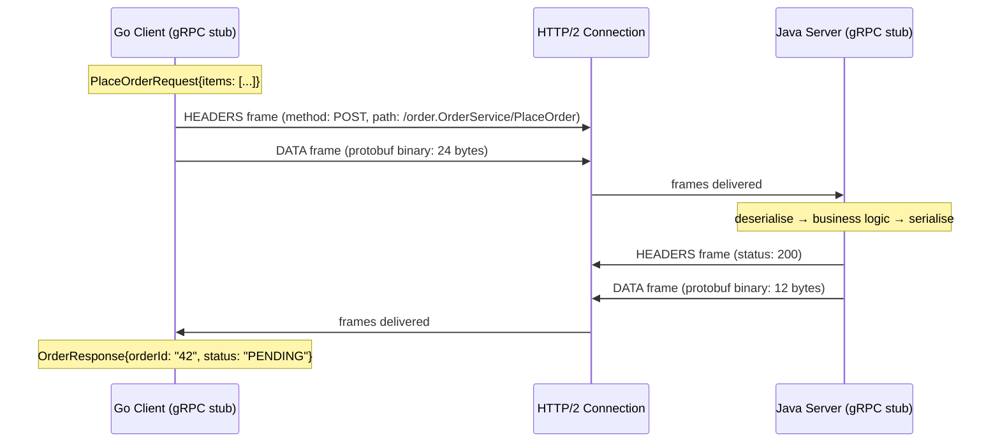
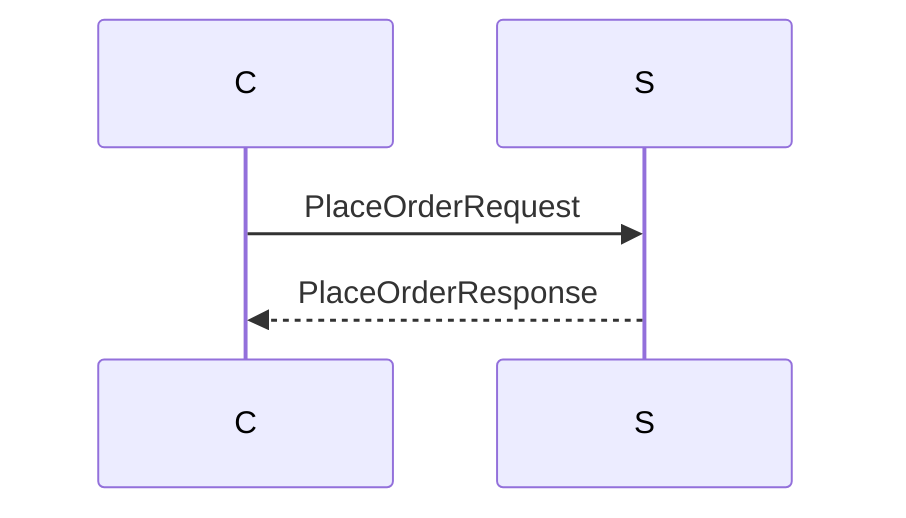
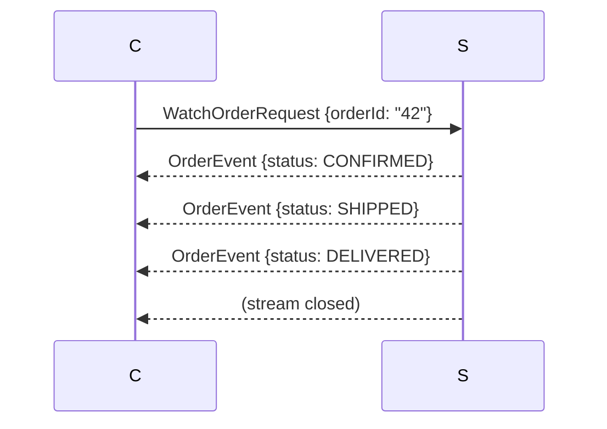
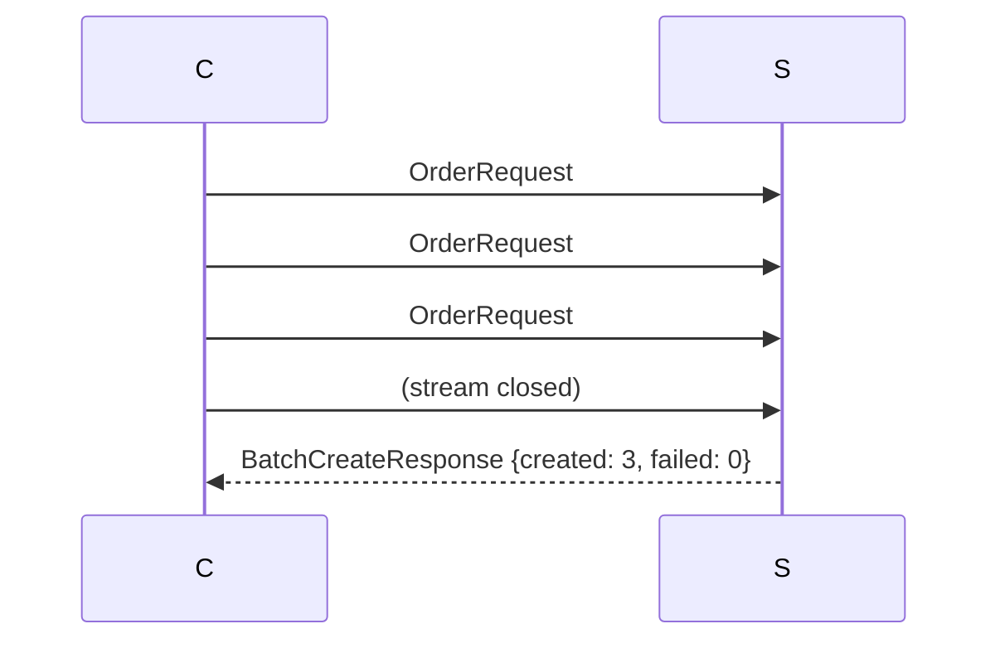
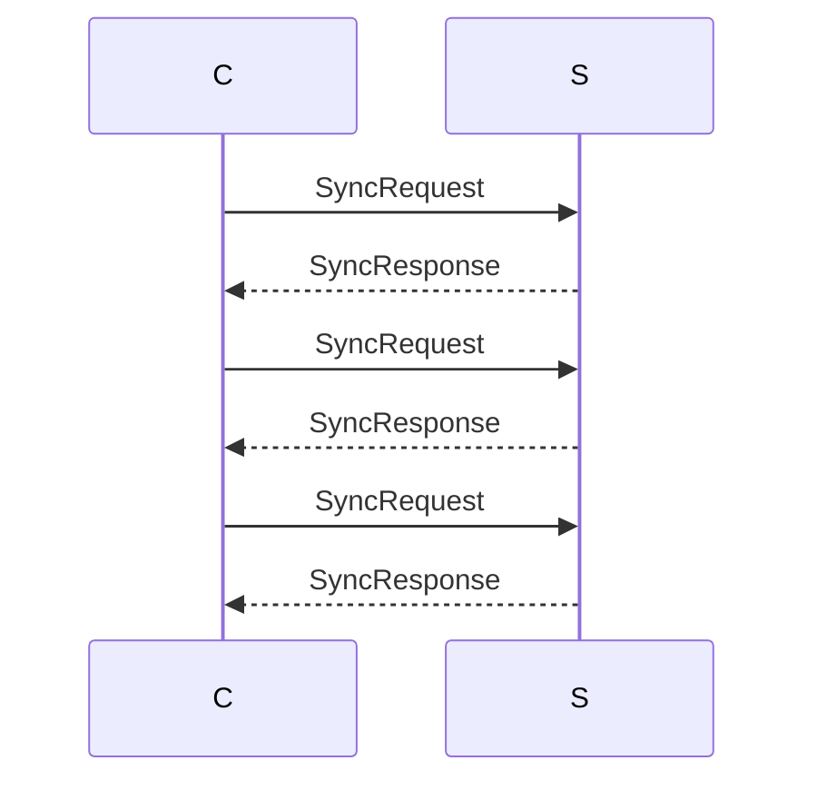
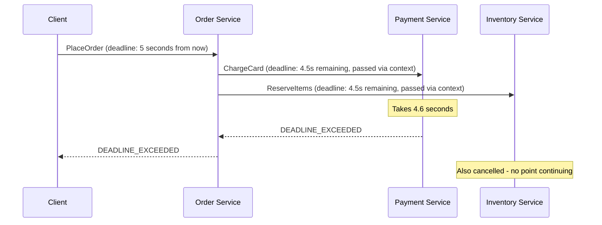

# gRPC and Protocol Buffers

## Concept

- **gRPC** (gRPC Remote Procedure Calls) is a high-performance, open-source RPC framework developed by Google (~2015). It lets a client call a method on a remote server as if it were a local function call.
- **Protocol Buffers** (protobuf) is gRPC's default serialisation format - a strongly typed, binary, compact encoding defined by a `.proto` schema file.
- gRPC is built on **HTTP/2** (topic 3), inheriting multiplexing, header compression, and streaming.
- It is the dominant protocol for **internal microservice communication** in companies that need performance, strong contracts, and polyglot service meshes (services written in Go, Java, Python, Node.js all calling each other via generated stubs).

**Why not just REST?** REST with JSON is flexible and universally understood. But:
- JSON parsing is CPU-intensive; protobuf parsing is 3-10× faster.
- JSON fields are strings; protobuf is strongly typed at the schema level - mistakes are caught at compile time, not runtime.
- REST has no built-in streaming; gRPC has four streaming modes.
- REST leaves each team to define their own API conventions; gRPC's `.proto` schema enforces a shared contract.



## Protocol Buffers: Deep Dive

### Why binary encoding?

A JSON representation:
```json
{"orderId": "42", "status": "PENDING", "totalCents": 9999}
```
= 51 bytes as UTF-8.

The protobuf equivalent:
```
field 1 (string) + "42"        = 4 bytes
field 2 (enum int) + 1         = 2 bytes
field 3 (int32) + 9999         = 3 bytes
Total: ~9 bytes (varint encoding)
```

5-10× smaller. Faster to encode and decode. But not human-readable - you need tooling (`protoc`, `grpcurl`) to inspect it.

### Proto file: the contract

```proto
syntax = "proto3";

package order.v1;

option go_package = "github.com/example/proto/order/v1;orderv1";
option java_package = "com.example.proto.order.v1";

// Service definition  -  the RPC interface
service OrderService {
  // Unary: one request, one response
  rpc PlaceOrder (PlaceOrderRequest) returns (PlaceOrderResponse);

  // Server streaming: one request, stream of responses
  rpc WatchOrder (WatchOrderRequest) returns (stream OrderEvent);

  // Client streaming: stream of requests, one response
  rpc BatchCreateOrders (stream PlaceOrderRequest) returns (BatchCreateResponse);

  // Bidirectional streaming: both sides stream
  rpc SyncOrders (stream OrderSyncRequest) returns (stream OrderSyncResponse);
}

message PlaceOrderRequest {
  repeated OrderItem items       = 1;
  string shipping_address_id     = 2;
  string payment_method_id       = 3;
  string idempotency_key         = 4;
}

message OrderItem {
  string product_id = 1;
  int32  quantity   = 2;
  // Field 3 was removed  -  reserved to prevent reuse
  reserved 3;
}

message PlaceOrderResponse {
  string order_id        = 1;
  OrderStatus status     = 2;
  int64  total_cents     = 3;
}

enum OrderStatus {
  ORDER_STATUS_UNSPECIFIED = 0;  // default value  -  always define 0
  ORDER_STATUS_PENDING     = 1;
  ORDER_STATUS_CONFIRMED   = 2;
  ORDER_STATUS_SHIPPED     = 3;
}

message WatchOrderRequest {
  string order_id = 1;
}

message OrderEvent {
  string      order_id       = 1;
  OrderStatus status         = 2;
  int64       updated_at_ms  = 3;
}
```

### Wire encoding: how protobuf serialises

Each field in a protobuf message is encoded as a **(tag, value)** pair. The tag encodes the **field number** and **wire type**:

```
tag = (field_number << 3) | wire_type
```

Wire types:
| Wire Type | Value | Used for |
| - | - | - |
| VARINT | 0 | int32, int64, bool, enum |
| 64-BIT | 1 | fixed64, double |
| LENGTH_DELIMITED | 2 | string, bytes, nested messages, repeated fields |
| 32-BIT | 5 | fixed32, float |

**Varint encoding**: small integers use fewer bytes. 1 = 1 byte, 127 = 1 byte, 128 = 2 bytes, 16383 = 2 bytes. Perfect for IDs, counts, and typical business values.

Example encoding of `PlaceOrderRequest{idempotency_key: "uuid-123"}`:
```
field 4, wire type 2 (length-delimited): tag = (4 << 3) | 2 = 0x22
length: 8 (8 bytes for "uuid-123")
data: 75 75 69 64 2d 31 32 33
Total: 10 bytes
```

### Schema evolution: the critical rules

Field numbers (not names) identify fields on the wire. Renaming a field is safe. Changing a field number is breaking.

| Change | Safe for old clients? | Safe for new clients reading old data? |
| - | - | - |
| Add new optional field | Yes - old clients ignore unknown fields | Yes - missing field gets default value |
| Remove a field | Yes - mark as `reserved` | Yes - gets default value |
| Rename a field | Yes - wire uses field number | Yes |
| Change field type (compatible) | Partial - int32→int64 safe | Partial |
| Change field type (incompatible) | No - corrupts data | No |
| Change field number | No - breaks all existing clients | No |
| Change from optional to repeated | Partial | Partial |

**`reserved` keyword**: prevents reusing a removed field number or name:
```proto
message OrderItem {
  reserved 3, 4;             // field numbers
  reserved "old_price";      // field name
}
```
If code tries to add a field with number 3 or name `old_price`, the compiler rejects it.

**Enum zero value**: proto3 requires every enum to have a zero value. Make it `UNSPECIFIED` or `UNKNOWN`. This is the value a field gets when it's missing, so "unknown" is semantically correct.

## The Four Streaming Modes

### 1. Unary RPC (most common)

One request → one response. Equivalent to REST POST.



### 2. Server-streaming RPC

One request → stream of responses. Client reads until server closes the stream.



Use for: real-time event feeds, tailing logs, live data streams, search results with partial streaming.

### 3. Client-streaming RPC

Stream of requests → one response when all requests are processed.



Use for: bulk data ingestion, log uploading, telemetry batching.

### 4. Bidirectional streaming RPC

Both sides stream independently and concurrently.



Use for: real-time collaboration, game state sync, IoT sensor + command channels.

## Deadlines and Cancellation

One of gRPC's best features - and one often overlooked in REST-based systems.

### Deadline propagation



When a client gives up (deadline exceeded), the cancellation propagates through the entire call chain. Services downstream don't waste time processing requests the client will never receive. In REST, there's no standardised mechanism for this - each team implements timeouts independently.

### gRPC status codes

gRPC has its own status code system (separate from HTTP status codes, though they're mapped to HTTP when using gRPC-Web):

| Code | Name | HTTP equivalent | When |
| - | - | - | - |
| 0 | OK | 200 | Success |
| 1 | CANCELLED | - | Client cancelled |
| 2 | UNKNOWN | 500 | Unknown error |
| 3 | INVALID_ARGUMENT | 400 | Bad input |
| 4 | DEADLINE_EXCEEDED | 504 | Timeout |
| 5 | NOT_FOUND | 404 | Resource missing |
| 7 | PERMISSION_DENIED | 403 | Not permitted |
| 8 | RESOURCE_EXHAUSTED | 429 | Rate limited or quota exceeded |
| 14 | UNAVAILABLE | 503 | Service temporarily unavailable - safe to retry |
| 16 | UNAUTHENTICATED | 401 | Not authenticated |

## Interceptors (Middleware)

gRPC supports interceptors (analogous to middleware in HTTP frameworks) for cross-cutting concerns:

```go
// Server-side interceptor for logging and tracing
func loggingInterceptor(ctx context.Context, req interface{},
    info *grpc.UnaryServerInfo, handler grpc.UnaryHandler) (interface{}, error) {

    start := time.Now()
    traceID := extractTraceID(ctx)

    resp, err := handler(ctx, req)

    log.Printf("method=%s trace=%s duration=%v err=%v",
        info.FullMethod, traceID, time.Since(start), err)

    return resp, err
}
```

Common interceptor use cases:
- **Authentication**: validate JWT or API key for every call.
- **Tracing**: extract/inject OpenTelemetry trace context.
- **Logging**: log method, duration, and status for every call.
- **Rate limiting**: enforce per-client or per-method quotas.
- **Retry logic**: automatically retry UNAVAILABLE responses with backoff.

## Load Balancing with gRPC

Standard HTTP load balancers (L7 proxies) work with gRPC because gRPC runs over HTTP/2. However, there's a gotcha:

**Problem**: HTTP/2 multiplexes many requests over one long-lived TCP connection. A simple L4 load balancer distributes TCP connections - but if you have 3 servers and all 100 clients open one connection each to server 1 (due to DNS resolution), all traffic goes to server 1.

**Solutions**:
1. **L7 proxy (Envoy, nginx)**: understands gRPC streams and can load balance individual RPCs across a pool, not just TCP connections.
2. **Client-side load balancing**: the client resolves multiple server IPs and picks one per RPC (round-robin). Used in Kubernetes with headless services.
3. **Service mesh** (Istio, Linkerd): injects sidecar proxies that handle gRPC load balancing transparently.

## gRPC-Web: Browser Support

Browsers can't use gRPC natively because:
1. Browser fetch/XMLHttpRequest doesn't expose HTTP/2 frames.
2. gRPC uses HTTP/2 trailers (metadata after the response body) which browsers can't read.

**gRPC-Web** is a modified protocol that wraps gRPC frames in a format browsers can consume. A proxy (Envoy, nginx-grpc-web-module) translates between gRPC-Web (browser) and native gRPC (server):

```
Browser → [gRPC-Web over HTTP/1.1 or HTTP/2] → Envoy proxy → [native gRPC over HTTP/2] → Server
```

gRPC-Web supports unary and server-streaming. Client-streaming and bidirectional streaming are not supported (browser networking APIs don't support it).

**In practice**: for browser-facing APIs, REST or GraphQL is simpler. Use gRPC for server-to-server communication, expose REST or GraphQL to browsers.

## gRPC vs. REST vs. GraphQL: Decision Guide

| Factor | gRPC | REST | GraphQL |
| - | - | - | - |
| Primary use | Internal microservices | Public APIs, browser clients | Client-driven queries |
| Transport | HTTP/2 | HTTP/1.1 or HTTP/2 | HTTP/1.1 or HTTP/2 |
| Payload | Binary (protobuf) - compact, fast | JSON - readable, flexible | JSON - flexible |
| Browser support | Via proxy (gRPC-Web) | Native | Native |
| Streaming | All 4 modes built-in | SSE / WebSocket (external) | Subscriptions (WebSocket) |
| Schema contract | .proto (required, compiled) | OpenAPI (optional) | GraphQL schema (required) |
| Type safety | Compile-time | Runtime (or OpenAPI) | Runtime (or tooling) |
| Code generation | First-class (part of the workflow) | Optional (openapi-generator) | Optional (graphql-codegen) |
| Debugging | Requires tools (grpcurl, Postman) | curl / browser DevTools | GraphiQL / browser |
| Performance (serialisation) | 3-10× faster than JSON | Baseline | Same as REST |
| Deadline propagation | Built-in | Manual (timeout headers) | Manual |

**Decision rule**:
- Internal microservices that need performance + streaming + strong contracts → **gRPC**
- Public APIs consumed by browsers and third parties → **REST**
- Frontend with diverse consumers needing flexible queries → **GraphQL**
- Hybrid: gRPC for internal, REST or GraphQL at the API gateway edge
