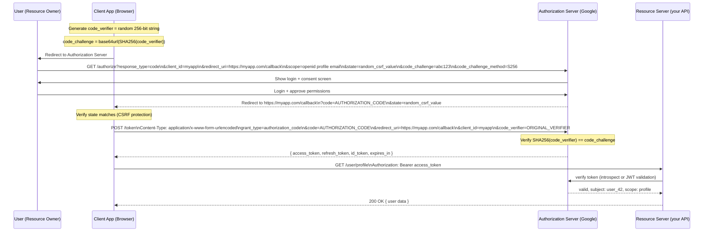
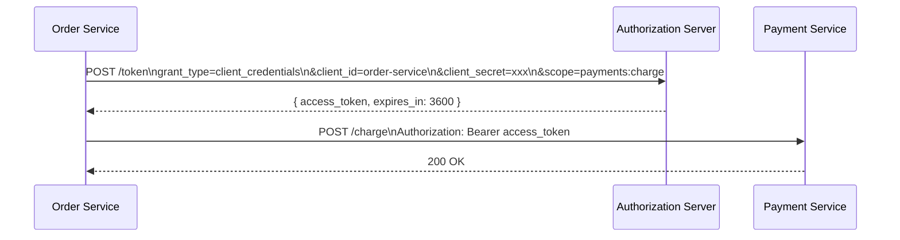
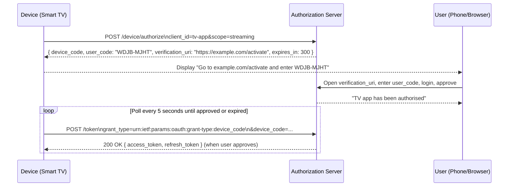
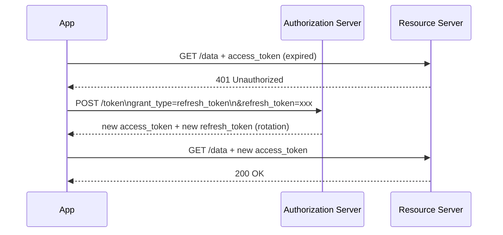

# OAuth 2.0 and OpenID Connect

## Concept

- **OAuth 2.0** (RFC 6749) is an **authorisation framework** that lets a user grant a third-party application limited access to their resources on another service - without sharing their password with the third party.
- **OpenID Connect (OIDC)** is an **authentication layer** built on top of OAuth 2.0. Where OAuth answers "what can this app access?", OIDC answers "who is the user?".
- Without OAuth, the old approach was to give third-party apps your username and password directly. This is catastrophic: the app gets full account access, you can't revoke access without changing your password, and if the app is breached, your password is exposed.

**The three-party model**:
```
Resource Owner (you) → grants permission to → Client Application (the app)
Authorization Server (Google, GitHub, your company SSO) → issues tokens
Resource Server (Google Drive, GitHub API) → validates tokens, serves data
```

**Real example**: "Login with Google" on a third-party app:
- Resource Owner: you
- Client Application: the third-party app
- Authorization Server: Google's OAuth server
- Resource Server: Google's APIs (if the app needs them) or just your profile (for login)

## OAuth 2.0 Core Flow: Authorization Code + PKCE

The Authorization Code flow is the secure standard for all modern apps. PKCE (Proof Key for Code Exchange) is the mandatory addition for public clients (browser apps, mobile apps) that can't safely store a secret.



### Why PKCE?

PKCE prevents the **authorization code interception attack**:
- Without PKCE: a malicious app on the same device intercepts the redirect with the authorization code. It exchanges the code for tokens.
- With PKCE: the code alone is useless. You must also prove knowledge of the `code_verifier` that was used to generate `code_challenge`. Only the legitimate app knows the verifier.

PKCE is now recommended even for confidential clients (server-side apps with a secret).

## Grant Types: Which Flow to Use

| Grant Type | Client Type | When to Use | Recommended |
| - | - | - | - |
| Authorization Code + PKCE | Any (public or confidential) | User-facing apps: SPAs, mobile, server-side web | Yes - current best practice |
| Client Credentials | Confidential (server) | Machine-to-machine, no user involved | Yes |
| Device Authorization | Public (limited UI) | Smart TVs, IoT, CLI tools | Yes |
| Authorization Code (no PKCE) | Confidential server app | Legacy server-side web apps | Use PKCE instead |
| Implicit | Public (browser SPA) | Deprecated | No - use Auth Code + PKCE |
| Resource Owner Password | Highly trusted first-party | Never for third-party | No - exposes password to app |

### Client Credentials flow (machine-to-machine)



No user involved. The service authenticates with its `client_id` + `client_secret` (or mTLS certificate). Used for all server-to-server OAuth flows.

### Device Authorization flow

For devices with limited input (smart TV, CLI tool, IoT device):



## Tokens: The Core of OAuth

### Access token

- Short-lived credential that authorises access to the Resource Server.
- Typical lifetime: 5-60 minutes.
- Sent as `Authorization: Bearer <token>` header on every API request.
- Can be opaque (random string) or a JWT.
- Short lifetime limits the damage from leakage.

### Refresh token

- Long-lived credential used only at the Authorization Server to obtain new access tokens.
- Never sent to the Resource Server.
- Typical lifetime: days to months.
- Stored securely: HttpOnly cookie (browser), secure storage (mobile), secret store (server).
- Enables "stay logged in" functionality without long-lived access tokens.



### Refresh token rotation

Every time a refresh token is used, it is invalidated and a new one is issued. If an attacker steals and uses a refresh token, the legitimate client's next refresh attempt will fail (the stolen token was already rotated). The Authorization Server detects "token reuse" and revokes the entire token family - forcing re-login.

## OpenID Connect (OIDC): Identity on Top of OAuth

OIDC adds an `id_token` to the OAuth flow. The `id_token` is a JWT that contains the user's identity information.

### ID token vs. access token

| | id_token | access_token |
| - | - | - |
| Purpose | Prove user identity to the client | Authorise access to the Resource Server |
| Consumed by | The Client Application | The Resource Server |
| Contains | User identity claims | Scopes, subject ID |
| Format | Always JWT | JWT or opaque |

### ID token (JWT) structure

```json
Header: { "alg": "RS256", "kid": "key-id-123", "typ": "JWT" }
Payload: {
  "iss": "https://accounts.google.com",
  "sub": "google_user_id_42",
  "aud": "my-client-id",
  "exp": 1700003600,
  "iat": 1700000000,
  "nonce": "random_value_from_auth_request",
  "email": "alice@example.com",
  "email_verified": true,
  "name": "Alice Smith",
  "picture": "https://lh3.googleusercontent.com/...",
  "locale": "en-US"
}
Signature: RSA_sign(base64(header) + "." + base64(payload), google_private_key)
```

### Standard OIDC claims

| Claim | Description |
| - | - |
| `sub` | Subject - unique user identifier at this issuer. Never reassigned. |
| `iss` | Issuer - URL of the Authorization Server |
| `aud` | Audience - must match your `client_id` |
| `exp` | Expiration time (Unix timestamp) |
| `iat` | Issued at time (Unix timestamp) |
| `nonce` | Mitigates replay attacks - must match the value sent in the auth request |
| `email` | User's email |
| `email_verified` | Whether the email was verified by the issuer |
| `name` | Full display name |
| `given_name` / `family_name` | First and last name |
| `picture` | Profile picture URL |

### OIDC Discovery

Authorization Servers publish their configuration at a well-known URL:
```
GET https://accounts.google.com/.well-known/openid-configuration
```
Returns JSON with: `authorization_endpoint`, `token_endpoint`, `userinfo_endpoint`, `jwks_uri` (public keys for JWT verification), supported scopes, claims, and grant types. Clients can auto-configure from this URL.

### Verifying an ID token (checklist)

1. Fetch public keys from `jwks_uri`.
2. Verify signature using the key with matching `kid`.
3. Check `iss` matches the expected issuer.
4. Check `aud` contains your `client_id`.
5. Check `exp` is in the future (not expired).
6. Check `iat` is not too far in the past (clock skew tolerance: 5 minutes).
7. Check `nonce` matches the value you sent in the auth request (prevents replay attacks).

## Scopes

Scopes define what the access token is permitted to do. They are space-separated strings requested during the authorization flow:

```
scope=openid profile email orders:read orders:write
```

**Standard OIDC scopes**:
- `openid` - required for OIDC; returns `sub` claim in id_token.
- `profile` - returns name, picture, locale, etc.
- `email` - returns email and email_verified.
- `offline_access` - requests a refresh token.

**Custom scopes**: define your own for your API:
- `orders:read` - can read orders
- `orders:write` - can create/update orders
- `admin` - admin access

**Principle of least privilege**: request only the scopes your app actually needs. The user sees the requested scopes on the consent screen - requesting fewer scopes builds trust and gets more users to approve.

## Token Storage in the Browser

This is a critical security decision:

| Storage | XSS risk | CSRF risk | Notes |
| - | - | - | - |
| `localStorage` | High - any JS can read it | None | Never use for auth tokens |
| `sessionStorage` | High - any JS can read it | None | Never use for auth tokens |
| JS variable (in-memory) | Low - XSS can still steal from current page | None | OK but tokens lost on page refresh |
| `HttpOnly` Cookie | None - JS can't read | High | Use with SameSite + CSRF token |
| `HttpOnly; SameSite=Lax` Cookie | None | Low-Medium | Best for most apps |
| `HttpOnly; SameSite=Strict` Cookie | None | None | Breaks cross-site auth flows |

**Best practice for SPAs**: store tokens in memory (JS variables). Use a refresh token in an HttpOnly, Secure, SameSite=Lax cookie. The refresh token is sent by the browser to your own auth endpoint (not the third-party Resource Server) to get new access tokens. Reduces both XSS and CSRF exposure.

## Token Introspection

For opaque (non-JWT) access tokens, the Resource Server must call the Authorization Server to validate:

```
POST https://auth.example.com/introspect
Authorization: Basic base64(resource-server-id:resource-server-secret)
Content-Type: application/x-www-form-urlencoded

token=opaque_access_token_abc123

→ 200 OK
{
  "active": true,
  "sub": "user_42",
  "scope": "orders:read orders:write",
  "client_id": "mobile-app",
  "exp": 1700003600
}

→ 200 OK (expired or revoked)
{ "active": false }
```

**Performance**: introspection adds a network hop per request. Cache the result for the token's remaining lifetime (subtract a few seconds for clock skew). Use JWT access tokens for the Resource Server to avoid introspection entirely.

## OAuth 2.0 Security Best Practices (RFC 9700)

- Always use **HTTPS** - tokens in plaintext are equivalent to passwords.
- Always use **PKCE** - even for confidential server-side clients.
- **State parameter**: include a random CSRF token in the auth request; verify it on redirect.
- **Short access token lifetime**: 5-15 minutes limits exposure from leakage.
- **Refresh token rotation**: detect theft.
- **Redirect URI validation**: register exact redirect URIs; reject wildcard matches.
- **Never put access tokens in URLs**: they appear in server logs, browser history, `Referer` headers.
- **Sender-constraining** (DPoP, mTLS) - bind tokens to the client's public key so stolen tokens are useless without the private key. Advanced but increasingly common.
