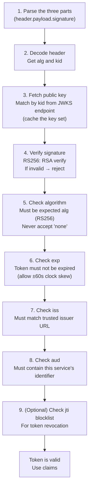
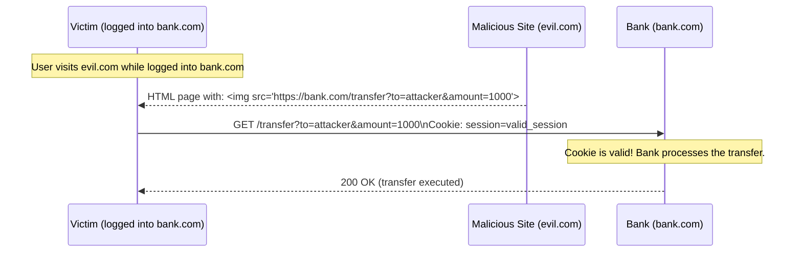

# Cookies, Sessions, and JWT

## Concept

- HTTP (topic 2) is **stateless** - every request is independent. The server has no memory of who you are between requests.
- For a "logged-in" experience, the application layers **state** on top of HTTP. The mechanism for this is called **session management**.
- Two broad strategies:
  - **Server-side sessions**: the server stores the session state; the client holds only a session ID (opaque reference).
  - **Client-side tokens**: the session state is encoded in a token that the client holds and sends with every request; the server validates the token without looking anything up.
- **JWT** (JSON Web Token) is the dominant format for client-side tokens.
- **Cookies** are the primary mechanism for carrying both session IDs and tokens in browser-based applications.

**Why this matters**: the choice between session cookies and JWTs affects scalability, security, revocability, and operational complexity. It's one of the most debated backend architecture decisions.

## Cookies: The Transport Mechanism

A cookie is a small piece of data that a server sends to a browser, and the browser automatically includes in subsequent requests to the same origin.

### Setting a cookie

```
HTTP/1.1 200 OK
Set-Cookie: session_id=abc123; Path=/; Domain=example.com; Max-Age=3600; HttpOnly; Secure; SameSite=Lax
```

The browser stores the cookie and attaches it automatically:
```
GET /api/orders HTTP/1.1
Host: api.example.com
Cookie: session_id=abc123
```

### Cookie attributes: the security-critical ones

**HttpOnly**: the cookie cannot be read by JavaScript (`document.cookie`). The cookie is only sent by the browser on HTTP requests. This is the most important security attribute - it prevents XSS attacks from stealing the cookie.

**Secure**: the cookie is only sent over HTTPS connections. Prevents transmission over plain HTTP where it could be intercepted.

**SameSite**: controls when cookies are sent with cross-site requests. This is the primary CSRF defence:

| SameSite | When cookie is sent | CSRF protection | Cross-site auth |
| - | - | - | - |
| `Strict` | Same-site requests only | Full | Breaks OAuth flows (auth server is a different site) |
| `Lax` | Same-site + top-level navigations (GET) | Partial - blocks cross-site POST | Works with most SSO flows |
| `None` | All requests (cross-site too) | None | Required if you need full cross-site cookie access |

`SameSite=None` requires `Secure` - otherwise Chrome rejects it. Use it only for legitimate third-party cookie scenarios (embedded widgets, cross-site auth).

**Domain**: specifies which domains receive the cookie. `Domain=.example.com` sends to all subdomains (`api.example.com`, `app.example.com`). Omitting Domain restricts it to the exact host that set it.

**Path**: restricts the cookie to a URL path prefix. `Path=/api` sends the cookie only on requests to `/api/*`. Usually set to `/` (all paths).

**Max-Age / Expires**: session cookies (no Max-Age/Expires) are deleted when the browser closes. Persistent cookies survive across browser sessions.

### Cookie security summary

```
Set-Cookie: token=...; HttpOnly; Secure; SameSite=Lax; Path=/; Max-Age=3600
```

This combination:
- `HttpOnly` → blocks XSS from stealing the token
- `Secure` → only sent over HTTPS
- `SameSite=Lax` → blocks CSRF for non-safe methods
- `Max-Age=3600` → expires in 1 hour

## Server-Side Sessions

The traditional session approach:

```mermaid
sequenceDiagram
    participant B as Browser
    participant S as Server
    participant Store as Session Store (Redis)

    B->>S: POST /login {username, password}
    S->>S: verify credentials
    S->>Store: SET session:abc123 {userId:42, roles:["buyer"], expiresAt:...} EX 3600
    S-->>B: 200 OK\nSet-Cookie: sid=abc123; HttpOnly; Secure; SameSite=Lax

    B->>S: GET /orders (Cookie: sid=abc123)
    S->>Store: GET session:abc123
    Store-->>S: {userId:42, roles:["buyer"]}
    S-->>B: 200 OK orders for user 42

    B->>S: POST /logout (Cookie: sid=abc123)
    S->>Store: DEL session:abc123
    S-->>B: 200 OK\nSet-Cookie: sid=; Max-Age=0 (clear the cookie)
```

**How the session ID is generated**: cryptographically secure random (CSPRNG), 128+ bits. In Python: `secrets.token_urlsafe(32)`. In Node.js: `crypto.randomBytes(32).toString('hex')`. This makes session IDs unguessable.

### Session fixation attack (and defence)

An attacker sets a known session ID before the user logs in (e.g., by sending a link with a pre-set cookie). When the user logs in, the server associates the known ID with the user. The attacker knows the ID and can now impersonate the user.

**Defence**: always generate a **new session ID on login**. Invalidate the pre-login session ID.

```
Before login: session:old_id → {anonymous: true}
User logs in → invalidate old_id → generate new_id
After login:  session:new_id → {userId: 42, roles: [...]}
```

### Scaling server-side sessions

Server-side sessions require a **shared session store** that every application server can read. An in-process session (stored in the server's RAM) breaks as soon as you have more than one server.

Use **Redis** as a distributed session store:
- Sub-millisecond reads.
- TTL-based automatic expiry.
- All servers share the same session state.
- Redis cluster for high availability.

**Session clustering vs. sticky sessions** (don't use sticky sessions):
- Sticky sessions: load balancer routes each user to the same server. If that server restarts, all sessions on it are lost and users must re-login. Wasteful and fragile.
- Redis sessions: any server can handle any request. Resilient to server restarts.

## JWT: JSON Web Tokens

JWT (RFC 7519) is the standard format for **self-contained, signed tokens**. The server encodes the session state into the token itself; the client holds the token; the server validates the signature without any database lookup.

### JWT structure

A JWT is three Base64URL-encoded JSON objects joined by dots:
```
eyJhbGciOiJSUzI1NiIsInR5cCI6IkpXVCJ9.eyJzdWIiOiJ1c2VyXzQyIiwiaXNzIjoiYXV0aC5leGFtcGxlLmNvbSIsImV4cCI6MTcwMDAwMzYwMH0.SIGNATURE
       HEADER                                           PAYLOAD                                                                SIGNATURE
```

**Header**:
```json
{
  "alg": "RS256",
  "typ": "JWT",
  "kid": "key-id-2024-01"
}
```
`alg`: signing algorithm. `kid`: key ID (which public key to use for verification, allowing key rotation).

**Payload (claims)**:
```json
{
  "sub": "user_42",
  "iss": "https://auth.example.com",
  "aud": "https://api.example.com",
  "exp": 1700003600,
  "iat": 1700000000,
  "jti": "unique-token-id-abc",
  "roles": ["buyer"],
  "email": "alice@example.com"
}
```

**Signature**:
```
RS256: RSA_sign(SHA256(base64url(header) + "." + base64url(payload)), privateKey)
HS256: HMAC_SHA256(base64url(header) + "." + base64url(payload), sharedSecret)
```

### RS256 vs. HS256

| Algorithm | Key type | Verify with | Use when |
| - | - | - | - |
| RS256 | RSA public/private key pair | Public key (can be published) | Multiple services verify; keys are public |
| HS256 | Shared secret | Same secret | Single service; secret must be kept shared |
| ES256 | ECDSA (smaller keys) | Public key | Same as RS256 but smaller key size |

**Prefer RS256 for production**: the signing private key stays only with the auth server. Any service can verify tokens using the public key (published at `/jwks.json`). No shared secret to leak.

### JWT validation: every step matters

A server receiving a JWT must:



**The `alg: none` attack**: an early JWT vulnerability. Some libraries accepted `"alg": "none"` in the header, meaning "no signature required." An attacker could craft any payload with `alg: none` and no signature. Always explicitly specify the expected algorithm; never accept `none`.

**The HS256 confusion attack**: if your library accepts both RS256 and HS256, an attacker can take the RS256 public key (which is public!) and use it as the HS256 shared secret. The library would then verify the forged token successfully. Always pin the expected algorithm.

## JWT vs. Sessions: The Real Trade-offs

| Factor | JWT (stateless) | Server-side session |
| - | - | - |
| Database lookup per request | None (cryptographic verification) | Yes (Redis lookup) |
| Horizontal scalability | Any server validates independently | All servers share Redis |
| Immediate revocation | Not possible without blocklist | Yes - delete from Redis |
| Token invalidation on logout | Must wait for expiry or use blocklist | Instant |
| Token size | 300-1000 bytes per request | ~20 bytes (session ID) |
| Payload visibility | Payload is Base64-decoded (not encrypted!) | Server-side only |
| Secret rotation | Must re-issue all tokens | Change session store keys |

### The JWT revocation problem

A JWT is valid until its `exp` claim. If a user logs out, changes their password, or is banned, their existing JWT remains valid until expiry. You cannot "un-issue" a JWT.

**Solutions** (each with a trade-off):
1. **Short expiry** (5-15 min) + **refresh tokens**: the attack window is small. The most common solution.
2. **JWT blocklist** (Redis SET): store invalidated JWT IDs (`jti` claim) in Redis. Check the blocklist on every request. Defeats the "no database lookup" benefit.
3. **Versioning**: include a `token_version` claim. Store the current version in the user record. If `token.token_version != db.user.token_version`, reject the token. Requires one DB lookup per request but is selective.

**For high-security scenarios** (banking, admin actions): use short-lived JWTs (5 minutes) + refresh tokens. Force re-authentication for sensitive actions regardless of token validity.

## CSRF: Cross-Site Request Forgery

CSRF exploits the fact that browsers automatically send cookies with every request, including cross-site requests.

### Attack scenario



The bank can't distinguish this from a legitimate request - the cookie is valid.

### CSRF defences

**SameSite=Lax or Strict** (the best defence - use it): `SameSite=Lax` prevents cookies from being sent on cross-site `POST`, `PUT`, `DELETE` requests. The image tag above (`GET`) is still sent, but banking operations should never be GET. For `SameSite=Strict`, even `GET` cross-site requests don't include cookies.

**CSRF token** (traditional defence):
```html
<form method="POST" action="/transfer">
  <input type="hidden" name="csrf_token" value="random_server_generated_token">
  ...
</form>
```
Server generates a random per-session (or per-form) token, embeds it in the HTML, stores it server-side. On POST, verifies the submitted token matches the stored one. The malicious page can't read the token (same-origin policy prevents reading cross-site HTML).

**Double-submit cookie** (stateless CSRF defence):
```javascript
// Client reads csrf cookie (NOT HttpOnly) and sends as header
fetch('/transfer', {
  headers: { 'X-CSRF-Token': getCookie('csrf_token') }
});
```
Server sets a non-HttpOnly cookie with a random value. JS reads the cookie, sends it as a custom header. Server verifies header == cookie. An attacker's page can't read the cookie (same-origin policy) so can't set the header.

## Complete Authentication Flow Example

Putting it all together: a modern web application with JWTs + HttpOnly cookies:

```mermaid
sequenceDiagram
    participant B as Browser
    participant Auth as Auth API
    participant API as Resource API
    participant R as Redis

    B->>Auth: POST /auth/login {email, password}
    Auth->>Auth: verify credentials (Argon2id)
    Auth->>Auth: generate access_token (JWT, 15min) + refresh_token (random, 30 days)
    Auth->>R: SET refresh:hash(refresh_token) {userId, version} EX 2592000
    Auth-->>B: 200 OK {access_token: "eyJ..."}\nSet-Cookie: rt=refresh_token_value; HttpOnly; Secure; SameSite=Lax; Path=/auth/refresh; Max-Age=2592000

    B->>API: GET /orders\nAuthorization: Bearer eyJ...
    API->>API: verify JWT (RS256)  -  no DB call
    API-->>B: 200 OK orders

    Note over B,API: Access token expires after 15 minutes
    B->>Auth: POST /auth/refresh\nCookie: rt=refresh_token_value
    Auth->>R: GET refresh:hash(rt)
    R-->>Auth: {userId, version}
    Auth->>Auth: generate new access_token + new refresh_token
    Auth->>R: DEL refresh:hash(old_rt)\nSET refresh:hash(new_rt) {userId, version}
    Auth-->>B: 200 OK {access_token: "eyJ..."}\nSet-Cookie: rt=new_refresh_token; ...

    B->>Auth: POST /auth/logout\nCookie: rt=...
    Auth->>R: DEL refresh:hash(rt)
    Auth-->>B: 200 OK\nSet-Cookie: rt=; Max-Age=0 (clear cookie)
```

Key design decisions:
- Access token in memory/Authorization header - short-lived, no storage vulnerability.
- Refresh token in HttpOnly cookie - JS can't steal it, SameSite blocks CSRF.
- Refresh token hashed in Redis - server never stores the raw token; hash prevents breached Redis from yielding usable tokens.
- Rotation on every refresh - theft detection.
- Logout deletes refresh token from Redis - immediate revocation.
