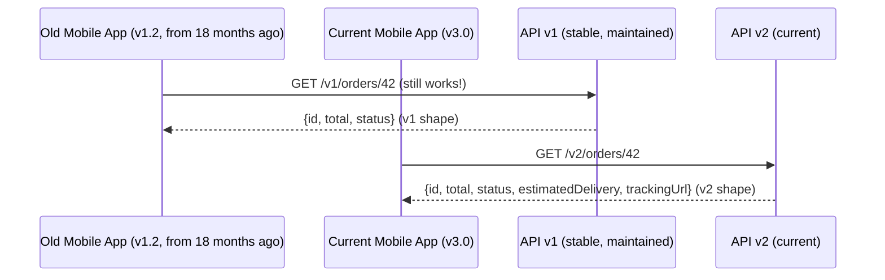
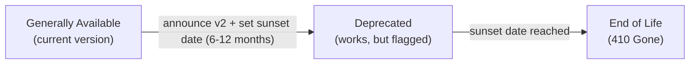

# API Versioning

## Concept

- APIs evolve. New features are added; old ones are deprecated; bugs are fixed in ways that change behaviour; data models change as the business grows.
- **API versioning** is the discipline of managing this evolution so that **existing clients continue to work** while new capabilities are introduced for new clients.
- The core tension: developers want to improve their APIs freely; clients want stability and predictability. Versioning creates a contract.
- Good versioning strategy is especially critical for **public APIs** (third-party developers, mobile apps you can't force-update). For internal APIs with coordinated deployments, you have more flexibility.

**Why does this matter?** Mobile apps are a perfect example. A user running an 18-month-old version of your app is still a paying customer. If you change your API and break that client, they get errors - not a prompt to update. Google Play and App Store data show ~15% of users are always 2+ major versions behind.



## Breaking vs. Non-Breaking Changes

Understanding what constitutes a breaking change is the foundation of versioning strategy.

### Non-breaking changes (backward-compatible)

Clients written against the old API continue to work without any code changes:

| Change | Safe? | Why |
| - | - | - |
| Add a new optional response field | Yes | Clients that ignore unknown fields are unaffected |
| Add a new optional request parameter | Yes | Old clients don't send it; server uses default |
| Add a new endpoint | Yes | Old clients don't call it |
| Add a new enum value | Yes (usually) | See caveat below |
| Make a previously required field optional | Yes | Old clients still send it |
| Expand a string field's allowed values | Yes | Existing values still work |
| Add a new HTTP method to an existing resource | Yes | Old clients use the old method |

**Enum caveat**: adding a new enum value is non-breaking only if clients are designed to handle unknown values gracefully. If a client has a `switch` statement on an enum and crashes on unknown values, the new value is breaking for that client.

### Breaking changes (require a new API version)

| Change | Why it's breaking |
| - | - |
| Remove a response field | Clients reading it get null/missing - may crash |
| Rename a response field | Client code using the old name gets null |
| Change a field's type (string → integer) | Deserialization fails |
| Change a URL path | Old clients still call the old path |
| Change authentication mechanism | Old clients can't authenticate |
| Change required to optional (sometimes) | Client validation logic may break |
| Add a required request field | Old clients don't send it - requests fail |
| Change response status codes | Client error handling breaks |
| Change pagination mechanism | Client can't navigate correctly |

**Key insight**: additions are usually safe; removals and changes are breaking.

## Versioning Strategies

### 1. URI path versioning (most common)

```
GET /api/v1/orders/42
GET /api/v2/orders/42
```

**Advantages**:
- Explicit, visible in logs, URLs, and documentation.
- Easy to route: load balancers and reverse proxies route by URL prefix.
- Easy to cache: CDNs cache by URL.
- Easy to test: just open a different URL.
- Works with all HTTP clients without any special configuration.

**Disadvantages**:
- The URL is part of the interface contract. Moving a resource requires careful URL planning.
- Multiple version URIs in documentation can be confusing.

**Best practice for URI versioning**:
- Only increment major version on breaking changes: `/v1` → `/v2`.
- Don't version minor additions - just add them.
- Keep version in the path, not the domain (`api-v2.example.com` is bad).

### 2. Header versioning (Content negotiation)

```
GET /api/orders/42
Accept: application/vnd.example.v2+json
```

Or with a custom header:
```
GET /api/orders/42
API-Version: 2024-01-15
```

**Advantages**:
- Clean URIs - the path doesn't encode the version.
- Follows HTTP content negotiation principles.

**Disadvantages**:
- Not visible in browser address bar or simple links.
- Can't test with a simple curl without headers.
- CDNs need to cache by header value (requires `Vary` header).
- API discovery and documentation are harder.

### 3. Date-based versioning (Stripe's approach)

```
GET /api/orders/42
Stripe-Version: 2024-11-20
```

Stripe's API is versioned by date. Each date represents a snapshot of all API changes up to that point. A client pins to a date and gets consistent behaviour for years - Stripe guarantees backward compatibility to the pinned date.

**How it works**:
- API code applies a series of "transforms" based on the client's pinned version.
- New features use the current date. Clients on older versions get compatibility transforms applied.
- The client's pinned version is stored in their API key settings.

**Advantages**: extremely fine-grained. A client isn't forced to migrate when they upgrade from v1 to v2 (which might include many changes); they get exactly the API as it was on their pinned date.

**Disadvantages**: complex to implement and maintain. The transform layer grows over time. Not practical unless you have the engineering resources to maintain it properly.

### 4. Query parameter versioning

```
GET /api/orders/42?api_version=2
```

Rarely recommended. It's easy to forget, doesn't have CDN cache-key behaviour by default (depends on CDN configuration), and query parameters have a different semantic meaning.

## Managing Multiple API Versions

### Code-level strategies

**Separate controllers/handlers per version**:
```
/api/v1/orders/42 → controllers/v1/OrderController.get
/api/v2/orders/42 → controllers/v2/OrderController.get
```
Clean separation. Easy to understand. Code duplication grows over time.

**Shared core with adapters**:
```
Request → Version Router → V2 Adapter → Core Business Logic → V1/V2 Response Transformer → Response
```
Core logic is shared. Version-specific code lives only in adapters. Less duplication. More indirection.

**Feature flags per version** (not recommended for large changes):
```javascript
if (version >= 2) {
  return { ...order, estimatedDelivery }
} else {
  return { id: order.id, total: order.total, status: order.status }
}
```
Simple for small additions. Becomes unmaintainable with many version differences.

### Database schema and API versions

Changing the database schema without breaking API v1:
- Add new columns (non-breaking to the DB, may be breaking to v1 API if v1 now returns unexpected data).
- Never rename columns that v1 reads from directly - use views or aliases.
- For major changes (e.g., splitting one table into two), keep the v1 query working via a compatibility view.

## Deprecation Lifecycle

A disciplined lifecycle prevents surprise breakage and builds developer trust:



### Step 1: Announce deprecation

Add to API response headers:
```
Deprecation: Sat, 1 Jun 2024 00:00:00 GMT
Sunset: Mon, 1 Dec 2025 00:00:00 GMT
Link: <https://docs.example.com/migrate-v1-to-v2>; rel="deprecation"
```

Add to schema/documentation:
- REST: add `x-deprecated: true` to OpenAPI spec.
- GraphQL: add `@deprecated(reason: "Use v2 query instead")` directive.
- gRPC: add `[deprecated = true]` option to proto field.

### Step 2: Monitor usage

Track which clients are still using deprecated endpoints:
```
Metrics:
- api_requests_total{version="v1", endpoint="/orders"}: 142,000 req/day
  - Client: iOS App (version < 3.0): 89,000 req/day
  - Client: Partner API (company X): 53,000 req/day
```

Contact high-traffic clients directly. Offer migration assistance.

### Step 3: Hard deadline enforcement

One month before sunset, start returning `Warning` headers:
```
Warning: 299 - "This API version is being deprecated on Dec 1 2025. See https://docs.example.com/migrate"
```

### Step 4: End of Life

Return `410 Gone` with migration instructions:
```
HTTP/1.1 410 Gone
Content-Type: application/json

{
  "error": "API_VERSION_DEPRECATED",
  "message": "API v1 was deprecated on December 1, 2025. Please migrate to v2.",
  "migrationGuide": "https://docs.example.com/migrate-v1-to-v2"
}
```

Use `410 Gone` (not `404 Not Found`) - it explicitly signals permanent removal, which robots and clients understand as "stop trying."

## gRPC Schema Evolution (Different Approach)

gRPC (topic 11) uses protobuf field numbers for wire compatibility. Versioning works differently:

- **No explicit version in the service name** for minor changes: just add new fields.
- **New service name for breaking changes**: `OrderService` → `OrderServiceV2`.
- **Never change field numbers**: they identify fields on the wire.
- **`reserved` fields**: mark removed field numbers as reserved to prevent reuse.

```proto
// Non-breaking: add new fields
message Order {
  string id      = 1;
  string status  = 2;
  float  total   = 3;
  // Added in v2  -  old clients ignore this field
  string estimated_delivery = 4;
  reserved 5, 6; // removed fields  -  can never be reused
}
```

## GraphQL Versioning (Schema-First Evolution)

GraphQL (topic 10) discourages explicit API versions. Instead:

```graphql
type Order {
  id: ID!
  total: Float!
  status: OrderStatus!
  # New fields  -  safe to add
  estimatedDelivery: DateTime
  trackingUrl: String
  # Old field being deprecated
  eta: String @deprecated(reason: "Use estimatedDelivery instead. Will be removed 2026-01-01.")
}
```

- Never remove a field - mark it `@deprecated` and keep it.
- Wait for all client queries to stop using the deprecated field (monitor via query analytics).
- Only after confirmed zero usage: remove the field in a coordinated client migration.

## Semantic Versioning for Internal APIs

For internal APIs (not public), Semantic Versioning (SemVer) is a useful communication tool:
```
MAJOR.MINOR.PATCH
2.1.3

PATCH: bug fix, no interface change
MINOR: new non-breaking features added
MAJOR: breaking changes
```

Internal services can use headers to communicate their version:
```
X-Api-Version: 2.1.3
```

And require a minimum version from dependencies:
```yaml
# service dependencies
payment-service: "^2.0.0"  # compatible with 2.x.x
```
