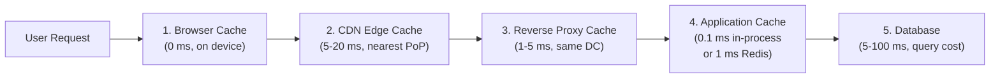
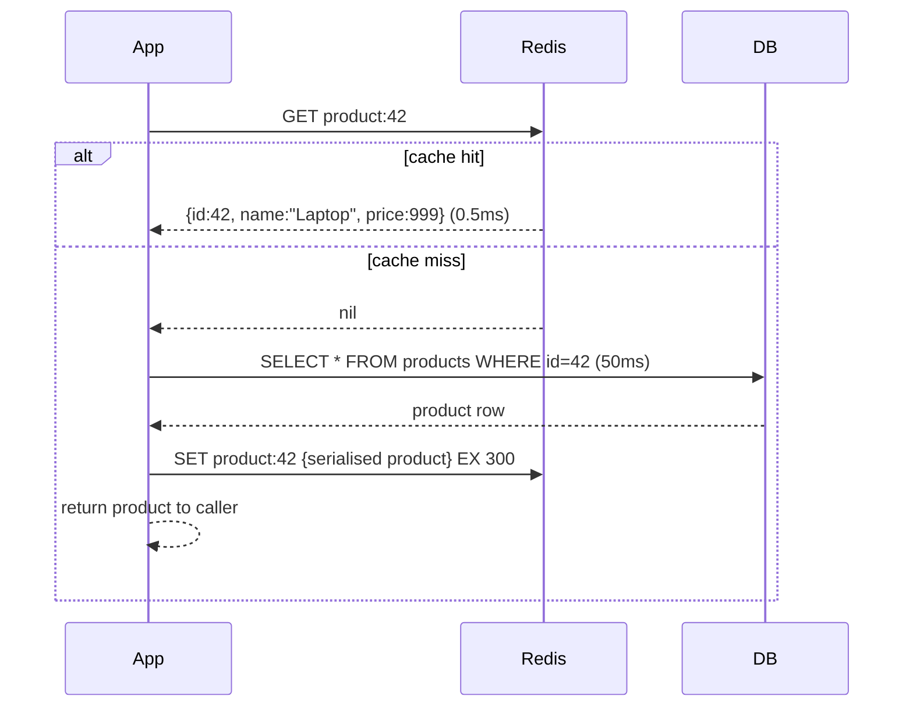
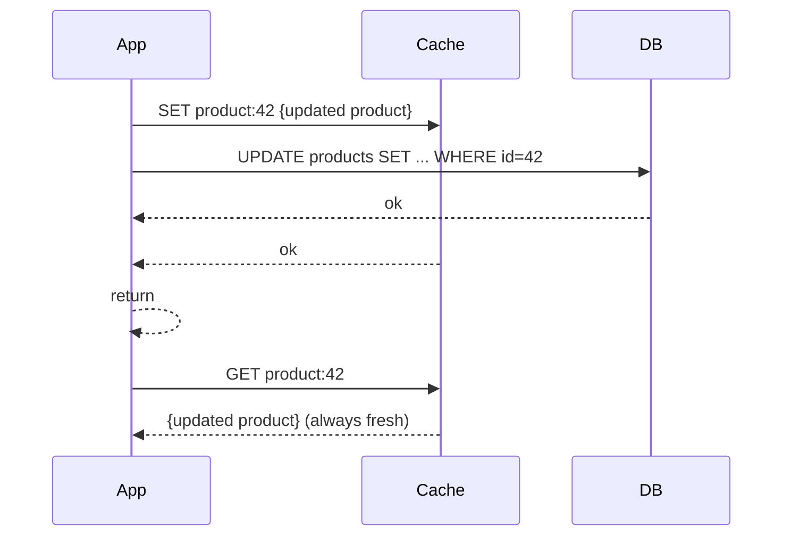
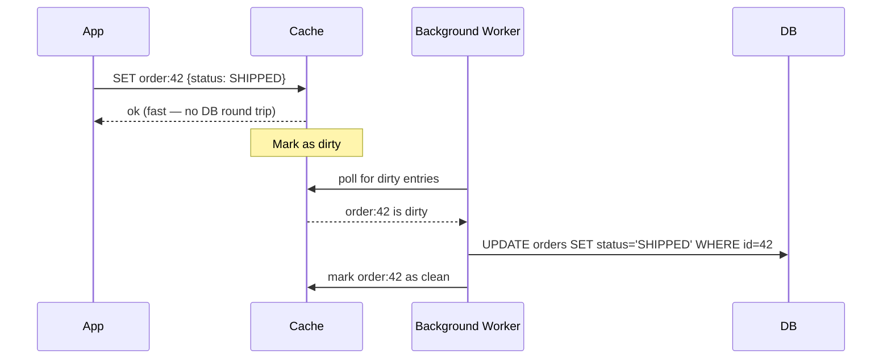
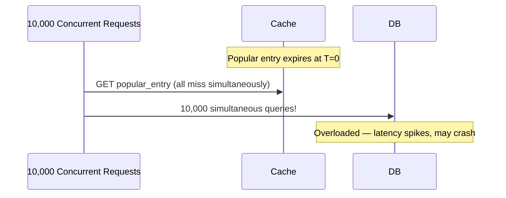

# Caching Basics

## Concept

- A **cache** is a fast, temporary storage layer that holds copies of expensive data — whether expensive to compute, expensive to fetch, or expensive to transfer — so future requests can be served faster.
- The fundamental principle: **serve from cache when the data is still valid; go to the source only when the cache is empty or stale**.
- Caching is the single most impactful latency optimisation in most systems. A database query that takes 50ms takes 0.1ms from an in-process cache.

**Why caching works**: most real-world data access is highly skewed. A small fraction of items account for the vast majority of reads — the **hot set**. A cache that holds the hot set serves almost all requests.

**The cache hierarchy**: from closest to the user to furthest:



Each layer serves requests that the previous layer couldn't. The goal: serve as many requests as possible at the leftmost (fastest) layer.

## Cache Patterns

### Cache-aside (lazy loading) — the most common



```python
def get_product(product_id: str) -> Product:
    cache_key = f"product:{product_id}"
    cached = redis.get(cache_key)
    if cached:
        return Product.from_json(cached)

    product = db.query("SELECT * FROM products WHERE id = %s", product_id)
    redis.setex(cache_key, 300, product.to_json())  # TTL: 300 seconds
    return product
```

**Characteristics**:
- Only requested data is cached — the cache fills with hot data naturally.
- First request always hits the database (cold start).
- Cache and database can be inconsistent during the TTL window.
- Simple and works with any data store.

### Write-through

Every write goes to the cache **and** the database synchronously. Reading always hits the cache first.



**Characteristics**:
- Cache always has fresh data (no stale reads after writes).
- Write latency is higher (two writes in the critical path).
- Cache contains all written data, including rarely-read items (wasted memory).
- Good for: write-once-read-many data, leaderboards, user profiles.

### Write-behind (write-back)

Writes go to the cache first. The database is updated **asynchronously** by a background process.



**Characteristics**:
- Very fast writes — database is not in the critical path.
- Cache absorbs write bursts (smooths traffic to DB).
- **Risk**: if the cache node fails before the write is persisted, data is lost.
- Good for: view counters, analytics events, logging, non-critical update-heavy data.
- Bad for: financial transactions, order status, anything that must not be lost.

### Read-through

The application always reads from the cache. The cache library transparently fetches from the database on a miss:

```python
# Application code — only talks to cache, never directly to DB
product = cache.get("product:42")  # cache handles the miss internally
```

The difference from cache-aside: the application is unaware of the database. The cache acts as a proxy. Simpler application code; the cache library manages population.

## Cache Eviction Policies

When the cache is full, the eviction policy decides which entries to remove:

### LRU (Least Recently Used)

Remove the entry that was accessed longest ago. Approximates the working set — entries that haven't been used recently are less likely to be needed soon.

```
Cache (capacity 3):
State: [A, B, C]   (A most recent, C least recent)
Access A → [A, B, C]
Access D → evict C, add D → [D, A, B]
Access B → [B, D, A]
Access E → evict A (least recent), add E → [E, B, D]
```

**LRU is the default** for most caches (Redis `allkeys-lru`, CPU L1/L2/L3, browser caches). Works well for most workloads.

### LFU (Least Frequently Used)

Remove the entry with the fewest accesses. Keeps items that are consistently popular even if not recently accessed.

Better than LRU for workloads where access patterns are stable over long periods (popular products that are always popular). Worse for seasonal patterns (Christmas items are hot in December, dead in January).

### TTL-Based Expiry

Remove entries after a fixed time, regardless of access frequency. Not really an eviction policy — it's a freshness mechanism. Combined with LRU: when the cache is full and all TTLs are future, evict LRU.

### Random Replacement

Evict a random entry. Simpler than LRU, surprisingly competitive in practice. Good theoretical guarantees for some access patterns.

### Redis eviction policies

Configure in `redis.conf` or via `CONFIG SET maxmemory-policy`:

| Policy | Description | Use when |
|---|---|---|
| `noeviction` | Return error when full | You can't tolerate data loss |
| `allkeys-lru` | Evict any key by LRU | General-purpose cache |
| `volatile-lru` | Evict only TTL-set keys by LRU | Cache mixed with persistent data |
| `allkeys-lfu` | Evict by access frequency | Stable hot items |
| `volatile-ttl` | Evict TTL-set key with shortest TTL | When TTL reflects importance |
| `allkeys-random` | Random eviction | Uniform access distribution |

## Cache Stampede (Thundering Herd)

**The problem**: a popular cache entry expires. 10,000 concurrent requests all miss simultaneously, all hit the database at once, overwhelming it.



### Solution 1: Mutex locking (single-filler)

Only one goroutine/thread fetches from the database on a miss; others wait:

```python
import redis
import time

def get_with_lock(key, fill_fn, ttl=300):
    value = redis.get(key)
    if value:
        return value

    lock_key = f"lock:{key}"
    if redis.set(lock_key, "1", nx=True, ex=10):  # acquire lock
        try:
            value = fill_fn()  # fetch from DB
            redis.setex(key, ttl, value)
            return value
        finally:
            redis.delete(lock_key)
    else:
        # Wait for lock holder to populate
        time.sleep(0.05)
        return get_with_lock(key, fill_fn, ttl)  # retry
```

One database query instead of 10,000.

### Solution 2: Probabilistic early expiration

Slightly before the TTL expires, proactively re-fetch. Avoids the cliff edge:

```python
import math, random, time

def get_with_early_expiry(key, fill_fn, ttl=300, beta=1.0):
    value, stored_ttl = redis.get_with_ttl(key)
    if value:
        # Decide whether to recompute early
        # Higher beta = more aggressive early expiry
        if stored_ttl > 0 and random.random() < beta * math.exp(-stored_ttl / ttl):
            # Stale but acceptable — recompute in background
            threading.Thread(target=lambda: refresh(key, fill_fn, ttl)).start()
        return value

    return refresh(key, fill_fn, ttl)
```

### Solution 3: Stale-while-revalidate (HTTP header)

For HTTP caches, the `stale-while-revalidate` directive serves stale content immediately while refreshing in the background:

```
Cache-Control: public, max-age=60, stale-while-revalidate=300
```

The cache serves the stale response to all pending requests while one background request re-fetches from origin. Zero stampede, zero latency spike.

## Cache Invalidation

"There are only two hard problems in computer science: cache invalidation and naming things." — Phil Karlton

### Time-based expiry (TTL)

Simplest strategy: cached entries expire after N seconds. The question is what TTL to choose:

| Data type | Recommended TTL | Reasoning |
|---|---|---|
| User profile | 60–300 seconds | Changes infrequently; slight staleness OK |
| Product catalog | 60–600 seconds | Public, changes slowly |
| Inventory/stock levels | 10–30 seconds | Changes quickly; overselling is costly |
| Session data | Same as session timeout | Must be accurate |
| Static assets (fingerprinted) | 31536000 seconds (1 year) | Content hash in URL guarantees freshness |
| Rate limit counters | Same as rate window | Must be accurate |
| Search results | 30–300 seconds | Fresh enough for UX |

### Event-driven invalidation

When the underlying data changes, immediately invalidate the cache entry:

```python
# In the order service
def update_order_status(order_id, new_status):
    db.execute("UPDATE orders SET status = %s WHERE id = %s", new_status, order_id)
    redis.delete(f"order:{order_id}")  # immediate invalidation
    redis.delete(f"user:{order.user_id}:orders")  # also invalidate user's order list
```

More complex but ensures consistency. Must identify all cache entries that contain the changed data.

### Cache tags (surrogate keys)

Tag cache entries with metadata, then purge by tag:

```python
def cache_product(product):
    redis.set(f"product:{product.id}", product.to_json())
    redis.sadd(f"tag:category:{product.category_id}", f"product:{product.id}")
    redis.sadd(f"tag:brand:{product.brand_id}", f"product:{product.id}")

def invalidate_category(category_id):
    keys = redis.smembers(f"tag:category:{category_id}")
    if keys:
        redis.delete(*keys)  # delete all products in this category
    redis.delete(f"tag:category:{category_id}")
```

Used extensively in CDNs (Cloudflare, Fastly) for purging related content.

## Distributed Caching

In a multi-server environment, each server can have its own local cache or share one distributed cache:

### Local (in-process) cache

Each application server has its own cache (e.g., Guava CacheBuilder, Caffeine in Java, `functools.lru_cache` in Python).

- Fastest possible: no network, direct memory read.
- No network overhead.
- **Inconsistency**: Server A may cache the old value of a product while Server B has already invalidated its copy.
- **Cache warming**: each server starts cold; the first requests to each server miss.
- Good for: immutable data, configuration, lookup tables.

### Remote shared cache (Redis/Memcached)

All servers share one cache cluster.

- Consistent: one source of truth.
- ~1 ms network overhead per operation (LAN).
- Redis is single-threaded (per slot) — throughput is bounded.
- Redis cluster scales horizontally via sharding.
- Memcached is multi-threaded and simpler — better for very high throughput pure caching.

### Two-tier: local + remote

Combine both:
1. Check local in-process cache (0.1 ms).
2. On miss, check remote Redis cache (1 ms).
3. On miss, query database (50 ms).

```python
def get_product(product_id):
    # Tier 1: local cache (Caffeine/LRU, max 1000 items, TTL 30s)
    cached = local_cache.get(f"product:{product_id}")
    if cached:
        return cached

    # Tier 2: Redis (TTL 300s)
    cached = redis.get(f"product:{product_id}")
    if cached:
        product = Product.from_json(cached)
        local_cache.set(f"product:{product_id}", product, ttl=30)
        return product

    # Tier 3: database
    product = db.query_product(product_id)
    redis.setex(f"product:{product_id}", 300, product.to_json())
    local_cache.set(f"product:{product_id}", product, ttl=30)
    return product
```

The local cache absorbs the hot set; Redis handles the warm set; the database handles true misses and writes.

## Cache Key Design

A good cache key uniquely identifies a piece of data and includes all variables that determine the correct value:

```
product:{product_id}                         → single product
user:{user_id}:orders:{status}:{page}        → paginated filtered order list
search:{query_hash}:{category}:{sort}:{page} → search results
tenant:{tenant_id}:config                    → per-tenant configuration
```

**Key prefixes**: use consistent prefixes to namespace keys. Makes debugging easier and allows bulk deletion of a namespace.

**Key length**: Redis stores keys as strings. Long keys waste memory. For frequently accessed keys, shorter is better. `p:42` vs `product:42` — the difference is small at 1000 keys, meaningful at 100 million keys.

**Namespace collisions**: if two different types of data share a key pattern, they'll overwrite each other. Always namespace: `order:42` and `product:42` are different keys.

## Redis vs. Memcached

| Factor | Redis | Memcached |
|---|---|---|
| Data structures | Strings, hashes, lists, sets, sorted sets, bitmaps, streams | Strings only |
| Persistence | Optional (RDB snapshots, AOF log) | None |
| Replication | Master-replica + cluster mode | None built-in |
| Pub/Sub | Yes | No |
| Transactions | Yes (MULTI/EXEC) | No |
| LFU eviction | Yes | No |
| Multi-threading | I/O multi-threaded since v6 | Fully multi-threaded |
| Memory efficiency | Slightly less (metadata per data structure) | Slightly better for simple strings |

**Default recommendation**: Redis. It does everything Memcached does plus persistence, pub/sub, atomic operations, and richer data structures. Memcached is only preferred when pure throughput on string keys is the only requirement.
