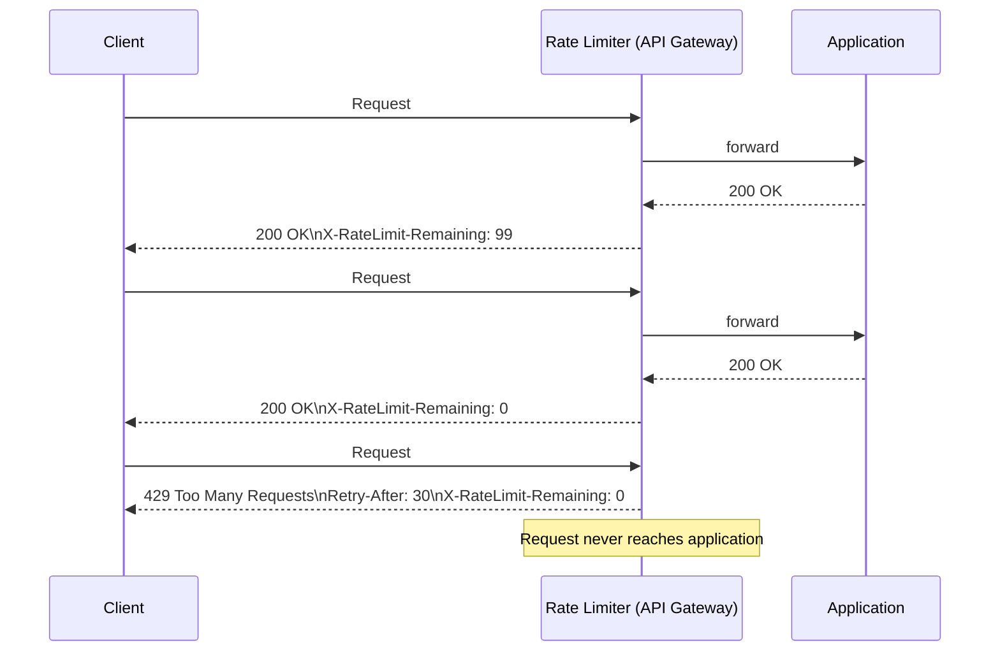
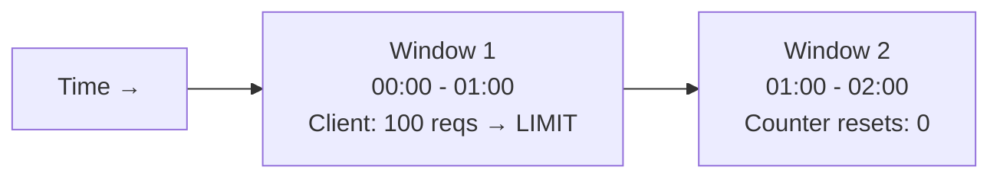
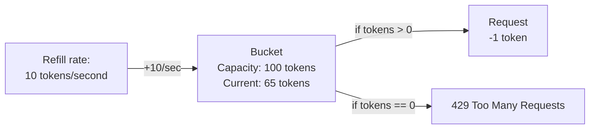
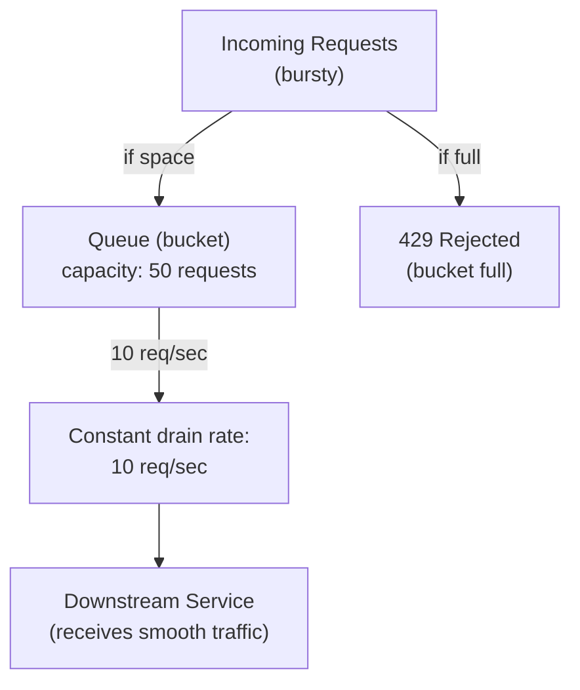
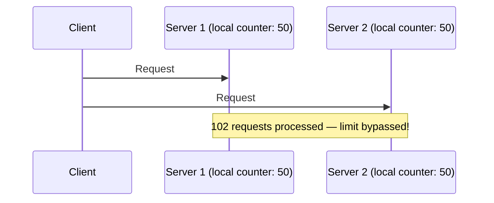
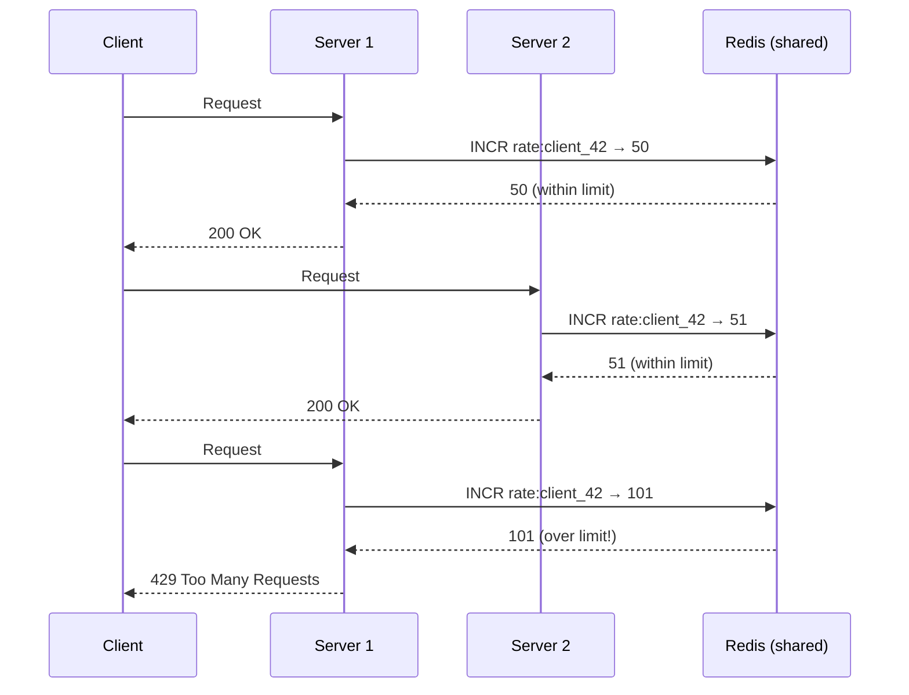

# Rate Limiting

## Concept

- **Rate limiting** restricts the number of requests a client can make within a given time window.
- Without rate limiting, one misbehaving or malicious client can exhaust your server's resources, degrading or denying service to all other clients.
- Rate limiting is enforced at the **entry point** of your system — typically an API gateway, reverse proxy, or load balancer — before requests reach application servers.
- It is one of the first lines of defence against:
  - **Accidental abuse**: a bug in a client retry loop floods your API.
  - **Intentional abuse**: scrapers, credential stuffing bots, DDoS.
  - **Runaway costs**: a client inadvertently triggering expensive operations in a tight loop.

**Rate limiting vs. throttling vs. quotas**:
- **Rate limiting**: how many requests per time window (100 req/min). Protects against burst abuse.
- **Throttling**: adding deliberate latency to slow a client down without rejecting. Less common; degrades UX.
- **Quotas**: total volume per period (10,000 requests per day). Billing and fair-use enforcement.



## Rate Limiting Algorithms

### 1. Fixed Window Counter

Divide time into fixed windows (e.g., each minute). Each client gets a counter per window. Reject when counter exceeds the limit.

```
Window: 00:00–01:00 → counter for client_42: 0, 1, 2 ... 100 (reject at 101)
Window: 01:00–02:00 → counter resets to 0
```

**Implementation** (Redis INCR with EXPIRE):
```
INCR rate:client_42:2024-01-01T00:01   → returns 47
EXPIRE rate:client_42:2024-01-01T00:01 60  (set if not already set)
```

**Key with current minute**: `rate:{client_id}:{unix_minute}` where `unix_minute = floor(now / 60)`.



**The boundary vulnerability**: a client can send 100 requests at `00:59:59` and 100 requests at `01:00:01`. That's 200 requests in 2 seconds — exactly 2× the nominal rate. This is the "double-spending" attack at window boundaries.

**When to use**: simple implementation, good enough for light rate limiting where exact enforcement isn't critical (e.g., internal APIs).

### 2. Sliding Window Log

Store the timestamp of every request in a sorted set. Count how many fall within the window. Reject if over limit.

```
On request at time T:
1. ZREMRANGEBYSCORE client_42:log -inf (T - window_seconds)  → remove old entries
2. count = ZCARD client_42:log
3. if count >= limit: reject
4. ZADD client_42:log T T  → add current timestamp
5. EXPIRE client_42:log window_seconds
```

```mermaid
sequenceDiagram
    participant C
    participant RL as Rate Limiter
    participant R as Redis (Sorted Set)

    Note over R: Current window: last 60 seconds
    R: [T-55, T-40, T-30, T-10, T-5] (5 requests in window)
    C->>RL: Request at T
    RL->>R: ZREMRANGEBYSCORE (remove entries older than T-60)
    RL->>R: ZCARD → 5 (within limit of 100)
    RL->>R: ZADD T
    RL-->>C: 200 OK
```

**Accurate** — no boundary vulnerability. Each request is evaluated against exactly the last N seconds of history.

**Memory cost**: O(requests_per_client_per_window). At 100 req/min and 10,000 active clients, that's 1 million entries in Redis. Manageable for moderate scale; concerning for very high-scale APIs.

### 3. Sliding Window Counter (hybrid — recommended)

Approximates the sliding window using only two counters (current and previous window). Memory-efficient with good accuracy:

```
current_window_count = requests in [window_start, now]
prev_window_count    = requests in [prev_window_start, window_start]
elapsed_fraction     = (now - window_start) / window_duration

estimated_count = prev_window_count × (1 - elapsed_fraction) + current_window_count
```

**Example**:
- Window: 1 minute
- Previous window had 80 requests.
- Current window is 30% elapsed (18 seconds in).
- Current window has 30 requests so far.

```
estimated = 80 × (1 - 0.30) + 30 = 80 × 0.70 + 30 = 56 + 30 = 86 requests
```

If the limit is 100, this client can make 14 more requests. Accurate without storing per-request timestamps.

**Redis implementation**:
```
pipeline = redis.pipeline()
pipeline.get(f"rate:{client}:prev")
pipeline.get(f"rate:{client}:curr")
prev_count, curr_count = pipeline.execute()

elapsed_fraction = (now % window_size) / window_size
estimated = int(prev_count or 0) * (1 - elapsed_fraction) + int(curr_count or 0)

if estimated >= limit:
    return REJECT

redis.incr(f"rate:{client}:curr")
redis.expire(f"rate:{client}:curr", window_size * 2)
```

### 4. Token Bucket

Each client has a "bucket" that:
- Holds tokens (maximum = bucket capacity).
- Refills at a constant rate (e.g., 10 tokens/second).
- Each request consumes 1 token. If the bucket is empty, reject.



**Allows bursts**: a client that hasn't made requests for 10 seconds has accumulated tokens. They can burst 100 requests in 100ms and then only 10/second thereafter. This is realistic — legitimate clients have bursty patterns (page load triggers 20 parallel asset requests).

**Implementation**: store `{tokens, last_refill_time}` per client. On each request:
1. Calculate tokens earned since last refill: `min(capacity, tokens + (now - last_refill) × rate)`.
2. If tokens ≥ 1: decrement and allow. Else: reject.
3. Update `{tokens, last_refill_time}`.

Atomic in Redis using a Lua script (to prevent race conditions between read and write).

**Used by**: AWS API Gateway, GitHub API, Stripe API, most large-scale APIs.

### 5. Leaky Bucket

Requests enter a queue (the "bucket"). The queue drains at a constant rate. If the queue is full, new requests are rejected.



**Enforces smooth output rate** regardless of bursty input. Protects downstream services that can't handle bursts (a payment processor that can handle exactly 100 transactions/second).

**Difference from token bucket**:
- Token bucket allows bursts (client perspective).
- Leaky bucket smooths output (server/downstream perspective).

### Algorithm comparison

| Algorithm | Burst allowed | Memory | Accuracy | Best for |
|---|---|---|---|---|
| Fixed window | Yes (at boundary) | O(1) per client | Low (boundary issue) | Simple, low-stakes |
| Sliding window log | No | O(requests) | Exact | High-precision, low traffic |
| Sliding window counter | Partial | O(1) | ~95% accurate | Production APIs |
| Token bucket | Yes (burst cap) | O(1) | Exact | API gateways |
| Leaky bucket | No | O(queue) | Exact | Smooth downstream rate |

## Distributed Rate Limiting

A single server can rate limit with in-process state. With multiple servers, you need a **shared counter**.

### The problem



### Redis as shared counter (the standard solution)



**Lua script for atomic token bucket** (prevents race conditions):
```lua
local key = KEYS[1]
local rate = tonumber(ARGV[1])
local capacity = tonumber(ARGV[2])
local now = tonumber(ARGV[3])

local bucket = redis.call("HMGET", key, "tokens", "last_refill")
local tokens = tonumber(bucket[1]) or capacity
local last_refill = tonumber(bucket[2]) or now

-- Calculate tokens earned
local elapsed = now - last_refill
local new_tokens = math.min(capacity, tokens + elapsed * rate)

if new_tokens >= 1 then
    redis.call("HMSET", key, "tokens", new_tokens - 1, "last_refill", now)
    redis.call("EXPIRE", key, 2 * capacity / rate)
    return 1  -- allowed
else
    return 0  -- rejected
end
```

Lua scripts in Redis execute atomically — no other command runs between the read and write.

## Rate Limit Headers

Always return rate limit information in response headers. Clients that understand these headers can back off before hitting the limit:

```
# Success response
HTTP/1.1 200 OK
X-RateLimit-Limit: 100
X-RateLimit-Remaining: 23
X-RateLimit-Reset: 1700000060
X-RateLimit-Window: 60
```

```
# Rate limited response
HTTP/1.1 429 Too Many Requests
X-RateLimit-Limit: 100
X-RateLimit-Remaining: 0
X-RateLimit-Reset: 1700000060
Retry-After: 47
Content-Type: application/json

{
  "error": "RATE_LIMIT_EXCEEDED",
  "message": "Too many requests. Retry after 47 seconds.",
  "retryAfter": 47
}
```

- `X-RateLimit-Limit`: maximum requests per window.
- `X-RateLimit-Remaining`: requests left in current window.
- `X-RateLimit-Reset`: Unix timestamp when the window resets.
- `Retry-After`: seconds to wait (can be relative seconds or HTTP date).

## Scoping Rate Limits

Rate limits can be applied at different granularities:

| Scope | Key | Use case |
|---|---|---|
| IP address | `rate:ip:1.2.3.4` | Unauthenticated endpoints, bots |
| User ID | `rate:user:42` | Authenticated user actions |
| API key | `rate:key:sk_live_abc` | Third-party API clients |
| Endpoint | `rate:user:42:POST:/orders` | Per-operation limits (expensive endpoints) |
| Tenant | `rate:tenant:acme` | Multi-tenant SaaS |

**Layered limits**: apply multiple limits simultaneously:
- Global: 10,000 req/min across all clients.
- Per-IP: 100 req/min for unauthenticated.
- Per-user: 1,000 req/min for authenticated.
- Per-endpoint: POST /search: 10 req/sec (expensive query).

## Rate Limiting at Different Layers

### API Gateway level (Nginx, Kong, AWS API Gateway)
- Rate limits before requests hit any application code.
- No application code changes needed.
- Limited visibility into user-level context (must pass auth info to gateway).

### Application middleware level
- Full access to user context, permissions, and business logic.
- Can apply different limits per subscription tier.
- Adds code complexity.

### Infrastructure level (Cloudflare, AWS Shield)
- Absorbs volumetric attacks before they reach your origin.
- Pattern-based (IP geolocation, request fingerprinting).
- No application awareness.

**Best practice**: layer all three. Cloudflare/CDN for volumetric and bot attacks, API gateway for per-key limits, application for business-logic-aware limits.

## Handling Clients Correctly

**Client-side exponential backoff** (what a well-behaved client should do):

```javascript
async function apiRequest(url, retries = 5) {
  for (let attempt = 0; attempt < retries; attempt++) {
    const response = await fetch(url);

    if (response.status !== 429) {
      return response;
    }

    const retryAfter = response.headers.get('Retry-After');
    const delay = retryAfter
      ? parseInt(retryAfter) * 1000
      : Math.pow(2, attempt) * 1000 + Math.random() * 1000;

    await sleep(delay);
  }
  throw new Error('Rate limit exceeded after retries');
}
```

The `Math.random() * 1000` (jitter) is critical: without it, all clients retry at exactly the same time after a `Retry-After` delay, causing a new burst.

## Relationship to Circuit Breaker

Rate limiting is sometimes confused with circuit breaking, but they solve different problems:
- **Rate limiting**: protects the server from too many requests from one client.
- **Circuit breaker**: protects the client from repeatedly calling a failing downstream service.

They complement each other:
```
Client → Circuit Breaker → Rate Limiter → API Server
                                          ↓
                               Downstream Service → Circuit Breaker → Database
```
