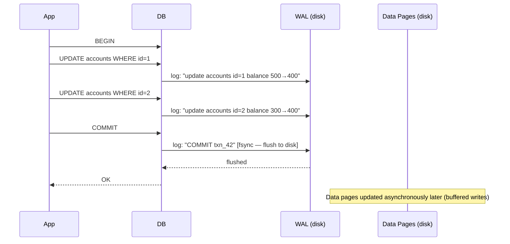
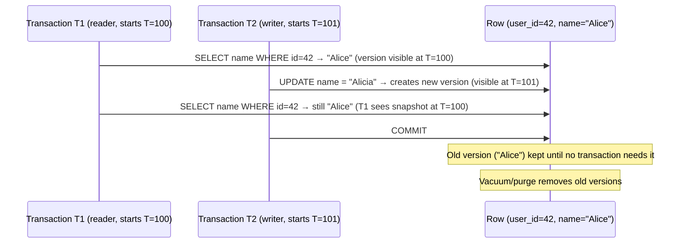

# Database Fundamentals

## Concept

- A database is a structured store for **persistent data** with mechanisms for concurrent access, failure recovery, and efficient querying.
- Two foundational concepts underpin everything in database theory:
  - **ACID** — the four properties that guarantee correctness of transactions.
  - **Indexes** — data structures that make queries fast.
- Understanding these isn't optional background knowledge — they directly determine system behaviour under load, failure, and concurrent access. Every "should we use a database for X?" question in system design requires this foundation.

**What a database must solve**:

| Problem | Solution |
|---|---|
| Multiple users modifying the same data simultaneously | Transactions + isolation |
| Process crashes mid-operation, leaving data half-written | Write-ahead log + atomicity |
| Hardware failures (disk, power) | Durability (fsync, replication) |
| Finding one row in 100 million rows in milliseconds | Indexes |
| Preventing logically invalid data | Constraints (FK, UNIQUE, CHECK) |

## ACID Properties — Explained Deeply

### A — Atomicity

A transaction is all-or-nothing. If it contains 10 statements and the 7th fails (or the server crashes), **all 10 are rolled back** as if none of them happened.

**Bank transfer example**:
```sql
BEGIN;
UPDATE accounts SET balance = balance - 100 WHERE id = 1;  -- debit Alice
UPDATE accounts SET balance = balance + 100 WHERE id = 2;  -- credit Bob
COMMIT;
```

If the server crashes after the debit but before the credit, atomicity ensures the debit is also rolled back on recovery. There is no state where Alice's balance decreased and Bob's didn't increase.

**How it's implemented (Write-Ahead Log)**:


**On crash recovery**: the database reads the WAL from the last checkpoint. For each logged transaction:
- If `COMMIT` is in the log: re-apply changes (redo).
- If no `COMMIT`: roll back any partial changes (undo).
- Result: committed data survives; uncommitted data is never partially visible.

### C — Consistency

A transaction brings the database from one **valid state** to another valid state. It never leaves the database in a state that violates defined constraints.

Constraints include:
- `NOT NULL` — required fields must have values.
- `UNIQUE` — no duplicate values for indexed columns.
- `FOREIGN KEY` — referenced rows must exist (e.g., order must reference a valid user_id).
- `CHECK` — domain constraints (`balance >= 0`, `age BETWEEN 0 AND 150`).

If a transaction would violate any constraint, the database rejects the entire transaction — not just the violating statement.

**Important distinction**: Consistency in ACID is about application-defined constraints. The C in CAP Theorem (phase 4) is about distributed read consistency. Different concepts.

### I — Isolation

Concurrent transactions should not see each other's intermediate (uncommitted) state. Each transaction executes as if it runs alone, even if many are executing concurrently.

**Without isolation** (chaos):
```
T1:  BEGIN; SELECT balance FROM accounts WHERE id=1;  -- reads 500
                         T2: BEGIN; UPDATE accounts SET balance = 200 WHERE id=1; COMMIT;
T1:  UPDATE accounts SET balance = balance + 100 WHERE id=1;  -- based on stale 500, sets to 600
T1:  COMMIT;
-- Bob's balance is now 600, not 300 (200 + 100 correct) — consistency violated!
```

### Isolation anomalies

| Anomaly | Description |
|---|---|
| Dirty read | Reading uncommitted data from another transaction (that may roll back) |
| Non-repeatable read | Same row read twice gives different results because another transaction committed between the reads |
| Phantom read | Same query run twice returns different rows because another transaction inserted/deleted between the reads |
| Lost update | Two transactions read-then-update the same row; one overwrites the other's change |

### Isolation levels

| Level | Dirty Read | Non-repeatable Read | Phantom Read | Lost Update | Notes |
|---|---|---|---|---|---|
| Read Uncommitted | Possible | Possible | Possible | Possible | Never use — reads uncommitted garbage |
| Read Committed | Prevented | Possible | Possible | Possible | PostgreSQL/Oracle default |
| Repeatable Read | Prevented | Prevented | Possible | Prevented | MySQL InnoDB default |
| Serializable | Prevented | Prevented | Prevented | Prevented | Highest isolation, lowest concurrency |

**PostgreSQL's Repeatable Read also prevents phantoms** (using SSI — Serializable Snapshot Isolation). MySQL InnoDB uses next-key locking to prevent phantoms at Repeatable Read.

**Choosing isolation level**: most applications use Read Committed. Financial transactions that must be precise use Repeatable Read or Serializable. Serializable reduces concurrency — use it only when the anomaly would cause real business damage.

### D — Durability

Once a transaction is committed, it **survives crashes**. Even if the server loses power 1 millisecond after the COMMIT acknowledgement, the data will be there after restart.

**How it works**:
1. Before acknowledging COMMIT, the database calls `fsync()` to flush the WAL to the physical disk.
2. `fsync` is a system call that waits until the OS confirms the data has left OS buffers and reached the storage medium.
3. The OS can lie if the disk has a volatile write cache. Enterprise databases use hardware with battery-backed write caches, or use storage with `fsync` guarantees.

**Disabling durability for speed**: some databases/configurations skip `fsync` for faster writes. This sacrifices durability — a crash can lose the last N seconds of committed transactions. Acceptable for caches and test data; unacceptable for financial or medical records.

**Replication as additional durability**: writing to 2 or 3 replicas before acknowledging COMMIT is stronger than a single fsync. Even if the primary's disk fails, the data survives on replicas. This is synchronous replication.

## Indexes — The Database's Performance Lever

An index is a separate data structure that allows the database to find rows quickly without scanning every row in the table.

**Without index** (sequential scan):
```sql
SELECT * FROM orders WHERE user_id = 42;
-- Database reads EVERY row in the orders table (full table scan)
-- If orders has 10 million rows: ~10 million disk reads
-- At 100 MB/s read speed: ~3 seconds
```

**With index on user_id** (index scan):
```sql
-- B-tree index finds user_id=42 in ~27 comparisons (log2 of 100M)
-- Returns matching row pointers
-- Fetches those rows directly
-- Execution time: ~2 milliseconds
```

### B+ Tree — The Standard Index

All major relational databases (PostgreSQL, MySQL InnoDB, SQLite, Oracle) use B+ trees as the primary index structure.

**Structure**:
```
                    [50 | 100]           ← Internal node
                  /      |      \
         [20|30]      [60|80]      [110|150]   ← Internal nodes
        /   |   \    /  |   \     /    |    \
    [10|15] [25] [35|40] [55] [70|90] [100] [120|140]  ← Leaf nodes (data pointers)
```

- **Internal nodes** contain keys used for navigation.
- **Leaf nodes** contain (key, row_pointer) pairs, and are linked in a doubly-linked list.
- The linked leaf list enables **range scans** efficiently — once you find the start, follow the links.

**Why B+ tree over binary tree?** Databases use disk I/O, which reads in blocks (typically 8KB–16KB pages). A B+ tree node is sized to fill one page (~200–1000 keys per node). This means O(log_200(N)) page reads instead of O(log_2(N)) binary tree comparisons. For 100 million rows: B+ tree ≈ 3–4 page reads; binary tree ≈ 27.

**B+ tree operations**:
- **Lookup by key** (`WHERE id = 42`): ~3–4 page reads, O(log N).
- **Range scan** (`WHERE id BETWEEN 100 AND 200`): find start key, follow leaf links, O(log N + k) where k = matching rows.
- **Sorted output** (`ORDER BY indexed_column`): traverse leaves in order, no sort needed.
- **Insert**: find leaf, insert in sorted position, split if full, O(log N).
- **Delete**: find and remove, merge/redistribute if underfull, O(log N).

### Hash Index

A hash map from key to row pointer. Lookup is O(1) average.

```sql
-- CREATE INDEX idx_sessions_token ON sessions USING HASH (token);
SELECT * FROM sessions WHERE token = 'abc123';  -- O(1) lookup
```

**Limitation**: only equality lookups. Cannot support:
- Range queries (`WHERE price > 100`)
- Sorting (`ORDER BY`)
- Prefix matching (`WHERE name LIKE 'Al%'`)

PostgreSQL supports explicit hash indexes. MySQL InnoDB has an adaptive hash index (internal — automatically caches hot B+ tree paths as a hash).

### Composite (Multi-Column) Index

An index on multiple columns:

```sql
CREATE INDEX idx_orders_user_status ON orders (user_id, status);
```

**Leftmost prefix rule**: the index can serve queries that use the columns in prefix order:
- `WHERE user_id = 42` ✓ (uses leftmost column)
- `WHERE user_id = 42 AND status = 'SHIPPED'` ✓ (uses both columns)
- `WHERE status = 'SHIPPED'` ✗ (doesn't start with user_id — cannot use this index)

**Column order matters**:
- Put **equality condition columns first** (`user_id = 42`).
- Put **range condition columns last** (`status IN ('SHIPPED', 'DELIVERED')`).
- Put **most selective columns first** for best index effectiveness.

### Index-only scans

If the SELECT fields are all part of the index, the database can answer the query purely from the index without accessing the main table:

```sql
CREATE INDEX idx_orders_user_total ON orders (user_id, total);

SELECT total FROM orders WHERE user_id = 42;
-- Index contains user_id and total → no need to read the main table
-- This is an index-only scan — fastest possible
```

### Partial Index

Index only rows that match a condition:

```sql
CREATE INDEX idx_orders_pending ON orders (created_at)
WHERE status = 'PENDING';
-- Small index covering only pending orders
-- Perfect for "find oldest pending orders" queries
```

### Expression Index

Index the result of an expression:

```sql
CREATE INDEX idx_users_lower_email ON users (LOWER(email));

-- Now this query uses the index:
SELECT * FROM users WHERE LOWER(email) = 'alice@example.com';
```

## MVCC — Multi-Version Concurrency Control

MVCC is how modern databases achieve high concurrency without excessive locking.

**The insight**: instead of one version of each row, maintain multiple versions. Readers read an older "snapshot" version. Writers write a new version. **Readers and writers never block each other**.



**Transaction snapshot**: each transaction is assigned a **transaction ID (XID)** when it starts. The transaction sees only rows whose XID is less than its own and committed. Rows written by uncommitted transactions are invisible.

**Vacuum** (PostgreSQL): a background process that removes old row versions no longer needed by any active transaction. Bloat builds up if vacuum can't keep up (very long-running transactions prevent old versions from being cleaned).

**Undo log** (MySQL InnoDB): similar concept — old row versions are stored in a separate undo log segment.

## Locking Strategies

### Pessimistic locking

Acquire a lock before reading, preventing concurrent modifications:

```sql
BEGIN;
SELECT balance FROM accounts WHERE id = 1 FOR UPDATE;
-- No other transaction can modify this row until COMMIT

UPDATE accounts SET balance = balance - 100 WHERE id = 1;
COMMIT;
```

`FOR UPDATE` acquires a row-level exclusive lock. Best for:
- High-contention scenarios (multiple users modifying the same inventory item).
- When you need to make a decision based on the read value.

**Deadlock**: T1 locks row A then tries to lock row B. T2 holds row B and tries to lock row A. Both wait forever. Databases detect and resolve deadlocks by aborting one transaction. Always acquire locks in a consistent order to minimise deadlocks.

### Optimistic locking (via version column)

No database locks. Each row has a version number. On update, check the version hasn't changed:

```sql
-- Read
SELECT id, name, balance, version FROM accounts WHERE id = 1;
-- Returns: (1, "Alice", 500, 3)

-- Update — only if version hasn't changed
UPDATE accounts SET balance = 400, version = 4 WHERE id = 1 AND version = 3;
-- Returns 0 rows updated if another transaction already incremented version
-- Application detects 0 rows, retries with fresh data
```

Best for:
- Low-contention scenarios (most operations succeed without conflicts).
- When contention is rare but must be detected.
- REST APIs where you can't hold a DB transaction open across HTTP requests.

## Query Planner and EXPLAIN

The database **query planner** (or query optimiser) translates your SQL into a physical execution plan. It picks the cheapest combination of:
- **Access methods**: sequential scan, index scan, bitmap index scan, index-only scan.
- **Join algorithms**: nested loop, hash join, merge join.
- **Join order**: which table to scan first.

```sql
EXPLAIN ANALYZE
SELECT u.name, COUNT(o.id) as order_count
FROM users u
JOIN orders o ON u.id = o.user_id
WHERE o.status = 'SHIPPED'
GROUP BY u.id, u.name
ORDER BY order_count DESC
LIMIT 10;
```

Output (PostgreSQL):
```
Limit  (cost=1523.45..1523.47 rows=10) (actual time=45.234..45.237 rows=10)
  -> Sort  (cost=1523.45..1533.45 rows=4000) (actual time=45.231..45.233 rows=10)
       Sort Key: count(o.id) DESC
       -> Hash Join  (cost=312.00..1423.00 rows=4000) (actual time=8.123..44.234 rows=8523)
            Hash Cond: (o.user_id = u.id)
            -> Index Scan on orders (cost=0.56..981.23 rows=8523) using idx_orders_status
                 Index Cond: (status = 'SHIPPED')
            -> Hash  (cost=185.00..185.00 rows=10000) (actual time=6.234..6.234 rows=10000)
                 -> Seq Scan on users  (cost=0.00..185.00 rows=10000)
Planning time: 0.456 ms
Execution time: 45.678 ms
```

**Reading EXPLAIN output**:
- `cost=` — estimated cost (arbitrary units: first value = startup cost, second = total cost).
- `actual time=` — real execution time in ms (requires ANALYZE).
- `rows=` — estimated vs. actual row count. Large discrepancy → stale statistics → consider `ANALYZE`.
- `Seq Scan` — full table scan. On a large table, this is the red flag to investigate.
- `Index Scan` — using an index. Good.
- `Hash Join` vs `Nested Loop` — hash join is efficient for large tables, nested loop for small inner tables.

## Transactions Best Practices

**Keep transactions short**: long transactions hold locks longer (pessimistic) or increase MVCC bloat (optimistic). Don't do external calls (HTTP, message queue) inside a database transaction.

```python
# BAD: HTTP call inside transaction (holds lock for 200ms)
with db.transaction():
    order = db.query("SELECT ... FOR UPDATE")
    result = stripe.charge(order.amount)  # 200ms HTTP call
    db.execute("UPDATE orders SET status = 'paid'")

# GOOD: prepare, charge, then update
order = db.query("SELECT ...")
result = stripe.charge(order.amount)  # outside transaction

with db.transaction():
    db.execute("UPDATE orders SET status = 'paid', payment_id = %s WHERE id = %s AND status = 'pending'",
               result.payment_id, order.id)
    if db.rowcount == 0:
        # Order was already paid or cancelled — handle idempotency
        db.rollback()
```

**Idempotency in transactions**: include an `idempotency_key` column with a UNIQUE constraint. If the same operation is retried, the INSERT will fail with a duplicate key error — the application catches it and returns the existing result.
