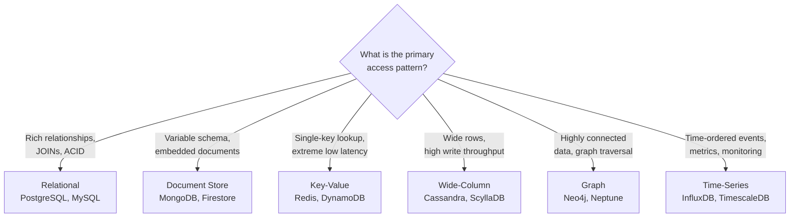
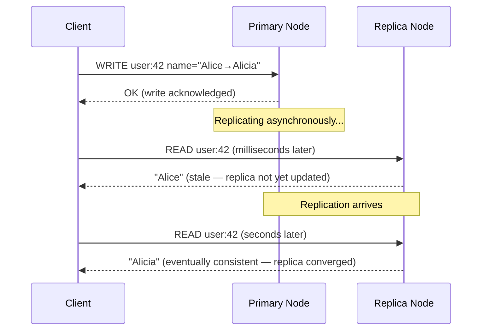
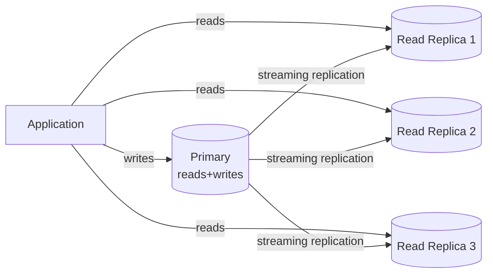
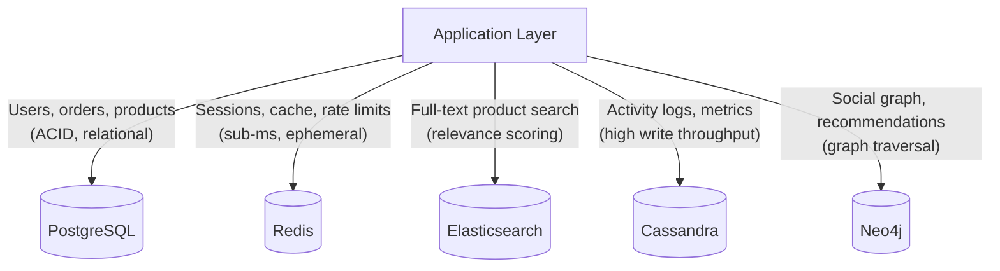

# SQL vs. NoSQL

## Concept

- **SQL databases** (relational) store data in tables with defined schemas. Rows reference rows in other tables via foreign keys. The query language (SQL) is declarative and standardised. ACID transactions (topic 18) are the default.
- **NoSQL databases** is an umbrella term for databases that don't use the relational model. This includes five major categories — document stores, key-value stores, wide-column stores, graph databases, and time-series databases — each optimised for a specific data model and access pattern.
- The choice between SQL and NoSQL is **not a religious debate** — it's an engineering decision based on data shape, access patterns, consistency requirements, team familiarity, and operational constraints.

**The most important rule**: use the database that matches your **access pattern**, not the one that's trendy. A document store used for relational data is painful. A relational database used for a social graph is painful.



## ACID vs. BASE — The Foundational Trade-off

SQL and NoSQL databases are not just different data models — they make fundamentally different promises about consistency and availability. Understanding this contrast is essential before choosing between them.

### ACID (SQL default — topic 18)

| Property | Guarantee |
|---|---|
| **A**tomicity | All operations in a transaction succeed or all are rolled back |
| **C**onsistency | Every transaction brings the DB from one valid state to another |
| **I**solation | Concurrent transactions don't see each other's partial state |
| **D**urability | Committed data survives crashes (fsync + WAL) |

ACID prioritises **correctness** over availability and performance. If a transaction can't be completed safely, it fails and is rolled back.

### BASE (NoSQL default)

BASE is the contrasting model used by most NoSQL systems, especially distributed ones:

| Property | What it means |
|---|---|
| **B**asically **A**vailable | The system remains available (returns a response) even during partial failures — the response may be stale or incomplete, but it won't fail entirely |
| **S**oft State | The system's state may change over time even without new input — replicas are allowed to be temporarily inconsistent and converge gradually |
| **E**ventually Consistent | All replicas will converge to the same value — but not instantly. A read immediately after a write may return the old value for a brief window (milliseconds to seconds) |



### Why BASE exists

ACID requires coordination across all replicas before acknowledging a write. In a distributed system with replicas in New York, London, and Tokyo, a synchronous write to all three adds ~150ms per write just for network round trips. That's prohibitive for high-throughput workloads.

BASE trades that guarantee for:
- **Write throughput**: write to one node, replicate asynchronously. Orders of magnitude faster.
- **Availability**: if 2 of 3 replicas are unreachable, the system still serves reads and writes from the remaining replica.
- **Geographic distribution**: active-active multi-region writes without cross-region synchronous coordination.

### The real question: what can your application tolerate?

| Scenario | Stale reads OK? | Recommended |
|---|---|---|
| Bank account balance | No — customer would see wrong balance | ACID (PostgreSQL) |
| Shopping cart item count | Yes — briefly showing wrong count is harmless | BASE (Cassandra, DynamoDB) |
| Order placed confirmation | No — must be durable | ACID |
| User's "followers" count on social media | Yes — showing 10,241 vs 10,243 briefly is fine | BASE |
| Payment deduction | No — partial writes cause financial loss | ACID |
| User's last-seen timestamp | Yes — a few seconds of staleness doesn't matter | BASE |

**The key insight**: BASE is not "less correct." It's a deliberate engineering choice when consistency is less important than availability and throughput. Using BASE for data that requires strong consistency (like account balances) causes real bugs. Using ACID for data where eventual consistency is fine wastes performance.

### Tunable consistency (the middle ground)

Some databases (Cassandra, DynamoDB) let you choose consistency per operation:

```
Cassandra write/read consistency levels:
- ONE:           Fast — write/read 1 replica. Eventual consistency.
- QUORUM:        Balanced — write/read majority. Stronger consistency.
- ALL:           Slow — write/read all replicas. ACID-like but reduces availability.
- LOCAL_QUORUM:  Quorum within the local data center. Multi-region safe.
```

With replication factor 3:
- `QUORUM` write (2 nodes) + `QUORUM` read (2 nodes) = at least 1 node overlap = you always see the latest write.
- `ONE` write + `ONE` read = may read from the replica that hasn't received the write yet.

This gives you ACID-like guarantees for critical operations and BASE performance for non-critical ones, using the same database.

## SQL / Relational Databases

### When SQL is the right choice

- **Structured, relational data**: your entities have clear relationships (orders have items, items have products, products have categories). JOINs are efficient.
- **ACID transactions are required**: financial operations, order management, medical records — partial updates must be impossible.
- **Complex ad-hoc queries**: SQL is the most expressive query language. Arbitrary combinations of filters, aggregations, window functions, subqueries.
- **Data integrity enforcement**: foreign keys, unique constraints, check constraints guarantee the database is always in a valid state.
- **Normalised data**: store data once, reference it many times. Avoids update anomalies (update a product name in one place, not in thousands of order records).

### Strengths

```sql
-- Complex query that would be hard in most NoSQL stores
SELECT
    u.name,
    COUNT(DISTINCT o.id)          AS order_count,
    SUM(oi.quantity * p.price)    AS lifetime_value,
    MAX(o.created_at)             AS last_order_date,
    RANK() OVER (ORDER BY SUM(oi.quantity * p.price) DESC) AS ltv_rank
FROM users u
JOIN orders o ON u.id = o.user_id
JOIN order_items oi ON o.id = oi.order_id
JOIN products p ON oi.product_id = p.id
WHERE o.status = 'DELIVERED'
  AND o.created_at >= NOW() - INTERVAL '12 months'
GROUP BY u.id, u.name
HAVING COUNT(DISTINCT o.id) >= 3
ORDER BY lifetime_value DESC
LIMIT 100;
```

This runs efficiently in PostgreSQL with proper indexes. In a document store, you'd need multiple queries and application-side joins.

### PostgreSQL feature highlights

PostgreSQL is the recommended default SQL database for new projects:
- JSONB columns — store semi-structured data with full JSON operators and indexing.
- Full-text search (`tsvector`, `tsquery`).
- Geographic data (PostGIS extension — spatial queries, distance calculations).
- Range types (`daterange`, `tsrange`, `int4range`).
- Window functions, CTEs, lateral joins.
- Partial indexes, expression indexes.
- Logical replication, streaming replication.
- Row-level security.
- LISTEN/NOTIFY (pub-sub within the database).

### Scaling SQL

SQL databases scale **reads** easily (replica set + read routing), and scale **writes** harder:



**Write scaling** options:
- **Vertical scaling**: bigger machine, more RAM, faster NVMe. PostgreSQL on a 96-core, 1TB RAM machine handles enormous write throughput.
- **Partitioning** (sharding): PostgreSQL table partitioning splits one logical table across multiple physical files. Queries touching one partition avoid scanning others.
- **Distributed SQL** (CockroachDB, PlanetScale, Spanner): horizontally scales writes across nodes while maintaining SQL semantics and ACID. Higher latency than single-node for single-row operations.

## Document Stores (MongoDB, Firestore, DynamoDB)

### When document stores are the right choice

- **Variable or flexible schema**: different documents in a collection can have different shapes.
- **Hierarchical / embedded data**: a blog post with comments, a product with variant attributes.
- **The application reads one document at a time**: the classic "get everything for this user's profile page in one query" pattern.
- **Rapid schema iteration**: add a field to some documents without a schema migration.
- **Developer productivity over query flexibility**: simpler data model, often faster initial development.

### Document model example

```json
{
  "_id": "order_42",
  "userId": "user_7",
  "status": "SHIPPED",
  "total": 199.98,
  "createdAt": "2024-01-15T10:30:00Z",
  "items": [
    {
      "productId": "prod_1",
      "name": "Wireless Keyboard",
      "quantity": 1,
      "price": 79.99
    },
    {
      "productId": "prod_2",
      "name": "Ergonomic Mouse",
      "quantity": 1,
      "price": 119.99
    }
  ],
  "shippingAddress": {
    "street": "123 Main St",
    "city": "Berlin",
    "zip": "10115",
    "country": "DE"
  },
  "trackingUrl": "https://dhl.com/track/xyz"
}
```

One document read retrieves the complete order. In SQL, the equivalent requires JOIN across orders, order_items, products, addresses.

### The denormalisation trade-off

Documents embed related data (denormalisation). The `items[].name` field duplicates product names:
- **Read performance**: single document read — fast.
- **Write consistency**: if a product is renamed, you must update every order that embedded it. In SQL, you update the products table once; JOIN returns the new name.

Rule of thumb: **embed data that changes together and is accessed together**. Reference (foreign key in document) data that changes independently.

### When document stores hurt

```
Q: "What are all orders that contain product prod_42?"
SQL: SELECT o.* FROM orders o JOIN order_items oi ON o.id = oi.order_id WHERE oi.product_id = 'prod_42';
MongoDB: db.orders.find({"items.productId": "prod_42"}) — works with an index, but...
```

What if you need: "Total revenue per product, by month, for all products in category 'electronics'"?

MongoDB can do it with aggregation pipelines, but it becomes complex and slow compared to SQL with proper indexes.

## Key-Value Stores (Redis, DynamoDB, etcd)

### When key-value stores are the right choice

- **Single-key lookup with sub-millisecond latency**: session data, feature flags, user preferences.
- **No complex queries needed**: you only look things up by a single key.
- **Ephemeral or cache data**: rate limit counters, cached responses, temporary tokens.
- **Extremely high throughput**: Redis handles 1 million operations/second on commodity hardware.

### Redis data structures

Redis is not just a key-value store — it supports rich data structures:

| Structure | Use case |
|---|---|
| String | Session tokens, cached JSON, counters (`INCR`) |
| Hash | Object with fields (`HGET user:42 name`) — like a row |
| List | Activity feed, job queue (`LPUSH`/`RPOP`) |
| Set | Unique members, tags (`SADD`, `SISMEMBER`) |
| Sorted Set | Leaderboard (score+member), rate limiting, pagination |
| Bitmap | User activity flags (day N was user active?) |
| HyperLogLog | Approximate unique count (daily active users) |
| Stream | Append-only event log, Kafka-lite |
| Pub/Sub | Message broadcasting between services |

### DynamoDB: key-value + document + serverless

DynamoDB is AWS's managed NoSQL service that combines key-value and document patterns:
- **Partition key** (primary key): determines the partition/shard where the item is stored. All items with the same partition key are in the same partition.
- **Sort key** (optional): within a partition, items are sorted by this key. Enables range queries within a partition.
- **Global Secondary Index (GSI)**: separate index with a different partition key. Enables queries across all items by a different attribute.

```
Table: Orders
PK: userId (partition key)
SK: createdAt (sort key)

Query: "Get all orders for user 42 in the last 30 days" → efficient (same partition, range on SK)
Query: "Get all orders with status SHIPPED" → requires GSI on (status, createdAt) or full scan
```

DynamoDB is serverless — no cluster to manage. Auto-scales, charges per request. Strong choice for serverless applications and extremely variable traffic.

## Wide-Column Stores (Cassandra, ScyllaDB, HBase)

### When wide-column stores are the right choice

- **Massive write throughput**: IoT sensor data, event logs, activity tracking.
- **Time-series data**: metrics, monitoring, click streams.
- **Globally distributed with tunable consistency**: multi-region writes.
- **Predictable query patterns**: queries are designed at schema time, not after.

### Cassandra data model

Cassandra organises data by **partition key** (determines which node) and **clustering key** (sort order within partition):

```sql
CREATE TABLE sensor_readings (
    device_id UUID,
    recorded_at TIMESTAMP,
    temperature FLOAT,
    humidity FLOAT,
    PRIMARY KEY (device_id, recorded_at)
) WITH CLUSTERING ORDER BY (recorded_at DESC);

-- Efficient: "Last 100 readings for device 42"
SELECT * FROM sensor_readings WHERE device_id = ? LIMIT 100;

-- Efficient: "Readings in the last hour for device 42"
SELECT * FROM sensor_readings
WHERE device_id = ?
  AND recorded_at >= toTimestamp(now()) - 3600s
LIMIT 1000;
```

All data for one device_id is on the same node (or replica set). Queries that stay within one partition are extremely fast.

**What Cassandra is bad at**:
- Queries without the partition key: requires a full cluster scan.
- JOINs: not supported.
- Ad-hoc queries: must be designed around partitions.
- Unique constraints: not enforced.

### Cassandra's consistency model

Cassandra offers **tunable consistency** per operation:

| Consistency Level | Write | Read | Notes |
|---|---|---|---|
| ONE | Write to 1 node | Read from 1 node | Fastest, lowest consistency |
| QUORUM | Write to majority | Read from majority | Balanced (default) |
| LOCAL_QUORUM | Quorum in local DC | Quorum in local DC | Multi-DC: local consistency |
| ALL | Write to all replicas | Read from all replicas | Strongest, least available |

With replication factor 3: `QUORUM` = 2 nodes. A write acknowledged by 2 nodes + a read from 2 nodes guarantees you see the latest write (because at least 1 node overlaps).

## Graph Databases (Neo4j, Amazon Neptune, ArangoDB)

### When graph databases are the right choice

- **Highly connected data with variable-depth traversals**: social networks (friends of friends), recommendation engines, knowledge graphs.
- **Relationship queries are first-class**: the structure of connections matters as much as the data itself.
- **Path-finding**: "What's the shortest trust path between user A and user B?"

### Why SQL fails for graphs

"Friends of friends of Alice who haven't seen movie X but have friends who have":

```sql
-- SQL: requires recursive CTE or pre-joined lookup table
WITH RECURSIVE friends_of_friends AS (
    SELECT f2.friend_id
    FROM friendships f1
    JOIN friendships f2 ON f1.friend_id = f2.user_id
    WHERE f1.user_id = 42
      AND f2.friend_id != 42
)
SELECT u.name FROM users u
JOIN friends_of_friends fof ON u.id = fof.friend_id
WHERE NOT EXISTS (
    SELECT 1 FROM watched w WHERE w.user_id = u.id AND w.movie_id = 100
)
AND EXISTS (
    SELECT 1 FROM friendships f JOIN watched w2 ON f.friend_id = w2.user_id
    WHERE f.user_id = u.id AND w2.movie_id = 100
);
```

**Neo4j Cypher** (graph query language):
```cypher
MATCH (alice:User {id: 42})-[:FRIENDS_WITH*2..3]-(fof:User)
WHERE NOT (fof)-[:WATCHED]->(:Movie {id: 100})
AND (fof)-[:FRIENDS_WITH]->(:User)-[:WATCHED]->(:Movie {id: 100})
RETURN fof.name
```

Clearer, and more performant — graph traversal is O(1) per hop, not O(N) per join.

### Graph database performance

- Each edge traversal in Neo4j is O(1) — pointers between nodes, not table scans.
- In SQL, each JOIN is O(log N) with an index or O(N) without. For 5-hop traversals: O(log N)^5 vs O(1)^5.
- Graph DBs shine at depth ≥ 3 traversals where SQL's join overhead compounds.

## Time-Series Databases (InfluxDB, TimescaleDB, Prometheus)

### The time-series problem

Metrics and events are append-heavy, read as ranges, and often aggregated by time:
```
INSERT (device_id=42, metric=temperature, value=23.5, time=now)
INSERT (device_id=42, metric=temperature, value=23.7, time=now+1s)
...  (millions of inserts per second)

SELECT avg(value), max(value), min(value)
FROM sensor_readings
WHERE device_id = 42
  AND time BETWEEN now-1h AND now
GROUP BY time_bucket('5 minutes', time)
```

This is a terrible fit for a general SQL database at high scale:
- Millions of tiny inserts per second overwhelm B-tree indexes (frequent splits/merges).
- High-resolution data must be downsampled over time (keep raw for 7 days, hourly averages for 1 year).

### TimescaleDB

TimescaleDB is PostgreSQL + automatic time partitioning + compression + continuous aggregations:
- Data is automatically partitioned by time (chunks) for fast range queries and efficient deletion.
- Columnar compression for old chunks: 90% size reduction.
- Continuous aggregates: materialised views that update incrementally.
- Full SQL, all PostgreSQL extensions, ACID — just faster for time-series.

### InfluxDB

Purpose-built time-series database. Schema-less: tags (indexed, low-cardinality) + fields (values) + timestamp. Line protocol: `measurement,tag=value field=value timestamp`.

```
sensor,device_id=42,location=berlin temperature=23.5,humidity=65 1700000000000000000
```

Better compression and higher ingest rate than TimescaleDB, but sacrifices SQL expressiveness.

## Polyglot Persistence

Production systems commonly use multiple database types — each for what it does best:



**Operational cost**: each database has its own operational model (backups, scaling, upgrades, failure modes). Start with one database that covers most use cases. Add databases only when you have a clear, measured performance or capability requirement that can't be met by your existing database.

## Decision Framework

Work through these questions in order:

1. **What are your access patterns?** Write them down explicitly: "get user by ID", "list orders for user sorted by date", "full-text search products", "count daily active users".

2. **What are your consistency requirements?** Is it okay to read slightly stale data? Must writes be immediately visible to all readers?

3. **What is your write volume?** 100 writes/second → any DB works. 1 million writes/second → Cassandra, ScyllaDB.

4. **How often does your schema change?** Frequent change → document store or JSONB in PostgreSQL. Stable → relational.

5. **Do you need JOINs?** Yes → relational. No → consider alternatives.

6. **What does your team know?** Starting with an unfamiliar database adds months of learning. Only choose a new database if the benefits clearly outweigh this cost.

### Quick reference

| Scenario | Database |
|---|---|
| Default new project (no special requirements) | PostgreSQL |
| Sessions, caching, rate limiting, pub-sub | Redis |
| Product catalog with variable attributes | PostgreSQL + JSONB, or MongoDB |
| Social network, recommendation engine | Neo4j, DynamoDB (denormalised) |
| Metrics, IoT, monitoring | TimescaleDB, InfluxDB, Prometheus |
| Event log, audit trail, activity feed | Cassandra, ScyllaDB |
| Full-text search with faceting | Elasticsearch, Typesense |
| Serverless, variable traffic, AWS | DynamoDB |
| Global distribution, multi-region writes | Cassandra, CockroachDB, Spanner |
