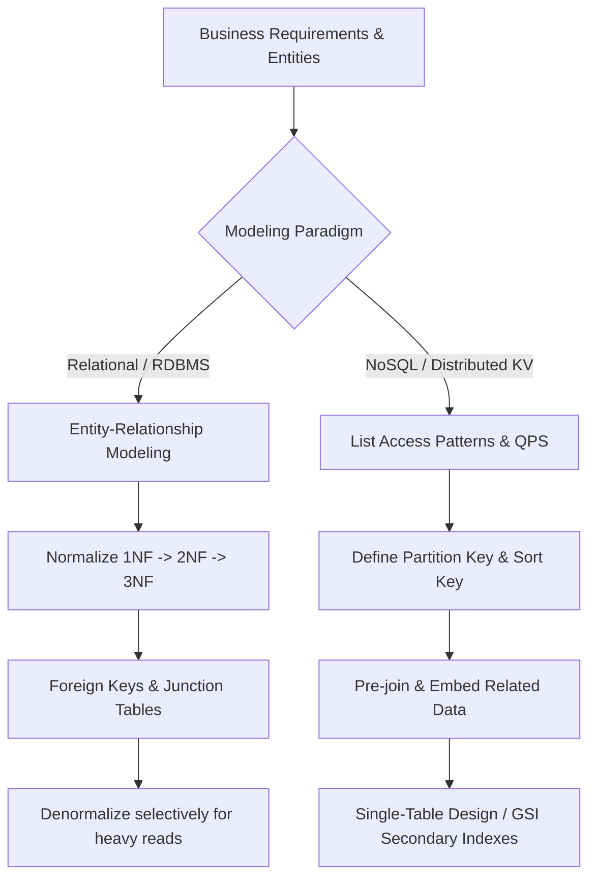

# Data Modeling & Schema Design

## Concept

- **Data Modeling** is the process of translating business entities and their interactions into an optimal physical database schema.
- In system design interviews, data modeling is **Step 4 of the 6-Step Framework**. A candidate who simply draws boxes without defining the data model cannot prove that their system can satisfy its functional requirements, read/write ratios, or consistency guarantees.
- The two dominant data modeling paradigms:
  1. **Relational / Entity-First Modeling (RDBMS - Schema-on-Write)**:
     - You model entities and relationships first (1:1, 1:N, M:N), normalize to eliminate redundancy, and let SQL query engines perform joins at read time.
     - Optimized for query flexibility, data integrity, and complex relational updates.
  2. **Access-Pattern-Driven Modeling (NoSQL - Schema-on-Read / Key-Value / Wide-Column)**:
     - You define all read and write queries *before* designing the schema. Data is denormalized and structured specifically so each critical query can be fulfilled in a single lookup without joins.
     - Optimized for predictable single-digit millisecond latency and horizontal scale.



## Relational Modeling: Normalization vs. Denormalization

### 1. Normalization (1NF to 3NF)
Normalization eliminates update, insertion, and deletion anomalies by organizing tables around single themes:
- **1NF (First Normal Form)**: Every column holds atomic, non-divisible values; no repeating groups or arrays.
- **2NF (Second Normal Form)**: Satisfies 1NF, and every non-key column depends on the *entire* primary key (eliminates partial key dependencies in composite keys).
- **3NF (Third Normal Form)**: Satisfies 2NF, and no non-key column depends on another non-key column (eliminates transitive dependencies: $A \rightarrow B \rightarrow C$).

**Benefits**: Zero data redundancy, minimal storage footprint, and atomic updates (you update a customer's address in one row, and it reflects everywhere instantly).

### 2. Denormalization (When and Why)
In high-scale systems, joining 5 normalized tables on 10,000 QPS causes severe disk I/O and latency spikes. **Denormalization** intentionally introduces duplicate data to speed up reads:
- **Pre-aggregating values**: Storing `like_count` or `order_total` directly on the parent row instead of running `SELECT COUNT(*)` on every fetch.
- **Duplicating parent fields**: Copying `author_name` directly into the `comments` table to avoid joining the `users` table during feed rendering.
- **Cost**: Introduces write-amplification (updating `author_name` requires updating millions of comment rows) and eventual consistency risks.

---

## Access-Pattern-Driven Modeling (NoSQL / Single-Table Design)

In distributed databases like DynamoDB, Cassandra, or ScyllaDB, joins do not scale across network partitions. You model strictly by access patterns:

### Primary Key Anatomy in Distributed Stores
- **Partition Key (Hash Key, PK)**: Determines which physical database node/shard stores the data via consistent hashing.
- **Sort Key (Range Key, SK)**: Organizes items physically in sorted order on disk within that partition. Allows range queries (`BETWEEN`, `>`, `<`).
- **Composite Primary Key**: `(Partition Key, Sort Key)`. Uniquely identifies an item and allows 1:N hierarchy modeling in a single partition.

### Single-Table Design Pattern
Instead of creating separate tables for Users, Orders, and Products, high-performance systems store multiple entity types in a **single table**, using generic overloaded partition and sort keys:

| Partition Key (PK) | Sort Key (SK) | Entity Type | Data Attributes |
|---|---|---|---|
| `USER#1001` | `PROFILE` | User | `name: "Alice", email: "alice@example.com"` |
| `USER#1001` | `ORDER#2026-08-01` | Order | `total: $120.00, status: "SHIPPED"` |
| `USER#1001` | `ORDER#2026-08-15` | Order | `total: $45.50, status: "PENDING"` |
| `ORDER#2026-08-15` | `ITEM#SKU99` | OrderItem | `product: "Keyboard", qty: 1, price: $45.50` |

**Why this is powerful**:
- Query: *"Get Alice's profile and all her recent orders"*:
  `SELECT * WHERE PK = 'USER#1001' AND SK BEGINS_WITH('ORDER#')`
  $\rightarrow$ Fetches the user profile and all orders in **a single indexed seek (sub-5ms)**, with zero relational joins.

---

## Worked Examples

### 1. E-Commerce Order & Line Items

**Normalized Relational (PostgreSQL)**:
```sql
CREATE TABLE orders (
    order_id UUID PRIMARY KEY,
    user_id UUID NOT NULL REFERENCES users(user_id),
    status VARCHAR(32) NOT NULL,
    total_amount NUMERIC(10, 2) NOT NULL,
    created_at TIMESTAMP WITH TIME ZONE DEFAULT NOW()
);

CREATE TABLE order_items (
    item_id UUID PRIMARY KEY,
    order_id UUID NOT NULL REFERENCES orders(order_id) ON DELETE CASCADE,
    product_id UUID NOT NULL REFERENCES products(product_id),
    quantity INT NOT NULL,
    unit_price NUMERIC(10, 2) NOT NULL
);
CREATE INDEX idx_orders_user_created ON orders(user_id, created_at DESC);
```

**Document Model (MongoDB)**:
When orders are immutable snapshots, embedding line items directly inside the order document eliminates joins completely:
```json
{
  "_id": "order_uuid_123",
  "user_id": "user_456",
  "status": "COMPLETED",
  "total_amount": 89.98,
  "items": [
    { "product_id": "prod_1", "name": "Wireless Mouse", "qty": 1, "price": 29.99 },
    { "product_id": "prod_2", "name": "Mechanical Keyboard", "qty": 1, "price": 59.99 }
  ],
  "created_at": "2026-09-01T10:00:00Z"
}
```

---

## Comparative Decision Matrix

| Dimension | Relational (Postgres/MySQL) | Document (MongoDB) | Wide-Column / Key-Value (Dynamo/Cassandra) |
|---|---|---|---|
| **Primary Driver** | Relationships & data integrity | Hierarchical / self-contained documents | Predictable ultra-high write/read throughput |
| **Join Support** | Native, full relational joins | Multi-document lookups (expensive) | No joins supported across partitions |
| **Schema Flexibility** | Rigid (Schema-on-write) | Flexible (Schema-on-read) | Strict partition key schema |
| **Scale Mechanism** | Vertical scale, read replicas, sharding | Sharding by shard key | Native consistent hashing across cluster |
| **Optimal Use Case** | Financial ledger, ERP, complex B2B | Product catalogs, CMS, user profiles | Time-series, IoT, massive clickstreams, shopping cart |

---

## Interview Framing

- In Step 4 of a system design interview, never write schema fields without explaining the access patterns first.
- Say: *"Our access patterns are: (1) Fetch user by ID, (2) Fetch the latest 20 tweets by user ID ordered by timestamp, and (3) Add a new tweet. Because query (2) is heavily read-dominant, I will design a composite key with `user_id` as the partition key and `created_at` as the sort key, allowing us to satisfy the query in a single sorted disk seek."*
- Proactively address the trade-off: *"I chose to denormalize `user_name` into the `tweets` table to avoid joining the `users` table on our 100,000 QPS read path, acknowledging that if a user updates their name, we accept eventual consistency via an asynchronous background job."*
