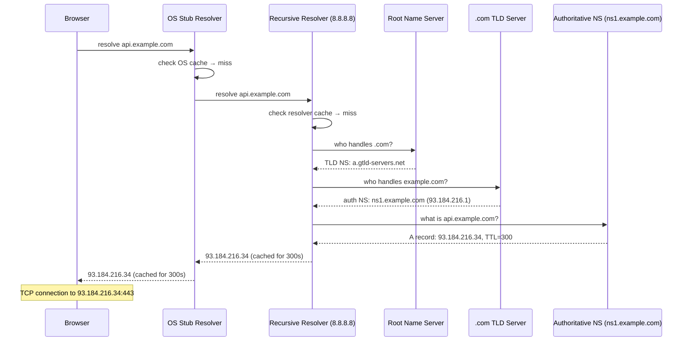
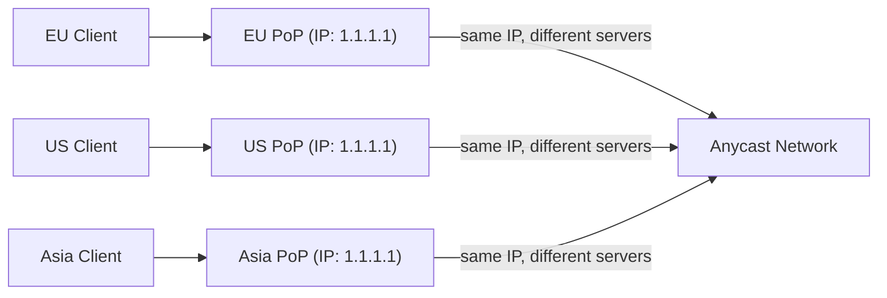

# DNS

## Concept

- **DNS** (Domain Name System) is the internet's phone book - it translates human-readable domain names (`api.example.com`) into machine-readable IP addresses (`93.184.216.34`) that routers can forward packets to.
- Every network connection starts with a DNS lookup. Before a browser can open a TCP connection to `api.example.com`, it must resolve the hostname to an IP address.
- DNS is a **distributed, hierarchical, cached** system - no single server holds all records. The hierarchy mirrors domain ownership: `com` delegates to `example.com` which delegates to `api.example.com`.
- DNS runs over **UDP port 53** by default (fast, no connection overhead). Large responses fall back to **TCP port 53**. Encrypted variants (DoH, DoT) use TCP 443 or TCP 853.

**Why DNS adds latency (and why it usually doesn't matter)**:
- An uncached DNS lookup can take 20-120 ms depending on the recursive resolver and geographic distance.
- After the first lookup, the answer is cached at multiple layers (OS, browser, resolver). Subsequent visits to the same domain incur ~0 ms DNS cost.
- This is why the first load of a page after clearing your browser cache feels slower.



## DNS Record Types: Complete Reference

| Record | Full Name | Purpose | Example |
| - | - | - | - |
| A | Address | IPv4 address for a hostname | `api.example.com → 93.184.216.34` |
| AAAA | IPv6 Address | IPv6 address for a hostname | `api.example.com → 2606:2800::1` |
| CNAME | Canonical Name | Alias - points to another hostname | `www.example.com → example.com` |
| MX | Mail Exchanger | Mail server for the domain, with priority | `example.com → 10 mail.example.com` |
| TXT | Text | Arbitrary text - used for SPF, DKIM, domain ownership | `example.com → "v=spf1 include:_spf.google.com ~all"` |
| NS | Name Server | Authoritative name servers for the domain | `example.com → ns1.cloudflare.com` |
| SOA | Start of Authority | Primary NS, contact, serial number, refresh intervals | One per zone |
| PTR | Pointer | Reverse DNS - IP address to hostname | `34.216.184.93.in-addr.arpa → api.example.com` |
| SRV | Service | Service location - protocol, port, hostname | `_https._tcp.example.com → 0 5 443 api.example.com` |
| CAA | Certificate Authority Authorization | Which CAs may issue certs for this domain | `example.com → 0 issue "letsencrypt.org"` |

### CNAME rules and gotchas

A CNAME cannot coexist with other record types at the same name. You can't have:
```
example.com  CNAME  myapp.heroku.com    ← INVALID at apex
example.com  MX     mail.example.com   ← MX would be ignored
```

This is the "CNAME at apex" problem. Solutions:
- Use **ALIAS** or **ANAME** records (Cloudflare, Route53) - these resolve like CNAME but are implemented as A/AAAA at the DNS level.
- Use your CDN's apex domain support.

### TTL: The Freshness Timer

Each DNS record has a TTL (Time To Live) in seconds. After the TTL expires, resolvers must re-query the authoritative server.

**Choosing TTL**:
- **Long TTL (3600-86400s)**: fewer queries, lower authoritative server load, cached longer in resolvers worldwide. Changes take hours to propagate.
- **Short TTL (30-300s)**: changes propagate in minutes. More queries. Use for records that change frequently or before planned migrations.

**TTL migration strategy**:
1. One week before the change, lower the TTL to 300 seconds.
2. Wait for all resolvers to pick up the new TTL (one full old-TTL period).
3. Make the record change.
4. The new record propagates globally within 5 minutes.
5. After the change is stable, raise the TTL back.

## How DNS Resolution Works: The Full Hierarchy

### The 13 root name servers

The DNS hierarchy starts at 13 root name server **clusters** (not individual machines):
```
a.root-servers.net through m.root-servers.net
```

Each "server" is actually hundreds of machines worldwide reached via **Anycast** routing. You reach the geographically nearest instance automatically. The root servers don't know every domain - they only know which servers are authoritative for each TLD.

### Recursive vs. iterative resolution

**From the client's perspective**: recursive. You ask and get a final answer.

**How the recursive resolver works**: iterative. It asks each nameserver in the hierarchy, gets a referral ("ask this server"), and follows the chain:

```
Resolver → Root: "Who has api.example.com?"
Root → Resolver: "I don't know, but .com is at a.gtld-servers.net"
Resolver → TLD: "Who has api.example.com?"
TLD → Resolver: "I don't know example.com, but ns1.example.com handles it"
Resolver → Auth: "What is api.example.com?"
Auth → Resolver: "It's 93.184.216.34 (TTL 300)"
Resolver → Client: "It's 93.184.216.34"
```

The resolver caches each step: if you next resolve `www.example.com`, the resolver already knows `ns1.example.com` handles `example.com` and skips straight to the authoritative query.

### Caching layers

1. **Browser DNS cache**: Chrome caches for 1 minute (or TTL, whichever is less). View at `chrome://net-internals/#dns`.
2. **OS stub resolver**: caches with the record's TTL. Clear with `ipconfig /flushdns` (Windows), `sudo systemd-resolve - flush-caches` (Linux), `sudo dscacheutil -flushcache` (macOS).
3. **Recursive resolver** (ISP's or 8.8.8.8): shared across millions of users. Popular domains have near-100% hit rate.
4. **Authoritative server**: the source of truth. Only queried on full cache misses.

## GeoDNS and Traffic Steering

GeoDNS returns different IP addresses based on where the query comes from, steering users to the nearest data center:

```
US user → dns.example.com → returns 52.86.1.1 (AWS us-east-1)
EU user → dns.example.com → returns 54.93.1.1 (AWS eu-west-1)
AP user → dns.example.com → returns 13.250.1.1 (AWS ap-southeast-1)
```

The authoritative server uses the **recursive resolver's IP** (not the end user's IP) to infer location. This is approximate - a user in Paris using Google's 8.8.8.8 appears to be in the US. **EDNS Client Subnet (ECS)** extension allows resolvers to pass the client's /24 subnet to the authoritative server for more accurate geolocation.

### Health-check-based failover

Route 53, Cloudflare, and other DNS providers continuously health-check your endpoints. If a data center becomes unhealthy:
1. Health check detects the failure (typically within 30 seconds).
2. The provider removes the unhealthy IP from the DNS response.
3. After the TTL of cached records expires, clients are routed around the failure.

**Gotcha**: the failover isn't instant. If your TTL is 300 seconds and a server fails, users cached to that IP can fail for up to 5 minutes. Lower your TTL for critical records.

## Anycast DNS

Anycast assigns the **same IP address** to many servers in different locations. BGP routing ensures each query reaches the nearest server:



Cloudflare's 1.1.1.1 resolves in ~14 ms worldwide using Anycast. Authoritative servers also use Anycast for DDoS resilience - an attack floods the nearest PoP, while other PoPs continue serving normally.

## DNS Security

### DNS spoofing / cache poisoning

An attacker sends forged DNS responses to a resolver, poisoning its cache with a malicious IP. The resolver then sends legitimate users to the attacker's server. Classic attack: redirect `bank.example.com` to a phishing site.

**DNSSEC** (DNS Security Extensions) prevents this by signing all DNS records with asymmetric cryptography. The resolver verifies the signature chain from the root to the queried record. If any signature is invalid, the response is rejected.

DNSSEC does **not** encrypt queries - it only provides integrity and authenticity. A network observer can still see which domains you're resolving.

### DNS over HTTPS (DoH) and DNS over TLS (DoT)

Standard DNS is plaintext UDP. Network intermediaries (ISPs, government filters, attackers) can read and modify queries.

**DoT** (RFC 7858): DNS over TCP/853 with TLS. Encrypted and authenticated. ISPs can't read the domain you're looking up.

**DoH** (RFC 8484): DNS queries embedded in HTTPS over port 443. Indistinguishable from regular HTTPS traffic - even an ISP monitoring all DNS traffic can't block it without blocking all HTTPS. Used by default in Firefox (Cloudflare's 1.1.1.1 by default), Chrome, and Windows 11.

**Trade-off**: ISPs use DNS queries for content filtering, parental controls, and network diagnostics. DoH bypasses these by moving resolution to a third-party resolver. Organisations that need to enforce DNS-based policies (corporate networks) must configure DoH with their own resolver.

### DNS amplification attacks

DNS is a common amplification vector for DDoS. A spoofed UDP query (40 bytes) can elicit a DNS response of 3000+ bytes - a 75x amplification factor. The attacker sends queries from spoofed source IPs; the DNS server sends large responses to the victim.

Mitigation: DNS servers should implement **Response Rate Limiting (RRL)** and use **Anycast** to spread attack traffic across PoPs.

## Split-Horizon DNS

The same domain name returns different IP addresses depending on whether the query comes from inside or outside a private network:

```
Internal query (10.0.0.0/8): api.example.com → 10.0.1.5 (private IP, no TLS overhead)
External query:               api.example.com → 93.184.216.34 (public IP, full TLS)
```

Implementation: run an internal DNS resolver that has authoritative records for private hostnames. Corporate VPNs, AWS Route 53 Private Hosted Zones, and Kubernetes CoreDNS all use this pattern.

## DNS in System Design

### Latency contribution

| DNS state | Latency added |
| - | - |
| OS cache hit | ~0 ms |
| Browser cache hit | ~0 ms |
| Recursive resolver cache hit | ~1-5 ms |
| Full recursive resolution (same continent) | ~20-50 ms |
| Full recursive resolution (cross-continent) | ~50-150 ms |

### DNS pre-fetching (browser optimization)

```html
<link rel="dns-prefetch" href="https://api.example.com">
<link rel="preconnect" href="https://fonts.googleapis.com">
```

`dns-prefetch`: resolve the hostname in the background before the resource is needed.
`preconnect`: resolve + TCP connect + TLS handshake in the background. Use for critical third-party origins (analytics, fonts, API).

### Interview pattern: designing global routing

When designing a globally distributed system, DNS is how you direct users to the right region:
1. **GeoDNS** with health checks: Route53, Cloudflare, Akamai.
2. **Anycast** for stateless services (DNS, CDN edge nodes).
3. **Low TTL** (60-300s) on records that participate in failover.
4. **High TTL** (3600-86400s) on stable records to reduce resolver load.
