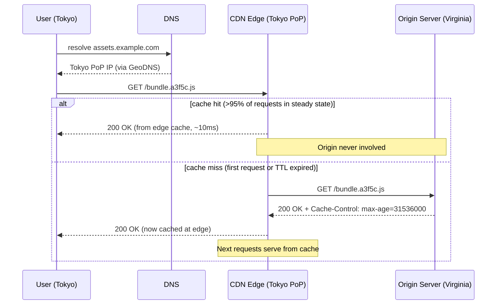
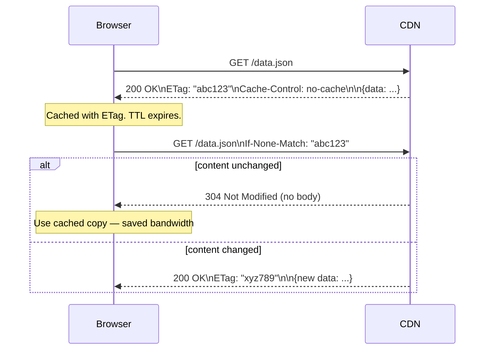
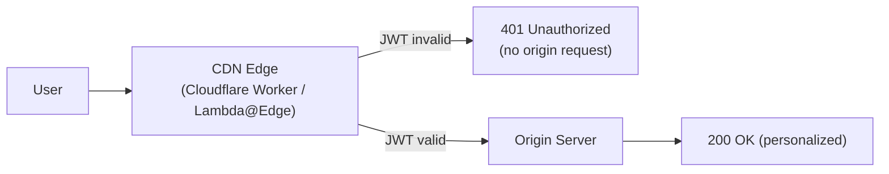
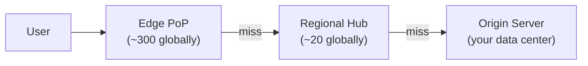

# CDN

## Concept

- A **CDN** (Content Delivery Network) is a globally distributed network of servers — called **edge nodes** or **Points of Presence (PoPs)** — that cache and serve content close to end users.
- The core insight: most web content is **read-heavy and identical across users**. A JavaScript bundle, a product image, or a public API response is the same for every user. There's no reason every request should travel to a single origin server in Virginia when the user is in Tokyo.
- Without CDN: user in Tokyo fetching assets hosted in Virginia → ~150 ms round-trip latency per resource, every load, forever.
- With CDN: user in Tokyo fetching from Tokyo PoP → ~5–20 ms round-trip. The PoP fetches from origin once and serves the cached copy to millions of users.
- CDNs are not just for static assets. They handle TLS termination, DDoS mitigation, Web Application Firewalls (WAF), edge compute, load balancing, and bot management.

**Analogy**: a CDN is like a chain of local warehouses for an e-commerce company. Instead of shipping every order from one central warehouse in another country, you pre-stock popular items in warehouses near your customers. Local delivery is fast; the central warehouse only ships when a local one runs out.



## How CDN Caching Works

### The cache key

The cache key determines which requests share a cached response. Two requests with the same cache key return the same cached content.

**Default cache key**: `scheme + host + path + query string`

```
https://cdn.example.com/api/products?category=electronics  →  one cache entry
https://cdn.example.com/api/products?category=clothing     →  different cache entry
```

**Extending the cache key**: the `Vary` response header adds more dimensions to the key:

```
Vary: Accept-Encoding
```

This tells the CDN to store separate cached copies for each encoding — a gzip response and a Brotli response won't be served interchangeably. A CDN will see `Accept-Encoding: gzip` and `Accept-Encoding: br` as different cache keys.

**Gotcha**: `Vary: Cookie` or `Vary: Authorization` effectively disables CDN caching — every user has different cookies/tokens → every user gets their own cache entry → 0% hit rate. For auth-protected content, set `Cache-Control: private` to prevent CDN caching entirely.

### Cache-Control directives

HTTP `Cache-Control` (topic 2) controls both browser and CDN caching:

| Directive | Browser | CDN | Notes |
|---|---|---|---|
| `max-age=N` | Cache N seconds | Cache N seconds | Both browser and shared caches |
| `s-maxage=N` | Ignored | Cache N seconds | CDN-only override; takes priority over max-age for CDNs |
| `public` | Cacheable | Cacheable | Explicit (default for 200 responses with max-age) |
| `private` | Cacheable | Do NOT cache | For user-specific responses |
| `no-cache` | Cache but revalidate | Cache but revalidate | Must check ETag/Last-Modified before serving |
| `no-store` | Do NOT cache | Do NOT cache | Sensitive data (auth tokens, medical records) |
| `immutable` | Never revalidate during max-age | Honour same | Used with fingerprinted URLs |
| `stale-while-revalidate=N` | Serve stale for N sec while refreshing | Same | Great UX pattern — no wait on refresh |
| `stale-if-error=N` | Serve stale for N sec if origin errors | Same | Resilience during origin outages |

### Cache-Control in practice

**Static assets with fingerprinted URLs** (best practice):
```
/static/app.a3f5c.js
Cache-Control: public, max-age=31536000, immutable
```
The URL changes on every deploy (Webpack/Vite add a content hash). Old URLs can be cached forever. New URLs are always fresh. No cache invalidation needed.

**API responses that are public and update periodically** (product catalog):
```
Cache-Control: public, s-maxage=60, stale-while-revalidate=300
```
CDN caches for 60 seconds. Serves stale for 5 minutes while refreshing in the background. Users see at most 1-minute-old data, but zero latency on stale serving.

**User-specific data** (user profile, order list):
```
Cache-Control: private, no-store
```
Browser may cache, CDN must not. Every user's response is unique.

**Sensitive data** (payment confirmation, auth tokens):
```
Cache-Control: no-store
```
Nothing caches it anywhere.

### ETags and conditional requests

Even with caching, sometimes you need to check if content changed. ETags avoid re-downloading unchanged content:



## Pull CDN vs. Push CDN

### Pull CDN (most common)

- CDN fetches content from origin **on the first miss**.
- No pre-configuration needed per asset.
- Origin URL is "behind" the CDN URL.

```
cdn.example.com/logo.png  →  CDN fetches from  →  origin.example.com/logo.png
```

Workflow:
1. First user requests `/logo.png` → CDN misses → fetches from origin → stores → serves.
2. All subsequent users → CDN hits → origin never involved.

**Cold start problem**: the first user after cache expiry pays origin latency. Solutions:
- Set long TTLs for stable content.
- Pre-warm the cache with a deploy script that requests all assets after deployment.
- Use `stale-while-revalidate` so stale is served while origin is re-fetched in the background.

### Push CDN

- You **upload** assets to the CDN's storage.
- Assets are pre-loaded at edge nodes worldwide before any user requests them.
- All users get cache hits from the first request.

When to use push CDN:
- Large binary files: game patches, software installers, video files.
- Predictable launches: "5 million users will request this file at 9am."
- Compliance: you need explicit control over exactly what's at the edge.

Downside: manual deployment step. Every new version must be pushed explicitly. Pull CDN manages this automatically via origin fetch.

## TLS Termination at the Edge

Without CDN:
```
User → [TLS handshake to Virginia] → [150ms RTT for handshake] → [HTTP request]
```
TLS 1.3 is 1 RTT. That's 150ms just for the handshake before the first byte of data.

With CDN:
```
User → [TLS handshake to Tokyo PoP] → [10ms RTT for handshake] → [HTTP request]
```
TLS termination happens at the nearest PoP. Even for 100% dynamic content that can't be cached, the CDN saves ~140ms per connection by terminating TLS close to the user.

The CDN then opens a separate long-lived (or pre-warmed) connection from the PoP to the origin. This connection already has TLS established and doesn't incur handshake cost on every request.

## CDN for APIs (Dynamic Content)

CDNs aren't just for static files. Apply them to APIs:

### Public, cacheable API responses

Product listings, public event schedules, exchange rates — same for all users:
```
GET /api/v1/products
Cache-Control: public, s-maxage=60, stale-while-revalidate=300
Vary: Accept-Encoding
```
CDN caches for 60 seconds. At 10,000 req/s, this means ~599,940 requests served from edge and only 1 per minute hitting origin. 99.998% cache hit rate.

### Edge compute for auth

For auth-protected APIs, you can't cache responses. But you can run authentication logic at the edge:



The edge worker validates the JWT (cryptographic verification, no database needed), adds user context as a header, and forwards only authenticated requests to origin. Invalid requests are rejected at the edge — reducing origin load and improving security.

## Cache Invalidation

The hardest part of CDN management. "Cache invalidation is one of the two hard problems in computer science."

### Purge by URL

Immediately invalidate specific cached objects:
```
POST https://api.cloudflare.com/client/v4/zones/{zone}/purge_cache
{"files": ["https://cdn.example.com/api/products?id=42"]}
```

Propagation: 1–30 seconds to reach all edge nodes worldwide.

### Purge by tag (surrogate keys)

Tag cached responses with metadata:
```
Cache-Tag: product-42, category-electronics
```

Then purge all pages containing a product:
```
POST /purge_cache
{"tags": ["product-42"]}
```

This purges every cached URL tagged `product-42` — the product page, any listing that includes it, any API response that contains it.

### Versioned URLs (best strategy)

Avoid invalidation entirely by encoding content version in the URL:
```
/static/app.a3f5c.js   ← build 1
/static/app.9d2e7.js   ← build 2
```
Old URLs cached forever. New URLs always miss on first request. No invalidation needed. No propagation delay. Zero risk of serving stale content.

## CDN Architecture and Tiering

Large CDNs like Cloudflare, Akamai, and Fastly use a **tiered caching** architecture:



- Edge PoPs are small, numerous, and geographically close to users.
- If an edge PoP misses, it queries a regional hub before going to origin.
- The regional hub is fewer in number but larger in cache capacity.
- This "shield" configuration dramatically reduces origin traffic: only one request per region reaches origin, not one per PoP.

**Origin shield** (Cloudflare Argo Shield, Fastly Shielding, CloudFront Origin Shield): collapses all CDN-to-origin traffic through a single PoP. Your origin server handles traffic proportional to your number of regions, not your number of CDN edge nodes.

## DDoS Protection at the Edge

CDN edge nodes are the first line of defence against volumetric attacks:
- Cloudflare's network capacity: 280+ Tbps. The largest recorded DDoS attack (2023): 71 Mpps. CDN absorbs it.
- Traffic scrubbing: the CDN identifies attack traffic (rate anomalies, fingerprints) and drops it at the edge.
- Bot detection: browser challenge pages, JavaScript challenges, and fingerprinting identify bot traffic.
- The origin server only sees clean traffic that passed CDN inspection.

## Common Mistakes in System Design

**Mistake 1: Caching authenticated responses**
Setting `Cache-Control: public, max-age=3600` on an endpoint that uses `Authorization: Bearer` headers. Every user's personal data is now cached and served to other users. Always use `Cache-Control: private` for authenticated responses.

**Mistake 2: Long TTL without fingerprinted URLs**
Setting `max-age=86400` on `/app.js`. After deploying a bug fix, users are stuck with the cached broken version for 24 hours. Either use fingerprinted URLs + immutable, or use short TTL + cache-busting on deploy.

**Mistake 3: Not setting Vary: Accept-Encoding**
Your origin serves gzip or Brotli based on `Accept-Encoding`. Without `Vary: Accept-Encoding`, the CDN might serve a gzip response to a client that only accepts Brotli (or vice versa). Always set `Vary: Accept-Encoding` when serving compressed content.

**Mistake 4: Forgetting the CDN in latency calculations**
In system design interviews, when calculating API latency, account for CDN TLS termination. A 150ms base RTT to your origin becomes 10ms when TLS terminates at a nearby CDN PoP.
