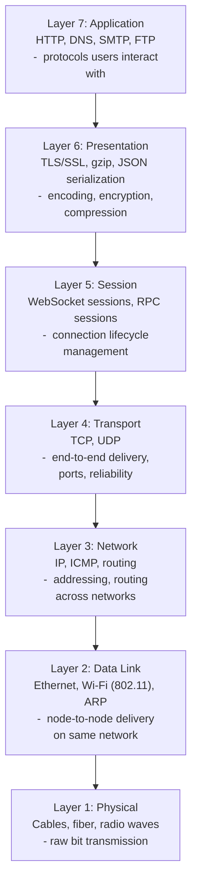
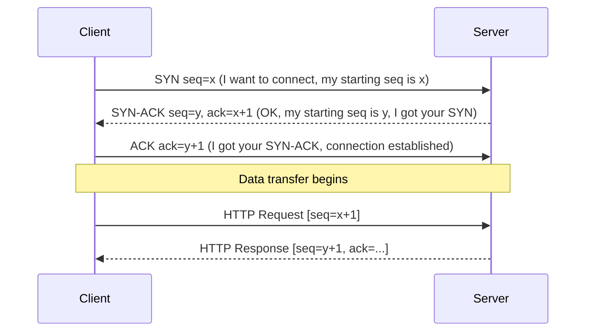
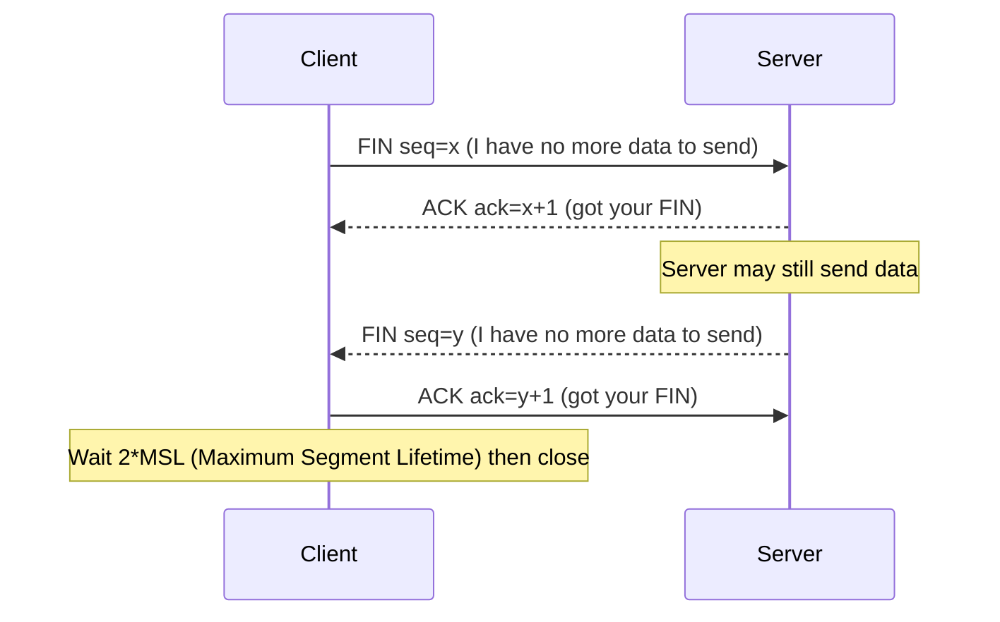
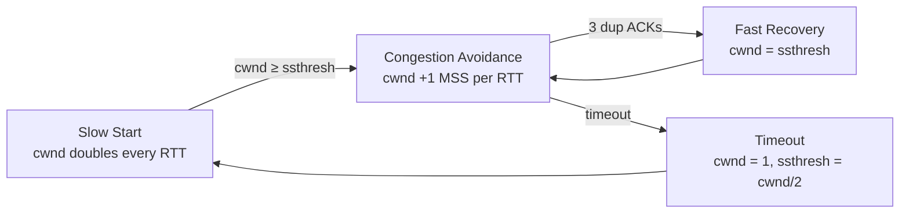
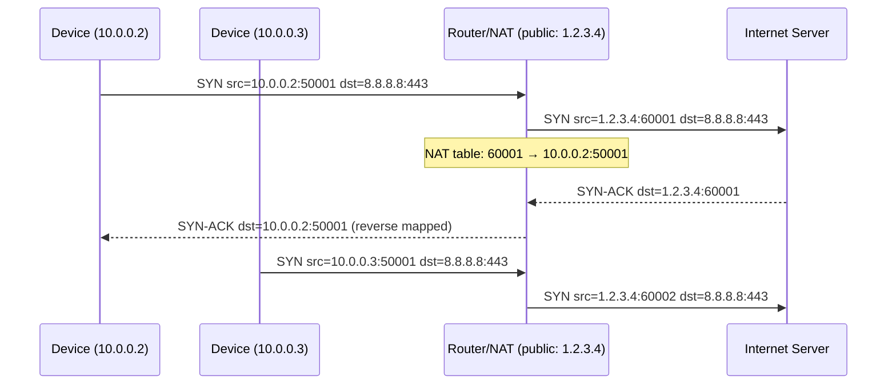
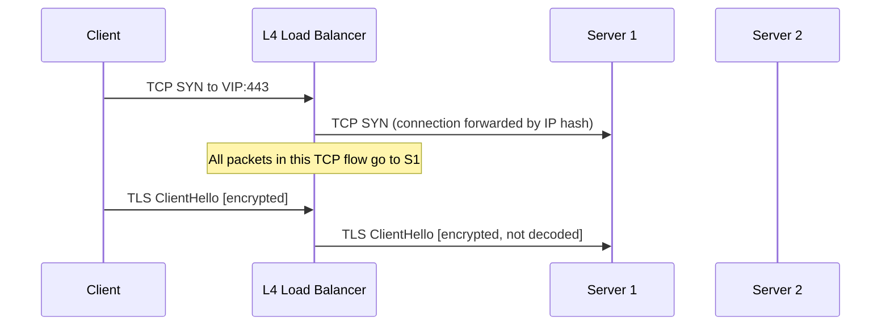
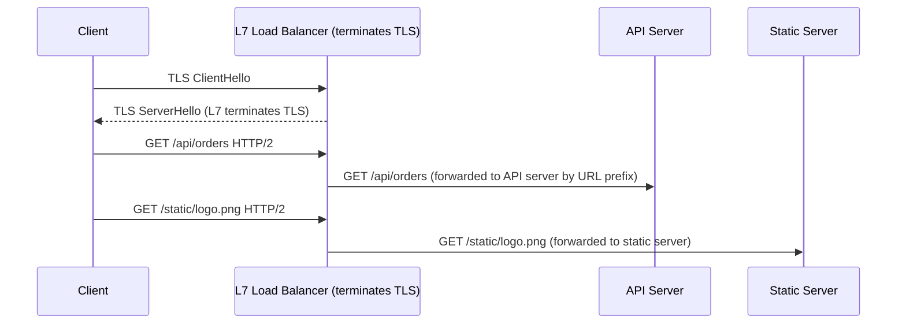

# OSI Model and Networking

## Concept

- The **OSI model** (Open Systems Interconnection) divides network communication into 7 abstraction layers. Each layer uses services from the layer below and provides services to the layer above. Developed by ISO in 1984 as a conceptual framework.
- In practice, the **TCP/IP model** (4 layers) is what the internet actually implements. The OSI model is used for education and debugging; TCP/IP is the real thing.
- Understanding layers matters for system design because network problems are layer-specific:
  - "Packets are dropping" → layer 1/2 (physical/data link) issue
  - "Wrong routing" → layer 3 (network/IP) issue
  - "Port unreachable" → layer 4 (transport/TCP) issue
  - "HTTP 502 Bad Gateway" → layer 7 (application) issue

**Analogy**: shipping a package internationally. Layer 7 is you writing the letter (content). Layer 4 is the envelope (delivery guarantee). Layer 3 is the postal routing system (which country → which city). Layer 2 is the delivery truck (local delivery within a city). Layer 1 is the road itself (physical infrastructure).



## Layer by Layer: Real Protocols and What They Do

### Layer 1: Physical

Transmits raw bits (0s and 1s) as electrical signals, light pulses (fiber), or radio waves (Wi-Fi).

- **Ethernet (copper)**: electrical voltage levels represent 0/1.
- **Fiber optic**: light pulses represent 0/1. Speeds up to 400 Gbps, negligible attenuation over thousands of km.
- **Wi-Fi (802.11)**: radio frequencies. 2.4 GHz (longer range, more interference), 5 GHz (shorter range, faster), 6 GHz (Wi-Fi 6E, minimal interference).

Layer 1 is why distance matters: light travels ~200,000 km/s in fiber (2/3 of c). London to New York (~5500 km) = minimum ~27.5 ms one-way propagation delay. No software optimisation can beat physics.

### Layer 2: Data Link

Handles **node-to-node delivery** on the same local network (LAN). Uses **MAC addresses** (48-bit hardware addresses, e.g., `00:1A:2B:3C:4D:5E`).

- **Ethernet frame**: preamble, destination MAC, source MAC, EtherType, payload, CRC.
- **ARP** (Address Resolution Protocol): maps IP addresses to MAC addresses. "Who has 192.168.1.1? Tell 192.168.1.5." The owner responds with its MAC address.
- **Switches** operate at layer 2: they learn which MAC addresses are on which port and forward frames only to the correct port (unlike hubs which broadcast to all ports).

### Layer 3: Network (IP)

Handles **host-to-host delivery across multiple networks**. Uses **IP addresses** (logical addresses, assigned by configuration, not hardware).

- **IPv4**: 32-bit address, ~4.3 billion total. Exhausted. NAT and IPv6 are the responses.
- **IPv6**: 128-bit address. `2001:0db8:85a3::8a2e:0370:7334`. 3.4 × 10³⁸ addresses. Enough for every grain of sand on Earth to have its own IP.
- **Routers** operate at layer 3: they read the destination IP, look it up in a routing table, and forward the packet toward the destination.

**IP is unreliable**: no guarantee of delivery, ordering, or duplicate prevention. That's TCP's job.

### Layer 4: Transport

Handles **process-to-process delivery** using ports. A server at 93.184.216.34 might run a web server (port 443), SSH (port 22), and a database (port 5432) simultaneously. Ports distinguish which process gets each packet.

Two dominant protocols: **TCP** and **UDP**.

### Layer 7: Application

The protocol the application uses. HTTP (topic 2), DNS (topic 4), SMTP (email), FTP (file transfer), etc. This is the only layer most application developers care about day-to-day.

## TCP: The Reliable Transport

### Three-way handshake

TCP establishes a connection before any data is sent. This costs exactly **1 RTT**:



SYN stands for "synchronise sequence numbers." Both sides pick random initial sequence numbers to prevent stale packet confusion with previous connections.

### Four-way termination

TCP closes gracefully - both sides signal they're done:



**TIME_WAIT state**: after sending the final ACK, the client waits 2 × MSL (typically 60-120 seconds) to handle delayed duplicates. A server with thousands of connections closing per second can exhaust ephemeral ports waiting in TIME_WAIT. Solution: enable `SO_REUSEADDR` or `SO_REUSEPORT`.

### TCP reliability mechanisms

**Sequence numbers**: every byte in the stream has a sequence number. The receiver sends ACKs confirming bytes received. The sender retransmits unacknowledged segments after a timeout.

**Retransmission timeout (RTO)**: if an ACK isn't received in time, the segment is retransmitted. RTO is estimated dynamically based on measured RTT. Starts conservative (1 second), doubles on each timeout (exponential backoff).

**Fast retransmit**: if the receiver gets an out-of-order segment, it immediately sends a duplicate ACK. After 3 duplicate ACKs, the sender retransmits the missing segment without waiting for RTO.

### Flow control

TCP prevents a fast sender from overwhelming a slow receiver. The receiver advertises a **receive window** (rwnd) - how many bytes it can buffer. The sender must not have more unacknowledged bytes in flight than the window:

```
Bytes in flight ≤ min(cwnd, rwnd)
```

where `cwnd` is the congestion window (set by congestion control, below).

### Congestion control

Flow control prevents overwhelming the receiver. Congestion control prevents overwhelming the **network**.

**Slow start**: Begin with cwnd = 1 MSS (Maximum Segment Size, typically 1460 bytes). Double cwnd every RTT until packet loss occurs. This probes available bandwidth exponentially.

**Congestion avoidance**: after reaching a threshold (ssthresh), increase cwnd by 1 MSS per RTT (linear) instead of doubling.

**Congestion detection**: traditionally, packet loss signals congestion (TCP Reno, CUBIC). Modern BBR (Bottleneck Bandwidth and RTT) uses bandwidth measurements instead - better for long-distance, high-bandwidth links.



**Impact on latency**: on a fresh TCP connection, slow start means the first few RTTs use only a fraction of available bandwidth. HTTP/2 multiplexing over one connection avoids opening many new connections and suffering slow start repeatedly.

### Keep-alive

A TCP connection stays open even if no data is sent. HTTP/1.1 `Connection: keep-alive` reuses the TCP connection for subsequent requests, avoiding the handshake cost. HTTP/2 and HTTP/3 always reuse connections.

TCP keep-alive probes (separate from HTTP keep-alive) detect and close dead connections at the OS level, freeing sockets.

## UDP: The Fast Transport

UDP has no connection state, no handshake, no retransmits, no ordering:

| | TCP | UDP |
| - | - | - |
| Connection | Established (3-way handshake) | Connectionless |
| Reliability | Guaranteed delivery | Best-effort |
| Ordering | Strict in-order delivery | No ordering guarantee |
| Error detection | CRC + retransmit | CRC only (no retransmit) |
| Latency | +1 RTT for handshake, +RTT for retransmits | Zero overhead |
| Use cases | HTTP, databases, SSH, email | DNS, gaming, VoIP, QUIC |

**Why UDP for games and VoIP?** A retransmitted packet from 200ms ago is useless in a real-time game - you want the current position, not a stale one. Applications implement their own error handling: games interpolate missing positions; VoIP codecs handle packet loss with concealment.

## IP Addressing: Deep Dive

### IPv4 address structure

An IPv4 address is 32 bits, written in dotted-decimal notation: `192.168.1.42`.

```
192    .168    .1      .42
11000000.10101000.00000001.00101010
```

A **subnet mask** (or CIDR prefix) determines which bits identify the network vs. the host:
```
192.168.1.0/24
└────────────────┘ first 24 bits = network address
                └─ last 8 bits = host address (256 hosts: .0 through .255)
```

| CIDR | Subnet Mask | Hosts Available |
| - | - | - |
| /8 | 255.0.0.0 | ~16.7 million |
| /16 | 255.255.0.0 | ~65,534 |
| /24 | 255.255.255.0 | 254 |
| /28 | 255.255.255.240 | 14 |
| /30 | 255.255.255.252 | 2 (point-to-point link) |

### Private address ranges (RFC 1918)

Not routable on the public internet - only within private networks:
- `10.0.0.0/8` - 10.x.x.x (used by large organisations)
- `172.16.0.0/12` - 172.16.x.x to 172.31.x.x (used by Docker)
- `192.168.0.0/16` - 192.168.x.x (home networks)

### NAT: Network Address Translation

NAT allows many devices on a private network to share one public IP address:



**NAT limitations**:
- Inbound connections are impossible without port forwarding - NAT doesn't know which internal host to deliver to.
- This is why P2P applications (WebRTC, online games) need **STUN/TURN servers** for NAT traversal (hole punching).
- QUIC (topic 3) uses Connection IDs to survive NAT rebinding (your public port changing when the NAT table entry expires).

## Load Balancers: Layer 4 vs Layer 7

Understanding OSI layers directly informs how load balancers work:

### Layer 4 load balancer (TCP/UDP)

Operates at the transport layer. Routes connections based on IP address and TCP/UDP port only. Does not read HTTP headers or URLs.



- **Does not terminate TLS**: the encrypted payload passes through unchanged.
- **Cannot route by URL**: doesn't inspect HTTP layer.
- **Very fast**: minimal processing, often implemented in kernel (Linux IPVS, eBPF XDP).
- **Use case**: routing TCP traffic, database connection routing, non-HTTP protocols.

### Layer 7 load balancer (Application)

Operates at the application layer. Reads and processes HTTP headers, URLs, and cookies.



- **Terminates TLS**: decrypts traffic to read headers.
- **Content-based routing**: route `/api/*` to API servers, `/static/*` to CDN origin.
- **Header manipulation**: inject `X-Forwarded-For`, `X-Request-ID`, strip internal headers.
- **Rate limiting, WAF**: applies rules before reaching application servers.
- **Health checks**: inspects HTTP responses, not just TCP connections.
- **Examples**: AWS ALB, nginx, HAProxy, Envoy, Caddy.

**Cost**: more CPU than L4 (decrypts every request). Still very fast - Envoy handles millions of requests/second on commodity hardware.

## Ports: Quick Reference

Well-known ports (IANA assigned, requires root/admin to bind):

| Port | Protocol | Service |
| - | - | - |
| 22 | TCP | SSH |
| 25 | TCP | SMTP (email submission) |
| 53 | TCP/UDP | DNS |
| 80 | TCP | HTTP |
| 443 | TCP/UDP | HTTPS (TCP for HTTP/1.1/2, UDP for HTTP/3) |
| 3306 | TCP | MySQL |
| 5432 | TCP | PostgreSQL |
| 6379 | TCP | Redis |
| 27017 | TCP | MongoDB |
| 2181 | TCP | ZooKeeper |
| 9092 | TCP | Kafka |

Ephemeral ports (49152-65535): dynamically assigned by the OS for outbound client connections.

## Common Networking Problems and Diagnostics

| Problem | Layer | Tool |
| - | - | - |
| Physical link down | L1 | `ping`, `ethtool` |
| Wrong MAC, ARP failure | L2 | `arp -a`, `arping` |
| Can't reach IP, routing issue | L3 | `traceroute`, `ip route` |
| Port blocked, firewall | L4 | `telnet host port`, `nc -zv host port` |
| DNS resolution failure | L7 | `nslookup`, `dig +trace` |
| HTTP error responses | L7 | `curl -v`, browser DevTools |

**traceroute** shows the path a packet takes:
```
traceroute api.example.com
 1  192.168.1.1 (gateway)        1.2 ms
 2  10.0.0.1 (ISP edge)          5.4 ms
 3  ...
12  93.184.216.34 (destination) 25.6 ms
```
High latency at hop N = bottleneck at that router. `* * *` = router doesn't respond to ICMP (not necessarily a problem).
