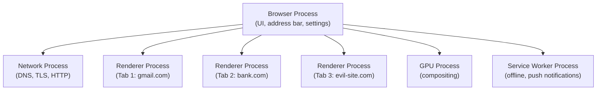
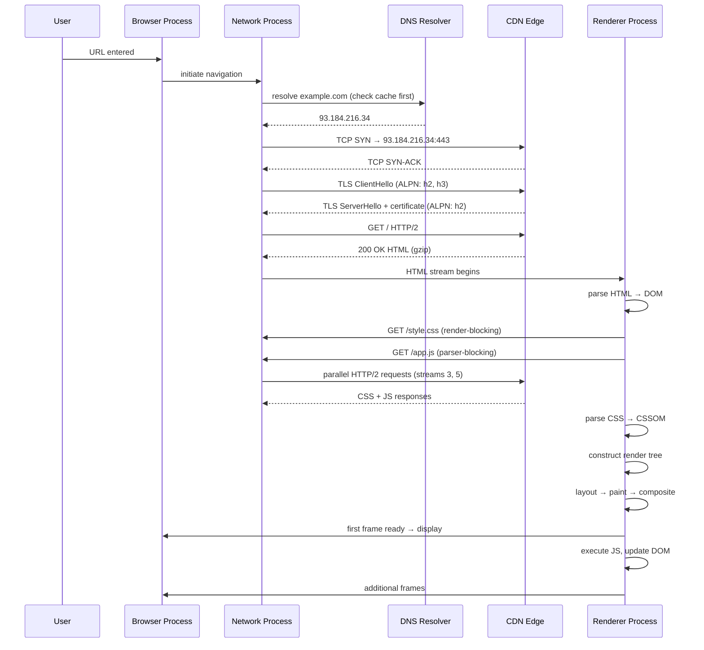
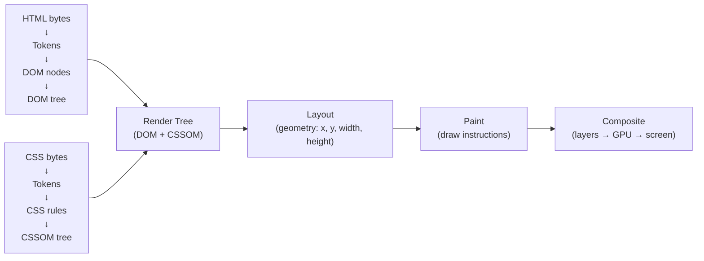
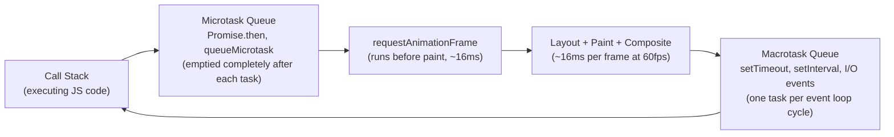
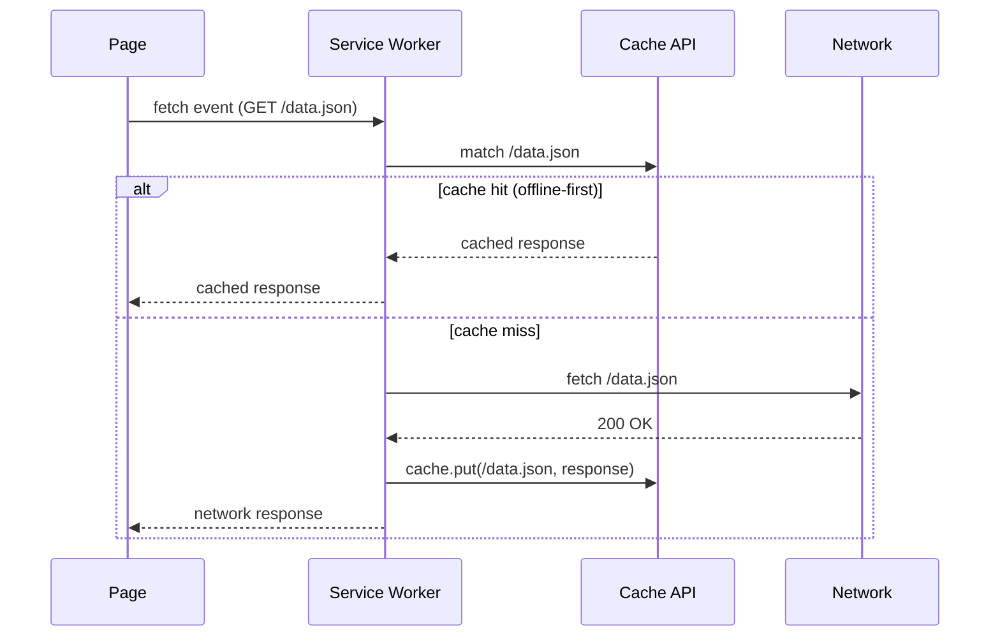

# Browser Architecture

## Concept

- A browser is a client (topic 1) that fetches resources over HTTP/HTTPS (topic 2), resolves names via DNS (topic 4), receives assets from CDN edge nodes (topic 5), and renders them into an interactive visual experience.
- Modern browsers are among the most complex software ever built - they handle sandboxed execution of arbitrary code (JavaScript), GPU-accelerated rendering, network request multiplexing, and security isolation, all while maintaining 60 fps.
- Understanding browser internals helps you write faster front-ends, diagnose performance problems, understand security models, and answer "what happens when you type a URL?" in interviews.

**Major browser engines**:
| Browser | HTML/CSS Engine | JavaScript Engine |
| - | - | - |
| Chrome, Edge | Blink | V8 |
| Firefox | Gecko | SpiderMonkey |
| Safari | WebKit | JavaScriptCore (Nitro) |

## Multi-Process Architecture

Modern browsers run **each tab in an isolated process** (Site Isolation). This is not an accident - it's a deliberate security architecture:



Benefits:
- **Crash isolation**: a crash in Tab 3 doesn't crash Tab 1 or Tab 2.
- **Security**: an iframe from `evil.com` embedded in your `bank.com` tab runs in a separate process with OS-level memory isolation. Even a renderer process compromise (via JavaScript exploit) can't read another origin's memory (Spectre/Meltdown mitigations).
- **Performance**: renderer processes run on separate cores, and can be killed when tabs are backgrounded to reclaim memory.

Cost: each process has OS overhead (memory, IPC). Opening 30 tabs means ~30 renderer processes. This is why browsers are memory-hungry.

## The Full Navigation Flow

When a user types a URL and presses Enter:



### Each step's latency contribution

| Step | Typical latency | Optimization |
| - | - | - |
| DNS lookup (uncached) | 20-150 ms | `dns-prefetch`, local DNS cache |
| DNS lookup (cached) | 0-1 ms | - |
| TCP handshake | 1 RTT (~50 ms cross-continent) | Connection pooling, QUIC |
| TLS handshake | 1 RTT (TLS 1.3) | Session resumption, 0-RTT |
| Server processing | 1-500 ms | Backend optimization |
| HTML transfer | depends on size + bandwidth | Compression, HTTP/2 |
| CSS parsing | < 10 ms typical | Reduce CSS size |
| JS parse + compile | 50-300 ms for large bundles | Code splitting, lazy loading |
| Layout | < 5 ms for simple pages | Reduce layout triggers |
| Paint + composite | < 16 ms (to hit 60 fps) | GPU compositing |

## Critical Rendering Path

The CRP is the sequence of steps the browser must complete before the first pixel is drawn.



### DOM construction

1. Browser receives HTML bytes.
2. Bytes decoded to characters per `charset` declaration.
3. Tokeniser converts characters to tokens: `<html>`, `<head>`, text nodes, etc.
4. Tokens form DOM nodes.
5. Nodes linked into the DOM tree based on nesting.

Incremental: the browser starts parsing and rendering before the full HTML is downloaded. That's why putting `<script>` tags at the end of `<body>` matters - scripts in `<head>` block parsing.

### CSSOM construction

CSS is **render-blocking**: the browser won't render anything until all CSS referenced in `<head>` is downloaded and parsed into the CSSOM. Why? Without CSS, the browser would render a flash of unstyled content, then re-render - a visible flicker.

**Implication**: minimise CSS that's in the critical path. Inline critical CSS for above-the-fold content. Use `media` attributes to mark non-critical CSS:
```html
<link rel="stylesheet" href="print.css" media="print"> <!-- non-blocking! -->
<link rel="stylesheet" href="desktop.css" media="(min-width: 900px)"> <!-- non-blocking on mobile -->
```

### JavaScript is parser-blocking

A `<script>` tag without `async` or `defer` **pauses HTML parsing** while the script downloads and executes. The browser must pause because JS might call `document.write()` which inserts HTML into the document.

```html
<!-- BAD: blocks parsing, must download + execute before parsing continues -->
<head>
  <script src="/analytics.js"></script>
</head>

<!-- GOOD: defer downloads in parallel, executes after DOM is ready -->
<head>
  <script src="/analytics.js" defer></script>
</head>

<!-- GOOD: async downloads in parallel, executes immediately when ready (no ordering guarantee) -->
<head>
  <script src="/analytics.js" async></script>
</head>
```

| | Download | Execute | Ordering |
| - | - | - | - |
| `<script>` | Blocks parsing | Immediately | Sequential |
| `async` | Parallel with parsing | On download complete | No guarantee |
| `defer` | Parallel with parsing | After DOM ready, before DOMContentLoaded | Document order |

Use `defer` for scripts that need the DOM. Use `async` for fully independent scripts (analytics, ads).

## The Event Loop and JavaScript Execution

JavaScript is **single-threaded** - it runs on one thread called the **main thread**. The main thread also handles layout, painting, and user input events.



**Task granularity is critical**: a single JS task that takes 200ms blocks the main thread. During those 200ms:
- No input events are processed (clicks, keystrokes feel unresponsive)
- No rendering occurs (screen freezes)
- No other JS runs

**Long Task** (Chrome DevTools): any task > 50ms is flagged as a Long Task. The 50ms budget comes from the RAIL model: Input response time should be < 100ms, and you need time for rendering, so individual tasks must be < 50ms.

Solutions:
- **Break work into smaller tasks**: `setTimeout(fn, 0)` or `scheduler.postTask()` yield to the browser between chunks.
- **Web Workers**: move expensive computation to a worker thread. Workers have no DOM access but can do heavy CPU work.
- **WASM**: compute-intensive algorithms (image processing, codecs) can run in WebAssembly at near-native speed.

## Reflow, Repaint, and Compositing

Not all rendering is equal. The cost depends on which layers of the rendering pipeline are triggered:

### Reflow (Layout)

Triggered when geometry changes: width, height, position, margin, font size, adding/removing DOM nodes.

**Reflow is expensive** because changing one element's size can cascade to its parent, siblings, and children. A reflow of the `<body>` element is a full-page layout recalculation.

```javascript
// BAD: causes layout thrashing
for (let i = 0; i < 100; i++) {
  el.style.width = el.offsetWidth + 1 + 'px'; // READ then WRITE, alternating
  // each iteration: WRITE (invalidates layout) → READ (forces synchronous reflow)
}

// GOOD: batch reads, then writes
const width = el.offsetWidth; // single READ
for (let i = 0; i < 100; i++) {
  el.style.width = width + i + 'px'; // WRITE only
}
```

**Layout thrashing**: alternating DOM reads (properties that require layout: `offsetWidth`, `clientHeight`, `getBoundingClientRect`) with DOM writes forces the browser to flush and recalculate layout synchronously on every read.

### Repaint

Triggered when visual appearance changes but geometry doesn't: `color`, `background-color`, `visibility`, `box-shadow`.

Cheaper than reflow - only the affected element and its painted children need repainting. Still requires the CPU to regenerate paint instructions.

### Composite

Some properties bypass both reflow and repaint and run entirely on the GPU compositor thread:
- `transform: translate(x, y)` - moves without triggering layout
- `transform: scale(x)` - scales without triggering layout
- `opacity` - fades without triggering repaint
- `will-change: transform` - promotes element to its own layer (use sparingly)

**Compositing is the fastest path**:
```javascript
// BAD: triggers reflow on every frame
el.style.left = x + 'px'; // position: absolute

// GOOD: compositor-only, 60fps animations
el.style.transform = `translateX(${x}px)`;
```

CSS animations on `transform` and `opacity` run on the compositor thread even when the main thread is busy. They never drop frames due to JS work.

## Resource Hints

Browsers support hints to start work before it's strictly needed:

```html
<!-- Resolve DNS for this origin in the background -->
<link rel="dns-prefetch" href="https://fonts.googleapis.com">

<!-- DNS + TCP + TLS  -  full preconnect for origins you'll definitely use -->
<link rel="preconnect" href="https://api.example.com">

<!-- Download this specific resource early (high priority, before parser finds it) -->
<link rel="preload" href="/font.woff2" as="font" crossorigin>
<link rel="preload" href="/hero-image.webp" as="image">

<!-- Download with low priority for likely next navigation -->
<link rel="prefetch" href="/next-page.js">

<!-- Full prerender (experimental, Chrome 108+) -->
<link rel="prerender" href="/next-page">
```

| Hint | DNS | TCP | TLS | Download | Execute |
| - | - | - | - | - | - |
| dns-prefetch | ✓ | | | | |
| preconnect | ✓ | ✓ | ✓ | | |
| preload | ✓ | ✓ | ✓ | ✓ | deferred |
| prefetch | ✓ | ✓ | ✓ | ✓ (low priority) | deferred |

## Browser Cache

HTTP responses are cached in the browser according to `Cache-Control` (topic 2) and `ETag` headers. The browser checks its cache before making any network request.

### Cache storage types

| Storage | Controlled by | Lifetime | Capacity |
| - | - | - | - |
| HTTP Cache | `Cache-Control` headers | Per TTL | Browser-managed |
| localStorage | JavaScript | Until explicitly cleared | ~5-10 MB |
| sessionStorage | JavaScript | Tab session only | ~5-10 MB |
| IndexedDB | JavaScript | Until explicitly cleared | 50%+ of disk |
| Cache API (Service Worker) | JavaScript | Until explicitly cleared | 50%+ of disk |
| Cookies | `Set-Cookie` header | Per `Max-Age` / `Expires` | ~4 KB per cookie |

### Service Workers

A Service Worker is a JavaScript script running in a **background thread** (separate from the page):



Service Workers power:
- **Offline support**: serve cached content when the network is unavailable.
- **Background sync**: queue form submissions when offline, replay when reconnected.
- **Push notifications**: receive push messages from the server even when the page is closed.
- **Precaching**: preload app shell resources at install time.

Lifecycle: **install** → **activate** → **fetch** (intercepts all requests from the controlled page).

## Web Performance Metrics

The industry has standardised on Core Web Vitals for measuring user-perceived performance:

| Metric | Measures | Good | Needs Improvement | Poor |
| - | - | - | - | - |
| LCP (Largest Contentful Paint) | Loading performance - when is the largest visible element rendered? | < 2.5s | 2.5-4s | > 4s |
| INP (Interaction to Next Paint) | Responsiveness - time from user interaction to next frame | < 200ms | 200-500ms | > 500ms |
| CLS (Cumulative Layout Shift) | Visual stability - do elements jump around? | < 0.1 | 0.1-0.25 | > 0.25 |

**FCP (First Contentful Paint)**: when first text or image is painted. Rough proxy for "server responded."
**TTFB (Time to First Byte)**: time from request to first response byte. Measures server + network speed.
