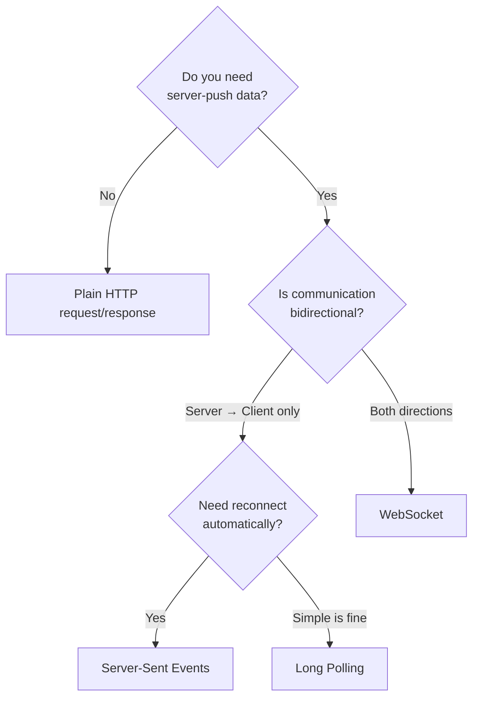
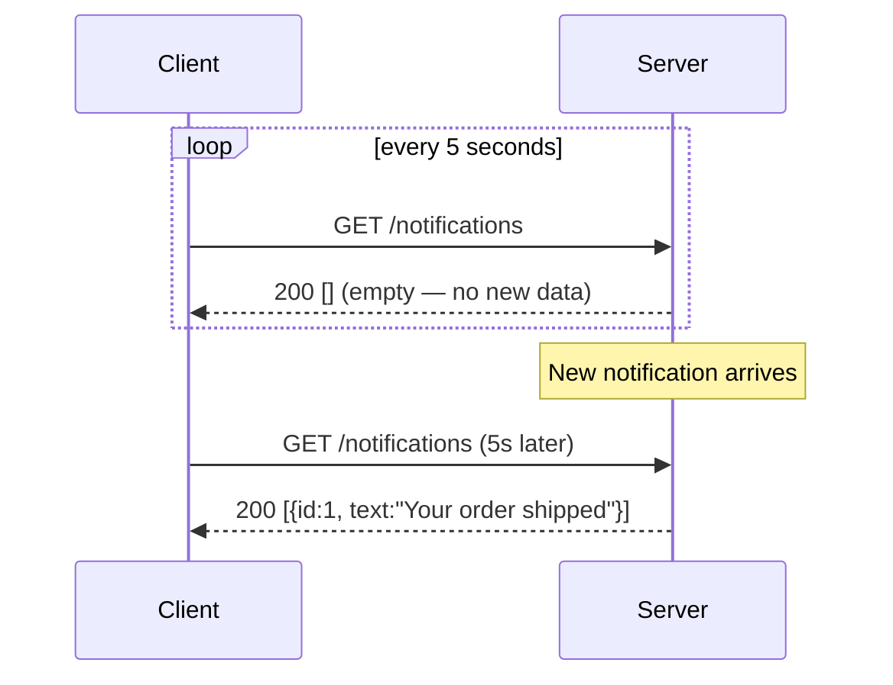
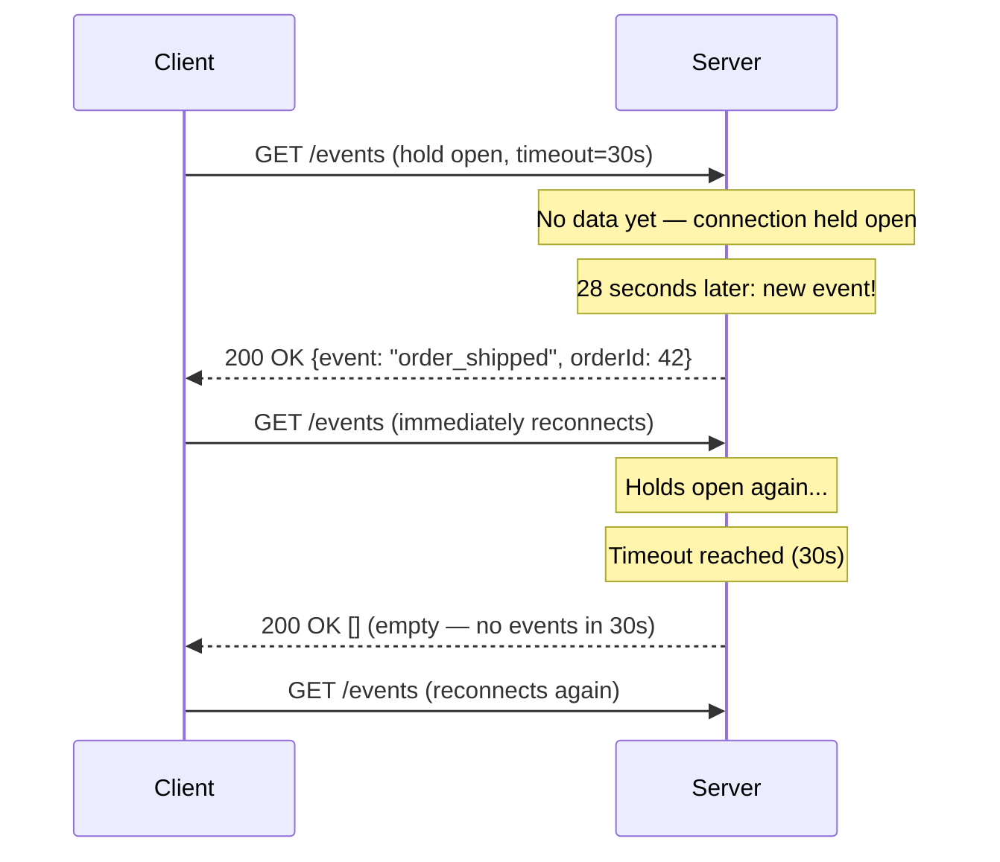
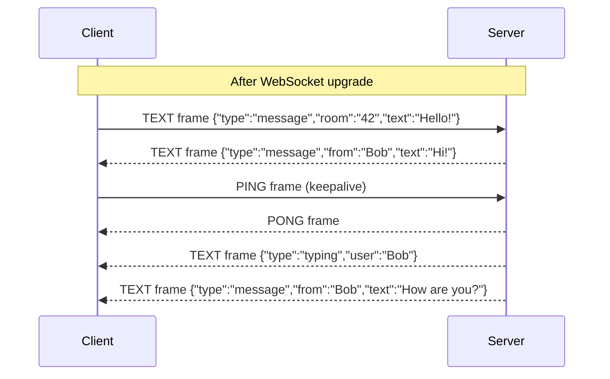
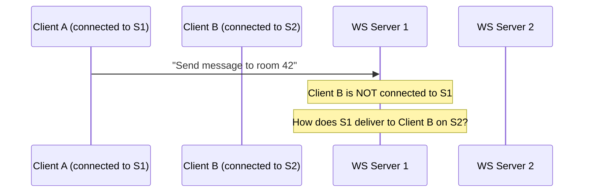
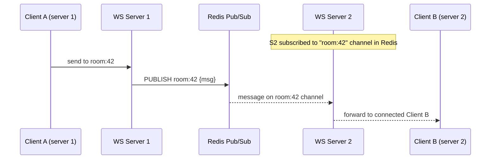

# WebSockets and Long Polling

## Concept

- HTTP (topic 2) is a **request-response** protocol. The client asks; the server answers. The server cannot send data unless the client first asks for it.
- Many real-world features need the **server to push data** to the client as soon as it's available, without waiting for a poll:
  - Chat messages arriving in a conversation
  - Live score updates in a sports app
  - Stock price changes in a trading dashboard
  - Collaborative editing — seeing another user's cursor move
  - Live notifications ("Your order shipped")
  - Real-time metrics and monitoring dashboards
- Three practical techniques exist, ordered by efficiency: **short polling** → **long polling** → **WebSocket**. A fourth, **Server-Sent Events (SSE)**, covers the server-to-client-only case.



## Short Polling — The Naive Approach

Client sends a request every N seconds, regardless of whether new data exists:



**Problems**:
- Wasteful: 99% of responses are empty "no new data."
- Latency up to N seconds (the polling interval) before the client sees new data.
- Multiplied across thousands of users → significant origin load for no value.

Short polling is only acceptable for very low-frequency updates (e.g., a dashboard refreshed every 30 minutes) where exact real-time delivery doesn't matter.

## Long Polling — Efficient HTTP Push

The client sends a request; the server **holds it open** until data is available, then responds immediately:



**Advantages over short polling**:
- Near-zero latency: data is delivered immediately when it's available.
- No wasted empty responses during quiet periods.
- Works through standard HTTP proxies and firewalls (plain HTTP).
- Simple to implement on any server.

**Disadvantages**:
- Each "held" request consumes a server thread/coroutine until it resolves.
- With 10,000 concurrent users all holding connections open, a server with 10,000 threads needs significant memory.
- Solution: use async I/O (Node.js, Go, async Python, Netty) — a held connection costs only a few KB of memory in an async runtime, not a full thread.
- Each message delivery requires a full new HTTP request (headers, auth token, etc.) — wasted overhead vs. WebSocket.

Long polling is used by: Firebase Realtime Database (fallback), many chat applications (fallback for old browsers), Comet web applications.

## WebSocket — Full-Duplex Communication

WebSocket provides a **persistent, bidirectional, full-duplex** channel over a single TCP connection.

### Why HTTP Upgrade?

WebSocket starts as HTTP so it can traverse the same port 80/443 and pass through existing proxies and firewalls. It then **upgrades** the connection:

### Handshake in detail

```
Client → Server:
GET /ws HTTP/1.1
Host: api.example.com
Upgrade: websocket
Connection: Upgrade
Sec-WebSocket-Key: dGhlIHNhbXBsZSBub25jZQ==
Sec-WebSocket-Version: 13
Sec-WebSocket-Protocol: chat, v1
Sec-WebSocket-Extensions: permessage-deflate

Server → Client:
HTTP/1.1 101 Switching Protocols
Upgrade: websocket
Connection: Upgrade
Sec-WebSocket-Accept: s3pPLMBiTxaQ9kYGzzhZRbK+xOo=
Sec-WebSocket-Protocol: chat
Sec-WebSocket-Extensions: permessage-deflate
```

`Sec-WebSocket-Accept` = Base64(SHA1(Sec-WebSocket-Key + "258EAFA5-E914-47DA-95CA-C5AB0DC85B11")). This prevents a caching proxy from mistakenly treating a WebSocket handshake as a regular HTTP response.

After 101, the TCP connection is a WebSocket connection. HTTP framing is gone.

### Frame structure

WebSocket messages are wrapped in lightweight frames:

```
0                   1                   2                   3
0 1 2 3 4 5 6 7 8 9 0 1 2 3 4 5 6 7 8 9 0 1 2 3 4 5 6 7 8 9 0 1
+-+-+-+-+-------+-+-------------+-------------------------------+
|F|R|R|R| opcode|M| Payload len |    Extended payload length    |
|I|S|S|S|  (4)  |A|     (7)     |             (16/64)           |
|N|V|V|V|       |S|             |   (if payload len==126/127)   |
| |1|2|3|       |K|             |                               |
+-+-+-+-+-------+-+-------------+ - - - - - - - - - - - - - - -+
```

- **FIN**: final fragment of a message.
- **Opcode**: `0x0` continuation, `0x1` text (UTF-8), `0x2` binary, `0x8` close, `0x9` ping, `0xA` pong.
- **MASK**: client → server frames must be masked (4-byte XOR key follows). Server → client frames are not masked. Masking prevents cache-poisoning attacks on proxies.
- **Payload length**: 7 bits (0–125), or 16-bit (126), or 64-bit (127) extension.

Compare overhead:
- HTTP request: 400–1000 bytes of headers per message.
- WebSocket frame: **2–14 bytes** per message overhead.

For a chat message of 50 bytes, WebSocket overhead is 2.8–22% vs. HTTP's 800–2000%.



### Message types and subprotocols

`Sec-WebSocket-Protocol` negotiates an application-level protocol on top of WebSocket:
- `chat` — custom JSON messaging protocol
- `graphql-ws` — GraphQL subscriptions over WebSocket
- `stomp` — STOMP messaging protocol (used with RabbitMQ)
- `ocpp` — Open Charge Point Protocol (EV charging stations)

Without a subprotocol, the application defines its own message format (usually JSON).

## Server-Sent Events (SSE) — Simple Server Push

SSE is a standardised HTTP API for **one-directional, server-to-client streaming**. The client opens one HTTP connection; the server streams events indefinitely:

```
GET /events HTTP/1.1
Accept: text/event-stream
Cache-Control: no-cache
```

Server response (content type `text/event-stream`, connection kept open):
```
HTTP/1.1 200 OK
Content-Type: text/event-stream
Cache-Control: no-cache
X-Accel-Buffering: no

id: 1
event: message
data: {"user":"alice","text":"Hello"}

id: 2
event: notification
data: {"type":"order_shipped","orderId":42}

: this is a comment — keeps the connection alive

```

SSE event format:
- `id:` — event ID; browser resends `Last-Event-ID` header on reconnect to get missed events.
- `event:` — event type (custom); defaults to `message`.
- `data:` — the payload (can be multiple lines, each prefixed with `data:`).
- `: comment` — ignored; often used as a keepalive heartbeat.
- Blank line separates events.

**Browser API** (EventSource):
```javascript
const source = new EventSource('/events');
source.onmessage = (e) => console.log(JSON.parse(e.data));
source.addEventListener('notification', (e) => showNotification(e.data));

// Automatic reconnect built-in — no code needed
// If the server closes the connection, EventSource reconnects after ~3 seconds
// Sends Last-Event-ID header to resume from last received event
```

SSE vs WebSocket:

| | SSE | WebSocket |
|---|---|---|
| Direction | Server → Client only | Bidirectional |
| Protocol | Plain HTTP/2 | Upgraded to WebSocket |
| Browser API | EventSource (simple) | WebSocket (slightly more complex) |
| Proxy support | Works through all HTTP proxies | Requires WebSocket-aware proxy |
| CDN support | Can be cached/streamed | Requires WebSocket pass-through |
| Reconnect | Automatic, built-in | Must implement manually |
| HTTP/2 multiplexing | Yes — multiple SSE streams share one connection | One connection per WebSocket |
| Binary support | No (text only) | Yes |

**Use SSE for**: notifications, live dashboards, activity feeds, AI streaming responses (like ChatGPT's token-by-token output — that's SSE), log tailing.

**Use WebSocket for**: chat, multiplayer games, collaborative editing, anything where the client also sends frequent messages.

## Scaling WebSocket Servers

WebSocket servers are **stateful** — a connected client is tied to a specific server process. This breaks the stateless horizontal-scaling model.

### The problem



### Solution: pub-sub broker

A shared pub-sub broker (Redis Pub/Sub, Kafka, NATS) bridges messages between server instances:



- Each server subscribes to Redis channels on behalf of connected clients.
- On message, the server looks up which local clients are in that room and delivers.
- Horizontal scaling: add more WS server instances; they all share the Redis broker.

### Sticky sessions

Alternative: configure the load balancer to route the same client (by IP or cookie) to the same server (sticky sessions / session affinity). Simpler but has failure handling problems — when the server restarts, all connections on it must reconnect and the new server may not be the sticky target.

## Connection Health — Heartbeats

WebSocket connections can go "half-open" — the underlying TCP connection is dead (lost packet, NAT timeout, etc.) but neither side has detected it. Without heartbeats, both sides wait forever for data from a dead connection.

**Server-sent ping frames** (WebSocket protocol level):
- Server sends a `PING` frame every 30–60 seconds.
- Client must respond with a `PONG` frame.
- If no pong arrives within a timeout, the server closes and the client reconnects.

**Application-level heartbeat** (when the WS library doesn't handle it):
- Both sides agree to send `{"type":"ping"}` every 30 seconds.
- The receiver responds with `{"type":"pong"}`.
- More portable across languages and libraries.

## Reconnection Strategy

Network interruptions are normal. A good WebSocket client always reconnects with **exponential backoff**:

```javascript
let delay = 1000; // start with 1 second
const maxDelay = 30000; // cap at 30 seconds

function connect() {
  const ws = new WebSocket(url);
  ws.onopen = () => { delay = 1000; }; // reset on successful connect
  ws.onclose = () => {
    setTimeout(connect, delay);
    delay = Math.min(delay * 2, maxDelay); // exponential backoff
  };
}
```

**With jitter** (prevents thundering herd when server restarts):
```javascript
delay = Math.min(delay * 2, maxDelay) * (0.5 + Math.random() * 0.5);
```

## Real-World Examples

| Feature | Company | Technique |
|---|---|---|
| Chat | Slack, Discord | WebSocket |
| Live scores | ESPN, BBC Sport | SSE or WebSocket |
| Collaborative editing | Figma, Google Docs | WebSocket (CRDT/OT over WS) |
| Notifications | GitHub, Jira | SSE |
| AI token streaming | ChatGPT, Claude | SSE |
| Live trading | Bloomberg, Robinhood | WebSocket |
| Real-time analytics | Datadog | WebSocket |
| Multiplayer games | various | WebSocket or custom UDP |
