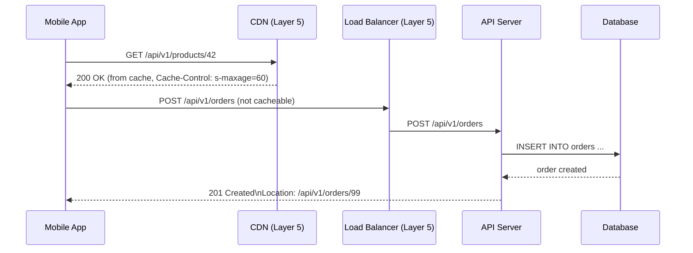
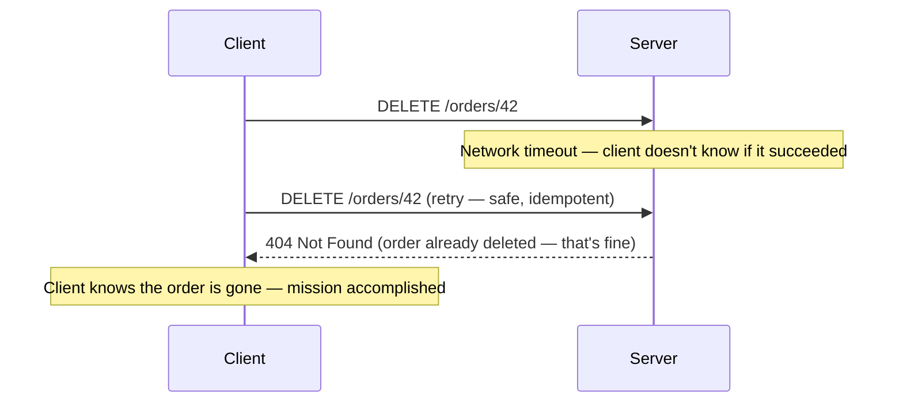
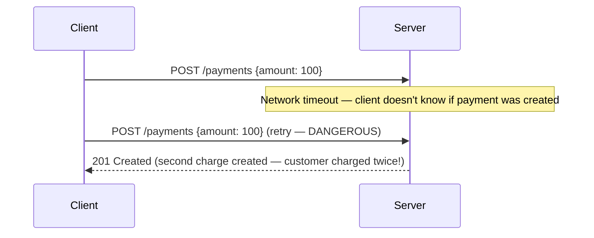
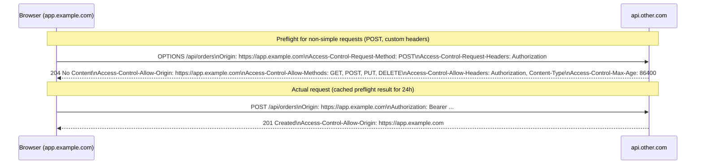

# REST APIs

## Concept

- **REST** (Representational State Transfer) is an architectural style for building networked APIs, described by Roy Fielding in his 2000 PhD dissertation. It is built on top of HTTP (topic 2) and inherits its semantics.
- REST is not a specification or standard — it's a set of **constraints**. An API that follows these constraints is called RESTful.
- The goal is **uniform interface**: any client that understands HTTP can use any REST API without a custom SDK, because the vocabulary (methods, status codes, URIs) is standardised.
- REST is the dominant style for public APIs, inter-service communication, and mobile backends.

**REST's six constraints**:
1. **Client-Server** — separate concerns (topic 1).
2. **Stateless** — every request contains all context needed; no server-side session.
3. **Cacheable** — responses declare whether they can be cached.
4. **Uniform Interface** — resources identified by URIs, representations transferred via standard media types, self-descriptive messages.
5. **Layered System** — client can't tell if it's talking to the origin or an intermediary (CDN, load balancer).
6. **Code on Demand** (optional) — server can send executable code (JavaScript to browsers).



## Resource Design — The Core Skill

REST models **resources** (nouns), not operations (verbs). Resources are things you act on, not things you do.

### Resource naming

| Bad (RPC style) | Good (REST style) | Reason |
|---|---|---|
| POST /createUser | POST /users | Verb in URL is redundant — POST already means create |
| GET /getUserById?id=42 | GET /users/42 | Path parameters for resource identity |
| POST /deleteOrder | DELETE /orders/42 | Use HTTP method for the operation |
| GET /getAllProducts | GET /products | "all" is implied — just return the collection |
| POST /updateUserPassword | PATCH /users/42/password | Resource path encodes what's being changed |

Rules:
- Use **nouns**, not verbs.
- Use **lowercase** with hyphens for readability: `/product-categories` not `/productCategories`.
- Use **plural nouns** for collections: `/users`, `/orders`, `/products`.
- Use **singular nouns** for singletons: `/user/profile` (profile of the current user), `/configuration`.
- **Nest** for ownership up to 2 levels: `/users/42/orders` (orders of user 42).

### Complete CRUD mapping

| Operation | HTTP Method | URI | Request Body | Success Response |
|---|---|---|---|---|
| List all orders | GET | `/orders` | — | 200 + array |
| List with filter | GET | `/orders?status=shipped&page=2` | — | 200 + array |
| Get one order | GET | `/orders/42` | — | 200 + object |
| Create order | POST | `/orders` | `{items, address}` | 201 + object + `Location: /orders/42` |
| Replace order | PUT | `/orders/42` | full order object | 200 + object |
| Update order fields | PATCH | `/orders/42` | `{status: "cancelled"}` | 200 + object |
| Delete order | DELETE | `/orders/42` | — | 204 |
| Nested resource | GET | `/users/42/orders` | — | 200 + array |
| Action on resource | POST | `/orders/42/cancel` | optional `{reason}` | 200 + object |

The last row (`/orders/42/cancel`) is a pragmatic exception: sometimes an action (cancel, publish, archive) doesn't map cleanly to a method. Using `POST /orders/42/cancel` is acceptable and widely used.

## HTTP Methods in REST — Deep Dive

### Idempotency in practice

Idempotency matters for **safe retries** in the face of network failures:



vs. POST:


**Idempotency Key** pattern for non-idempotent operations:
```
POST /payments
Idempotency-Key: a7f5c3e8-d4b2-4f9a-8c1e-3b7d2a5f9c8e

{"amount": 100, "currency": "USD"}
```

Server stores the result keyed by the idempotency key. If the same key is received again, return the cached result without re-processing. The client can safely retry after a timeout.

## Pagination

Returning all records in one response is impractical at scale. Three strategies:

### Offset pagination

```
GET /orders?offset=40&limit=20
```
Returns records 41–60.

```json
{
  "data": [...],
  "pagination": {
    "offset": 40,
    "limit": 20,
    "total": 243,
    "next": "/orders?offset=60&limit=20",
    "prev": "/orders?offset=20&limit=20"
  }
}
```

**Pros**: random access — jump to any page.
**Cons**: `OFFSET 1000000 LIMIT 20` in SQL requires the database to count and skip 1 million rows — slow. Also inconsistent: if a record is inserted between page 1 and page 2 requests, some records shift and might be returned twice or skipped.

### Cursor pagination

```
GET /orders?after=cursor_dXNlcjoxMDA&limit=20
```

The cursor encodes the last record seen (often a Base64-encoded ID or composite key, not a page number):

```json
{
  "data": [...],
  "pagination": {
    "next_cursor": "cursor_dXNlcjoxMjA",
    "has_more": true
  }
}
```

**Pros**: O(log N) performance (uses index seek, not scan). Stable — insertions don't shift pages.
**Cons**: no random access — can't jump to page 5. Previous page navigation is harder.

### Keyset pagination

Similar to cursor, but exposes the sort key directly:
```
GET /orders?after_id=1000&limit=20
```

Most practical for `ORDER BY id` queries. Uses the primary key index directly.

### Which to use?

- Default: **cursor pagination** — performant, stable, sufficient for most UIs.
- Need random page access: **offset pagination** — accept the performance cost.
- Internal APIs with trusted clients: **keyset pagination** — simplest to implement correctly.

## Filtering, Sorting, and Field Selection

**Filtering** (query parameters):
```
GET /orders?status=shipped&user_id=42&min_total=50
GET /orders?created_after=2024-01-01T00:00:00Z
```

**Sorting**:
```
GET /orders?sort=created_at&order=desc
GET /orders?sort=total&order=asc
```

**Multi-sort** (comma-separated):
```
GET /orders?sort=status,created_at&order=asc,desc
```

**Field selection** (sparse fieldsets — avoids over-fetching):
```
GET /orders?fields=id,status,total
```

Response only includes the requested fields. Reduces payload, speeds up serialisation.

**Embedding related resources** (avoids N+1 round trips):
```
GET /orders/42?include=items,user
```

Server includes `items` and `user` in the response instead of requiring separate requests.

## Content Negotiation

HTTP allows clients to tell servers what format they can accept:

```
GET /orders/42
Accept: application/json, application/xml;q=0.9, */*;q=0.8
Accept-Language: en-US, en;q=0.9, de;q=0.8
Accept-Encoding: gzip, br
```

`q` values (quality factors) express preference: `q=1.0` (default) = preferred, `q=0.5` = acceptable, `q=0` = unacceptable.

The server picks the best match and indicates it in `Content-Type`:
```
Content-Type: application/json; charset=utf-8
```

**Versioning via Accept header** (content negotiation approach to API versioning):
```
Accept: application/vnd.myapi.v2+json
```

Vs. URI versioning (`/v2/orders`) — both are valid; URI versioning is more common because it's simpler to route, log, and cache.

## HATEOAS — Hypermedia as the Engine of Application State

The most ambitious REST constraint. Responses include links to related resources and available actions:

```json
{
  "id": 42,
  "status": "pending",
  "total": 199.98,
  "_links": {
    "self":    { "href": "/orders/42", "method": "GET" },
    "cancel":  { "href": "/orders/42/cancel", "method": "POST" },
    "payment": { "href": "/orders/42/payment", "method": "GET" },
    "user":    { "href": "/users/7", "method": "GET" }
  }
}
```

**Intent**: clients navigate the API by following links in responses, never hardcoding URLs. The server can change URLs without breaking clients.

**Reality**: HATEOAS is rarely implemented in practice. Most teams document their API URLs in OpenAPI/Swagger and let clients hardcode them. The cognitive overhead of truly link-driven clients outweighs the flexibility benefit for most applications.

## OpenAPI and API Documentation

OpenAPI (formerly Swagger) is the standard schema language for describing REST APIs:

```yaml
openapi: "3.1.0"
info:
  title: Orders API
  version: "1.0"
paths:
  /orders/{id}:
    get:
      summary: Get an order
      parameters:
        - name: id
          in: path
          required: true
          schema: { type: integer }
      responses:
        "200":
          description: Order found
          content:
            application/json:
              schema: { $ref: "#/components/schemas/Order" }
        "404":
          description: Order not found
```

OpenAPI enables:
- Auto-generated documentation (Swagger UI, Redoc)
- Client SDK generation (OpenAPI Generator)
- Server stub generation
- Request/response validation in tests
- Mock server generation for frontend development

## Richardson Maturity Model

A useful framework for assessing how "RESTful" an API is:

| Level | Name | Description | Example |
|---|---|---|---|
| 0 | The Swamp of POX | Single URI, POST for everything | `POST /api {"action":"getOrder","id":42}` |
| 1 | Resources | Multiple URIs, but methods used wrong | `POST /orders/42/get` |
| 2 | HTTP Verbs | Proper use of methods + status codes | `GET /orders/42 → 200` |
| 3 | Hypermedia Controls | HATEOAS — links in responses | Level 2 + `_links` |

Most production APIs are level 2. Level 3 is academically interesting but rarely implemented.

## Error Response Design

Consistent error responses are as important as success responses. Clients must parse errors to recover or display messages.

```json
{
  "error": {
    "code": "ORDER_NOT_FOUND",
    "message": "Order 42 does not exist or has been deleted.",
    "details": [
      {
        "field": "id",
        "issue": "not_found",
        "value": "42"
      }
    ],
    "documentation_url": "https://docs.example.com/errors/ORDER_NOT_FOUND",
    "trace_id": "req_abc123xyz",
    "timestamp": "2024-01-15T10:30:00Z"
  }
}
```

- `code` — machine-readable error identifier. Clients switch on this.
- `message` — human-readable description. For developers, not end users.
- `details` — per-field validation errors. Enables form-level error display.
- `trace_id` — ties the error to a server-side log entry. Essential for debugging.

### Validation error example

```json
{
  "error": {
    "code": "VALIDATION_ERROR",
    "message": "Request body validation failed.",
    "details": [
      { "field": "items[0].quantity", "issue": "must_be_positive", "value": -1 },
      { "field": "shippingAddress.zip", "issue": "invalid_format", "value": "not-a-zip" }
    ]
  }
}
```

## CORS — Cross-Origin Resource Sharing

Browsers enforce the **Same-Origin Policy**: JavaScript on `app.example.com` cannot make `fetch()` calls to `api.other.com` without explicit permission.

CORS is the mechanism for granting that permission:



**Simple requests** (GET with standard headers, no custom headers) don't require a preflight. Everything else triggers a preflight OPTIONS request.

**`Access-Control-Allow-Origin: *`** allows any origin but disables sending credentials (cookies, Authorization headers). For authenticated APIs, use the specific origin: `Access-Control-Allow-Origin: https://app.example.com`.

## Common REST API Mistakes

**Mistake 1: Using GET for state-changing operations**
`GET /orders/42/cancel` — GET must be safe (no side effects). Use `POST /orders/42/cancel`.

**Mistake 2: 200 OK for errors**
```json
HTTP/1.1 200 OK
{"success": false, "error": "Order not found"}
```
HTTP clients (middleware, CDNs, monitoring) use status codes for routing and alerting. A 200 for an error confuses every system that processes it.

**Mistake 3: Ignoring idempotency for payment/booking endpoints**
Always implement `Idempotency-Key` for operations that must not be duplicated.

**Mistake 4: Returning 404 vs 403 for auth errors**
If the resource exists but the user can't see it, return 404 (not 403) to prevent leaking resource existence to unauthorised callers. This is a security/privacy decision, not a technical one.
