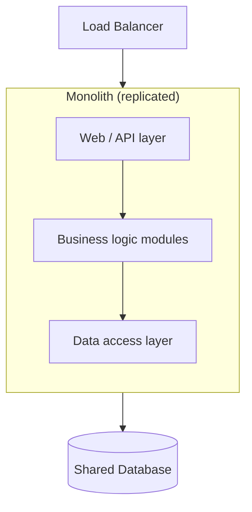

# Monolith Architecture

## Concept

- A **monolith** is a single deployable unit where all application code — UI, business logic, data access — lives in one codebase and runs in one process (or identical replicas of it).
- All modules share one runtime, one memory space, and usually one database. A call between modules is an in-process function call, not a network hop.
- "Monolith" is not an insult. It is the correct **default** starting architecture for almost every new system. You scale it horizontally by running many identical copies behind a load balancer.
- The monolith only becomes a problem when a *single team can no longer reason about, test, or deploy it safely* — and that boundary arrives later than most engineers assume.

## Problem It Solves

- Removes all the distributed-systems hard problems on day one: no network partitions between modules, no distributed transactions, no service discovery, no cross-service tracing.
- One repository, one build, one deploy pipeline — fast to develop and easy to onboard.
- In-process calls are nanoseconds; the same call across services is milliseconds and can fail.
- A single database means real ACID transactions across the whole domain — an order, its payment, and its inventory update commit atomically.
- Lets a small team ship features instead of operating infrastructure.

## Trade-offs

- **Simplicity vs. independent deploys** — every change redeploys the whole app; one risky line blocks everyone's release.
- **Shared runtime vs. fault isolation** — a memory leak or infinite loop in one module can take down the entire process.
- **Single tech stack vs. flexibility** — the whole app shares one language/runtime; you can't adopt Go for one hot path while staying in Python elsewhere.
- **Scaling granularity** — you scale the whole app even if only the image-processing module is hot, wasting resources.
- **Codebase coupling over time** — without discipline, modules grow tangled dependencies (the "big ball of mud"), which is what the *modular monolith* (topic 2) prevents.
- **Build/test time** — as the codebase grows, CI gets slower, lengthening the feedback loop.

## Examples

- **Early-stage startup**
  - One Rails/Django/Spring app, one Postgres database, deployed to a handful of identical instances.
  - Handles the first millions of users comfortably; premature microservices here would slow the team to a crawl.
- **Scaling the monolith (this is usually enough)**
  - Stateless app servers → add replicas behind a load balancer.
  - Read-heavy → add read replicas and a cache (topics 13, 18).
  - Hot background work → push to a queue and worker (topic 19).
  - You can ride a well-built monolith to very large scale — Shopify, GitHub, and Stack Overflow famously run large monoliths.
- **When the monolith starts to hurt**
  - Multiple teams stepping on each other in one deploy pipeline.
  - One module needs radically different scaling or a different language.
  - Build/test cycles measured in tens of minutes.
  - These are the signals to extract a service (topic 3) — not before.
- **Interview framing**
  - Start a design as a monolith, justify it with the scale numbers, then split *only the specific component* the estimates show needs independent scaling. This signals judgment over hype.
