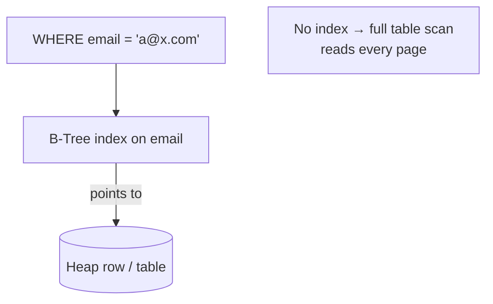

# Database Indexing

## Concept

- An **index** is an auxiliary data structure that lets the database find rows by a column's value without scanning the whole table - turning an O(N) scan into an O(log N) lookup.
- The default index is a **B-Tree** (balanced, sorted), which supports equality (`=`), range (`<`, `>`, `BETWEEN`), prefix, and `ORDER BY` queries because it keeps keys in sorted order.
- An index is a trade: it speeds up reads that match it but slows down writes (every insert/update/delete must also maintain the index) and consumes storage.
- The art is indexing the columns your queries actually filter/sort on - and no more.

## Problem It Solves

- Without an index, finding rows by a non-primary column requires reading every row - fatal at scale.
- Indexes enable fast point lookups, range scans, sorted retrieval, and efficient joins.
- A **covering index** (containing all columns a query needs) lets the query be answered from the index alone, never touching the table.
- Composite indexes accelerate multi-column filters and enforce sort order.

## Trade-offs

- **Read speed vs. write cost**: each index adds work to every write and uses disk; over-indexing degrades write throughput.
- **Selectivity**: indexes help on **high-cardinality** columns (email, user_id); a low-cardinality column (boolean, status with 3 values) often isn't worth indexing - the planner may prefer a scan.
- **Composite column order matters**: an index on `(a, b)` serves `WHERE a=…` and `WHERE a=… AND b=…`, but **not** `WHERE b=…` alone (the leftmost-prefix rule).
- **Clustered vs. secondary**: a clustered index stores the table in index order (one per table); secondary indexes point back to rows and add a lookup hop (related: topic 33).
- **Index bloat**: indexes fragment and grow; they need maintenance.

## Examples

- **Point lookup**
  - `CREATE INDEX idx_users_email ON users(email);` turns login lookups from a full scan into a B-Tree probe.
- **Composite + leftmost prefix**
  - `INDEX (tenant_id, created_at)` serves "this tenant's recent rows" efficiently; querying by `created_at` alone won't use it.
- **Covering index**
  - `INDEX (user_id) INCLUDE (status, total)` answers "status and total for a user" from the index alone - no heap fetch.
- **Specialized indexes**
  - Hash (equality only), GiST/GIN (full-text, JSONB, arrays in Postgres), spatial (topic on geospatial), partial (`WHERE active = true`) to index only relevant rows.
- **Interview framing**
  - State the query first, then the index that serves it. Mention the leftmost-prefix rule and the write-cost trade-off. To go deeper on *why* B-Trees, see storage engines (topic 30); on *whether the planner uses it*, see query optimization (topic 31).
