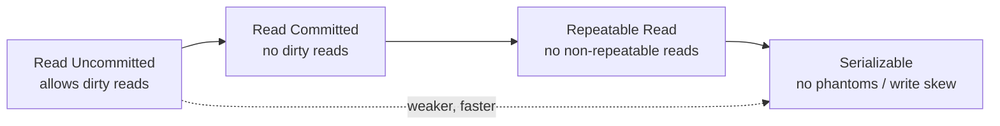

# Database Isolation Levels

## Concept

- **Isolation** (the "I" in ACID) defines how/when one transaction's changes become visible to others running concurrently. Stronger isolation is more correct but more costly.
- The SQL standard defines four levels, each preventing more **read anomalies**:
  - **Read Uncommitted** — can see other transactions' uncommitted changes (**dirty reads**).
  - **Read Committed** — sees only committed data, but a row re-read can change (**non-repeatable read**).
  - **Repeatable Read** — re-reading a row gives the same value, but new rows can appear in a range (**phantom read**).
  - **Serializable** — transactions behave as if run one at a time; no anomalies.
- The anomalies, in order of severity: **dirty read → non-repeatable read → phantom read → write skew**.

## Problem It Solves

- Concurrent transactions interleave; without isolation rules you get corrupted reads and lost updates.
- Isolation levels let you **choose** how much concurrency anomaly you tolerate in exchange for throughput — pay for correctness only where the data requires it.
- Serializable guarantees that complex invariants (e.g., "total balance never goes negative across two accounts") hold even under concurrency.

## Trade-offs

- **Correctness vs. concurrency/throughput** — Serializable can force retries or block; Read Committed allows more parallelism but admits anomalies.
- **Default varies by database** — PostgreSQL defaults to Read Committed; many MySQL setups default to Repeatable Read. Know your engine's default and what it actually prevents.
- **Implementation differs** — MVCC engines (Postgres) implement Repeatable Read as a snapshot; lock-based engines use shared/exclusive locks. Same name, different performance behavior.
- **Write skew** — a subtle anomaly Repeatable Read does **not** prevent; only Serializable (or explicit locking) does.
- **Application-level locking** — sometimes `SELECT … FOR UPDATE` (pessimistic) or a version column (optimistic) is the right tool instead of raising the global isolation level.

## Examples

- **Dirty read (Read Uncommitted)**
  - T1 deducts $100 but hasn't committed; T2 reads the lowered balance and acts on it; T1 rolls back — T2 acted on data that never existed.
- **Non-repeatable read (prevented by Repeatable Read)**
  - A report reads a price, does work, re-reads it and gets a different value because another transaction committed in between.
- **Phantom read (prevented by Serializable)**
  - "Count active users" returns 100, then 101 within the same transaction because a new row was inserted into the range.
- **Write skew (needs Serializable)**
  - Two on-call doctors each check "≥1 other doctor on shift" and both go off-shift simultaneously — each read was valid, the combined write breaks the invariant.
- **Interview framing**
  - Tie the choice to the data: financial ledgers → Serializable or explicit locks; a social feed counter → Read Committed is fine. Mention `SELECT FOR UPDATE` and optimistic version columns as targeted alternatives to globally raising isolation.
