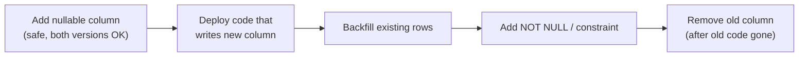

# Database Migrations

## Concept

- A **schema migration** is a versioned, repeatable change to the database structure (tables, columns, indexes, constraints) and sometimes its data, applied as code alongside the application.
- Migrations are **forward-only and ordered**: each is a numbered/timestamped script checked into version control and applied exactly once, tracked in a `schema_migrations` table.
- The hard part is not changing the schema - it's changing it **without downtime** while old and new application versions run simultaneously during a rolling deploy.
- The governing principle is **backward-and-forward compatibility**: every intermediate state must work with both the old and new code.

## Problem It Solves

- Keeps schema changes reviewable, reproducible across environments (dev/staging/prod), and rollback-aware.
- Prevents the classic outage where a deploy changes the schema in a way the still-running old code can't handle (or vice versa).
- The **expand - contract (parallel change)** pattern lets you ship breaking changes safely in stages: expand (add the new shape), migrate (dual-write/backfill), contract (remove the old shape) - each step compatible with the deploy in flight.

## Trade-offs

- **Safe but multi-step vs. fast but risky**: a single `ALTER` is quick but can lock a large table or break running code; the expand - contract sequence is several deploys but zero downtime.
- **Locking**: some operations rewrite or lock the whole table (adding a non-null column with a default on old engines, changing a type). Use online-DDL tools (gh-ost, pt-online-schema-change) or engine features that avoid full locks.
- **Backfills at scale**: updating millions of rows must be **batched** to avoid long transactions and replication lag.
- **Rollback**: destructive migrations (dropping a column) can't be undone without a backup; prefer reversible steps and delay destructive ones.
- **Data migrations vs. schema migrations**: mixing heavy data backfills into schema scripts can block deploys; run large backfills as separate, resumable jobs.

## Examples

- **Renaming a column without downtime (expand - contract)**
  1. Add new column `full_name` (nullable).
  2. Deploy code that writes both `name` and `full_name`.
  3. Backfill `full_name` from `name` in batches.
  4. Deploy code that reads `full_name`.
  5. Stop writing `name`; later drop it.
- **Adding an index on a hot table**
  - Use `CREATE INDEX CONCURRENTLY` (Postgres) so writes aren't blocked during the build.
- **Tooling**
  - Flyway, Liquibase, Alembic (Python), Rails/ActiveRecord migrations, Prisma Migrate - all track applied versions and order.
- **Interview framing**
  - When a design implies a schema change under load, describe expand - contract and online DDL. Saying "I'd just `ALTER TABLE`" on a 500M-row table is a red flag; describing batched backfills and compatibility windows is senior signal.
