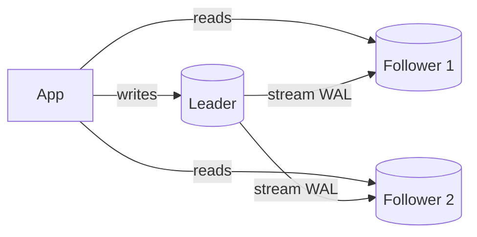

# Replication

## Concept

- **Replication** keeps copies of the same data on multiple database nodes. It is the primary mechanism for **read scaling**, **high availability**, and **disaster recovery**.
- The dominant model is **leader - follower** (primary - replica): all writes go to the leader, which streams its change log (the WAL, topic 9) to followers that apply it and serve reads.
- Replication can be:
  - **Synchronous**: the leader waits for follower acknowledgment before committing. No data loss on failover, but higher write latency and reduced availability if a follower is slow.
  - **Asynchronous**: the leader commits immediately and ships changes after. Fast, but a leader crash can lose the last un-replicated writes, and followers lag.
- **Multi-leader** and **leaderless** (quorum) models exist for multi-region writes and high availability (see Phase 4: consistency, quorums).

## Problem It Solves

- **Read scaling**: spread reads across many followers; the leader handles only writes.
- **High availability**: if the leader dies, a follower is promoted (failover), so the system keeps serving.
- **Disaster recovery / geo-locality**: a follower in another region survives a regional outage and serves nearby reads with lower latency.
- **Zero-downtime maintenance**: patch a follower, then fail over to it.

## Trade-offs

- **Replication lag vs. consistency**: async followers lag the leader by milliseconds to seconds, causing **stale reads** and the **read-your-own-writes** problem (a user updates their profile, then reads a replica and sees the old value).
- **Sync vs. async**: sync prevents data loss but couples write latency to the slowest replica and can stall on a failing follower; async is fast but loses recent writes on failover.
- **Failover hazards**: split-brain (two leaders) if failover is mishandled; needs fencing and consensus (Phase 4: leader election).
- **Write scaling is not solved**: replication scales *reads*; the single leader still bounds *write* throughput. For that you need sharding (topic 14).

## Examples

- **Read-your-writes mitigation**
  - After a write, route that user's reads to the leader for a short window, or read from a replica only if it has caught up past the write's log position.
- **Semi-synchronous**
  - Wait for at least one follower to ack (bounding data loss) while not waiting for all - a common middle ground.
- **Quorum (leaderless)**
  - Dynamo-style systems write to W replicas and read from R; if W + R > N you get strong-ish consistency without a single leader (Phase 4).
- **Real systems**
  - PostgreSQL streaming replication, MySQL binlog replication, MongoDB replica sets (automatic election), Cassandra (leaderless quorum).
- **Interview framing**
  - "Leader for writes, followers for reads, async replication, and route post-write reads to the leader to handle read-your-writes." Distinguish clearly: replication scales reads/HA; sharding scales writes.
