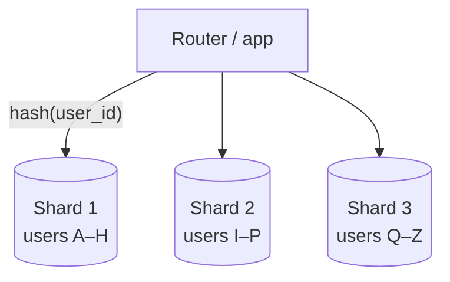

# Sharding

## Concept

- **Sharding** (horizontal partitioning) splits one logical dataset across many independent database nodes, each holding a **subset** of the rows. It is the primary way to scale **writes** and **storage** beyond a single machine.
- Every row is assigned to a shard by a **shard key** via a partitioning strategy:
  - **Hash-based** — `shard = hash(key) % N`. Even distribution, but range queries scatter and resharding is painful (use consistent hashing, Phase 4, to limit reshuffling).
  - **Range-based** — contiguous key ranges per shard. Great for range scans, but prone to **hot shards** (e.g., all recent timestamps land on one shard).
  - **Directory/lookup-based** — a lookup service maps keys → shards. Flexible (rebalance by updating the map) at the cost of an extra hop and a critical dependency.
- The shard key choice is the most important and least reversible decision — it determines distribution, query efficiency, and hot spots.

## Problem It Solves

- A single leader (topic 13) caps write throughput and dataset size; sharding removes both ceilings by adding nodes.
- Each shard handles a fraction of writes, storage, and index size — keeping each node's working set in memory.
- Enables near-linear horizontal scaling of the write path, which replication alone cannot provide.

## Trade-offs

- **Scale vs. lost cross-shard operations** — JOINs and transactions that span shards become application-level work or are impossible; design queries to stay within one shard (by the shard key).
- **Even distribution vs. hot partitions** — a poorly chosen key (low cardinality, monotonically increasing, or a celebrity user) overloads one shard while others idle (see topic 32).
- **Resharding pain** — adding shards with `% N` remaps most keys; consistent hashing (Phase 4) limits movement but resharding is still a major operation.
- **Operational complexity** — routing, rebalancing, per-shard backups, cross-shard analytics, and global secondary indexes (topic 33) all get harder.
- **Fan-out reads** — queries without the shard key must hit every shard and merge results (scatter-gather), which is slow and fragile.

## Examples

- **Good shard key**
  - `user_id` for a social app: each user's data colocated, queries stay on one shard, high cardinality spreads load.
- **Bad shard key**
  - `created_at` (range): all new writes hit the newest shard — a write hot spot. `country` (low cardinality): a few huge shards.
- **Avoiding cross-shard transactions**
  - Colocate related entities under the same key (an order and its items both keyed by `user_id`), so a checkout stays single-shard.
- **Combining with replication**
  - Each shard is itself a replicated leader–follower group: sharding scales writes, replication gives each shard HA and read scaling.
- **Interview framing**
  - Reach for sharding only when capacity estimates show one node can't hold the data or absorb the writes. Lead with the shard key and justify it against distribution, query patterns, and hot spots — then mention consistent hashing for rebalancing.
