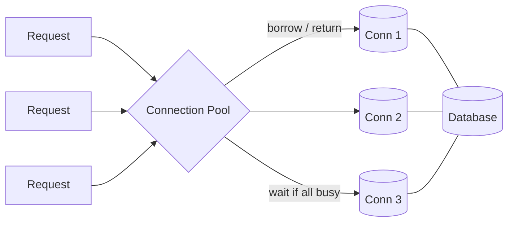

# Connection Pooling

## Concept

- A **connection pool** is a cache of pre-established, reusable database connections shared across application requests, instead of opening a new connection per request.
- Database connections are **expensive**: each requires a TCP handshake, TLS negotiation, authentication, and (in Postgres) a dedicated backend **process** with its own memory. Creating one per request is slow and quickly exhausts the database.
- The pool keeps N open connections; a request **borrows** one, runs its queries, and **returns** it. When all are busy, new requests **wait** (up to a timeout) for one to free up.
- Pooling decouples the number of concurrent *application requests* from the number of *database connections* the server must sustain.

## Problem It Solves

- Eliminates per-request connection setup latency (handshake + auth), often tens of milliseconds.
- Protects the database from **connection exhaustion**: Postgres struggles past a few hundred connections because each is a process; the pool caps concurrency to a safe number.
- Smooths bursts — excess requests queue briefly instead of overwhelming the DB.
- Improves throughput and tail latency under load.

## Trade-offs

- **Pool size tuning** — too small starves the app (requests wait); too large overwhelms the DB and can *reduce* throughput (more contention, context switching). The right size is usually `~ (core_count * 2) + effective_spindles`, far smaller than engineers expect.
- **Waiting vs. failing** — when the pool is exhausted, requests block; a borrow timeout converts a stall into a fast error (pairs with circuit breakers, topic 8).
- **Per-instance pools multiply** — 50 app replicas × a 20-connection pool = 1000 DB connections; size pools with the fleet in mind.
- **External poolers** — PgBouncer/pgpool sit between app and DB to multiplex thousands of client connections onto a few DB connections (transaction pooling), at the cost of some session-level feature restrictions.
- **Leaked connections** — code paths that borrow but never return drain the pool and cause mysterious stalls.

## Examples

- **In-app pool**
  - HikariCP (Java), `pgxpool` (Go), SQLAlchemy pool (Python), built-in pools in most ORMs. Configure max size, min idle, and connection timeout.
- **Serverless problem**
  - Hundreds of short-lived Lambda instances each opening a connection can crush Postgres; a proxy like PgBouncer or AWS RDS Proxy multiplexes them safely.
- **Sizing in practice**
  - A service on 4-core boxes with 40 replicas might use a pool of 10 each → 400 DB connections; if the DB tops out at 300, lower the per-instance pool or add a pooler.
- **Interview framing**
  - Whenever a stateless app tier talks to a relational DB, mention a connection pool and that pool size — not app concurrency — is what the DB must survive. For serverless, mention an external pooler.
