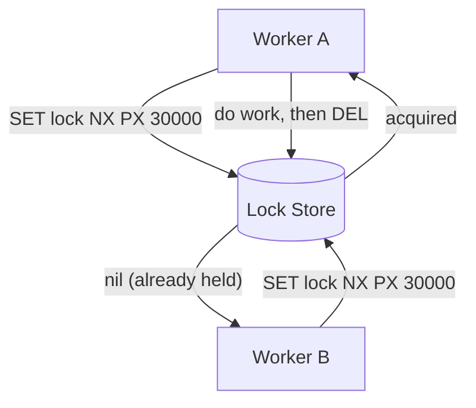

# Distributed Locking

## Concept

- A **distributed lock** coordinates exclusive access to a shared resource across multiple processes or machines that don't share memory — the multi-node version of a mutex.
- It answers: "only one worker at a time may do X" when "workers" are separate servers (e.g., only one node runs a cron job, processes an order, or writes a file).
- Implementations use an external, agreed-upon store with atomic operations:
  - **Redis** — `SET key value NX PX <ttl>` (set-if-not-exists with expiry); the Redlock algorithm for multi-node Redis.
  - **ZooKeeper / etcd** — ephemeral sequential nodes / leases; stronger correctness via consensus (Phase 4).
  - **Database** — a row lock (`SELECT … FOR UPDATE`) or a unique constraint on a "lock" row.
- Every distributed lock needs a **TTL/lease** so a crashed holder doesn't lock the resource forever.

## Problem It Solves

- Prevents duplicate or conflicting work when several nodes could act on the same resource: double-charging a card, two schedulers firing the same job, concurrent edits corrupting a file.
- Provides mutual exclusion where a local lock can't, because the contenders are on different machines.
- Enables leader-style "only one active worker" patterns without full consensus machinery for simple cases.

## Trade-offs

- **Correctness vs. simplicity** — Redis locks are easy and fast but are **not** guaranteed safe under GC pauses, clock skew, and network delays (a holder can be paused past its TTL while believing it still holds the lock). For strict correctness use a consensus store (etcd/ZooKeeper) and **fencing tokens**.
- **TTL tension** — too short and a slow-but-alive holder loses the lock mid-work (two holders); too long and a crash blocks others for that whole duration.
- **Liveness vs. safety** — auto-expiry guarantees liveness but can violate mutual exclusion; fencing tokens (monotonic numbers the resource checks) restore safety.
- **Performance cost** — every locked operation serializes through one store; heavy lock contention becomes a bottleneck.
- **Prefer designing locks away** — idempotency (topic 22), partitioning by key, or single-writer-per-shard often removes the need for a lock entirely.

## Examples

- **Redis lock (simple, best-effort)**
  - `SET job:nightly worker-42 NX PX 60000`; if it returns OK, run the job and `DEL` after. A Lua script ensures you only delete *your* lock (compare value before delete).
- **Fencing token (safe)**
  - The lock store hands out an increasing token with each grant; the protected resource rejects writes carrying a token lower than the highest it has seen — so a revived stale holder can't corrupt state.
- **Database lock**
  - `SELECT … FOR UPDATE` on a row to serialize updates within one transaction — simplest when you already have a relational DB and the critical section is a DB write.
- **Interview framing**
  - State whether you need *best-effort* (Redis + TTL, fine for "avoid duplicate emails") or *strict* (consensus store + fencing tokens, for money). Mention that the strongest design often eliminates the lock via idempotency or per-key single-writer.
