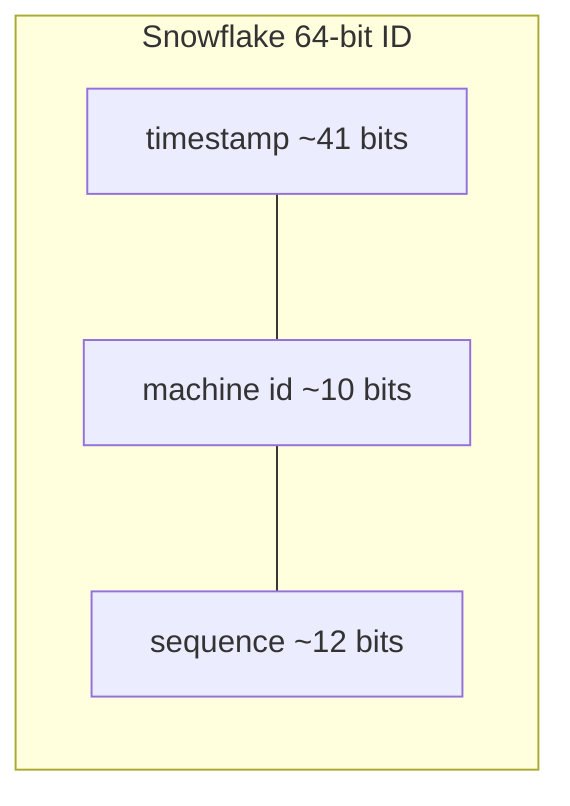

# Unique ID Generation

## Concept

- Distributed systems need to generate **unique identifiers** at high rate across many nodes without a central bottleneck — for primary keys, message IDs, request IDs, and short codes.
- The core tension: a single auto-increment counter is simple and ordered but is a SPOF and a write bottleneck; fully random IDs scale infinitely but lose ordering and hurt index locality.
- Common approaches:
  - **UUID v4** — 122 random bits; collision-free in practice, no coordination, but large (16 bytes) and unordered (bad for B-Tree insert locality).
  - **UUID v7 / ULID** — timestamp-prefixed, so they're **sortable by time** *and* decentralized — the modern default.
  - **Snowflake** — 64-bit ID = timestamp + machine/worker ID + per-ms sequence. Time-sortable, compact, very high throughput.
  - **DB ticket server / segment allocation** — a central DB hands out ranges (e.g., 1000 IDs) that each node consumes locally, amortizing coordination.

## Problem It Solves

- Generates globally unique keys without every insert contending on one counter.
- **Time-ordered** IDs (Snowflake, UUIDv7) improve database performance: new rows append to the end of the index instead of scattering random inserts across B-Tree pages.
- Sortable IDs double as rough creation-time ordering, useful for feeds and pagination.
- Decentralized generation removes the SPOF of a single sequence server.

## Trade-offs

- **Ordered vs. random** — ordered IDs help index locality and pagination but can **leak information** (rate of creation, approximate volume) and create insert hot spots on the latest shard; random IDs avoid leakage but fragment indexes.
- **Size vs. compactness** — 128-bit UUIDs are bigger keys (more index memory, more bytes per row, larger foreign keys) than 64-bit Snowflake IDs.
- **Coordination vs. independence** — Snowflake needs unique machine IDs assigned; ticket servers need a central DB; UUIDs need nothing.
- **Clock dependence** — Snowflake/UUIDv7 rely on clocks; clock skew or backward jumps can cause collisions or out-of-order IDs (needs NTP and monotonic handling).
- **Security** — sequential public IDs let users enumerate resources; use opaque/random external IDs even if internal keys are sequential.

## Examples

- **Snowflake at scale**
  - Twitter's original design: 41-bit ms timestamp + 10-bit worker + 12-bit sequence → ~4096 IDs/ms/node, time-sortable, fits in a `BIGINT`.
- **ULID for app keys**
  - Lexicographically sortable, URL-safe, 128-bit; gives time-ordering without a coordination service.
- **Short codes (URL shortener)**
  - Base62-encode a Snowflake/counter value for compact human-friendly codes — see the URL-shortener case study.
- **Ticket server**
  - A node requests a block of 1000 IDs from a central table; it allocates locally and only hits the DB once per block, surviving brief DB outages.
- **Interview framing**
  - Default to UUIDv7/ULID or Snowflake for distributed IDs; justify by index locality and the no-central-bottleneck property. Mention exposing opaque external IDs for security.
