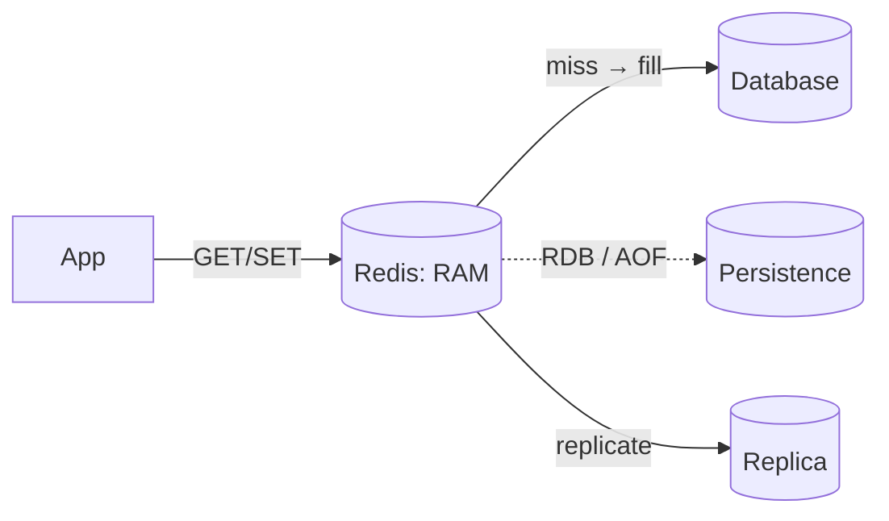

# Redis

## Concept

- **Redis** is an in-memory data-structure store used as a cache, message broker, rate limiter, session store, and lightweight database. Its speed comes from keeping data in RAM and using simple, single-threaded command execution.
- It is **not just key→string**: it offers rich data structures - strings, hashes, lists, sets, sorted sets, bitmaps, HyperLogLog, streams, and geospatial - each with atomic operations.
- It is **single-threaded** for command execution, which makes every individual command atomic (no locks needed) but means one slow command (`KEYS *`, a huge `SORT`) blocks everything.
- It offers **optional persistence** (RDB snapshots, AOF append-log), **replication**, and **Redis Cluster** for sharding across nodes.

## Problem It Solves

- **Sub-millisecond reads** for hot data, offloading the database (cache-aside, topic 16 in Phase 2).
- **Shared ephemeral state** across stateless app servers: sessions, feature flags, rate-limit counters.
- **Atomic primitives** for coordination: `INCR` counters, `SET NX` locks (topic 16), sorted-set leaderboards and sliding-window rate limiters.
- **Lightweight messaging**: Pub/Sub for fire-and-forget broadcast, and **Streams** for a durable, consumer-group log (a Kafka-lite).

## Trade-offs

- **Speed vs. durability**: RAM is fast but volatile; persistence (AOF `everysec`) bounds data loss to ~1 s but adds I/O. A pure cache can skip persistence; a primary store can't.
- **Memory cost & eviction**: everything lives in RAM; you must cap `maxmemory` and pick an eviction policy (`allkeys-lru`, etc.). Big values and unbounded keyspaces are dangerous.
- **Single-threaded pitfalls**: O(N) commands on large collections block the event loop; use `SCAN` not `KEYS`, and avoid giant blocking operations.
- **Scaling writes**: one node is bounded by RAM and a core; Redis Cluster shards by hash slot but loses multi-key atomicity across slots.
- **Cache consistency**: stale entries and invalidation are your responsibility (topic 16 in Phase 2 covers patterns and the stampede problem).

## Examples

- **Sliding-window rate limiter**
  - A sorted set keyed by user, scored by timestamp; trim old entries and count remaining to enforce "N requests per window" atomically.
- **Leaderboard**
  - `ZADD game:scores 4200 player:7`; `ZREVRANGE` for the top 10 - O(log N) ranked reads.
- **Session store**
  - `HSET session:abc user 42 expires …` with a TTL; any app replica reads it, enabling stateless servers.
- **Streams for work**
  - `XADD` events to a stream; consumer groups (`XREADGROUP`) give at-least-once delivery with acknowledgments - useful before reaching for Kafka.
- **Interview framing**
  - Reach for Redis for caching, counters, sessions, locks, and leaderboards. Name the *data structure* (sorted set for leaderboards/rate limits) - that specificity is strong signal. Note persistence/eviction choices when it's a primary store vs. a cache.
