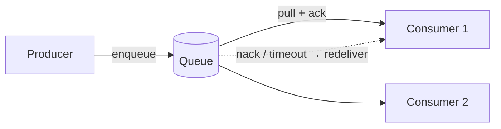

# Message Queues

## Concept

- A **message queue** lets services communicate **asynchronously**: a producer puts a message on the queue and moves on; a consumer pulls and processes it later. Producer and consumer are decoupled in time and load.
- The queue is a **buffer** between fast producers and slower consumers. It absorbs spikes, smooths throughput, and survives consumer restarts.
- Core semantics:
  - **Point-to-point**: each message is delivered to exactly one consumer in a group (work distribution).
  - **Acknowledgment**: the broker removes a message only after the consumer acks; an un-acked message is redelivered (at-least-once).
  - **Visibility timeout / in-flight**: while being processed, a message is hidden from other consumers.
- Examples: RabbitMQ, AWS SQS, ActiveMQ, Redis Streams, Google Pub/Sub.

## Problem It Solves

- **Decoupling**: the producer doesn't need the consumer to be up; checkout enqueues "send email" and returns instantly.
- **Load leveling**: a traffic spike fills the queue; consumers drain it at a steady rate instead of the database being hammered.
- **Reliability**: messages persist until acked, so a consumer crash doesn't lose work.
- **Scaling consumers**: add workers to the same queue to process faster (competing consumers).
- **Responsiveness**: slow/spiky work (email, image processing, webhooks) leaves the request path.

## Trade-offs

- **Async vs. complexity**: you gain throughput and resilience but inherit eventual consistency, out-of-order processing, and the need to handle retries and failures.
- **At-least-once → duplicates**: redelivery on missed acks means consumers must be **idempotent** (topic 22).
- **Ordering**: most queues don't guarantee global order; if order matters, you need ordering keys/FIFO queues (which reduce parallelism).
- **Poison messages**: a message that always fails will be redelivered forever unless you cap retries and route it to a **dead-letter queue** (topic 35).
- **Backpressure & lag**: if producers outpace consumers indefinitely, the queue grows without bound; monitor queue depth and consumer lag (Phase 4: backpressure).

## Examples

- **Offloading work**
  - Order placed → enqueue `send_confirmation`, `update_analytics`, `notify_warehouse`; the user's checkout returns immediately while workers process the rest.
- **Competing consumers**
  - 10 workers pull from one queue; throughput scales with worker count, and the queue distributes load automatically.
- **Visibility timeout (SQS)**
  - A worker pulls a message, which becomes invisible for 30 s; if it doesn't ack/delete in time (crash), the message reappears for another worker.
- **FIFO when needed**
  - SQS FIFO or a per-key partition guarantees order for messages sharing a group ID, at lower throughput than standard queues.
- **Interview framing**
  - Introduce a queue whenever work can be done asynchronously or to absorb spikes. Always pair it with "consumers are idempotent" and "failed messages go to a DLQ" - that shows production maturity.
