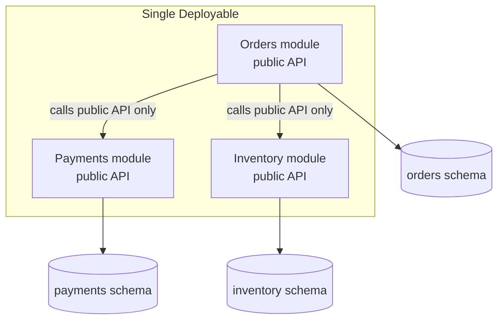

# Modular Monolith

## Concept

- A **modular monolith** is still one deployable unit, but its code is split into well-defined **modules** with explicit boundaries, owned interfaces, and enforced dependency rules.
- Each module owns its domain logic and its data, and exposes a narrow public API. Other modules call that API — they do **not** reach into each other's internals or tables.
- It keeps the operational simplicity of a monolith (one deploy, in-process calls, one transaction boundary) while gaining the *internal* decoupling that makes a future split into services possible.
- It is the pragmatic middle ground: most teams should run a modular monolith for far longer than they think, and extract services only where evidence demands it.

## Problem It Solves

- A plain monolith (topic 1) tends to rot into a "big ball of mud" where everything imports everything; the modular monolith prevents this with hard boundaries.
- Keeps the cost of distributed systems at zero while still letting teams own modules independently.
- Makes a later extraction to microservices cheap: a module with a clean API and its own schema can be lifted out by replacing in-process calls with network calls.
- Module boundaries force you to discover the *right* service boundaries **before** paying the cost of the network — a much cheaper place to be wrong.

## Trade-offs

- **Discipline vs. enforcement** — boundaries are only as real as your tooling enforces (module visibility, architecture tests, separate schemas); without enforcement it silently degrades back into a ball of mud.
- **Shared deploy** — modules still ship together; you do not get independent deploys or independent scaling.
- **Shared failure domain** — one module can still crash the process.
- **Schema separation effort** — giving each module its own schema/tables (and forbidding cross-module joins) is extra up-front work that pays off only at extraction time.

## Examples

- **E-commerce broken into modules**
  - `Catalog`, `Orders`, `Payments`, `Shipping`, each with its own package namespace, public interface, and database schema.
  - `Orders` calls `Payments.charge()` in-process; it never reads the payments tables directly.
- **Enforcing boundaries**
  - Java: the Java Platform Module System or ArchUnit tests that fail the build if `orders` imports `payments.internal`.
  - .NET/TypeScript: project references and lint rules; tools like `dependency-cruiser`.
  - Spring Modulith and similar frameworks make modules first-class and test the boundaries.
- **Clean extraction path**
  - When `Payments` needs PCI isolation and independent scaling, you wrap its public API behind HTTP/gRPC, move its schema to its own database, and deploy it separately — callers change one adapter, not their logic.
- **Interview framing**
  - "I'd build this as a modular monolith with module-per-bounded-context and schema-per-module, so we keep ACID and simple ops now but can extract Payments to its own service when compliance or scale requires it." This signals senior judgment.
