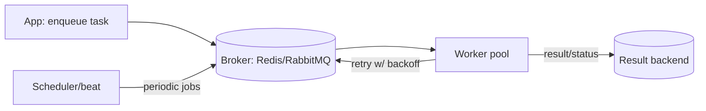

# Task Queues

## Concept

- A **task queue** is a higher-level abstraction built on a message queue, purpose-built for running **background jobs**: it adds workers, scheduling, retries, prioritization, and result tracking around the raw enqueue/consume primitive.
- Where a message queue moves opaque messages between services, a task queue runs **your functions** asynchronously — "send this email," "generate this PDF," "recompute this report" — with operational features baked in.
- Typical features: delayed/scheduled execution, periodic (cron) jobs, retry with backoff, priority lanes, concurrency limits, and a dashboard of job status.
- Examples: Celery (Python), Sidekiq (Ruby), BullMQ (Node), Temporal/Airflow (workflow-oriented), AWS Step Functions.

## Problem It Solves

- Moves slow, spiky, or deferrable work off the request path so user requests stay fast.
- Provides the **operational scaffolding** you'd otherwise hand-build: retries with exponential backoff, scheduled and recurring jobs, dead-lettering, rate limiting, and visibility into what ran and what failed.
- Lets you scale background processing independently of the web tier by adding workers.
- Centralizes job orchestration (chains, groups, and simple workflows).

## Trade-offs

- **Convenience vs. another moving part** — a broker, worker fleet, and result store to operate and monitor.
- **Retries vs. idempotency** — automatic retries mean a task can run more than once; tasks must be idempotent or guard against duplicate side effects (topic 22).
- **At-least-once execution** — like message queues, exactly-once is not free; design for re-execution.
- **Result backend cost** — storing every job result (e.g., in Redis) consumes memory; set TTLs.
- **Long/stateful workflows** — simple task queues handle one-shot jobs well but get awkward for multi-step, long-running, stateful workflows; that's where workflow engines (Temporal, Step Functions) and the orchestration vs choreography topic (topic 38) come in.

## Examples

- **Email and media jobs**
  - `send_welcome_email.delay(user_id)` returns instantly; a worker sends it, retrying with backoff if SMTP is down, and dead-letters after N attempts.
- **Scheduled & periodic**
  - Nightly billing run via a cron-style scheduler; "remind in 24h" via a delayed task.
- **Priority lanes**
  - Interactive jobs (password-reset email) on a high-priority queue; bulk jobs (analytics rollups) on a low-priority queue with capped workers.
- **Idempotent task**
  - "Charge invoice" checks an idempotency key/ledger first so a retried task never double-charges.
- **Interview framing**
  - Use a task queue for background jobs and scheduled work; mention retries-with-backoff, idempotent handlers, and DLQs. For multi-step long-running processes, escalate to a workflow engine rather than chaining tasks by hand.
