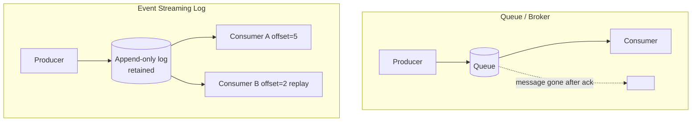

# Message Broker vs. Event Streaming

## Concept

- Both move data asynchronously, but they have fundamentally different models:
  - **Message broker (queue)** — RabbitMQ, SQS. A message is delivered to a consumer and then **removed** (consumed once). The broker tracks delivery state per message. Optimized for **task distribution** and request/response decoupling.
  - **Event streaming log** — Kafka, Pulsar, Kinesis. Events are **appended to an immutable, ordered log** and **retained** for a period (or forever). Consumers track their own **offset** and can replay from any point. Optimized for **event distribution** to many independent consumers.
- The mental shift: a queue is a *to-do list that empties as work is done*; a log is a *durable history that many readers scan at their own pace*.

## Problem It Solves

- **Broker** — distribute discrete units of work to a pool of workers, with per-message acks, redelivery, and DLQs. Best when each message is a task done once.
- **Streaming log** — let *many* independent consumers each read the *same* event stream (analytics, search indexer, cache updater, audit) without coupling them, and **replay** history to rebuild state, backfill a new consumer, or recover from bugs.
- Streaming enables event-driven architecture, event sourcing (Phase 4), CDC, and stream processing at high throughput.

## Trade-offs

- **Consume-once vs. retain-and-replay** — brokers can't easily replay (the message is gone); logs keep history but cost storage and need retention/compaction policies.
- **Per-message routing vs. ordered partitions** — brokers offer flexible routing (topics, fanout, headers) and per-message priority; Kafka guarantees order only *within a partition* and scales by partition count.
- **Throughput** — Kafka's sequential-append log delivers very high throughput; brokers with per-message bookkeeping are typically lower throughput but richer in delivery semantics.
- **Operational model** — Kafka (partitions, consumer groups, ISR, ZooKeeper/KRaft) is more complex to run than SQS (fully managed) or RabbitMQ.
- **Choosing wrong** — using Kafka as a simple task queue adds needless complexity; using a queue where you need replay/multi-consumer forces painful workarounds.

## Examples

- **Use a broker when**
  - "Process each uploaded video once," "send each email once" — discrete tasks, competing consumers, DLQ on failure.
- **Use a streaming log when**
  - A `user_signed_up` event must feed the welcome-email service, the analytics pipeline, the CRM sync, and the search indexer — independently, each at its own offset, with the ability to replay if one breaks.
- **Replay power**
  - A bug corrupted a downstream store; you reset the consumer's offset and reprocess a week of events to rebuild it — impossible with a plain queue.
- **Partitioning for order**
  - Key events by `user_id` so all of one user's events land in the same partition and stay ordered, while different users parallelize.
- **Interview framing**
  - State the model explicitly: "task to be done once → queue; event many consumers replay → Kafka log." Mention partitions-for-ordering and retention/compaction for Kafka, and DLQ for brokers.
