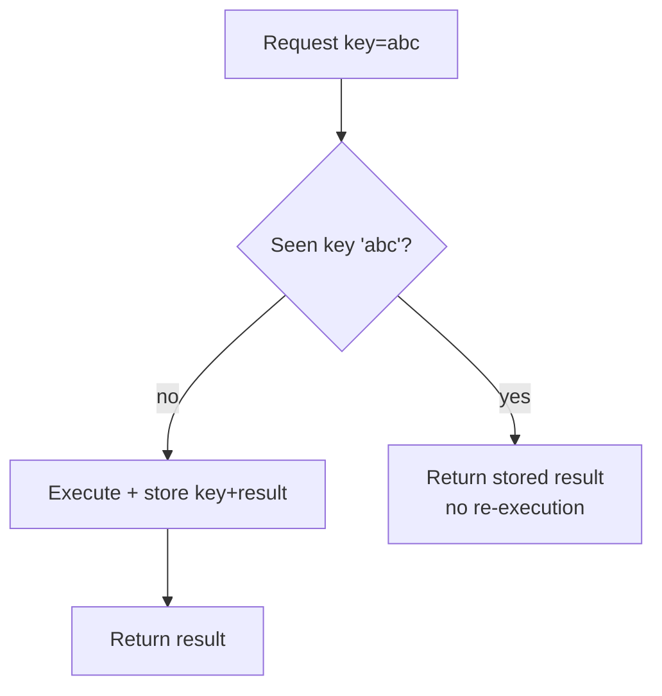

# Idempotency

## Concept

- An operation is **idempotent** if performing it multiple times has the **same effect as performing it once**. `SET balance = 100` is idempotent; `balance = balance + 100` is not.
- Idempotency is the antidote to the fundamental reality of distributed systems: **at-least-once delivery**. Networks drop responses, clients retry, queues redeliver - so the same request *will* arrive more than once. Idempotent handlers make duplicates harmless.
- The standard mechanism is an **idempotency key**: the client sends a unique key with the request; the server records it on first processing and, on any retry with the same key, returns the stored result **without re-executing** the side effect.

## Problem It Solves

- Prevents duplicate side effects when retries happen: double charges, duplicate orders, repeated emails, double inventory decrements.
- Lets clients **retry safely** after a timeout without knowing whether the original request succeeded - the key guarantees at-most-once *effect* on top of at-least-once *delivery*.
- Makes message-queue and task-queue consumers (topics 19-20) safe under redelivery.
- Is the foundation for reliable payments, webhooks, and any "exactly-once business effect" requirement.

## Trade-offs

- **Key storage cost & TTL**: you must persist processed keys (with results) in a fast store; they need a retention window long enough to cover all retries but bounded to limit growth.
- **Naturally idempotent vs. enforced**: some operations are inherently idempotent (PUT a full resource, set a flag); others (increment, append, charge) must be *made* idempotent via keys or conditional writes.
- **Atomicity**: recording the key and performing the side effect must be atomic, or a crash between them breaks the guarantee (this is exactly what the outbox pattern, topic 36, solves).
- **Scope of the key**: too broad and you reject legitimate distinct requests; too narrow and duplicates slip through. Keys are usually per-operation, client-generated.
- **Distributed nuances**: across services, the dedup store and key propagation get harder (Phase 4 revisits idempotency in the distributed setting).

## Examples

- **Payments**
  - Stripe-style: client sends `Idempotency-Key: <uuid>` on "create charge." A retry with the same key returns the original charge instead of charging again.
- **HTTP method semantics**
  - `GET`, `PUT`, `DELETE` are defined as idempotent; `POST` is not - which is why "create" endpoints need explicit idempotency keys.
- **Queue consumer**
  - "Apply payment" checks a `processed_messages` table for the message ID before acting; if present, it acks and skips.
- **Conditional write**
  - `UPDATE orders SET status='paid' WHERE id=? AND status='pending'` - applying it twice changes nothing the second time.
- **Interview framing**
  - Whenever retries or queues appear (which is almost always), proactively say "consumers/handlers are idempotent via an idempotency key" and note the atomic record-and-act requirement (→ outbox). This is one of the highest-signal phrases in a system design interview.
