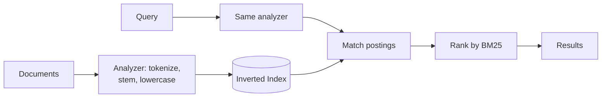

# Search Systems

## Concept

- A **search system** lets users find relevant documents by keywords (or vectors) across large text corpora - something relational `LIKE '%term%'` queries cannot do efficiently or relevantly.
- The core data structure is the **inverted index**: a map from each term → the list of documents containing it (a "postings list"). To answer "documents containing *coffee* AND *beans*," you intersect two short postings lists instead of scanning every document.
- A search pipeline has stages:
  - **Ingestion/indexing**: documents are **analyzed** (tokenized, lowercased, stemmed, stop-words removed) and written into the inverted index.
  - **Querying**: the query is analyzed the same way, postings are matched, and results are **ranked** by relevance (e.g., BM25/TF-IDF).
- Examples: Elasticsearch/OpenSearch, Apache Solr (both on Lucene), Typesense, Meilisearch; vector search for semantic matching (Phase 7).

## Problem It Solves

- **Relevance**: returns the *best* matches ranked, not just exact substring hits; handles typos, synonyms, stemming ("running" matches "run").
- **Speed at scale**: the inverted index turns full-text search over millions of documents into fast postings-list intersections.
- **Rich querying**: faceting (filter by category/price), highlighting, autocomplete, fuzzy matching, geo and range filters.
- Offloads expensive text queries from the primary database, which is bad at them.

## Trade-offs

- **Separate system vs. consistency**: search is usually a **secondary index** fed from the primary DB; keeping it in sync introduces lag and a sync pipeline (CDC, topic on outbox/CDC). It is eventually consistent with the source of truth.
- **Index size & cost**: inverted indexes plus stored fields can be large and memory-hungry; sharding and replicas add ops burden.
- **Write amplification / near-real-time**: indexing has a refresh interval; new documents are searchable after a short delay, not instantly.
- **Relevance tuning is hard**: analyzers, boosting, and ranking need iteration; "search quality" is a product problem, not just infra.
- **Not a system of record**: don't treat Elasticsearch as your primary store; it can lose data on misconfiguration and is built for search, not transactions.

## Examples

- **E-commerce search**
  - Index products with fields for title, description, brand, price; query with full-text on title + facets on brand/price + BM25 ranking + typo tolerance.
- **Keeping search in sync**
  - On product update, the DB write emits an event (via outbox/CDC) that updates the Elasticsearch document - decoupling the source of truth from the search index.
- **Autocomplete/typeahead**
  - Edge-ngram analyzers or a dedicated suggester index serve prefix queries in milliseconds (see the autocomplete case study).
- **Hybrid search**
  - Combine keyword (BM25) with semantic vector search (Phase 7) for better recall on natural-language queries.
- **Interview framing**
  - When a design needs full-text search, introduce a dedicated search index (Elasticsearch) fed asynchronously from the DB, mention the inverted index and BM25 ranking, and flag that it's eventually consistent and not the source of truth.
