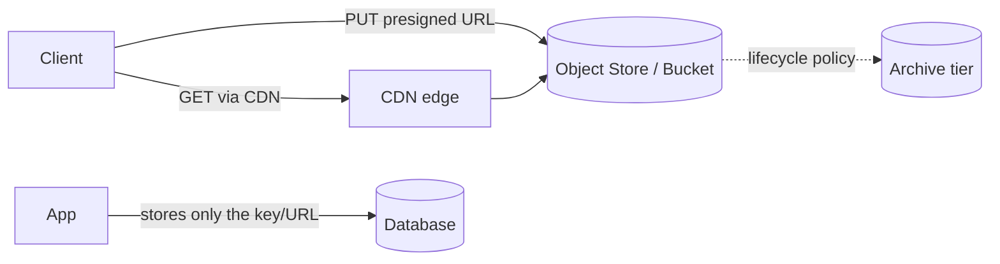

# Object Storage

## Concept

- **Object storage** (S3, GCS, Azure Blob) stores unstructured **blobs** - images, videos, backups, logs, ML datasets - as objects in a flat namespace of **buckets**, each addressed by a key and accessed over HTTP.
- Unlike file systems (hierarchical, POSIX, mountable) or block storage (raw disks for databases), object storage is built for **massive scale, durability, and cheap capacity** rather than low-latency random writes or in-place editing.
- Each object is **immutable** in practice: you replace it wholesale rather than editing in place. Objects carry **metadata** and are retrieved by key, often via a CDN.
- It offers extreme durability (e.g., "11 nines") by replicating/erasure-coding data across devices and availability zones, and **storage tiers** (hot/infrequent/archive) for cost.

## Problem It Solves

- Stores arbitrarily large files cheaply and durably without managing disks, RAID, or capacity planning - it scales effectively infinitely.
- Decouples big binary data from the database: the DB stores a small **reference** (the object key/URL), keeping rows small and backups fast.
- Serves static assets globally and cheaply, especially fronted by a CDN.
- Underpins data lakes, backups, and ML training data at petabyte scale.

## Trade-offs

- **Cheap & durable vs. high-latency, no edits**: great for whole-object read/write; bad for low-latency random access or partial in-place updates (use block storage/DB for those).
- **Eventual consistency nuances**: historically list/overwrite operations were eventually consistent; modern S3 is read-after-write consistent for new objects, but cross-region replication still lags.
- **Egress cost**: storage is cheap; **bandwidth out** (and cross-region transfer) can dominate the bill - front with a CDN and watch egress.
- **Per-request overhead**: millions of tiny objects incur per-request cost and listing pain; batch small files where possible.
- **Security**: public-bucket misconfiguration is a classic data-breach cause; default to private + presigned URLs and least-privilege policies.

## Examples

- **Direct browser upload (offload the app)**
  - The app issues a **presigned URL**; the client uploads the file straight to S3, so large transfers never pass through your servers. The app stores only the resulting key.
- **Serving media**
  - Store the original in S3; serve through CloudFront/CDN with long cache TTLs and fingerprinted keys for instant invalidation.
- **Lifecycle tiering**
  - Logs land in standard storage, transition to infrequent-access after 30 days, and to Glacier/archive after 90 - automatically, to cut cost.
- **As a data lake**
  - Raw event files in S3 (Parquet) queried by Athena/Spark - the storage layer for data engineering (see the Data Engineering phase).
- **Interview framing**
  - For any design with images/video/files (YouTube, chat attachments, avatars), store blobs in object storage and keep only the key in the DB; mention presigned URLs for upload, CDN for delivery, and lifecycle tiers for cost.
