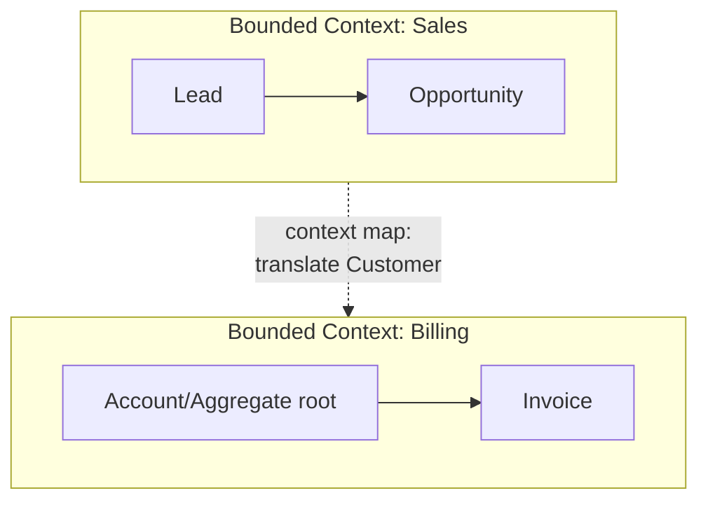

# Domain-Driven Design (DDD)

## Concept

- **Domain-Driven Design** is an approach to modeling complex business software where the **domain** (the business problem) drives the design, and the code's structure mirrors the language and boundaries of the business.
- Its most load-bearing idea for system design is the **bounded context**: a boundary within which a model and its terms have a single, consistent meaning. "Customer" in *Sales* (a lead with a pipeline) is a different model from "Customer" in *Billing* (an account with invoices). Each lives in its own bounded context.
- **Bounded contexts are the natural seams for services** (topic 3) and modules (topic 2). DDD is *the* answer to "how do I decide service boundaries?"
- Key building blocks: **Ubiquitous Language** (the shared vocabulary between engineers and domain experts, encoded in the code), **Aggregates** (a cluster of objects treated as one consistency/transaction boundary, accessed via a root), **Entities** (identity-based), **Value Objects** (immutable, equality by value), and **Domain Events** (something meaningful happened).

## Problem It Solves

- Prevents the "god model" where one bloated `Customer`/`Order` class tries to satisfy every team's needs and changes for every reason.
- Gives a principled, business-aligned way to draw **service and module boundaries** - instead of splitting by technical layer (a "users service," a "database service"), you split by **capability** (Sales, Billing, Shipping).
- Defines clear **consistency boundaries**: an aggregate is the unit that must be transactionally consistent; everything outside it is eventually consistent (via domain events). This directly informs where you can use a DB transaction vs. a saga (Phase 4).
- Aligns engineers and domain experts through shared language, reducing translation bugs.

## Trade-offs

- **Power vs. overhead**: DDD's full tactical machinery (aggregates, repositories, domain events) is overkill for simple CRUD; reserve it for genuinely complex domains.
- **Aggregate sizing**: too large an aggregate creates contention and big transactions; too small splits invariants that should be atomic. Sizing aggregates is the hard skill.
- **Eventual consistency between aggregates**: DDD pushes you to keep aggregates small and connect them with events, which means accepting eventual consistency across them (and the complexity that brings).
- **Learning curve & jargon**: easy to cargo-cult the patterns without the modeling discipline that gives them value.
- **Context mapping effort**: defining how bounded contexts integrate (shared kernel, customer-supplier, anti-corruption layer) is real design work.

## Examples

- **Boundaries from contexts**
  - An e-commerce system decomposes into *Catalog*, *Ordering*, *Payments*, *Shipping*, *Inventory* - each a bounded context, each a candidate service/module with its own model and data.
- **Aggregate as transaction boundary**
  - An `Order` aggregate (root) owns its `OrderLine`s; you load and save the whole order atomically. Inventory is a *separate* aggregate - reserving stock happens via a domain event, not the same transaction.
- **Anti-corruption layer**
  - When *Ordering* integrates with a legacy *Billing* system, an ACL translates between the two models so the legacy design doesn't leak into and corrupt the clean domain model.
- **Domain events**
  - `OrderPlaced` is published; *Shipping* and *Analytics* react independently - the decoupling that event-driven architecture (Phase 4) is built on.
- **Interview framing**
  - When asked "how would you split this into services?", answer with bounded contexts and aggregates, not technical layers. Saying "aggregates define my transaction boundaries; cross-aggregate consistency is eventual via domain events" is strong Staff-level signal.
